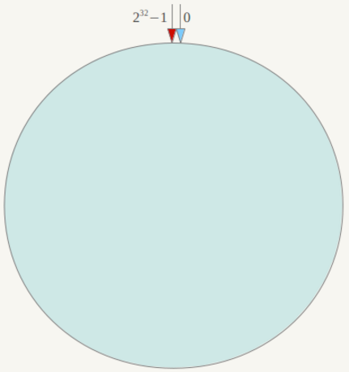
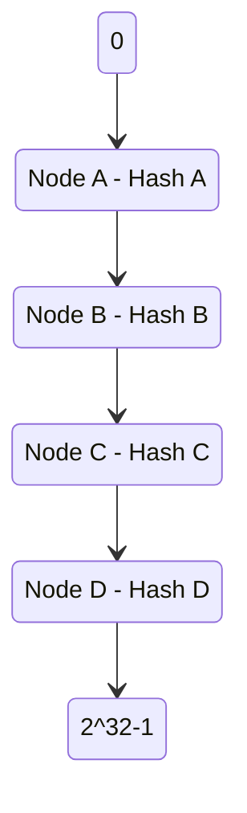
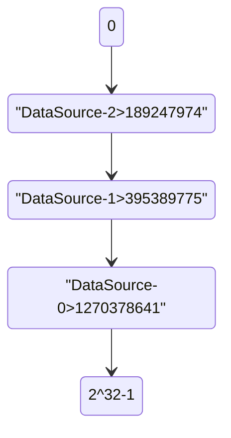

## 简介

一致性哈希算法，它是 1997 年麻省理工学院提出的一种算法。它首先假设一个圆由 $2^32$ 个点构成, 取值范围区间为 $[0, 2^32-1]$, 可以根据数据库编号或者其他标识的属性求其哈希值 (hash code), 然后该值就会对应到这个圆上的某一点



假设有 4 个物理数据库, 编号为 Node A, Node B, Node C, Node D, 根据编号求出对应的哈希值并放到圆中的相应位置



这样便产生了 5 个区间: $[0, Hash A], [Hash A, Hash B], [Hash B, Hash C], [Hash C, Hash D], [Hash D, 2^32-1]$

对于每一个映射到 $[0, 2^32-1]$ 区间的 ID, 都必定落入这 5 个区间中

在一致性哈希算法中, 采用顺时针方向找到下一个数据库节点来存放数据

例如计算出来的哈希值在 $[Hash A, Hash B]$ 区间值找到 Node B 节点

<!-- more -->

## 优点

- 当减少一个节点的时候, 只需要将减少的节点的数据插入到顺时针的下一个节点即可
- 当新增一个节点的时候, 只需要通过计算哈希值将下一个节点中数据分布在新增节点区间的数据分配给新节点即可

## 实现

在实际使用过程中, 需要找到一种性能更好, 分配更均匀的哈希算法, 同时使用编程语言已经实现的哈希环结构可以更加方便高效的实现

fnv1_32_hash 算法支持 32 位二进制, 并且性能不错, 在 Java 中, SortedMap 是一个哈希环的接口, 支持顺时针路由到下一个节点, 实现类是 TreeMap

```java
/**
  * 保存映射数据
  * 服务器的 hash 值: 数据源编号
  */
private static SortedMap<Integer, String> sortedMap = new TreeMap<>();

/**
  * 添加数据源
  *
  * @param dsKey
  */
public static void addDsKey(String dsKey) {
    // 计算哈希值
    int hashCode = getHash(dsKey);
    System.out.printf("%s: %d\n", dsKey, hashCode);
    // 存入排序 Map 中
    sortedMap.put(hashCode, dsKey);
}

/**
  * 使用 FNV1 的 32 位哈希算法计算字符串的哈希值
  *
  * @param str 需要求哈希值的字符串
  */
private static int getHash(String str) {
    final int p = 16777619;
    int hash = (int) 2166136261L;
    for (int i = 0; i < str.length(); i++) {
        hash = (hash ^ str.charAt(i)) * p;
    }
    hash += hash << 13;
    hash ^= hash >> 7;
    hash += hash << 3;
    hash ^= hash >> 17;
    hash += hash << 5;
    if (hash < 0) {
        // 对负数求绝对值
        hash = Math.abs(hash);
    }
    return hash;
}

/**
  * 根据字符串哈希值找到对应的数据源
  *
  * @param id 雪花 ID
  */
private static String getDataSource(long id) {
    // 计算字符串的哈希值
    int hash = getHash(String.valueOf(id));
    // 得到大于该哈希值的所有 Map
    SortedMap<Integer, String> subMap = sortedMap.tailMap(hash);
    Integer firstKey = null;
    if (subMap == null || subMap.isEmpty()) {
        // 没有大于当前节点的哈希值的数据, 就选择哈希值最小的数据源
        firstKey = sortedMap.firstKey();
    } else {
        // 获取大于当前节点的第一个节点 Key 就是顺时针过去离字符串哈希值最近的那个节点
        firstKey = subMap.firstKey();
    }
    // 返回对应的服务器名称
    return sortedMap.get(firstKey);
}
```

这里使用一个排序的 Map, key 是保存哈希值, value 保存对应数据源的编号, 相当于哈希环

测试方法如下

```java
public static void main(String[] args) {
    Test test = new Test(0);
    addDsKey("DataSource-0");
    addDsKey("DataSource-1");
    addDsKey("DataSource-2");
    int[] counts = {0, 0, 0};
    long start = System.currentTimeMillis();
    for (int i = 0; i < 9999; i++) {
        long id = test.nextId();
        String dsKey = getDataSource(id);
        if ("DataSource-0".equals(dsKey)) {
            counts[0]++;
        } else if ("DataSource-1".equals(dsKey)) {
            counts[1]++;
        } else if ("DataSource-2".equals(dsKey)) {
            counts[2]++;
        }
    }
    long end = System.currentTimeMillis();
    System.out.println(end - start);
    System.out.printf("DataSource-0: %d\nDataSource-1: %d\nDataSource-2: %d", counts[0], counts[1], counts[2]);
}
```

结果如下

```sh
DataSource-0: 1270378641
DataSource-1: 395389775
DataSource-2: 189247974
67
DataSource-0: 4124
DataSource-1: 912
DataSource-2: 4963
Process finished with exit code 0
```

## 问题

从结果可以看到, 这个换的区间应该是 %[0, 189247974], [189247974, 395389775], [395389775, 1270378641], [1270378641, 2^32-1]%



可以发现由于 `DataSource-1` 所占的区间比例小, 所以命中的数量相对低, 这样便会导致几个数据源压力不均衡

## 改进

由上面的分析可知, 由于哈希值划分的哈希环不均匀, 导致区间大的命中率高很多, 但是使用的哈希算法是固定的, 也没办法通过修改数据源标识来更加均分命中率

那可以从另一方面扩展, 如果将划分的节点增多, 是不是就可以比较均匀的分摊命中率

这个想法可以通过虚拟节点来处理, 由于节点计算出来的哈希值并不与节点物理顺序一致, 所以通过每个节点拓展出来的虚拟节点便可以更加均匀的分布在整个哈希环中

简单拓展添加数据源方法

```java
/**
  * 添加数据源
  *
  * @param dsKey
  */
public static void addDsKey(String dsKey) {
    // 通过循环将每个物理节点变为虚拟节点映射
    for (int i = 0 ; i < 10; i ++) {
        // 通过特定规则添加虚拟节点
        String key = dsKey + "#" + i;
        // 计算虚拟节点哈希值
        int hashCode = getHash(key);
        // 只将虚拟节点存放到排序 Map 中
        sortedMap.put(hashCode, key);
    }
}
```

测试方法如下, 主要将映射到虚拟节点的数据反向映射到物理节点

```java
public static void main(String[] args) {
    Test test = new Test(0);
    addDsKey("DataSource-0");
    addDsKey("DataSource-1");
    addDsKey("DataSource-2");
    int[] counts = {0, 0, 0};
    long start = System.currentTimeMillis();
    for (int i = 0; i < 9999; i++) {
        long id = test.nextId();
        String dsKey = getDataSource(id);
        if ("DataSource-0".equals(dsKey)) {
            counts[0]++;
        } else if ("DataSource-1".equals(dsKey)) {
            counts[1]++;
        } else if ("DataSource-2".equals(dsKey)) {
            counts[2]++;
        }
    }
    long end = System.currentTimeMillis();
    System.out.println(end - start);
    System.out.printf("DataSource-0: %d\nDataSource-1: %d\nDataSource-2: %d", counts[0], counts[1], counts[2]);
}
```

结果如下

```sh
21
DataSource-0: 3988
DataSource-1: 2547
DataSource-2: 3464
Process finished with exit code 0
```

可以发现, 在进行模拟 10 个虚拟节点后会发现 3 个数据源的数据量已经比较均衡, 更多的虚拟节点会让数据分布更均匀, 但也会导致了在增删一台物理节点后的处理更复杂, 性能更差
