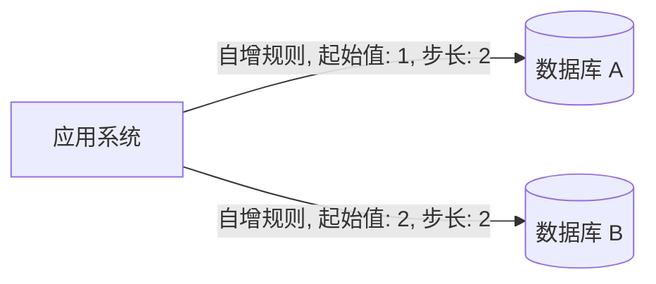

## 简介

在现实生活中, 每个行为看上去都是独一无二的, 那么要将所有的事情都数据化, 就需要一个唯一的 ID 来进行标识

在单个系统中, 由于运行环境有限, 比如在单个线程, 单个数据库中, 这种环境很容易生成系统唯一 ID

但在分布式和微服务系统中, 由于涉及到多个机器多个容器的协助, 这里就需要一个单独的发号机制来生成全局唯一的 ID, 这样不管整个系统进行扩容或者减配, 都不会影响到 ID 的生成

<!-- more -->

## 需求

- 机制的可靠性: 有些算法可能有一定的概率出现重复的 ID, 也可以利用缓存机制来实现, 但缓存工具也不一定完全可靠, 可能也需要重启或者出现故障, 如果遇到类似这样的问题, 是否会对 ID 的唯一性造成影响
- 实现复杂度: 有些算法可以实现 ID 的唯一性和可读性, 但是实现起来十分复杂, 后续也难以改造
- 可扩展性: 有时候, 发号机制不单单是一个节点的工作, 可能是多个节点的工作, 节点能否伸缩是一个考量点
- ID 的可读性: 有些 ID 只是为了唯一性, 如 UUID 机制, 它是不可读的, 没有业务含义, 不过, 生成一个可读的带有业务含义的 ID, 将有助于业务人员和开发人员定位业务和问题所在
- 性能: 分布式系统往往也需要面对高并发的情况, 在这种情况下, 性能也会列入评价 ID 机制的范畴

## UUID

UUID 是 Universally Unique Identifier (通用唯一识别码) 的缩写, 它是一种软件建构的标准, 亦为开放软件基金会组织在分布式计算环境领域的一部分

在各种系统中, 都有已经内置的工具类辅助生成 UUID, 在 Java 中, 提供了 UUID (java.util.UUID) 类, 因此我们可以很方便地使用 UUID, 通过使用 `UUID.randomUUID()` 可以方便高效的生成 UUID 序列

- 优点: 方便使用, 性能高效
- 缺点: 无规则, 数据量大

由于 UUID 的无规则特性, 会降低数据库主键算法的性能, 一般是 B+ 树算法, 而且无法根据当前的序号定位改记录的生成时间地点, 也导致排查问题的难度增加

另外, 由于 UUID中包含字符串, 所以存储会占用较大的空间, 对于大量微服务的系统中, 网络传输内容也多, 相比较于数字, 计算性能更低, 不方便优化

## 数据库自带

如果采用单一数据库, 并且对性能要求比较低, 那么采用数据库自增长 ID 也是可以的, 对于多数据库的情况, 可以通过控制不同的数据库自增长 ID 序列来达到全局的唯一性, 但是不能应付扩容的情况



根据上面的流程, 可以保证多个数据库的主键不重复, 但是会导致以下问题

- 需要新增数据库节点的话就需要改变自增长规则
- 数据库主键自增无法满足高并发场景
- 需要迁移或者合并数据会导致现有规则出现冲突

## 使用 Redis 生成

Redis 性能比数据库高, 扩展也方便, 因为 Redis 执行 Lua 脚本的过程是原子性的, 所以不会产生重号的问题, 这样可以通过 hash 结构保存自定义的 ID 生成规则, 通过自定义的起始值和步长同数据库的规则便可以实现多个 Redis 集群生成全局 ID

## 使用时钟

常用的开发语言都可以提供获取当前纳秒数

$$ 1 s = 10^3 ms = 10^6 μs = 10^9 ns $$

这就意味着单一的节点可以实现非常高的并发 ID 生成

从数据类型来看, 大整数型 (BIGINT) 支持大小为 64 位二进制, 有符号的范围为 $-2^63 ~ 2^63-1$

整数型 (INT) 支持大小为 32 位二进制, 有符号的范围为 $-2^23 ~ 2^23-1$

这样一个纳秒时间符合大整数的范围

```java
// 同步锁标识
private static final Class<Test> LOCK = Test.class;

private static long nanoTimeKey() {
    synchronized (LOCK) {
        // 获取当前时间
        long cur = System.nanoTime();
        // 自转
        while (true) {
            // 将当前时间作为标识
            long flag = System.nanoTime();
            if (flag - cur > 1) {
                // 只有当现在已经过去 1 单位后才返回
                // 这样保证了每次返回的时间肯定不同
                // 保存不重复
                return cur;
            }
        }
    }
}
```

这里使用同步锁和自转的方式, 避免多线程的情况下拿到两个相同的时间点

- 优点: 算法简单, 实际使用并发性能高
- 缺点: 单节点不能保证可用性, 多节点会导致相同的 ID 出现, 物理机器时钟回拨问题

既然多节点会导致获取到相同的时间点, 那么就在时间点上面再带上每个节点的标识, 并且转换为顺序递增的序列就可以实现相应的功能

于是便有了各种整合了时间戳, 应用标识, 数据中心标识等业务逻辑的变种时钟拨号算法, 最知名广泛的是雪花 (SnowFlake) 算法

## 雪花算法

雪花 (SnowFlake) 算法是 Twitter 提出的一种时钟拨号算法, 基于大整数型 (BIGINT) 类型来定义的

- 第 1 位二进制值固定为 0, 没有业务含义, 在计算机原理中, 它是一个符号位, 0 代表正数, 1 代表负数, 这里恒定为 0
- 第 2～42 位, 共 41 位二进制, 为时间戳位, 用于存入精确到毫秒数的时间
- 第 43～52 位, 共 10 位二进制, 为工作机器 id 位, 其中工作机器又分为 5 位数据中心编号和 5 位受理机器编号, 而 5 位二进制表达整数时取值区间为[0, 31]
- 第 53～64 位, 共 12 位二进制, 代表 1 ms 内可以产生的序列号, 当它表示整数时, 取值区间为[0, 4095]

这样的一个算法可以保证一个工作机器在 1 ms 内生成 4096 个编号, 实际就是 1 秒至多产生 4 096 000 个 ID, 这样的性能显然可以满足分布式系统的需要, 而更加好的是, 存在 10 位工作机器位, 这样出现问题可以定位到机器, 有助于业务和开发者定位问题

- 优点:
  - 可以支持多达 1024 个工作机器同时发号不冲突
  - 每个工作机器并发性能高
  - 生成 ID 包含时间戳, 工作机器标识和序号等业务逻辑, 可以辅助定位业务
  - 使用 16 位数字存储性能高, 数据量小
- 缺点:
  - 时间戳存储空间为 41 位二进制, 所以应用的配置只能使用 69 年, 到期后可以更新起始时间或升级算法
  - 提供 1024 个工作机器位和每台机器每毫秒能产生 4096 个序号会造成资源浪费
  - 多个工作机器物理机器时间同步问题
  - 时间回拨问题

很明显时间问题这个需要进行物理时间配置, 其他的问题可以通过自定义时钟拨号算法进行控制

## 自定义算法

通过了解雪花 (SnowFlake) 算法的规则, 可以通过自定义业务逻辑来生成符合自身的发号算法, 前提是需要将数据长度控制在 64 位二进制内, 不然会导致性能大大降低
