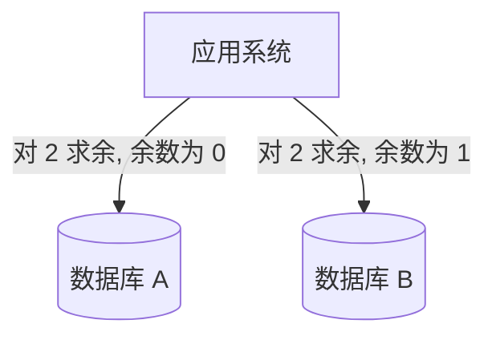

## 简介

求余算法是常见的哈希算法, 相对比较简单

例如在进行分库存储的时候, 通过对 ID 进行求余, 就知道该存入哪个数据库

```mermaid
graph TB
  u[应用系统] -->|对 2 求余, 余数为 0 | a[(数据库 A)]
  u -->|对 2 求余, 余数为 1 | b[(数据库 B)]
```

## 使用

- 优点
  - 简单方便
  - 性能高
  - 对已经固定数据量的业务适用
- 缺点
  - 扩容或者缩减都会导致算法变化, 这样所有数据进行迁移
