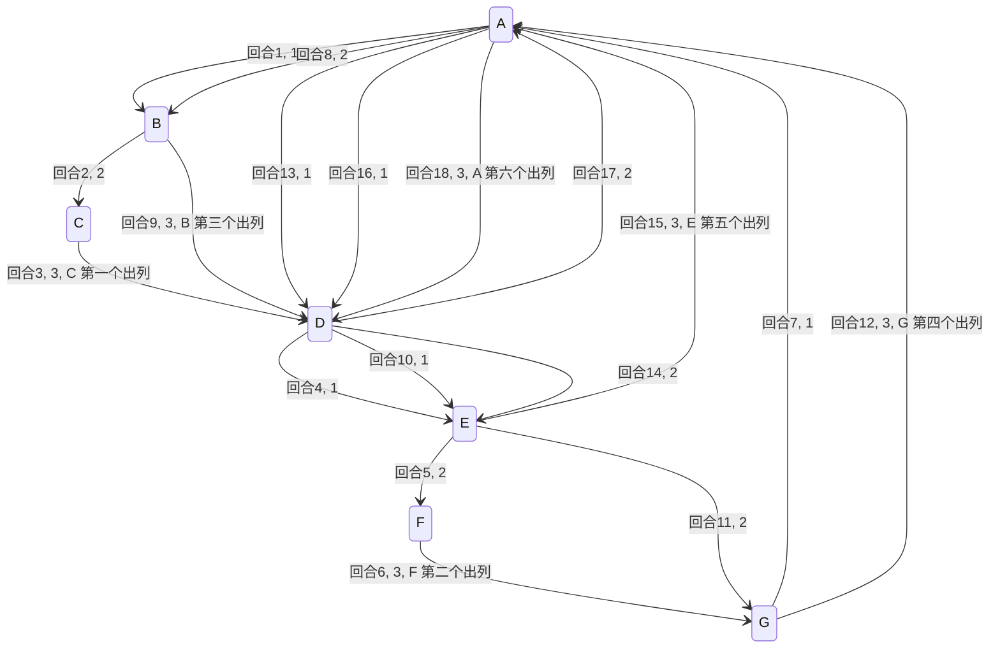

## 问题

在罗马人占领乔塔帕特后, 39 个犹太人与 Josephus 及他的朋友躲到一个洞中, 39 个犹太人决定宁愿死也不要被敌人抓到, 于是决定了一种自杀方式, 41 个人排成一个圆圈, 由第 1 个人开始报数, 报数到 3 的人就自杀, 然后再由下一个人重新报 1, 报数到 3 的人再自杀, 这样依次下去, 直到剩下最后一个人时, 那个人可以自由选择自己的命运, 这就是著名的约瑟夫问题

## 使用单向环形链表模拟问题

现在使用单向环形链表模拟一个总数 n = 7, 第 m = 3 个出列的流程



<!-- more -->

## 简单解决

- 如果链表为空或者链表节点数为 1, 或者 k 的值小于 1, 则不用调整就直接返回
- 在环形链表中遍历每个节点, 不断转圈, 不断让每个节点报数
- 当报数到达 k 时, 就删除当前报数的节点
- 删除节点后, 别忘了还要把剩下的节点继续连成环状, 继续转圈报数, 继续删除
- 不停地删除, 直到环形链表中只剩一个节点, 过程结束

由上面步骤可得出, 要找出最后存在链表里面的节点, 需要经过 $(k-1) \times n$ 次模拟才可以, 时间复杂度为 $O(k \times n)$

## 公式推导解决

当 $k=2$ 时的问题

设 $f(n)$ 为一开始有 $n$ 个人时, 生还者的位置(注意: 最终的生还者只有一个), 走了一圈以后, 所有偶数号码的人被杀, 再走第二圈, 则新的第二, 第四, ...个人被杀, 等等；就像没有第一圈一样, 如果一开始有偶数个人, 则第二圈时位置为 $x$ 的人一开始在第 $2x-1$ 个位置, 因此位置为 $f(2n)$ 的人开始时的位置为 $2f(n)-1$ , 这便给出了以下的递推公式:

 $f(2n)=2f(n)-1.\,$
如果一开始有奇数个人, 则走了一圈以后, 最终是号码为 1 的人被杀, 于是同样地, 再走第二圈时, 新的第二, 第四, ...个人被杀, 等等, 在这种情况下, 位置为 $x$ 的人原先位置为 $2x+1$ , 这便给出了以下的递推公式:

 $f(2n+1)=2f(n)+1.\,$
如果我们把 $n$ 和 $f(n)$ 的值列成表, 我们可以看出一个规律:

$n$     1 2 3 4 5 6 7 8 9 10 11 12 13 14 15 16
$f(n)$  1 1 3 1 3 5 7 1 3 5  7  9  11 13 15 1

从中可以看出,  $f(n)$ 是一个递增的奇数数列, 每当 n 是 2 的幂时, 便重新从 $f(n)=1$ 开始, 因此, 如果我们选择 m 和 l, 使得 $n=2^{m}+l$ 且 $0\leq l<2^{m}$ , 那么 $f(n)=2\cdot l+1$ , 注意:  $2^m$ 是不超过 n 的最大幂, l 是留下的量, 显然, 表格中的值满足这个方程, 我们用数学归纳法给出一个证明,

定理: 如果 $n=2^{m}+l$ 且 $0\leq l<2^{m}$ , 则 $f(n)=2l+1$ ,

证明: 对 $n$ 应用数学归纳法,  $n=1$ 的情况显然成立, 我们分别考虑 $n$ 是偶数和 $n$ 是奇数的情况,

如果 $n$ 是偶数, 则我们选择 $l_{1}$ 和 $m_{1}$ , 使得 $n/2=2^{m_{1}}+l_{1}$ , 且 $0\leq l_{1}<2^{m_{1}}$ , 注意 $l_{1}=l/2$ , 我们有 $f(n)=2f(n/2)-1=2((2l_{1})+1)-1=2l+1$ , 其中第二个等式从归纳假设推出,

如果 $n$ 是奇数, 则我们选择 $l_{1}$ 和 $m_{1}$ , 使得 $(n-1)/2=2^{m_{1}}+l_{1}$ , 且 $0\leq l_{1}<2^{m_{1}}$ , 注意 $l_{1}=(l-1)/2$ , 我们有 $f(n)=2f((n-1)/2)+1=2((2l_{1})+1)+1=2l+1$ , 其中第二个等式从归纳假设推出, 证毕,

答案的最漂亮的形式, 与 $n$ 的二进制表示有关: 把 $n$ 的第一位移动到最后, 便得到 $f(n)$ , 如果 $n$ 的二进制表示为 $n=b_{0}b_{1}b_{2}b_{3}\dots b_{m}$ , 则 $f(n)=b_{1}b_{2}b_{3}\dots b_{m}b_{0}$ , 这可以通过把 $n$ 表示为 $2^{m}+l$ 来证明,

一般情况下, 考虑生还者的号码从 $n-1$ 到 $n$ 的变化, 我们可以得到以下的递推公式 (编号从 0 开始):

 $f(n,k)=(f(n-1,k)+k){\bmod {n}}$ ,  $f(1,k)=0$

这种方法的运行时间是 $O(n)$ ,

对于 $k\neq 2$ 的情况, $k<n$ , 可以将上述方法推广, 将杀掉第 k, 2k, ...,  $\lfloor n/k\rfloor $  个人视为一个步骤, 然后把号码改变, 可得如下递推公式, 运行时间为 $O(k\log n)$ ,

$$
f(n,k)=\begin{cases}
    0&{\text{if }}n=1\\\\
    (f(n-1,k)+k){\bmod {n}}&{\text{if }}1<n<k\\\\
    \left\lfloor {\frac {k((f(n',k)-n{\bmod {k}}){\bmod {n}}')}{k-1}}\right\rfloor {\text{where }}n'=n-\left\lfloor {\frac {n}{k}}\right\rfloor &{\text{if }}k\leq n\\\\
\end{cases}
$$

## 实现

```java
@Slf4j
public class LinkListJosephusRing {
    static class Node {
        int value;
        Node next;

        public Node(int value) {
            this.value = value;
        }
    }

    static Node filter(Node head, int m) {
        if (head == null || head.next == head || m == 1) {
            // 当 n = 1 或者 m = 1 的情况直接返回
            return head;
        }
        Node next = head.next;
        // 保存链表大小
        int size = 1;

        while (next != head) {
            size ++;
            next = next.next;
        }

        // 计算出存活的位置
        size = curLive(size, m);

        // 递归获取存活位置的节点
        while (--size != 0) {
            head = head.next;
        }
        // 仅剩最后一个节点, 完成环形
        head.next = head;
        return head;
    }

    static int curLive(int n, int m) {
        if (n == 1) {
            return 1;
        }
        return (curLive(n - 1, m) + m - 1) % n + 1;
    }

    public static void main(String[] args) {
        Node a = new Node(1);
        Node b = new Node(2);
        Node c = new Node(3);
        Node d = new Node(4);
        Node e = new Node(5);
        Node f = new Node(6);
        Node g = new Node(7);
        a.next = b;
        b.next = c;
        c.next = d;
        d.next = e;
        e.next = f;
        f.next = g;
        g.next = a;

        Node live = filter(a, 3);
        log.info("n = 7, m = 3 存活节点为 {}", live.value);
    }
}
```

```sh
[main] INFO algo.LinkListJosephusRing - n = 7, m = 3 存活节点为 4
```

## 参考

- [约瑟夫问题](https://zh.wikipedia.org/wiki/%E7%BA%A6%E7%91%9F%E5%A4%AB%E6%96%AF%E9%97%AE%E9%A2%98)
