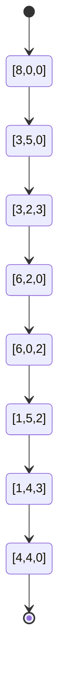
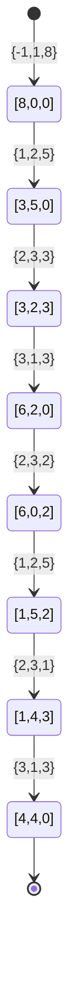

## 简介

有三个容积分别是 3 升, 5 升和 8 升的水桶, 其中容积为 8 升的水桶中装满了水, 容积为 3 升和容积为 5 升的水桶是空的, 三个水桶都没有体积刻度, 现在需要将大水桶中的 8 升水等分成两份, 每份都是 4 升水, 如何只使用另外两个空水桶实现

## 解析

目前已知最快的操作步骤, 共需要 7 次倒水动作：

1. 从 8 升水桶中倒 5 升水到 5 升水桶中
2. 从 5 升水桶中倒 3 升水到 3 升水桶中
3. 从 3 升水桶中倒 3 升水到 8 升水桶中
4. 从 5 升水桶中倒 2 升水到 3 升水桶中
5. 从 8 升水桶中倒 5 升水到 5 升水桶中
6. 从 5 升水桶中倒 1 升水到 3 升水桶中
7. 从 3 升水桶中倒 3 升水到 8 升水桶中

一个稍微复杂一点的答案, 这个答案需要 8 次倒水动作：

1. 从 8 升水桶中倒 3 升水到 3 升水桶中
2. 从 3 升水桶中倒 3 升水到 5 升水桶中
3. 从 8 升水桶中倒 3 升水到 3 升水桶中
4. 从 3 升水桶中倒 2 升水到 5 升水桶中
5. 从 5 升水桶中倒 5 升水到 8 升水桶中
6. 从 3 升水桶中倒 1 升水到 5 升水桶中
7. 从 8 升水桶中倒 3 升水到 3 升水桶中
8. 从 3 升水桶中倒 3 升水到 5 升水桶中

最后的结果都是 5 升水桶和 8 升水桶中各有 4 升水, 因为只有这两只桶能装上 4 升水

这个问题的答案远不止只两个

<!-- more -->

## 思路

人的思维方式可以很快的确定解决这个问题的关键是通过倒水凑出确定的 1 升水或能容纳 1 升水的空间, 三只水桶的容积分别是 3, 5 和 8, 用这三个数做加减运算, 可以得到很多组答案

$$
3-(5-3)=1 \\
(3＋3)-5=1
$$

这分别是前面推导过程中的解决方法

这不是一个典型意义上的求解最优解的问题, 虽然可能暗含了求解倒水次数最少的方法的要求, 但就本质而言, 常用的求解最优解问题的高效方法都不适用于此问题, 所以对于计算而言, 就是穷举解空间的全部合法解

解决本问题的算法关键是建立状态和动作的数学模型, 并找到一种持续驱动动作产生的搜索方法

### 建立数学模型

建立描述问题的数据结构, 完整的状态模型不仅要能够描述静止状态, 还要能够描述并记录状态转换动作, 尤其是对状态转换的描述, 因为这会影响到状态树搜索算法的设计

#### 状态的数学模型

由于题目中需要的是水的状态, 在任何时刻都是有三个水桶, 变量是水的多少, 所以使用一个一维数组来描述三个水桶中不同时刻的水量, 这样可以将初始状态定义为 $[8, 0, 0]$, 终止状态为 $[4, 4, 0]$, 这样便可以将上面的解答用状态转换描述出来



当然, 每个状态都会有多个可变的状态, 将所有可用的状态组合起来就是一棵状态树, $[8, 0, 0]$ 是状态树的根, 所以题目的求解过程就是要找到所有叶子节点为 $[4, 4, 0]$ 的路径

#### 动作模型

一个合法的倒水动作包含三个要素：倒出水的桶, 倒入水的桶和倒水体积, 同样使用一个三元组来描述倒水动作：`{ from, to, water }`, from 是指从哪个桶中倒水, to 是指将水倒向哪个桶, water 是此次倒水动作所倒的水量

每一个动作都可以用一个实例来表示

```java
class Action {
  int from;
  int to;
  int water;
}
```

某一个状态的改变都是通过初始状态 `+` 倒水动作组合成, 这样也可以通过计算得出结果状态

```java
class BucketState {
  int[] bucketWater;
  Action curAction;
}
```

最终的状态图如下



### 搜索算法

对于本问题来说, 这个状态树最初只有一个根节点, 整棵树的展开是随着搜索算法逐步展开的, 对于树状结构的搜索, 可以采用深度优先搜索 (DFS) 算法, 也可以采用广度优先搜索 (BFS) 算法, 两种方法各有优缺点

- 广度优先搜索
  - 优点是不会因为状态重复出现而导致搜索时出现状态环路
  - 缺点是需要比较多的存储空间记录中间状态
- 深度优先搜索
  - 优点是在同一时间只需要存储从根节点到当前搜索状态节点这一条路径上的状态节点, 需要的存储空间比较小
  - 缺点是要对搜索过程中因出现重复状态导致的状态环路做特殊处理, 避免状态搜索时出现死循环的情况

要求解所有可能的等分水的方法, 意味着要记录从初始状态到最终状态, 所以更适合使用深度优先遍历算法

#### 状态树的遍历和剪枝

通过对元素的组合可以生成一系列的动作, 对应不同动作会生成新的状态树, 对于本问题来讲, 产生的动作需要满足下列的条件才能继续遍历下去

- 不能向自身倒水
- 倒出水的桶不能为空桶
- 接收水的桶必需有空间接收水, 不能是满桶状态

#### 重复状态处理

采用深度优先搜索状态树, 会遇到重复状态导致的状态环路, 比如, 假设某一时刻从 1 号桶倒 3 升水到 3 号桶, 下一个时刻又从 3 号桶倒 3 升水到 1 号桶, 此时水桶的状态就又回到了之前的状态, 这就形成一个状态环路, 有可能几个状态之后才出现重复状态导致产生复杂的状态环路, 如果对这种情况不做处理, 状态搜索就会在某个状态树分支陷入死循环, 永远无法到达正确的结果状态, 除此之外, 如果对一个状态树分支上的某个状态经过搜索, 其结果已经知道, 则在另一个状态树分支上搜索时再遇到这个状态时, 可以直接给出结果, 或跳过搜索, 以便提高搜索算法的效率, 在这个过程中因重复出现被放弃或跳过的状态, 可以理解为另一种形式的“剪枝”, 可以使一次深度优先遍历很快收敛到初始状态

应对的方法便是对当前深度遍历过程中经过的搜索路径上所有已经搜索过的状态做一个记录, 形成一个当前已经处理过的状态表, 每次因为动作组合生成新状态时, 都检查一下是否在这个记录中有状态相同的记录, 如果存在状态相同的记录则跳过这个新状态, 回溯到上一步继续处理下一个状态, 如果新状态是状态表中没有的状态, 则将新状态加入到状态表, 然后从新状态开始继续深度优先遍历

## 实现

状态树的搜索是一个递归实现的过程：从初始状态开始, 由第一个合法的倒水动作得到一个新的状态, 记录这个状态, 并从这个新状态开始递归搜索, 在一个分支搜索完成后 (无论是否得到结果) , 取消这个状态, 然后从下一个合法的倒水动作再得到一个新状态, 然后从这个状态开始继续搜索, 直到遍历完所有合法的倒水动作

递归算法, 状态树搜索必须有一个终止条件, 否则算法无法收敛, 那么本问题的状态搜索的终止条件是什么？这要从两方面看, 一方面是倒水动作的遍历, 这是一个排列组合问题, 排列完所有组合就是结束条件, 另一方面是状态判断, 如果出现了等分水的最终状态, 则可以结束对状态树上当前分支的搜索

```java
public class BucketsEquallyWater {
    /**
     * 数量
     */
    private static final int BUCKETS_COUNT = 3;

    /**
     * 桶容量
     */
    private static int[] buckets = {8, 5, 3};

    /**
     * 初始状态
     */
    private static int[] start = {8, 0, 0};

    /**
     * 动作
     */
    @AllArgsConstructor
    static class Action {
        /**
         * 来源桶编号
         */
        public int from;
        /**
         * 目标桶编号
         */
        public int to;
        /**
         * 水量
         */
        public int water;

        @Override
        public String toString() {
            return "{从第 " + (from + 1) +
                    " 个桶往第 " + (to + 1) +
                    " 倒入 " + water +
                    " 水";
        }
    }

    /**
     * 每次动作的状态
     */
    static class BucketState {
        /**
         * 倒水后的状态
         */
        public int[] bucketWater;
        /**
         * 倒水操作状态
         */
        public Action curAction;

        public BucketState(int[] bucketWater) {
            this.bucketWater = bucketWater.clone();
            this.curAction = new Action(-1, -1, -1);
        }

        @Override
        public String toString() {
            if (curAction.water == -1) {
                return "开始状态 " + Arrays.toString(bucketWater);
            }
            return curAction + " 结果是 " + Arrays.toString(bucketWater);
        }

        /**
         * 判断是否最终状态, 目标是 [4, 4, 0]
         *
         * @return
         */
        public boolean isFinalState() {
            int[] state = bucketWater.clone();
            if (state[0] == 4 && state[1] == 4) {
                return true;
            }
            return false;
            /*if (this.curAction == null) {
                return false;
            }
            int[] state = bucketWater.clone();
            state[curAction.from] -= curAction.water;
            state[curAction.to] += curAction.water;
            if (state[0] == 4 && state[1] == 4) {
                return true;
            }
            return false;*/
        }

        /**
         * 判断当前转移水的桶的有效性
         *
         * @param from 来源桶编号
         * @param to   目标桶编号
         * @return
         */
        public boolean canTakeDumpAction(int from, int to) {
            assert from >= 0 && from < BUCKETS_COUNT;
            assert to >= 0 && to < BUCKETS_COUNT;
            // 判断不是同一个桶, 且 from 桶中有水, 且 to 桶中不满
            return (from != to && !isBucketEmpty(from) && !isBucketFull(to));
        }

        /**
         * 桶是否满水
         *
         * @param num 桶编号
         * @return
         */
        private boolean isBucketFull(int num) {
            return bucketWater[num] == buckets[num];
        }

        /**
         * 桶是否空
         *
         * @param num 桶编号
         * @return
         */
        private boolean isBucketEmpty(int num) {
            return bucketWater[num] == 0;
        }

        /**
         * 状态是否相等
         *
         * @param state 目标
         * @return
         */
        public boolean equals(BucketState state) {
            return this.bucketWater[0] == state.bucketWater[0]
                    && this.bucketWater[1] == state.bucketWater[1]
                    && this.bucketWater[2] == state.bucketWater[2];
                    /*&& this.curAction.from == state.curAction.from
                    && this.curAction.to == state.curAction.to
                    && this.curAction.water == state.curAction.water;*/
        }

        /**
         * 倒水操作
         *
         * @param from 来源桶编号
         * @param to   目标桶编号
         * @return
         */
        public boolean dumpWater(int from, int to) {
            // 从当前状态
            // this.bucketWater = current.bucketWater;
            // 目标桶可倒入的水量
            int water = buckets[to] - this.bucketWater[to];
            if (this.bucketWater[from] >= water) {
                // 如果当前桶有超过可倒入的水量
                this.bucketWater[to] += water;
                this.bucketWater[from] -= water;
            } else {
                // 当前桶里水不足, 那就使用所有
                this.bucketWater[to] += this.bucketWater[from];
                water = this.bucketWater[from];
                this.bucketWater[from] = 0;
            }
            if (water > 0) {
                // 有效操作
                this.curAction = new Action(from, to, water);
                return true;
            }
            return false;
        }
    }

    /**
     * 当前深度搜索的列表, 使用堆栈模拟当前正在搜索的分支
     */
    private static Stack<BucketState> states = new Stack<>();

    /**
     * 深度搜索
     */
    private static void search() {
        // 获取队列最后的状态, 也就当前的状态
        BucketState current = states.lastElement();
        if (current.isFinalState()) {
            // 如果是目标值, 打印出来
            printResult(states);
            // 收敛条件
            return;
        }
        // 循环两次所有桶, 在方法中对桶转移水这个操作的有效性进行剪枝
        for (int i = 0; i < BUCKETS_COUNT; i++) {
            for (int j = 0; j < BUCKETS_COUNT; j++) {
                searchStateOnAction(states, current, j, i);
            }
        }
    }

    /**
     * 判断当前状态是否已经操作过, 避免循环
     *
     * @param states 已经搜索过的列表
     * @param state  当前
     * @return
     */
    private static boolean isProcessState(Stack<BucketState> states, BucketState state) {
        Iterator<BucketState> iterator = states.iterator();
        while (iterator.hasNext()) {
            BucketState next = iterator.next();
            if (next.equals(state)) {
                return true;
            }
        }
        return false;
    }

    /**
     * 根据当前状态计算出下一个状态并保存到列表中
     *
     * @param states  已经搜索过的列表
     * @param current 当前状态
     * @param from    来源桶编号
     * @param to      目标桶编号
     */
    private static void searchStateOnAction(Stack<BucketState> states, BucketState current, int from, int to) {
        if (current.canTakeDumpAction(from, to)) {
            // 从当前状态
            BucketState next = new BucketState(current.bucketWater);
            // 开始动作
            boolean isDump = next.dumpWater(from, to);
            if (isDump && !isProcessState(states, next)) {
                // 压入
                states.push(next);
                // 继续深度搜索下一节点
                search();
                // 回退当前分支
                states.pop();
            }
        }
    }

    /**
     * 计数
     */
    private static int index = 0;

    /**
     * 打印堆栈
     *
     * @param states 已经搜索过的列表
     */
    private static void printResult(Stack<BucketState> states) {
        Iterator<BucketState> iterator = states.iterator();
        System.out.println(++index);
        while (iterator.hasNext()) {
            BucketState next = iterator.next();
            System.out.println(next);
        }
        System.out.println("总共 " + states.size() + " 步");
    }

    public static void main(String[] args) {
        states.add(new BucketState(start));
        search();
    }
}
```

## 结果

```sh
1
开始状态 [8, 0, 0]
{从第 1 个桶往第 2 倒入 5 水 结果是 [3, 5, 0]
{从第 1 个桶往第 3 倒入 3 水 结果是 [0, 5, 3]
{从第 2 个桶往第 1 倒入 5 水 结果是 [5, 0, 3]
{从第 3 个桶往第 2 倒入 3 水 结果是 [5, 3, 0]
{从第 1 个桶往第 3 倒入 3 水 结果是 [2, 3, 3]
{从第 3 个桶往第 2 倒入 2 水 结果是 [2, 5, 1]
{从第 2 个桶往第 1 倒入 5 水 结果是 [7, 0, 1]
{从第 3 个桶往第 2 倒入 1 水 结果是 [7, 1, 0]
{从第 1 个桶往第 3 倒入 3 水 结果是 [4, 1, 3]
{从第 3 个桶往第 2 倒入 3 水 结果是 [4, 4, 0]
总共 11 步
2
开始状态 [8, 0, 0]
{从第 1 个桶往第 2 倒入 5 水 结果是 [3, 5, 0]
{从第 2 个桶往第 3 倒入 3 水 结果是 [3, 2, 3]
{从第 2 个桶往第 1 倒入 2 水 结果是 [5, 0, 3]
{从第 3 个桶往第 2 倒入 3 水 结果是 [5, 3, 0]
{从第 1 个桶往第 3 倒入 3 水 结果是 [2, 3, 3]
{从第 3 个桶往第 2 倒入 2 水 结果是 [2, 5, 1]
{从第 2 个桶往第 1 倒入 5 水 结果是 [7, 0, 1]
{从第 3 个桶往第 2 倒入 1 水 结果是 [7, 1, 0]
{从第 1 个桶往第 3 倒入 3 水 结果是 [4, 1, 3]
{从第 3 个桶往第 2 倒入 3 水 结果是 [4, 4, 0]
总共 11 步
3
开始状态 [8, 0, 0]
{从第 1 个桶往第 2 倒入 5 水 结果是 [3, 5, 0]
{从第 2 个桶往第 3 倒入 3 水 结果是 [3, 2, 3]
{从第 3 个桶往第 1 倒入 3 水 结果是 [6, 2, 0]
{从第 2 个桶往第 3 倒入 2 水 结果是 [6, 0, 2]
{从第 1 个桶往第 2 倒入 5 水 结果是 [1, 5, 2]
{从第 1 个桶往第 3 倒入 1 水 结果是 [0, 5, 3]
{从第 2 个桶往第 1 倒入 5 水 结果是 [5, 0, 3]
{从第 3 个桶往第 2 倒入 3 水 结果是 [5, 3, 0]
{从第 1 个桶往第 3 倒入 3 水 结果是 [2, 3, 3]
{从第 3 个桶往第 2 倒入 2 水 结果是 [2, 5, 1]
{从第 2 个桶往第 1 倒入 5 水 结果是 [7, 0, 1]
{从第 3 个桶往第 2 倒入 1 水 结果是 [7, 1, 0]
{从第 1 个桶往第 3 倒入 3 水 结果是 [4, 1, 3]
{从第 3 个桶往第 2 倒入 3 水 结果是 [4, 4, 0]
总共 15 步
4
开始状态 [8, 0, 0]
{从第 1 个桶往第 2 倒入 5 水 结果是 [3, 5, 0]
{从第 2 个桶往第 3 倒入 3 水 结果是 [3, 2, 3]
{从第 3 个桶往第 1 倒入 3 水 结果是 [6, 2, 0]
{从第 2 个桶往第 3 倒入 2 水 结果是 [6, 0, 2]
{从第 1 个桶往第 2 倒入 5 水 结果是 [1, 5, 2]
{从第 2 个桶往第 3 倒入 1 水 结果是 [1, 4, 3]
{从第 2 个桶往第 1 倒入 4 水 结果是 [5, 0, 3]
{从第 3 个桶往第 2 倒入 3 水 结果是 [5, 3, 0]
{从第 1 个桶往第 3 倒入 3 水 结果是 [2, 3, 3]
{从第 3 个桶往第 2 倒入 2 水 结果是 [2, 5, 1]
{从第 2 个桶往第 1 倒入 5 水 结果是 [7, 0, 1]
{从第 3 个桶往第 2 倒入 1 水 结果是 [7, 1, 0]
{从第 1 个桶往第 3 倒入 3 水 结果是 [4, 1, 3]
{从第 3 个桶往第 2 倒入 3 水 结果是 [4, 4, 0]
总共 15 步
5
开始状态 [8, 0, 0]
{从第 1 个桶往第 2 倒入 5 水 结果是 [3, 5, 0]
{从第 2 个桶往第 3 倒入 3 水 结果是 [3, 2, 3]
{从第 3 个桶往第 1 倒入 3 水 结果是 [6, 2, 0]
{从第 2 个桶往第 3 倒入 2 水 结果是 [6, 0, 2]
{从第 1 个桶往第 2 倒入 5 水 结果是 [1, 5, 2]
{从第 2 个桶往第 3 倒入 1 水 结果是 [1, 4, 3]
{从第 3 个桶往第 1 倒入 3 水 结果是 [4, 4, 0]
总共 8 步
6
开始状态 [8, 0, 0]
{从第 1 个桶往第 2 倒入 5 水 结果是 [3, 5, 0]
{从第 2 个桶往第 3 倒入 3 水 结果是 [3, 2, 3]
{从第 3 个桶往第 1 倒入 3 水 结果是 [6, 2, 0]
{从第 2 个桶往第 3 倒入 2 水 结果是 [6, 0, 2]
{从第 1 个桶往第 2 倒入 5 水 结果是 [1, 5, 2]
{从第 2 个桶往第 3 倒入 1 水 结果是 [1, 4, 3]
{从第 1 个桶往第 2 倒入 1 水 结果是 [0, 5, 3]
{从第 2 个桶往第 1 倒入 5 水 结果是 [5, 0, 3]
{从第 3 个桶往第 2 倒入 3 水 结果是 [5, 3, 0]
{从第 1 个桶往第 3 倒入 3 水 结果是 [2, 3, 3]
{从第 3 个桶往第 2 倒入 2 水 结果是 [2, 5, 1]
{从第 2 个桶往第 1 倒入 5 水 结果是 [7, 0, 1]
{从第 3 个桶往第 2 倒入 1 水 结果是 [7, 1, 0]
{从第 1 个桶往第 3 倒入 3 水 结果是 [4, 1, 3]
{从第 3 个桶往第 2 倒入 3 水 结果是 [4, 4, 0]
总共 16 步
7
开始状态 [8, 0, 0]
{从第 1 个桶往第 2 倒入 5 水 结果是 [3, 5, 0]
{从第 2 个桶往第 3 倒入 3 水 结果是 [3, 2, 3]
{从第 3 个桶往第 1 倒入 3 水 结果是 [6, 2, 0]
{从第 2 个桶往第 3 倒入 2 水 结果是 [6, 0, 2]
{从第 1 个桶往第 3 倒入 1 水 结果是 [5, 0, 3]
{从第 3 个桶往第 2 倒入 3 水 结果是 [5, 3, 0]
{从第 1 个桶往第 3 倒入 3 水 结果是 [2, 3, 3]
{从第 3 个桶往第 2 倒入 2 水 结果是 [2, 5, 1]
{从第 2 个桶往第 1 倒入 5 水 结果是 [7, 0, 1]
{从第 3 个桶往第 2 倒入 1 水 结果是 [7, 1, 0]
{从第 1 个桶往第 3 倒入 3 水 结果是 [4, 1, 3]
{从第 3 个桶往第 2 倒入 3 水 结果是 [4, 4, 0]
总共 13 步
8
开始状态 [8, 0, 0]
{从第 1 个桶往第 2 倒入 5 水 结果是 [3, 5, 0]
{从第 2 个桶往第 3 倒入 3 水 结果是 [3, 2, 3]
{从第 1 个桶往第 2 倒入 3 水 结果是 [0, 5, 3]
{从第 2 个桶往第 1 倒入 5 水 结果是 [5, 0, 3]
{从第 3 个桶往第 2 倒入 3 水 结果是 [5, 3, 0]
{从第 1 个桶往第 3 倒入 3 水 结果是 [2, 3, 3]
{从第 3 个桶往第 2 倒入 2 水 结果是 [2, 5, 1]
{从第 2 个桶往第 1 倒入 5 水 结果是 [7, 0, 1]
{从第 3 个桶往第 2 倒入 1 水 结果是 [7, 1, 0]
{从第 1 个桶往第 3 倒入 3 水 结果是 [4, 1, 3]
{从第 3 个桶往第 2 倒入 3 水 结果是 [4, 4, 0]
总共 12 步
9
开始状态 [8, 0, 0]
{从第 1 个桶往第 3 倒入 3 水 结果是 [5, 0, 3]
{从第 1 个桶往第 2 倒入 5 水 结果是 [0, 5, 3]
{从第 3 个桶往第 1 倒入 3 水 结果是 [3, 5, 0]
{从第 2 个桶往第 3 倒入 3 水 结果是 [3, 2, 3]
{从第 3 个桶往第 1 倒入 3 水 结果是 [6, 2, 0]
{从第 2 个桶往第 3 倒入 2 水 结果是 [6, 0, 2]
{从第 1 个桶往第 2 倒入 5 水 结果是 [1, 5, 2]
{从第 2 个桶往第 3 倒入 1 水 结果是 [1, 4, 3]
{从第 3 个桶往第 1 倒入 3 水 结果是 [4, 4, 0]
总共 10 步
10
开始状态 [8, 0, 0]
{从第 1 个桶往第 3 倒入 3 水 结果是 [5, 0, 3]
{从第 3 个桶往第 2 倒入 3 水 结果是 [5, 3, 0]
{从第 1 个桶往第 2 倒入 2 水 结果是 [3, 5, 0]
{从第 2 个桶往第 3 倒入 3 水 结果是 [3, 2, 3]
{从第 3 个桶往第 1 倒入 3 水 结果是 [6, 2, 0]
{从第 2 个桶往第 3 倒入 2 水 结果是 [6, 0, 2]
{从第 1 个桶往第 2 倒入 5 水 结果是 [1, 5, 2]
{从第 2 个桶往第 3 倒入 1 水 结果是 [1, 4, 3]
{从第 3 个桶往第 1 倒入 3 水 结果是 [4, 4, 0]
总共 10 步
11
开始状态 [8, 0, 0]
{从第 1 个桶往第 3 倒入 3 水 结果是 [5, 0, 3]
{从第 3 个桶往第 2 倒入 3 水 结果是 [5, 3, 0]
{从第 1 个桶往第 3 倒入 3 水 结果是 [2, 3, 3]
{从第 1 个桶往第 2 倒入 2 水 结果是 [0, 5, 3]
{从第 3 个桶往第 1 倒入 3 水 结果是 [3, 5, 0]
{从第 2 个桶往第 3 倒入 3 水 结果是 [3, 2, 3]
{从第 3 个桶往第 1 倒入 3 水 结果是 [6, 2, 0]
{从第 2 个桶往第 3 倒入 2 水 结果是 [6, 0, 2]
{从第 1 个桶往第 2 倒入 5 水 结果是 [1, 5, 2]
{从第 2 个桶往第 3 倒入 1 水 结果是 [1, 4, 3]
{从第 3 个桶往第 1 倒入 3 水 结果是 [4, 4, 0]
总共 12 步
12
开始状态 [8, 0, 0]
{从第 1 个桶往第 3 倒入 3 水 结果是 [5, 0, 3]
{从第 3 个桶往第 2 倒入 3 水 结果是 [5, 3, 0]
{从第 1 个桶往第 3 倒入 3 水 结果是 [2, 3, 3]
{从第 3 个桶往第 2 倒入 2 水 结果是 [2, 5, 1]
{从第 2 个桶往第 1 倒入 5 水 结果是 [7, 0, 1]
{从第 3 个桶往第 2 倒入 1 水 结果是 [7, 1, 0]
{从第 1 个桶往第 2 倒入 4 水 结果是 [3, 5, 0]
{从第 2 个桶往第 3 倒入 3 水 结果是 [3, 2, 3]
{从第 3 个桶往第 1 倒入 3 水 结果是 [6, 2, 0]
{从第 2 个桶往第 3 倒入 2 水 结果是 [6, 0, 2]
{从第 1 个桶往第 2 倒入 5 水 结果是 [1, 5, 2]
{从第 2 个桶往第 3 倒入 1 水 结果是 [1, 4, 3]
{从第 3 个桶往第 1 倒入 3 水 结果是 [4, 4, 0]
总共 14 步
13
开始状态 [8, 0, 0]
{从第 1 个桶往第 3 倒入 3 水 结果是 [5, 0, 3]
{从第 3 个桶往第 2 倒入 3 水 结果是 [5, 3, 0]
{从第 1 个桶往第 3 倒入 3 水 结果是 [2, 3, 3]
{从第 3 个桶往第 2 倒入 2 水 结果是 [2, 5, 1]
{从第 2 个桶往第 1 倒入 5 水 结果是 [7, 0, 1]
{从第 3 个桶往第 2 倒入 1 水 结果是 [7, 1, 0]
{从第 1 个桶往第 3 倒入 3 水 结果是 [4, 1, 3]
{从第 1 个桶往第 2 倒入 4 水 结果是 [0, 5, 3]
{从第 3 个桶往第 1 倒入 3 水 结果是 [3, 5, 0]
{从第 2 个桶往第 3 倒入 3 水 结果是 [3, 2, 3]
{从第 3 个桶往第 1 倒入 3 水 结果是 [6, 2, 0]
{从第 2 个桶往第 3 倒入 2 水 结果是 [6, 0, 2]
{从第 1 个桶往第 2 倒入 5 水 结果是 [1, 5, 2]
{从第 2 个桶往第 3 倒入 1 水 结果是 [1, 4, 3]
{从第 3 个桶往第 1 倒入 3 水 结果是 [4, 4, 0]
总共 16 步
14
开始状态 [8, 0, 0]
{从第 1 个桶往第 3 倒入 3 水 结果是 [5, 0, 3]
{从第 3 个桶往第 2 倒入 3 水 结果是 [5, 3, 0]
{从第 1 个桶往第 3 倒入 3 水 结果是 [2, 3, 3]
{从第 3 个桶往第 2 倒入 2 水 结果是 [2, 5, 1]
{从第 2 个桶往第 1 倒入 5 水 结果是 [7, 0, 1]
{从第 3 个桶往第 2 倒入 1 水 结果是 [7, 1, 0]
{从第 1 个桶往第 3 倒入 3 水 结果是 [4, 1, 3]
{从第 3 个桶往第 2 倒入 3 水 结果是 [4, 4, 0]
总共 9 步
15
开始状态 [8, 0, 0]
{从第 1 个桶往第 3 倒入 3 水 结果是 [5, 0, 3]
{从第 3 个桶往第 2 倒入 3 水 结果是 [5, 3, 0]
{从第 1 个桶往第 3 倒入 3 水 结果是 [2, 3, 3]
{从第 3 个桶往第 2 倒入 2 水 结果是 [2, 5, 1]
{从第 3 个桶往第 1 倒入 1 水 结果是 [3, 5, 0]
{从第 2 个桶往第 3 倒入 3 水 结果是 [3, 2, 3]
{从第 3 个桶往第 1 倒入 3 水 结果是 [6, 2, 0]
{从第 2 个桶往第 3 倒入 2 水 结果是 [6, 0, 2]
{从第 1 个桶往第 2 倒入 5 水 结果是 [1, 5, 2]
{从第 2 个桶往第 3 倒入 1 水 结果是 [1, 4, 3]
{从第 3 个桶往第 1 倒入 3 水 结果是 [4, 4, 0]
总共 12 步
16
开始状态 [8, 0, 0]
{从第 1 个桶往第 3 倒入 3 水 结果是 [5, 0, 3]
{从第 3 个桶往第 2 倒入 3 水 结果是 [5, 3, 0]
{从第 1 个桶往第 3 倒入 3 水 结果是 [2, 3, 3]
{从第 3 个桶往第 2 倒入 2 水 结果是 [2, 5, 1]
{从第 1 个桶往第 3 倒入 2 水 结果是 [0, 5, 3]
{从第 3 个桶往第 1 倒入 3 水 结果是 [3, 5, 0]
{从第 2 个桶往第 3 倒入 3 水 结果是 [3, 2, 3]
{从第 3 个桶往第 1 倒入 3 水 结果是 [6, 2, 0]
{从第 2 个桶往第 3 倒入 2 水 结果是 [6, 0, 2]
{从第 1 个桶往第 2 倒入 5 水 结果是 [1, 5, 2]
{从第 2 个桶往第 3 倒入 1 水 结果是 [1, 4, 3]
{从第 3 个桶往第 1 倒入 3 水 结果是 [4, 4, 0]
总共 13 步

Process finished with exit code 0
```
