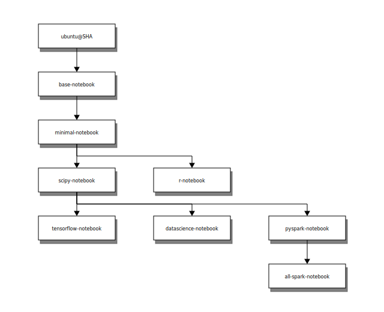

# 简介

> [Jupyter Notebook](https://jupyter.org/install.html) 是一个基于 Web 的交互式计算环境, 用于创建 Jupyter Notebook 文档, 对于 python 的初学者, 提供了一套可视化的交互式的试验环境

这篇文档主要记录 [Jupyter Notebook 容器](https://jupyter-docker-stacks.readthedocs.io/en/latest/)的介绍和使用

- `jupyter/base-notebook`: 核心堆栈的最小镜像
  - 最小功能的 Jupyter Notebook 服务器
  - [MiniConda](https://conda.io/miniconda.html)
  - 没有预装科学计算软件包
  - 镜像使用无特权用户 `jovyan` (可配置)
  - 容器入口点 `tini`, 默认命令 `start-notebook.sh`
  - `start-singleuser.sh` 脚本可用于在 JupyterHub 中启动容器
  - `start.sh` 脚本
  - 自签名 https 证书和无密码的 sudo 选项
- `jupyter/minimal-notebook`: 添加一些命令行工具
  - [Pandoc](http://pandoc.org/) 和 [TeX Live](https://www.tug.org/texlive/) 用于文档转换
  - git, emacs, jed, nano, tzdata, and unzip
- `jupyter/r-notebook`: 包括 r 语言生态系统的流行软件包
- `jupyter/scipy-notebook`: 包括科学计算的 python 生态系统的流行软件包
- `jupyter/tensorflow-notebook`: 包括 python 生态系统的流行的深度学习库
- `jupyter/datascience-notebook`: 包括用于来自 Julia, Python 和 R 社区的数据分析的库
- `jupyter/pyspark-notebook`: 包括对 Apache Spark (可选地在 Mesos上) 的 Python 支持
- `jupyter/all-spark-notebook`: 包括对 Apache Spark (可选地在 Mesos上) 的 Python, R 和 Scala 支持



<!-- more -->

# 创建 Deployment

```yml
apiVersion: apps/v1
kind: Deployment
metadata:
  name: jupyter-notebook
  labels:
    app: jupyter-notebook
spec:
  replicas: 1
  selector:
    matchLabels:
      app: jupyter-notebook
  template:
    metadata:
      labels:
        app: jupyter-notebook
    spec:
      containers:
      - name: base-notebook
        image: 127.0.0.1:32000/jupyter/base-notebook
        ports:
        - containerPort: 8888
        command: ["start-notebook.sh"]
        args: ["--NotebookApp.token=''"]
```

这里我们使用了 `jupyter/base-notebook` 镜像, 由于不需要 token 登录, 所以使用了 `--NotebookApp.token=''` 参数

# 创建 Service

```yml
kind: Service
apiVersion: v1
metadata:
  name: jupyter-notebook
spec:
  selector:
    app: jupyter-notebook
  ports:
  - protocol: TCP
    port: 8888
    targetPort: 8888
```

暴露 `8888` 端口

# 创建 nginx 入口

```yml
apiVersion: extensions/v1beta1
kind: Ingress
metadata:
  name: jupyter-notebook
  namespace:
  annotations:
    kubernetes.io/tls-acme: "true"
    kubernetes.io/ingress.class: "nginx"
    nginx.ingress.kubernetes.io/auth-type: basic
    # name of the secret that contains the user/password definitions
    nginx.ingress.kubernetes.io/auth-secret: basic-auth
    # message to display with an appropiate context why the authentication is required
    nginx.ingress.kubernetes.io/auth-realm: "Authentication Required - jupyter"
spec:
  rules:
  - host: e.yzer.club
    http:
      paths:
      - path: /
        backend:
          serviceName: jupyter-notebook
          servicePort: 8888
  tls:
  - secretName: jupyter-secret
    hosts:
      - e.yzer.club
```

这里使用 nginx 将服务暴露到外网, 前面取消了 jupyter notebook 自带的 token 认证, 这里使用 nginx 的 basic-auth 认证方式, 通过新增认证文件来实现

```sh
htpasswd -c auth jupyter
New password:
Re-type new password:
Adding password for user jupyter
```

```sh
# 使用 htpasswd 生成的 auth 文件
kubectl create secret generic basic-auth --from-file=auth
secret "basic-auth" created
```

匿名访问返回 401

```sh
curl -v https://e.yzer.club -H 'Host:e.yzer.club'                        
* Rebuilt URL to: https://e.yzer.club/
*   Trying 111.230.168.38...
* TCP_NODELAY set
* Connected to e.yzer.club (111.230.168.38) port 443 (#0)
* ALPN, offering h2
* ALPN, offering http/1.1
* successfully set certificate verify locations:
*   CAfile: /etc/ssl/certs/ca-certificates.crt
  CApath: /etc/ssl/certs
* TLSv1.3 (OUT), TLS handshake, Client hello (1):
* TLSv1.3 (IN), TLS handshake, Server hello (2):
* TLSv1.2 (IN), TLS handshake, Certificate (11):
* TLSv1.2 (IN), TLS handshake, Server key exchange (12):
* TLSv1.2 (IN), TLS handshake, Server finished (14):
* TLSv1.2 (OUT), TLS handshake, Client key exchange (16):
* TLSv1.2 (OUT), TLS change cipher, Client hello (1):
* TLSv1.2 (OUT), TLS handshake, Finished (20):
* TLSv1.2 (IN), TLS handshake, Finished (20):
* SSL connection using TLSv1.2 / ECDHE-RSA-AES256-GCM-SHA384
* ALPN, server accepted to use h2
* Server certificate:
*  subject: CN=e.yzer.club
*  start date: Sep 16 00:00:00 2019 GMT
*  expire date: Dec 14 12:00:00 2020 GMT
*  subjectAltName: host "e.yzer.club" matched cert's "e.yzer.club"
*  issuer: C=CN; O=TrustAsia Technologies, Inc.; OU=Domain Validated SSL; CN=TrustAsia TLS RSA CA
*  SSL certificate verify ok.
* Using HTTP2, server supports multi-use
* Connection state changed (HTTP/2 confirmed)
* Copying HTTP/2 data in stream buffer to connection buffer after upgrade: len=0
* Using Stream ID: 1 (easy handle 0x56441c0d7580)
> GET / HTTP/2
> Host:e.yzer.club
> User-Agent: curl/7.58.0
> Accept: */*
> 
* Connection state changed (MAX_CONCURRENT_STREAMS updated)!
< HTTP/2 401 
< server: nginx/1.15.8
< date: Wed, 22 Jan 2020 10:02:12 GMT
< content-type: text/html
< content-length: 179
< www-authenticate: Basic realm="Authentication Required - jupyter"
< strict-transport-security: max-age=15724800; includeSubDomains
< 
<html>
<head><title>401 Authorization Required</title></head>
<body>
<center><h1>401 Authorization Required</h1></center>
<hr><center>nginx/1.15.8</center>
</body>
</html>
* Connection #0 to host e.yzer.club left intact
```