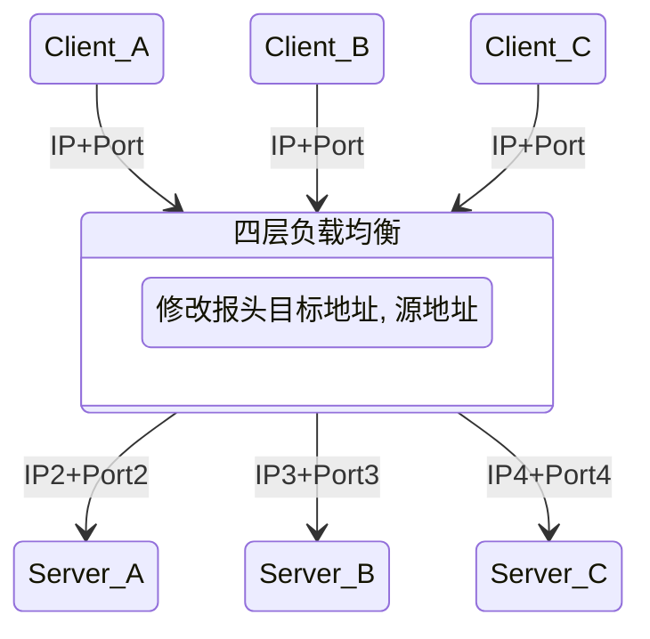
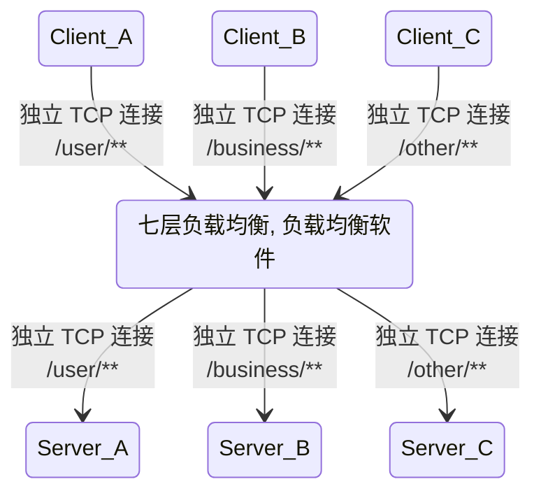

## 简介

负载均衡建立在现有网络结构之上, 提供了一种廉价, 有效, 透明的方法来扩展网络设备和服务器的带宽, 增加了吞吐量, 加强了网络数据处理能力, 并提高了网络的灵活性和可用性

## 四层负载均衡与七层负载均衡区别

- 四层负载均衡:
  - 基于 IP 和端口的方式实现网络的负载均衡, 具体实现为对外提供一个虚拟 IP 和端口接收所有用户的请求, 然后根据负载均衡配置和负载均衡策略将请求发送给真实的服务器
  - 主要通过修改报文中的目标地址和端口来实现报文的分发和负载均衡, 以 TCP 为例, 负载均衡设备在接收到第 1 个来自客户端的 SYN 请求后, 会根据负载均衡配置和负载均衡策略选择一个最佳的服务器, 并将报文中的目标 IP 地址修改为该服务器的 IP 直接转发给该服务器, TCP 连接的建立 (即三次握手过程) 是在客户端和服务器端之间完成的, 负载均衡设备只起到路由器的转发功能
  - 只能针对 IP 地址和端口上的数据做统一的分发, 通常使用 LVS 等技术实现基于 Socket 的四层负载均衡
- 七层负载均衡:
  - 基于 URL 等资源来实现应用层基于内容的负载均衡, 具体实现为通过虚拟的 URL 或主机名接收所有用户的请求, 然后将请求发送给真实的服务器
  - 主要通过解析报文中真正有意义的应用层内容, 并根据负载均衡配置和负载均衡策略选择一个最佳的服务器响应用户的请求
  - 根据消息的内容做更加详细的有针对性的负载均衡
  - 七层负载均衡根据不同的数据类型将数据存储在不同的服务器上来提高网络整体的负载能力, 比如将客户端的基本信息存储在内存较大的缓存服务器上, 将文件信息存储在磁盘空间较大的文件服务器上, 将图片视频存储在网络 I/O 能力较强的流媒体服务器上, 在接收到不同的客户端的请求时从不同的服务器上获取数据并将其返回给客户端, 提高客户端的访问效率

<!-- more -->

## 常用方案

- 四层负载均衡:
  - F5: 硬件负载均衡器, 功能完备, 价格昂贵
  - LVS: 基于 IP+ 端口实现的四层负载软件, 常和 Keepalive 配合使用
  - Nginx: 同时实现四层负载和七层负载均衡, 带缓存功能, 可基于正则表达式灵活转发
- 七层负载均衡:
  - HAProxy: 支持七层代理, 会话保持, 标记, 路径转移等
  - Nginx: 同时实现四层负载和七层负载均衡, 在 HTTP 和 Mail 协议上功能比较好, 性能与 HAProxy 差不多
  - Apache: 使用简单, 性能较差

## 算法

- 轮询均衡 (Round Robin) : 将客户端请求轮流分配到 1 至 N台服务器上, 每台服务器均被均等地分配一定数量的客户端请求, 轮询均衡算法适用于集群中所有服务器都有相同的软硬件配置和服务能力的情况下
- 权重轮询均衡 (Weighted Round Robin) : 根据每台服务器的不同配置及服务能力, 为每台服务器都设置不同的权重值, 然后按照设置的权重值轮询地将请求分配到不同的服务器上, 例如, 服务器 A 的权重值被设计成 3, 服务器 B 的权重值被设计成 3, 服务器 C 的权重值被设计成 4, 则服务器 A, B, C 将分别承担 30%, 30%, 40% 的客户端请求, 权重轮询均衡算法主要用于服务器配置不均等的集群中
- 随机均衡 (Random) : 将来自网络的请求随机分配给内部的多台服务器, 不考虑服务器的配置和负载情况
- 权重随机均衡 (Weighted Random) : 类似于权重轮询算法, 只是在分配请求时不再轮询发送, 而是随机选择某个权重的服务器发送
- 响应速度均衡 (Response Time) : 根据服务器设备响应速度的不同将客户端请求发送到响应速度最快的服务器上, 对响应速度的获取是通过负载均衡设备定时为每台服务都发出一个探测请求 (例如 Ping) 实现的, 响应速度均衡能够为当前的每台服务器根据其不同的负载情况分配不同的客户端请求, 这有效避免了某台服务器单点负载过高的情况, 但需要注意的是, 这里探测到的响应速度是负载均衡设备到各个服务器之间的响应速度, 并不完全代表客户端到服务器的响应速度, 因此存在一定偏差
- 最少连接数均衡 (Least Connection) : 在负载均衡器内部记录当前每台服务器正在处理的连接数量, 在有新的请求时, 将该请求分配给连接数最少的服务器, 这种均衡算法适用于网络连接和带宽有限, CPU 处理任务简单的请求服务, 例如 FTP
- 处理能力均衡: 将服务请求分配给内部负荷最轻的服务器, 负荷是根据服务器的 CPU 型号, CPU 数量, 内存大小及当前连接数等换算而成的, 处理能力均衡算法由于考虑到了内部服务器的处理能力及当前网络的运行状况, 所以相对来说更加精确, 尤其适用于七层负载均衡的场景
- DNS 响应均衡 (Flash DNS) : 在分布在不同中心机房的负载均衡设备都收到同一个客户端的域名解析请求时, 所有负载均衡设备均解析此域名并将解析后的服务器 IP 地址返回给客户端, 客户端向收到第一个域名解析后的 IP 地址发起请求服务, 而忽略其他负载均衡设备的响应, 这种均衡算法适用于全局负载均衡的场景
- 散列算法均衡: 通过一致性散列算法和虚拟节点技术将相同参数的请求总是发送到同一台服务器, 该服务器将长期, 稳定地为某些客户端提供服务, 在某个服务器被移除或异常宕机后, 该服务器的请求基于虚拟节点技术平摊到其他服务器, 而不会影响集群整体的稳定性
- IP 地址散列: 在负载均衡器内部维护了不同链接上客户端和服务器的 IP 对应关系表, 将来自同一客户端的请求统一转发给相同的服务器, 该算法能够以会话为单位, 保证同一客户端的请求能够一直在同一台服务器上处理, 主要适用于客户端和服务器需要保持长连接的场景, 比如基于 TCP 长连接的应用
- URL 散列: 通过管理客户端请求 URL 信息的散列表, 将相同 URL 的请求转发给同一台服务器, 该算法主要适用于在七层负载中根据用户请求类型的不同将其转发给不同类型的应用服务器
