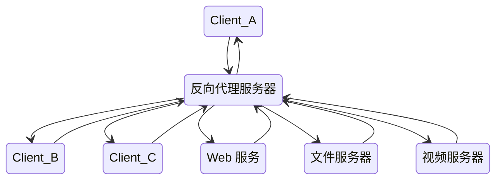

## 简介

一般的负载均衡软件如 LVS 实现的功能只是对请求数据包的转发和传递，从负载均衡下的节点服务器来看，接收到的请求还是来自访问负载均衡器的客户端的真实用户；而反向代理服务器在接收到用户的访问请求后，会代理用户重新向节点服务器（We b 服务器、文件服务器、视频服务器）发起请求，反向代理服务器和节点服务器做具体的数据交互，最后把数据返回给客户端用户。在节点服务器看来，访问的节点服务器的客户端就是反向代理服务器，而非真实的网站访问用户

<!-- more -->



## 负载均衡模块

`ngx_http_upstream_module` 是 Nginx 的负载均衡模块，可以实现网站的负载均衡功能即节点的健康检查。upstream 模块允许 Nginx 定义一组或多组节点服务器，在使用时可通过 `proxy_pass` 代理方式把网站的请求发送到事先定义好的对应 Upstream 组的名字上

```conf
upstream lb{
  server 10.0.0.77 weight=5;
  server 10.0.0.88 weight=10;
}
```

- weight：服务器权重
- max_fails：Nginx 尝试连接后端服务器的最大失败次数，如果失败时大于 max_fails，则认为该服务器不可用
- fail_timeout：max_fails 和 fail_timeout 一般会关联使用，如果某台服务器在 fail_timeout 时间内出现了 max_fails 次连接失败，那么 Nginx 会认为其已经挂掉，从而在 fail_timeout 时间内不再去请求它，fail_timeout 默认是 10s，max_fails 默认是 1，即在默认情况下只要发生错误就认为服务器挂了，如果将 max_fails 设置为 0，则表示取消这项检查
- backup：表示当前服务器是备用服务器，只有其他非 backup 后端服务器都挂掉或很忙时，才会分配请求给它
- down：标志服务器永远不可用

## proxy_pass

proxy_pass 指令属于 ngx_http_proxy_module 模块，此模块可以将请求转发到另一台服务器，在实际的反向代理工作中，会通过 location 功能匹配指定的 URI，然后把接收到的服务匹配 URI 的请求通过 proxy_pass 抛给定义好的 upstream 节点池

```conf
location /login/ {
  proxy_pass http://lb/login;
}
```

- proxy_next_upstream: 在什么情况下将请求传递到下一个 upstream
- proxy_limit_race: 限制从后端服务器读取响应的速率
- proxy_set_header: 设置 HTTP 请求 header, 后续请求会将 header 传给后端服务器节点
- client_body_buffer_size: 客户端请求主体缓冲区的大小
- proxy_connect_timeout: 代理与后端节点服务器连接的超时时间
- proxy_send_timeout: 后端节点数据回传的超时时间
- proxy_read_timeout: 设置 Nginx 从代理的后端服务器获取信息的时间, 表示在连接成功建立后, Nginx 等待后端服务器的响应时间
- proxy_buffer_size: 设置缓冲区的大小
- proxy_buffers: 设置缓冲区的数量和大小
- proxy_busy_buffers_size: 用于设置系统很忙时可以使用的 proxy_buffers 大小, 推荐为 `proxy_buffers x 2`
- proxy_temp_file_write_size: 指定缓存临时文件的大小

https://qidawu.github.io/2017/05/13/nginx-upstream/

# Nginx 负载均衡

2017-05-13[Nginx](/tags/Nginx/ "Nginx")

# [](#集群 " 集群 ") 集群

Nginx 标准 HTTP 模块 [ngx\_http\_upstream\_module](http://nginx.org/en/docs/http/ngx_http_upstream_module.html) 内置了集群和负载均衡功能, 使用其中的 `upstream` 配合 `proxy_pass` 指令即可快速实现一个集群:

<table> <tbody> <tr> <td class="gutter"> <pre> <span class="line">1</span> <br> <span class="line">2</span> <br> <span class="line">3</span> <br> <span class="line">4</span> <br> <span class="line">5</span> <br> <span class="line">6</span> <br> <span class="line">7</span> <br> <span class="line">8</span> <br> <span class="line">9</span> <br> <span class="line">10</span> <br> <span class="line">11</span> <br> <span class="line">12</span> <br> <span class="line">13</span> <br> <span class="line">14</span> <br> <span class="line">15</span> <br> <span class="line">16</span> <br> </pre> </td> <td class="code"> <pre> <span class="line"> http {</span> <br> <span class="line">    upstream backend {</span> <br> <span class="line">        server backend1.example.com       weight=5; </span> <br> <span class="line">        server 127.0.0.1:8080             max_fails=3 fail_timeout=30s; </span> <br> <span class="line">        server unix:/tmp/backend3; </span> <br> <span class="line"> </span> <br> <span class="line">        server backup1.example.com:8080   backup; </span> <br> <span class="line">        server backup2.example.com:8080   down; </span> <br> <span class="line">    } </span> <br> <span class="line"> </span> <br> <span class="line">    server {</span> <br> <span class="line">        location / {</span> <br> <span class="line">            proxy_pass http://backend; </span> <br> <span class="line">        } </span> <br> <span class="line">    } </span> <br> <span class="line">} </span> <br> </pre> </td> </tr> </tbody> </table>

其中 `server` 指令的常用参数描述如下:

| 参数 | 描述 |
| --- | --- |
| `weight= number` | 设置服务器的轮询权重, 默认为 1. 用于后端服务器性能不均的情况. |
| `max_conns= number` | 设置被代理服务器的最大可用并发连接数限制, 默认为 0, 表示没有限制. |
| `max_fails= number` | 设置最大失败重试次数, 默认为 1. 设置为 0 表示禁用重试. |
| `fail_timeout= time` | 设置失败时间, 默认 10 秒. |
| `backup` | 将服务器标记为备份服务器. 当主服务器不可用时, 它将被传递请求. |
| `down` | 将服务器标记为永久不可用. |

# [](#负载均衡 " 负载均衡 ") 负载均衡

负载均衡 (Load Balance), 其意思就是将运算或存储负载按一定的算法分摊到多个运算或存储单元上, 下面介绍 Nginx 几种常见的负载均衡方法:

*   默认策略: 加权轮询策略 (weighted round-robin).
*   `random`, 加权随机策略.
*   `ip_hash`, 基于客户端 IP 计算出哈希值, 再根据服务器数量取模选取服务器 (ip\_hash % server\_size = server\_no).
*   `hash key [consistent]`, 基于指定 key 计算出哈希值, 再根据服务器数量取模选取服务器. 可选一致性哈希算法缓解重映射问题.
*   `least_conn`, 基于最小活跃连接数 (加权). 如果有多个服务器符合条件, 则使用加权轮询策略依次响应.
*   `least_time`, 基于最小平均响应时间和最小活跃连接数 (加权). 如果有多个服务器符合条件, 则使用加权轮询策略依次响应.

## [](#ip-hash "ip hash") ip hash

使用 Nginx `ip_hash` 指令, 配置如下:

<table> <tbody> <tr> <td class="gutter"> <pre> <span class="line">1</span> <br> <span class="line">2</span> <br> <span class="line">3</span> <br> <span class="line">4</span> <br> <span class="line">5</span> <br> <span class="line">6</span> <br> <span class="line">7</span> <br> <span class="line">8</span> <br> </pre> </td> <td class="code"> <pre> <span class="line"> upstream backend {</span> <br> <span class="line">    ip_hash; </span> <br> <span class="line"> </span> <br> <span class="line">    server backend1.example.com; </span> <br> <span class="line">    server backend2.example.com; </span> <br> <span class="line">    server backend3.example.com down; </span> <br> <span class="line">    server backend4.example.com; </span> <br> <span class="line">} </span> <br> </pre> </td> </tr> </tbody> </table>

`ip_hash` 指令指定集群使用基于**客户端 IP 地址**的负载均衡方法. 客户端 IPv4 地址的前三个八位字节或整个 IPv6 地址用作哈希键. 该方法确保来自同一客户端的请求将始终传递到同一台服务器, 除非此服务器不可用, 客户端请求则将被**转发**到另一台服务器 (多数情况下, 始终是同一台服务器).
如果其中一台服务器需要临时删除, 则应使用 `down` 参数标记, 以便保留当前客户端 IP 地址的哈希值.

## [](#一致性 -hash " 一致性 hash") 一致性 hash

使用 Nginx `hash` 指令, 常用的例如基于来源 IP 进行哈希, 配置如下:

<table> <tbody> <tr> <td class="gutter"> <pre> <span class="line">1</span> <br> <span class="line">2</span> <br> <span class="line">3</span> <br> <span class="line">4</span> <br> <span class="line">5</span> <br> <span class="line">6</span> <br> </pre> </td> <td class="code"> <pre> <span class="line"> upstream backend {</span> <br> <span class="line">    hash $remote_addr consistent; </span> <br> <span class="line"> </span> <br> <span class="line">    server backend1.example.com; </span> <br> <span class="line">    server backend2.example.com; </span> <br> <span class="line">} </span> <br> </pre> </td> </tr> </tbody> </table>

`hash` 指令指定集群使用基于**指定 hash 散列键**的负载均衡方法. 散列键可以包含文本, 变量及其组合. 请注意, 从集群中添加或删除服务器可能会导致大量键被重新映射到不同的服务器.

解决办法是使用 `consistent` 参数启用 [ketama](http://www.last.fm/user/RJ/journal/2007/04/10/392555/) 一致性 hash 算法. 该算法将每个 server 虚拟成 n 个节点, 均匀分布到 hash 环上. 每次请求, 根据配置的参数计算出一个 hash 值, 在 hash 环上查找离这个 hash 最近的虚拟节点, 对应的 server 作为该次请求的后端服务器. 该算法确保在添加或删除服务器时, 只会有少量键被重新映射到不同的服务器. 这有助于为缓存服务器实现更高的缓存命中率.

# [](#会话保持 " 会话保持 ") 会话保持

sticky cookie 粘滞会话 (也称会话保持 \\ 会话绑定) 是负载均衡的一个基本功能, 为了确保与某个客户相关的所有应用请求能够由同一台服务器进行处理, 我们需要在负载均衡上启用会话保持功能, 以确保负载均衡的部署不会影响到正常的业务处理.

基于源地址的 ip\_hash 进行会话保持的问题在于, 当多个客户是通过代理或地址转换的方式来访问服务器时, 由于都分配到同一台服务器上, 会导致服务器之间的负载失衡.

通过 cookie 实现客户端与后端服务器的会话保持, 在一定条件下可以保证同一个客户端访问的都是同一个后端服务器. 使用 Nginx `sticky` 指令, 配置如下:

<table> <tbody> <tr> <td class="gutter"> <pre> <span class="line">1</span> <br> <span class="line">2</span> <br> <span class="line">3</span> <br> <span class="line">4</span> <br> <span class="line">5</span> <br> <span class="line">6</span> <br> </pre> </td> <td class="code"> <pre> <span class="line"> upstream backend {</span> <br> <span class="line">    server backend1.example.com; </span> <br> <span class="line">    server backend2.example.com; </span> <br> <span class="line"> </span> <br> <span class="line">    sticky cookie srv_id expires=1h domain=.example.com path=/; </span> <br> <span class="line">} </span> <br> </pre> </td> </tr> </tbody> </table>

下面这份配置在同一域名下有两个 location, 分别对应了两组集群服务. 为了分别实现会话保持, 将 cookie 写入了对应的 path 下, 避免 cookie 互相干扰, 也减少了数据传输量:

<table> <tbody> <tr> <td class="gutter"> <pre> <span class="line">1</span> <br> <span class="line">2</span> <br> <span class="line">3</span> <br> <span class="line">4</span> <br> <span class="line">5</span> <br> <span class="line">6</span> <br> <span class="line">7</span> <br> <span class="line">8</span> <br> <span class="line">9</span> <br> <span class="line">10</span> <br> <span class="line">11</span> <br> <span class="line">12</span> <br> <span class="line">13</span> <br> <span class="line">14</span> <br> <span class="line">15</span> <br> <span class="line">16</span> <br> <span class="line">17</span> <br> <span class="line">18</span> <br> <span class="line">19</span> <br> <span class="line">20</span> <br> <span class="line">21</span> <br> <span class="line">22</span> <br> <span class="line">23</span> <br> <span class="line">24</span> <br> <span class="line">25</span> <br> <span class="line">26</span> <br> </pre> </td> <td class="code"> <pre> <span class="line"> http {</span> <br> <span class="line">    upstream backend1 {</span> <br> <span class="line">        server backup1.example.com:8080; </span> <br> <span class="line">        server backup1.example.com:8081; </span> <br> <span class="line">    	sticky cookie srv_backend1 path=/backend1; </span> <br> <span class="line">    } </span> <br> <span class="line"> </span> <br> <span class="line">    upstream backend2 {</span> <br> <span class="line">        server backup2.example.com:8080; </span> <br> <span class="line">        server backup2.example.com:8081; </span> <br> <span class="line">    	sticky cookie srv_backend2 path=/backend2; </span> <br> <span class="line">    } </span> <br> <span class="line">    </span> <br> <span class="line">    server {</span> <br> <span class="line">        server_name example.com; </span> <br> <span class="line">        listen 80; </span> <br> <span class="line">    </span> <br> <span class="line">        location /backend1/ {</span> <br> <span class="line">            proxy_pass http://backend1; </span> <br> <span class="line">        } </span> <br> <span class="line">        </span> <br> <span class="line">        location /backend2/ {</span> <br> <span class="line">            proxy_pass http://backend2; </span> <br> <span class="line">        } </span> <br> <span class="line">    } </span> <br> <span class="line">} </span> <br> </pre> </td> </tr> </tbody> </table>

# [](#健康检查 " 健康检查 ") 健康检查

健康检查 (Health Check) 是保障集群可用性的重要手段, 有三种常见的健康检查方法:

*   使用社区版 Nginx 的 `max_fails` 和 `fail_timeout` 指令进行被动式检查, 不推荐使用, 详见: <[nginx 中健康检查 (health\_check) 机制深入分析](https://segmentfault.com/a/1190000002446630)>;
*   使用 [商业版 Nginx Plus](http://nginx.com/products/) 进行主动式检查, 缺点是要收费;
*   使用 Nginx 第三方模块编译, 例如: [nginx\_upstream\_check\_module](https://github.com/yaoweibin/nginx_upstream_check_module) ;
*   使用 [Tengine](http://tengine.taobao.org/) 内置的 [主动式健康检查](http://tengine.taobao.org/document_cn/http_upstream_check_cn.html) 功能 (该内置模块等同于第 3 点).

## [](#主动式健康检查 " 主动式健康检查 ") 主动式健康检查

以 `nginx_upstream_check_module` 第三方模块为例, 演示配置如下:

<table> <tbody> <tr> <td class="gutter"> <pre> <span class="line">1</span> <br> <span class="line">2</span> <br> <span class="line">3</span> <br> <span class="line">4</span> <br> <span class="line">5</span> <br> <span class="line">6</span> <br> </pre> </td> <td class="code"> <pre> <span class="line"> upstream backend1 {</span> <br> <span class="line">    check interval=3000 rise=2 fall=5 timeout=1000 type= http; </span> <br> <span class="line">    check_keepalive_requests 100; </span> <br> <span class="line">    check_http_send "HEAD /m/monitor.html HTTP/1.1\r\nConnection: keep-alive\r\nHost: check.com\r\n\r\n"; </span> <br> <span class="line">    check_http_expect_alive http_2xx http_3xx; </span> <br> <span class="line">} </span> <br> </pre> </td> </tr> </tbody> </table>

这段配置表示:

1.  `check` 指令配置: 每隔 `interval` 毫秒主动发送一个 `http` 健康检查包给后端服务器. 请求超时时间为 `timeout` 毫秒. 如果连续失败次数达到 `fall_count`, 服务器就被认为是 down; 如果连续成功次数达到 `rise_count`, 服务器就被认为是 up.
2.  `check_keepalive_requests` 指令配置: 一个连接发送的请求数.
3.  `check_http_send` 指令配置: 请求包的内容 (注意, 这里必须 [配置 `Host` 请求头否则可能报错](https://my.oschina.net/liuleidefeng/blog/786739)).
4.  `check_http_expect_alive` 指令配置: 响应状态码为 `2XX` 和 `3XX` 表示请求成功, 服务健康.

查看 Tomcat access.log 如下:

<table> <tbody> <tr> <td class="gutter"> <pre> <span class="line">1</span> <br> <span class="line">2</span> <br> <span class="line">3</span> <br> <span class="line">4</span> <br> <span class="line">5</span> <br> <span class="line">6</span> <br> </pre> </td> <td class="code"> <pre> <span class="line">127.0.0.1 - - [06/Jun/2017:21:03:30 +0800] "HEAD /m/monitor.html HTTP/1.1" 200 -</span> <br> <span class="line">127.0.0.1 - - [06/Jun/2017:21:03:33 +0800] "HEAD /m/monitor.html HTTP/1.1" 200 -</span> <br> <span class="line">127.0.0.1 - - [06/Jun/2017:21:03:36 +0800] "HEAD /m/monitor.html HTTP/1.1" 200 -</span> <br> <span class="line">127.0.0.1 - - [06/Jun/2017:21:03:39 +0800] "HEAD /m/monitor.html HTTP/1.1" 200 -</span> <br> <span class="line">127.0.0.1 - - [06/Jun/2017:21:03:42 +0800] "HEAD /m/monitor.html HTTP/1.1" 200 -</span> <br> <span class="line">127.0.0.1 - - [06/Jun/2017:21:03:45 +0800] "HEAD /m/monitor.html HTTP/1.1" 200 -</span> <br> </pre> </td> </tr> </tbody> </table>

此时关闭某台后端服务器, 一段时间后再访问, 请求会被路由到其它服务器; 重启后, 该服务器自动加入集群. 通过健康状态页面 `/status` 可见:

<table> <tbody> <tr> <td class="gutter"> <pre> <span class="line">1</span> <br> <span class="line">2</span> <br> <span class="line">3</span> <br> <span class="line">4</span> <br> <span class="line">5</span> <br> <span class="line">6</span> <br> <span class="line">7</span> <br> </pre> </td> <td class="code"> <pre> <span class="line"> Nginx http upstream check status</span> <br> <span class="line"> </span> <br> <span class="line"> Check upstream server number: 2, generation: 2</span> <br> <span class="line"> </span> <br> <span class="line"> Index	Upstream	Name	Status	Rise counts	Fall counts	Check type	Check port</span> <br> <span class="line">0	backend1	127.0.0.1:8080	up	4741	0	http	0</span> <br> <span class="line">1	backend1	127.0.0.1:8081	down	0	2340	http	0</span> <br> </pre> </td> </tr> </tbody> </table>

# [](#常用变量 " 常用变量 ") 常用变量

## [](#upstream-addr "$upstream_addr")$upstream\_addr

该模块中很常用的一个变量, 用于标识集群中服务器的 IP 和端口. 一般会加入到 Nginx 日志, 同时脱敏后加入到响应头中, 用于排查问题来源:

<table> <tbody> <tr> <td class="gutter"> <pre> <span class="line">1</span> <br> <span class="line">2</span> <br> <span class="line">3</span> <br> <span class="line">4</span> <br> <span class="line">5</span> <br> <span class="line">6</span> <br> <span class="line">7</span> <br> <span class="line">8</span> <br> <span class="line">9</span> <br> <span class="line">10</span> <br> <span class="line">11</span> <br> <span class="line">12</span> <br> <span class="line">13</span> <br> <span class="line">14</span> <br> <span class="line">15</span> <br> <span class="line">16</span> <br> <span class="line">17</span> <br> <span class="line">18</span> <br> <span class="line">19</span> <br> <span class="line">20</span> <br> <span class="line">21</span> <br> <span class="line">22</span> <br> <span class="line">23</span> <br> <span class="line">24</span> <br> <span class="line">25</span> <br> <span class="line">26</span> <br> <span class="line">27</span> <br> <span class="line">28</span> <br> </pre> </td> <td class="code"> <pre> <span class="line"> http {</span> <br> <span class="line"> </span> <br> <span class="line">    ...</span> <br> <span class="line"> </span> <br> <span class="line">    log_format  main  '"$http_x_forwarded_for" - "$upstream_addr" - $remote_user [$time_local] "$request" '</span> <br> <span class="line">                  '$status $body_bytes_sent "$http_referer" '</span> <br> <span class="line">                  '"$http_user_agent" $remote_addr $request_time_msec'</span> <br> <span class="line">    access_log  logs/access.log  main; </span> <br> <span class="line"> </span> <br> <span class="line">    map $upstream_addr $short_address {</span> <br> <span class="line">        ~^\d+\.\d+\.\d+\.(.*) ''; </span> <br> <span class="line">    } </span> <br> <span class="line"> </span> <br> <span class="line">    server {</span> <br> <span class="line">        server_name example.com; </span> <br> <span class="line">        listen 80; </span> <br> <span class="line">        </span> <br> <span class="line">        upstream backend {</span> <br> <span class="line">            server 127.0.0.1:81; </span> <br> <span class="line">            server 127.0.0.1:82; </span> <br> <span class="line">        } </span> <br> <span class="line">        </span> <br> <span class="line">        location / {</span> <br> <span class="line">            add_header X-From $short_address$1; </span> <br> <span class="line">            proxy_pass http://backend/; </span> <br> <span class="line">        } </span> <br> <span class="line">    } </span> <br> <span class="line">} </span> <br> </pre> </td> </tr> </tbody> </table>
