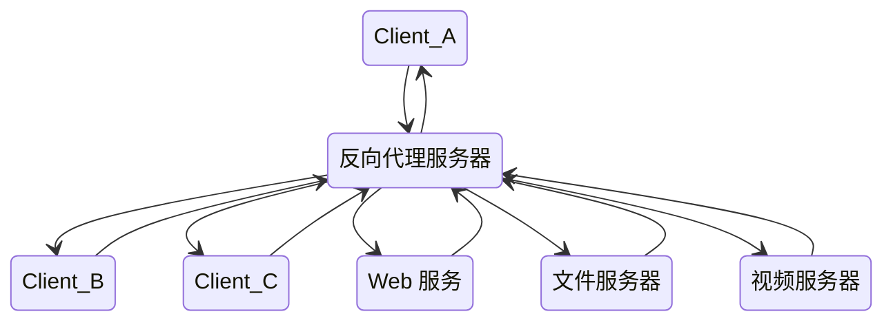

## 简介

一般的负载均衡软件如 LVS 实现的功能只是对请求数据包的转发和传递，从负载均衡下的节点服务器来看，接收到的请求还是来自访问负载均衡器的客户端的真实用户；而反向代理服务器在接收到用户的访问请求后，会代理用户重新向节点服务器（We b 服务器、文件服务器、视频服务器）发起请求，反向代理服务器和节点服务器做具体的数据交互，最后把数据返回给客户端用户。在节点服务器看来，访问的节点服务器的客户端就是反向代理服务器，而非真实的网站访问用户



## 负载均衡模块

`ngx_http_upstream_module` 是 Nginx 的负载均衡模块，可以实现网站的负载均衡功能即节点的健康检查。upstream 模块允许 Nginx 定义一组或多组节点服务器，在使用时可通过 `proxy_pass` 代理方式把网站的请求发送到事先定义好的对应 Upstream 组的名字上

```conf
upstream lb{
  server 10.0.0.77 weight=5;
  server 10.0.0.88 weight=10;
}
```

- weight：服务器权重
- max_fails：Nginx 尝试连接后端服务器的最大失败次数，如果失败时大于 max_fails，则认为该服务器不可用
- fail_timeout：max_fails 和 fail_timeout 一般会关联使用，如果某台服务器在 fail_timeout 时间内出现了 max_fails 次连接失败，那么 Nginx 会认为其已经挂掉，从而在 fail_timeout 时间内不再去请求它，fail_timeout 默认是 10s，max_fails 默认是 1，即在默认情况下只要发生错误就认为服务器挂了，如果将 max_fails 设置为 0，则表示取消这项检查
- backup：表示当前服务器是备用服务器，只有其他非 backup 后端服务器都挂掉或很忙时，才会分配请求给它
- down：标志服务器永远不可用

## proxy_pass

proxy_pass 指令属于 ngx_http_proxy_module 模块，此模块可以将请求转发到另一台服务器，在实际的反向代理工作中，会通过 location 功能匹配指定的 URI，然后把接收到的服务匹配 URI 的请求通过 proxy_pass 抛给定义好的 upstream 节点池

```conf
location /login/ {
  proxy_pass http://lb/login;
}
```

- proxy_next_upstream: 在什么情况下将请求传递到下一个 upstream
- proxy_limit_race: 限制从后端服务器读取响应的速率
- proxy_set_header: 设置 HTTP 请求 header, 后续请求会将 header 传给后端服务器节点
- client_body_buffer_size: 客户端请求主体缓冲区的大小
- proxy_connect_timeout: 代理与后端节点服务器连接的超时时间
- proxy_send_timeout: 后端节点数据回传的超时时间
- proxy_read_timeout: 设置 Nginx 从代理的后端服务器获取信息的时间, 表示在连接成功建立后, Nginx 等待后端服务器的响应时间
- proxy_buffer_size: 设置缓冲区的大小
- proxy_buffers: 设置缓冲区的数量和大小
- proxy_busy_buffers_size: 用于设置系统很忙时可以使用的 proxy_buffers 大小, 推荐为 `proxy_buffers x 2`
- proxy_temp_file_write_size: 指定缓存临时文件的大小
