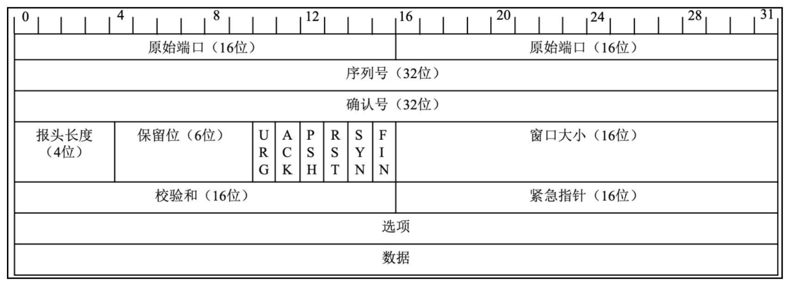
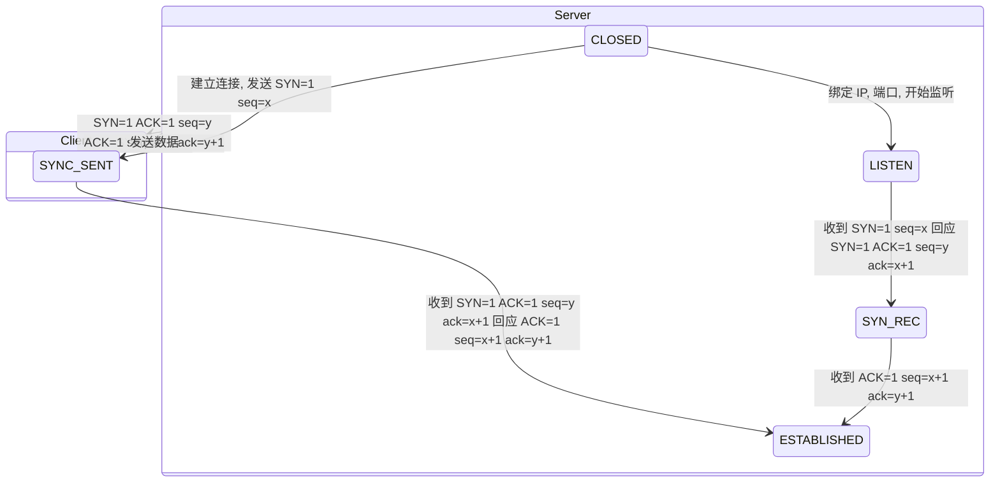
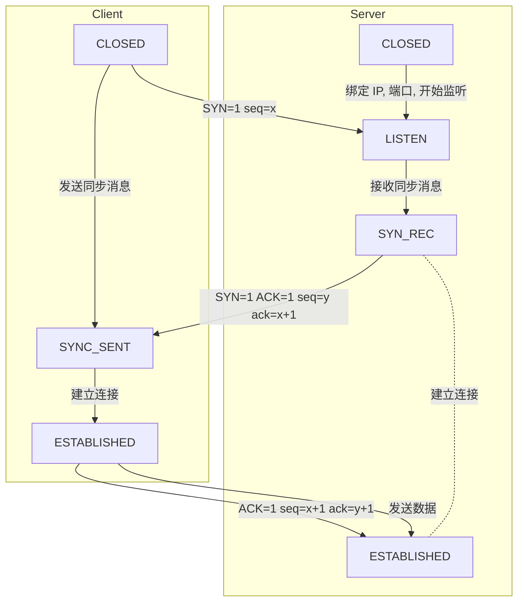

## 简介

TCP 数据在传输之前会建立连接需要进行 3 次沟通, 在数据传输完成断开连接的时候要进行 4 次沟通

## 数据包结构

- 源端口号 (16 位) : 标识源主机的一个应用进程 (连同源主机的 IP 地址)
- 目的端口号 (16 位) : 标识目的主机的一个应用进程 (连同目的主机的 IP 地址) , IP 报头中的源主机 IP 地址, 目的主机的 IP 地址和源端口, 目的端口确定了唯一一条 TCP 连接
- 顺序号 seq (32 位) : 标识从 TCP 源端向 TCP 目的端发送的数据字节流, 表示这个报文段中的第 1 个数据字节的顺序号, 如果将字节流看作在两个应用程序间的单向流动, 则 TCP 用顺序号对每个字节进行计数, 序号是 32bit 的无符号数, 序号达到 232-1 后又从 0 开始, 在建立一个新的连接时, SYN 标志变为 1, 顺序号字段包含由这个主机选择的该连接的初始顺序号 ISN (Initial Sequence Number)
- 确认号 ack (32 位) : 存储发送确认的一端所期望收到的下一个顺序号, 确认序号是上次已成功收到的数据字节顺序号加 1, 只有 ACK 标志为 1 时确认序号字段才有效, TCP 为应用层提供全双工服务, 这意味着数据能在两个方向上独立进行传输, 因此, 连接的每一端都必须保持每个方向上的传输数据顺序号
- TCP 报头长度 (4 位) : 存储报头中头部数据的长度, 实际上指明了数据从哪里开始, 需要这个值是因为任选字段的长度是可变的, 该字段占 4bit, 因此 TCP 最多有 60 字节的首部, 但没有任选字段, 正常的长度是 20 字节
- 保留位 (6 位) : 数据保留位, 目前必须被设置为 0
- 控制位 (control flags: 6 位) : 在 TCP 报头中有 6 个标志比特, 它们中的多个可被同时设置为 1
  - URG: 为 1 时表示紧急指针有效, 为 0 时忽略紧急指针的值
  - ACK: 为 1 时表示确认号有效, 为 0 时表示在报文中不包含确认信息, 忽略确认号字段
  - PSH: 为 1 时表示是带有 PUSH 标志的数据, 指示接收方应该尽快将这个报文段交给应用层, 而不用等待缓冲区装满
  - RST: 用于复位由于主机崩溃或其他原因而出现的错误连接, 还可以用于拒绝非法报文段和拒绝连接请求, 在一般情况下, 如果收到一个 RST 为 1 的报文, 那么一定发生了某些问题
  - SYN: 同步序号, 为 1 时表示连接请求, 用于建立连接和使顺序号同步 (Synchronize)
  - FIN: 用于释放连接, 为 1 时表示发送方已经没有数据要发送了, 即关闭本方数据流
- 窗口大小 (16 位) : 数据字节数, 表示从确认号开始, 本报文的源方可以接收的字节数, 即源方接收窗口的大小, 窗口大小是 16bit 的字段, 因而窗口最大为 65535 字节
- 校验和 (16 位) : 此校验和是对整个的 TCP 报文段, 包括 TCP 头部和 TCP 数据, 以 16 位字符计算所得的, 这是一个强制性的字段, 一定是由发送端计算和存储的, 并由接收端验证
- 紧急指针 (16 位) : 只有在 URG 标志置为 1 时紧急指针才有效, 这时告诉 TCP 该条数据需要紧急发送
- 选项: 最常见的可选字段是最长报文大小, 又叫作 MSS (Maximum Segment Size) , 每个连接方通常都在通信的第 1 个报文段 (为建立连接而设置 SYN 标志的那个段) 中指明这个选项, 指明该 TCP 连接能接收的最大长度的报文段, 选项长度不一定是 32 字节的整数倍, 所以要加填充位, 使得报头长度成为整字节数
- 数据: TCP 报文段中的数据部分是可选的, 在一个连接建立和一个连接终止时, 双方交换的报文段仅有 TCP 首部, 如果一方没有数据要发送, 则也使用没有任何数据的首部确认收到的数据, 在处理超时的许多情况下也会发送不带任何数据的报文段

## 三次握手

TCP 是因特网的传输层协议, 使用三次握手协议建立连接, 在客户端主动发出 SYN 连接请求后, 等待对方回答 SYN+ACK, 并最终对对方的 SYN 执行 ACK 确认, 这种建立连接的方式可以防止产生错误的连接, TCP 使用的流量控制协议是可变大小的滑动窗口协议

流程

- 客户端发送 SYN (seq=x) 报文给服务器端, 进入 SYN_SEND 状态
- 服务器端收到 SYN 报文, 回应一个 SYN (seq =y) 和 ACK (ack=x+1) 报文, 进入 SYN_RECV 状态
- 客户端收到服务器端的 SYN 报文, 回应一个 ACK (ack=y+1) 报文, 进入 Established 状态

在三次握手完成后, TCP 客户端和服务器端成功建立连接

## 四次挥手

在断开连接时要进行四次挥手, 这是由于 TCP 的半关闭造成的, 因为 TCP 连接是全双工的 (即数据可在两个方向上同时传递) , 所以在进行关闭时对每个方向都要单独进行关闭, 这种单方向的关闭叫作半关闭, 在一方完成它的数据发送任务时, 就发送一个 FIN 来向另一方通告将要终止这个方向的连接

TCP 断开连接既可以是客户端主动断开连接, 也可以是服务端主动断开连接

流程

- 客户端应用进程调用断开连接的请求, 向服务器端发送一个终止标志位 FIN=1, seq=u 的消息, 表示在客户端关闭链路前要发送的数据已经安全发送完毕, 可以开始关闭链路操作, 并请求服务器端确认关闭客户端到服务器的链路操作, 此时客户端处于 FIN-WAIT-1 状态
- 服务器在收到这个 FIN 消息后返回一个 ACK=1, ack=u+1, seq=v 的消息给客户端, 表示接收到客户端断开链路的操作请求, 这时 TCP 服务器端进程通知高层应用进程释放客户端到服务器端的链路, 服务器处于 CLOSE-WAIT 状态, 即半关闭状态, 客户端在收到消息后处于 FIN-WAIT-2 状态
- 服务器端将关闭链路前需要发送给客户端的消息发送给客户端, 在等待该数据发送完成后, 发送一个终止标志位 FIN=1, ACK=1, seq=w, ack=u+1 的消息给客户端, 表示关闭链路前服务器需要向客户端发送的消息已经发送完毕, 请求客户端确认关闭从服务器到客户端的链路操作, 此时服务器端处于 LAST-ACK 状态, 等待客户端最终断开链路
- 客户端在接收到这个最终 FIN 消息后, 发送一个 ACK=1, seq=u+1, ack=w+1 的消息给服务器端, 表示接收到服务器端的断开连接请求并准备断开服务器端到客户端的链路, 此时客户端处于 TIM-WAIT 状态, TCP 连接还没有释放, 然后经过等待计时器 (2MSL) 设置的时间后, 客户端将进入 CLOSE 状态
