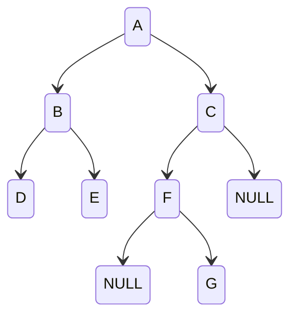

## 简介

二叉树的遍历就是按某条搜索路径访问二叉树中的每个节点一次且只有一次, 按照根、左子树和右子树的访问先后顺序不同，二叉树的遍历可以有 6 种方案：DLR、LDR、LRD、DRL、RDL、RLD

## 先序遍历 DLR

遍历序列为: ABDECFG

- 空二叉树: 空操作
- 非空二叉树
  - 访问根节点
  - 先序遍历左子树
  - 先序遍历右子树

快速确定技巧, **采用从左到右投影的方法, 注意对于同层级的子树, 中间节点在最上, 左子树第二, 右子树最下, 从上到下即为遍历顺序**

## 中序遍历 LDR

遍历序列为: DBEAFGC

- 空二叉树: 空操作
- 非空二叉树
  - 中序遍历左子树
  - 访问根节点
  - 中序遍历右子树

快速确定技巧, **采用从上到下投影的方法, 从左到右即为遍历顺序**

## 后序遍历 LRD

遍历序列为: DEBGFCA

- 空二叉树: 空操作
- 非空二叉树
  - 后序遍历左子树
  - 后序遍历右子树
  - 访问根节点

快速确定技巧, **采用从右到左投影的方法, 注意对于同层级的子树, 中间节点在最上, 右子树第二, 左子树最下, 从下到上即为遍历顺序**

## 层次遍历

按照层次的顺序从左向右进行遍历
