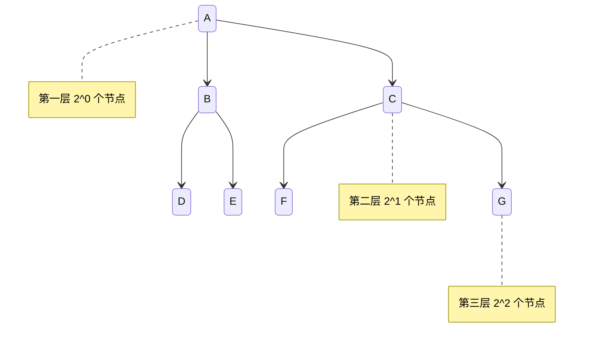

## 简介

二叉树 (binary tree) 是n ($n \geq 0$) 个节点构成的集合

可以为空树 (n=0) , 或者满足以下两个条件

- 有且仅有一个称为根的节点
- 除根节点以外, 其余节点分为两个互不相交的子集 $T_1$ 和 $T_2$, 分别称为 `T` 的左子树和右子树, 且 $T_1$ 和 $T_2$ 本身都是二叉树

## 特殊二叉树

- 满二叉树：一棵深度为k 且有 2k −1 个节点的二叉树, 即全部节点度都是 2 的二叉树
- 完全二叉树：除了最后一层外, 每一层都是满的, 最后一层节点是从左向右出现的

## 性质

- 在二叉树的第 i 层上至多有 $2^{i−1}$ 个节点
- 深度为 k 的二叉树至多有 $2^k−1$ 个节点
- 对于任何一棵二叉树, 若叶子数为 $n_0$, 度为 2 的节点数为 $n_2$, 则 $n_0=n_2+1$
- 具有 n 个节点的完全二叉树的深度必为 $log_2n+1$
- 对于完全二叉树, 若从上至下, 从左至右编号, 则编号为 i 的节点, 其左孩子编号必为 2i, 其右孩子编号必为 2i+1, 其双亲的编号必为i/2

证明

因为上一层的每个节点最多有两个孩子, 因此当前层最多是上一层节点数的 2 倍

- `i = 1`: 只有一个根节点 $2^{i-1}=2^0=1$
- `i > 1`: 假设第 `i−1` 层有 $2^{i−2}$ 个节点, 而第 `i` 层节点数最多是第 `i−1` 层的 `2` 倍, 即第 `i` 层节点数最多有 $2×2^{i−2}=2^{i−1}$

深度为k的二叉树, 每一层都达到最大节点数, 把每层的节点数加起来就是整棵二叉树的最大节点数

$$\sum^{k}_{i=1}2^{i-1}=2^0+2^1+2^2 \dots 2^{k-1}=2^k-1$$

二叉树中的节点度数不超过 2, 因此一共有 3 种节点, 即度为 0, 度为 1, 度为 2, 假设二叉树总的节点数为n, 度为 0 的节点数为 $n_0$, 度为 1 的节点数为 $n_1$, 度为 2 的节点数为 $n_2$, 总节点数等于 3 种节点数之和, 即 $n=n_0+n_1+n_2$

总节点数等于分支 b 加 1, 每个度为 2 的节点产生 2 个分支, 度为 1 的节点产生 1 个分支, 度为 0 的节点没有分支, 因此分支数 $b=n_1+2n_2$, 所以 $n=b+1=n_1+2n_2+1$, 可以得出 $n_0=n_2+1$
