## 简介

图通常用一个二元组 $G=<V, E>$ 表示, V 表示顶点集, E 表示边集, $|V|$ 表示顶点集中元素的个数, 即顶点数, n 个顶点的图称为 n 阶图, $|E|$ 表示边集中元素的个数, 即边数

注意: **顶点集 V 和边集 E 均为有限集合, 其中 E 可以为空集, V 不可以为空集**, 但在运算中, 可能产生 V 为空集, V 为空集的图称为空图, 记为 $\phi$

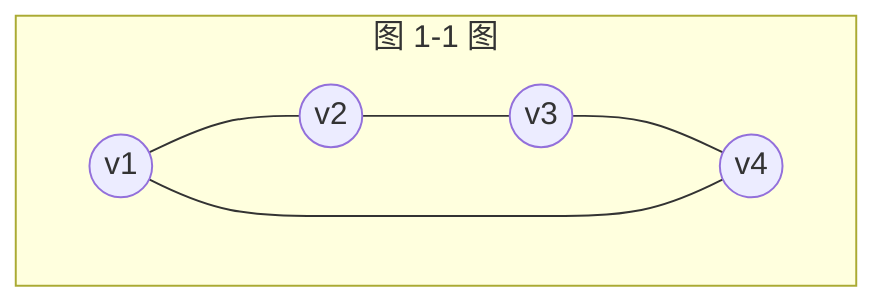

下面介绍图的一些基本术语

<!-- more -->

## 无向图

若图 G 中每条边都是没有方向的, 则称为无向图, 如图 1-2 所示, 每条边都是两个顶点组成的无序对, 例如顶点 $v_1$ 和顶点 $v_3$ 之间的边, 记为 $(v_1, v_3)$ 或 $(v_3, v_1)$, 如图 1-3 所示

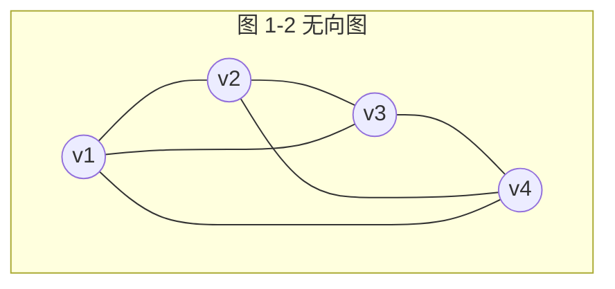

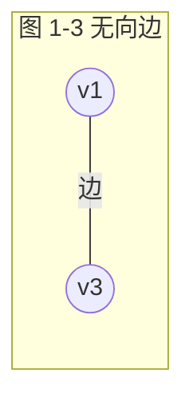

图 1-3 无向边

## 有向图

若图 G 中每条边都是有方向的, 则称为有向图, 如图 1-4 所示, 有向边也称为弧, 每条弧都是由两个顶点组成的有序对, 例如从顶点 $v_1$ 到顶点 $v_3$ 的弧, 记为 $<v_1, v_3>$, $v_1$ 称为弧尾, $v_3$ 称为弧头, 如图 1-5 所示

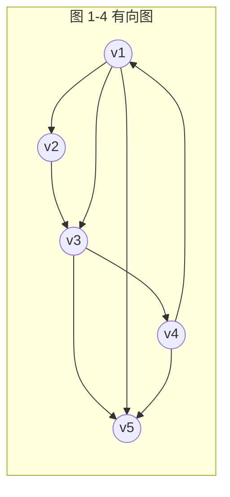

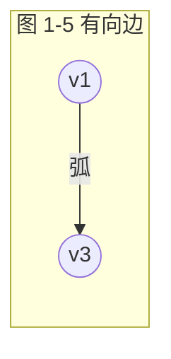

注意: **尖括号** $<v_i, v_j>$ 表示**有序对**, **圆括号** $(v_i, v_j)$ 表示**无序对**

## 简单图

既不含平行边也不含环的图称为简单图, 图 1-2 和图 1-4 均为简单图

在无向图中, 若关联一对顶点的无向边多于一条, 则称这些边为平行边, 平行边的条数称为重数, 如图 1-6 (a) 所示, 在有向图中, 若关联一对顶点的有向边多于一条, 并且这些边的始点和终点相同 ( 方向一致 ) , 则称这些边为平行边, 如图 1-6 (b) 所示, 自环是指一条边关联的两个顶点为同一个顶点, 也就是说自己到自己有一条边, 如图 1-6 (c) 所示, 含有平行边的图称为多重图, 平行边的条数称为重数

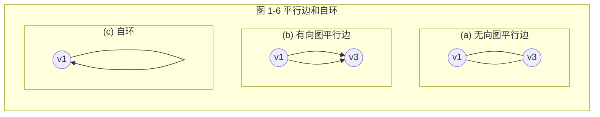

## 完全图

在无向图中, 若任意两个点都有一条边, 则该图称为无向完全图, 如图 1-7 所示, 含有 n 个顶点的无向图, 每个顶点到其他的 $n−1$ 个顶点都有边, 一共有 $n(n−1)/2$ 条边

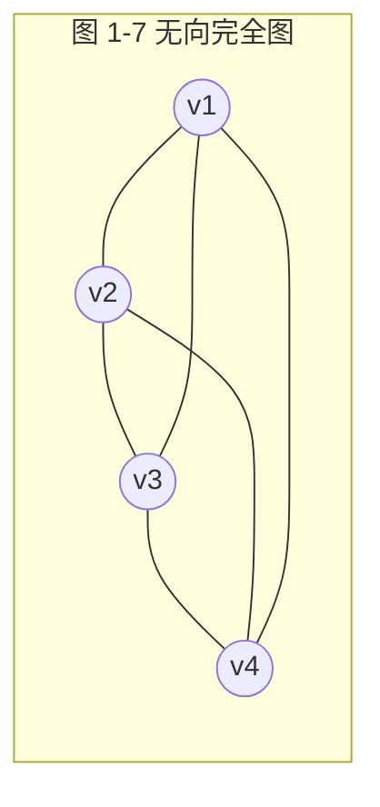

在有向图中, 若任意两个点都有两条方向相反的两条弧, 则该图称为有向完全图, 如图 1-8 所示, 含有 n 个顶点的有向图, 每个顶点发出 $n−1$ 条边, 并且进来 $n−1$ 条边, 一共有 $n(n−1)$ 条边

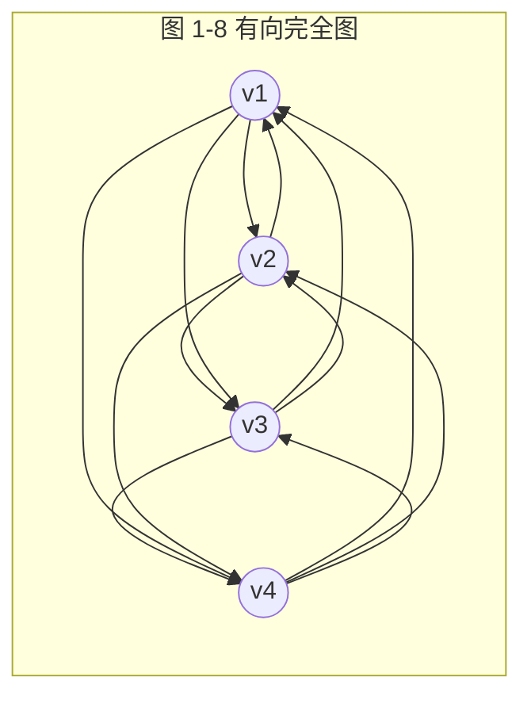

## 稀疏图和稠密图

有很少边或弧的图称为稀疏图, 反之, 则称为稠密图, 这是一个非常模糊的概念, 很难讲多少算稀疏, 多少算稠密, 一般来说, 若图 G 满足 $|E|<|V|×log|V|$, 则称 G 为稀疏图

## 网

在实际应用中, 经常在边上标注如距离, 时间, 耗费等数值, 该数值称为边的权值, 带权的图称为网, 如图 1-9 所示

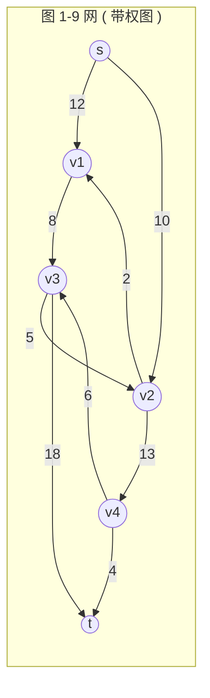

## 邻接和关联

邻接是指顶点和顶点之间的关系, 关联是指边和顶点之间的关系, 有边/弧相连的两个顶点之间的关系, 如无向边 $(v_i, v_j)$, 则称 v_i 和 v_j 互为邻接点, 有向边 $<v_i, v_j>$, 则称 $v_i$ 邻接到 $v_j$, $v_j$ 邻接于 $v_i$, 若存在 $(v_i, v_j)$ 或 $<v_i, v_j>$, 则称该边或弧关联于 $v_i$ 和 $v_j$, 如图 1-10 所示, 在图中, 每条边关联 ( 依附 ) 两个顶点

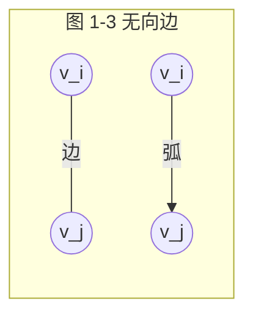

## 顶点的度

顶点的度是指与该顶点相关联的边的数目, 记为 $TD(v)$

握手定理: 度数之和等于边数的两倍, 即

$$\sum \limits_{i = 1}^n {TD({v_i})} = 2e$$

其中, n 为顶点数, e 为边数

在计算度数之和时, 每条边算了两次, 如图 1-11 所示, 如果在计算度数时, 每算一度划一条线, 则可以看出每条边被计算了两次

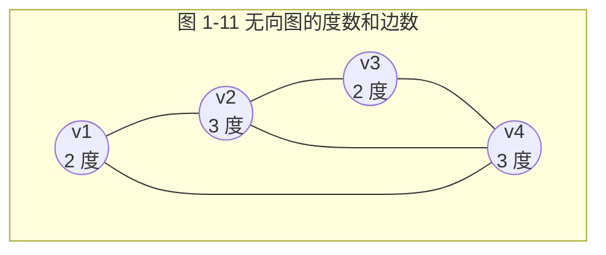

在有向图中, 顶点的度又分为入度和出度, 顶点 v 的入度是以 v 为终点的有向边的条数, 记作 $ID(v)$, 即进来的边数, 顶点 v 的出度是以 v 为始点的有向边的条数, 记作 $OD(v)$, 即发出的边数, 顶点 v 的度等于其入度和出度之和, 即

$$TD(v) = ID(v) + OD(v)$$

在有向图中, 所有顶点的入度之和等于出度之和, 又因为所有顶点度数之和等于边的 2 倍, 因此

$$\sum \limits_{i = 1}^n {ID({v_i})} = \sum \limits_{i = 1}^n {OD({v_i}) = e} $$

例如, 在图 1-12 中, 顶点 v_1 的入度为 1, 出度为 3, 度为入度和出度之和 4, 所有顶点的入度之和为 8, 所有顶点的出度之和也为 8, 图中的边数也为 8, 所有顶点的入度之和 = 出度之和 = 边数

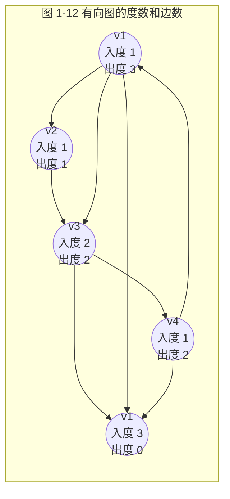

## 路径, 路径长度和距离

- 路径: 接续的边的顶点构成的序列
- 路径长度: 路径上边或弧的数目
- 距离: 从顶点到另一顶点的最短路径长度

例如, 在图 1-13 中, s, $v_1$, $v_3$, t 是 s 到 t 的一条路径, 路径长度为 3, s, $v_2$, $v_4$, $v_3$, t 也是 s 到 t 的一条路径, 路径长度为 4, 两个顶点之间的路径有可能有很多个, 路径长度最短的为两个顶点的距离, 如 s 到 t 的距离为 3

注意: **在有向图中, 路径必须沿着箭头的方向走, 无向图只要有边就可以走**

## 回路 ( 环 ) , 简单路径和简单回路

回路 ( 环 ) : 第一个顶点和最后一个顶点相同的路径, 在图 1-13 中, $v_2$, $v_4$, $v_3$, $v_2$ 是回路

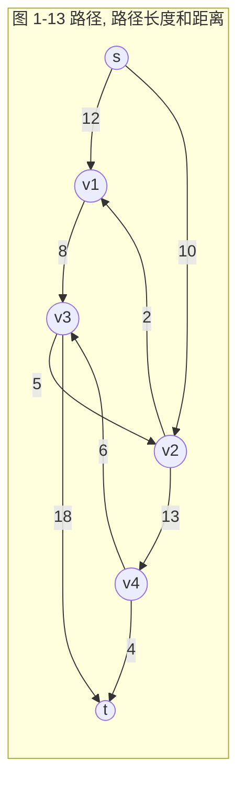

- 简单路径: 除路径起点和终点可以相同外, 其余顶点均不相同的路径, 在图 1-13 中, s, $v_2$, $v_4$, $v_3$, t 是简单路径, 而 s, $v_2$, $v_4$, $v_3$, $v_2$, $v_1$ 不是简单路径
- 简单回路: 除路径起点和终点相同外, 其余顶点均不相同的路径, 在图 1-13 中, $v_2$, $v_4$, $v_3$, $v_2$ 是简单回路

## 子图与生成子图

- 子图: 设有两个图 $G=(V, E)$, $G1=(V1, E1)$, 若 $v_1 \subseteq V$, $E1 \subseteq E$, 则称 G1 是 G 的子图, 从图中选择若干个顶点, 若干条边构成的图称为原图的子图
- 生成子图: 从图中选择所有顶点, 若干条边构成的图称为原图的生成子图

如图 1-14 所示, (b) , (c) 是 (a) 的子图, (b) 是 (a) 的生成子图, 「生成」两个字的含义就是包含所有顶点

## 连通图和连通分量

- 连通图: 在无向图中, 如果顶点 $v_i$ 到 $v_j$ 有路径, 则称 $v_i$ 和 $v_j$ 是连通的, 如果图中任何两个顶点都是连通的, 则称 G 为连通图, 例如, 图 1-14 (a) 是连通图

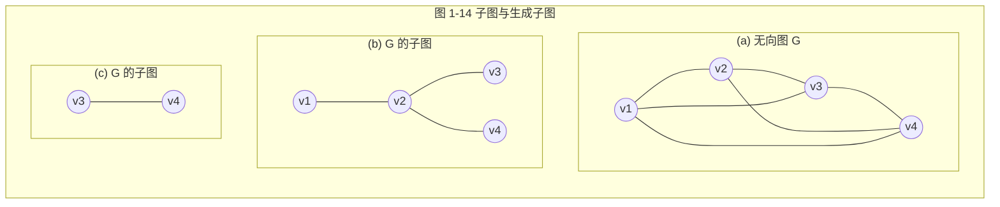

- 连通分量: 无向图 G 的极大连通子图称为 G 的连通分量, 极大连通子图意思是: 该子图是 G 的连通子图, 如果再加入一个顶点, 该子图不连通, 例如, 图 1-15 中有 3 个连通分量, 如图 1-16 所示

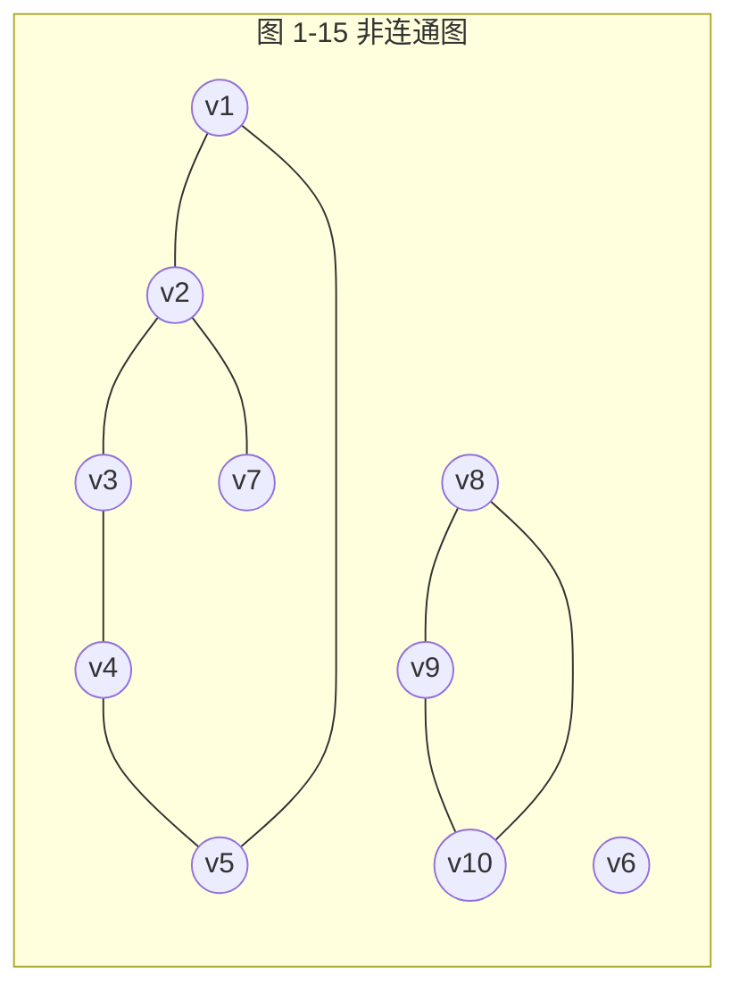

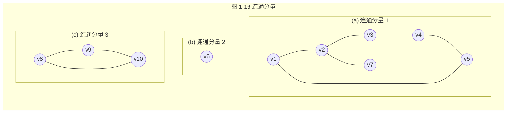

对于连通图, 其连通分量就是它自己, 对于非连通图, 则有 2 个以上连通分量

## 强连通图和强连通分量

- 强连通图: 在有向图中, 如果图中任何两个顶点 $v_i$ 到 $v_j$ 有路径, 且 $v_j$ 到 $v_i$ 也有路径, 则称 G 为强连通图
- 强连通分量: 有向图 G 的极大强连通子图称为 G 的强连通分量, 极大强连通子图意思是: 该子图是 G 的强连通子图, 如果再加入一个顶点, 该子图不再是强连通的

如图 1-17 所示, (a) 是强连通图, (b) 不是强连通图, (c) 是 (b) 的强连通分量

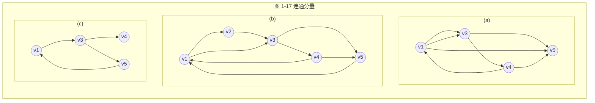

## 树和有向树

从图论的角度来看, 树是一个无环连通图, 一个含 n 个顶点, m 条边的图, 只要满足下列 5 个条件之一就是一棵树:

- G 是连通图且 $m=n−1$
- G 是连通图且无环
- G 是连通图, 但删除任意一条边就不连通
- G 是无环图, 但添加任意一条边就会产生环
- G 中任意一对顶点之间仅存在一条简单路径

- 有向树: 只有一个顶点入度为 0, 其余顶点入度均为 1 的有向图, 如图 1-18 所示

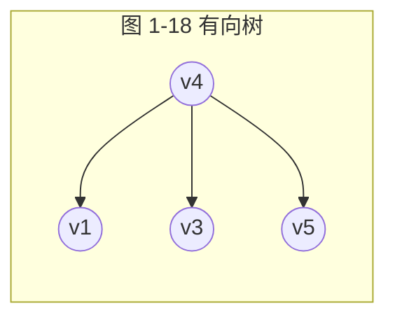

## 生成树和生成森林

- 极小连通子图: 该子图是 G 的连通子图, 在该子图中删除任何一条边, 该子图不再连通, 例如在图 1-19 中, (b) 是 (a) 的极小连通子图, (c) 不是 (a) 的极小连通子图
- 生成树: 包含无向图 G 所有顶点的极小连通子图, 如图 1-19 (b) 所示

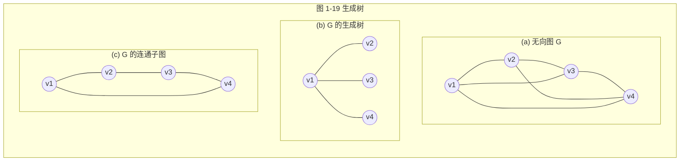

因为生成树包含所有顶点, 因此只有连通图才有生成树, 而非连通图, 每一个连通分量会有一棵生成树

- 生成森林: 对非连通图, 由各个连通分量的生成树组成的集合, 例如, 图 1-15 中的 3 个连通分量, 每个连通分量得到一棵生成树, 称为生成森林, 如图 1-20 所示

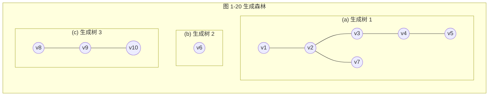

## 二分图

二分图, 又称为二部图, 是图论中的一种特殊模型, 设 $G=<V, E>$ 是一个无向图, 如果顶点集 V 可分割为两个互不相交的子集 $V_1$, $V_2$, 并且图中的每条边 $(i, j)$ 所关联的两个顶点 i 和 j 分别属于这两个不同的顶点集 $(i \in v_1, j \in v_2)$, 则称图 G 为二分图, 如图 1-21 所示

```mermaid
graph LR
  subgraph "图 1-21 二分图"
    subgraph V1
      a((1))
      b((2))
      c((3))
      d((4))
    end
    subgraph V2
      e((5))
      f((6))
      g((7))
    end
    a --- f
    a --- g
    b --- e
    c --- g
    d --- e
  end
```

## 引用

趣学数据结构
