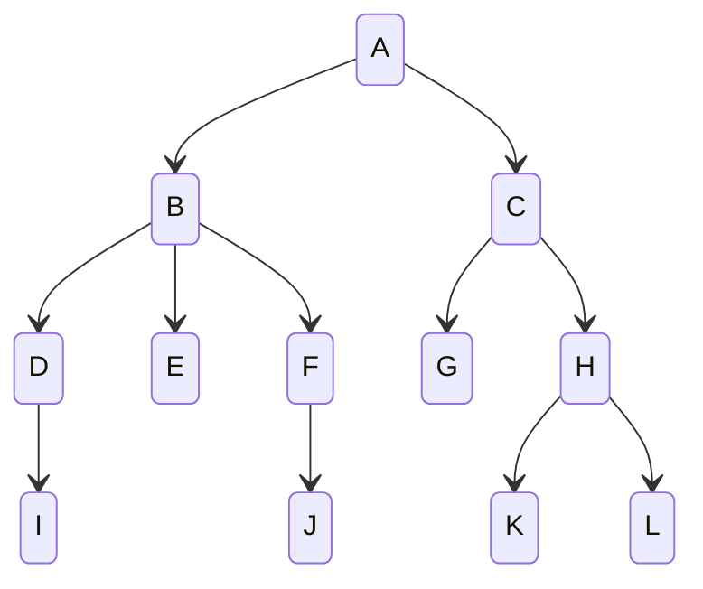

## 简介

树是一种数据结构, 是由 n (n>=1) 个有限的节点组成的一种具有层次关系的集合, 之所以称它为树, 是因为它长得像一棵倒过来的树

- 每个节点 (除了根节点以外) 只能有一个父节点
- 每个节点可能有 `0` 个或者多个子节点
- 除根节点外, 每个子节点又可以分为多个不相交的子树

<!-- more -->

## 定义



- 点 (Node) : 树中的每个元素都叫作节点, 在某些书中将其写为 "结点"
- 根节点或树根 (Root) : 有一个特点的节点叫作根节点, 即树顶端的一个节点, 又叫作树根, 其实就是倒过来的最下面的节点
- 子树 (SubTree) : 除根节点外, 其他节点可以分为多个树的集合, 叫作子树, 对于如上图所示的树, `K` 这个节点可以叫作一棵子树, 而 `H`, `K`, `L` 三个节点组合起来也可以叫作一棵子树
- 节点的度: 一个节点直接含有的子树的个数叫作节点的度, 比如上图中 `B` 节点的度为 `3`, 它们的树根分别是 `D`, `E`, `F`
- 叶子节点, 叶节点, 终端节点: 度为 `0` 的节点叫作叶子节点, 也叫作叶节点, 终端节点, 其实就是没有子节点的节点, 或者说没有子树的节点就是叶子节点, 比如上图中的 `E`, `L` 都是叶子节点
- 双亲节点, 父节点: 父节点就是一个节点头上的那个节点, 如果一个节点包含若干个子节点, 那么这个节点就是这些子节点的父节点, 也叫作双亲节点
- 兄弟节点: 兄弟节点其实和家族树类似, 拥有相同父节点的节点互相叫作兄弟节点
- 树的度: 一棵树中最大节点的度叫作树的度, 即树中哪个节点的子节点最多, 那么这个节点的子节点的个数就是树的度
- 节点的层次: 从根这一层开始算起, 根算第 `1` 层, 根的子节点算第 `2` 层, 一直到最下面一层, 在如上图所示的节点中, `A` 的层次是 `4`, `C` 的层次是 `3`, `E` 的层次是 `1`
- 树的高度, 深度: 树的深度是从根节点开始 (其深度为 `1`) 自顶向下逐层累加的, 高度是从叶节点开始 (其高度为 `1`) 自底向上逐层累加的, 虽然树的深度和高度一样, 但是具体到树的某个节点, 其深度和高度是不一样的
- 堂兄弟节点: 堂兄弟节点是同一层的但是父母节点不同的节点, 或者说双亲节点在同一层的节点是堂兄弟节点
- 节点的祖先: 从根节点到某个节点这一路走下来的除了该节点的所有节点, 都是该节点的祖先
- 节点的子孙: 在以某节点为根的子树中, 任何一个节点都是其子孙, 也就是这个节点下面的与这个节点有关的节点都是这个节点的子孙
- 森林: 由 `m` 棵不相交的树组成的集合, 叫作森林

## 树的种类

二叉树, 平衡二叉树, B 树, B+ 树, 哈夫曼树, 还有 B-树, B*树, 红黑树, trie 树等

## 存储结构

```java
public class TreeNode {
  private int data;
  private int parent;
  private int[] children;
}
```

树节点必须包含 data 字段

- data: 节点的值
- parent: 父节点
- children: 子节点列表

一颗树可以被表示为一个数组

```java
TreeNode[] treeNode = new TreeNode[100];
```

数组存储结构

| index | parent | data | children |
| -- | -- | -- | -- |
| 0 | -1 | A | [1, 2] |
| 1 | 0 | B | [3, 4, 5] |
| 2 | 0 | C | [6, 7] |
| 3 | 1 | D | [8] |
| 4 | 1 | E | `NULL` |
| 5 | 1 | F | [9] |
| 6 | 2 | G | `NULL` |
| 7 | 2 | H | [10, 11] |
| 8 | 3 | I | `NULL` |
| 9 | 5 | J | `NULL` |
| 10 | 7 | K | `NULL` |
| 11 | 7 | L | `NULL` |
