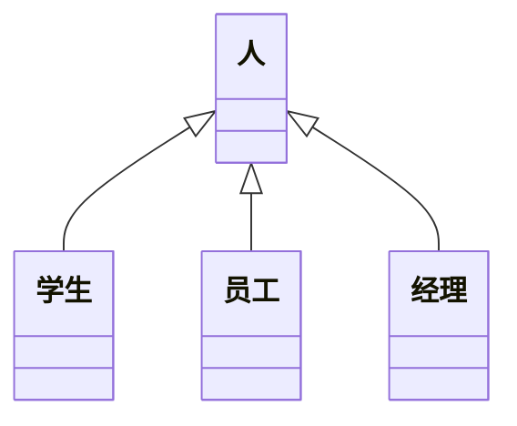
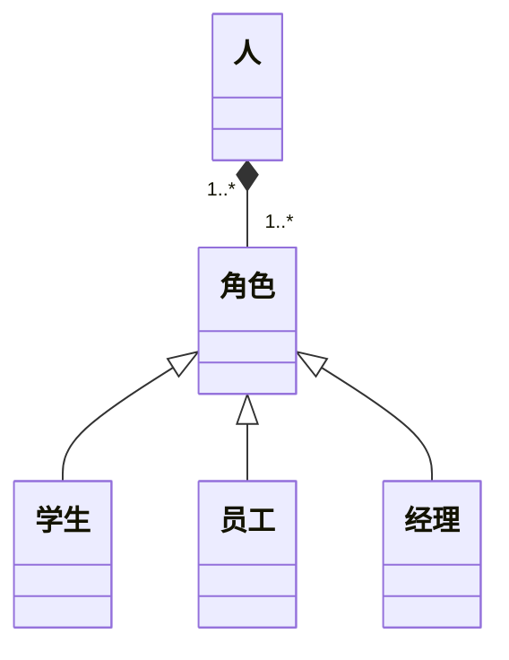

## 简介

合成/聚合复用原则也叫组合复用原则, 就是在一个新的对象里面使用一些已有的对象, 使之成为新对象的一部分, 新的对象通过向这些对象的委派达到复用已有功能的目的, 遵循这个原则就是要尽量使用组合, 而不是使用继承

<!-- more -->

## 复用方式

在面向对象的设计里, 有两种基本的方法可以在不同的环境中复用已有的设计和实现, 即通过组合或通过继承

### 组合

由于组合可以将已有的对象纳入到新对象中, 使之成为新对象的一部分, 因此新对象可以调用已有对象的功能, 这样做有下面的好处：

- 新对象存取成分对象的唯一方法是通过成分对象的接口
- 这种复用是黑箱复用, 因为成分对象的内部细节是新对象所看不见的
- 这种复用支持包装
- 这种复用所需要的依赖较少
- 每一个新的类可以将焦点集中到一个任务上
- 这种复用可以在运行时间动态进行, 新对象可以动态的引用与成分对象类型相同的对象

组合复用的缺点就是用组合复用建造的系统会有较多的对象需要管理

### 继承

组合几乎可以用到任何环境中去, 但是继承只能用到一些环境中

继承复用通过扩展一个已有对象的实现来得到新的功能, 基类明显的捕获共同的属性和方法, 而子类通过增加新的属性和方法来扩展超类的实现

继承的优点：

- 新的实现比较容易, 因为基类的大部分功能都可以通过继承自动的进入子类
- 修改或扩展继承而来的实现较为容易

继承的缺点：

- 继承复用破坏了包装, 因为继承超类的的实现细节暴露给子类, 由于超类的内部细节常常对子类是透明的, 因此这种复用是透明的复用, 又称 "白箱" 复用
- 如果超类的实现发生改变, 那么子类的实现也不得不发生改变, 因此, 当一个基类发生改变时, 这种改变就会像水中投入石子引起的水波一样, 将变化一圈又一圈的传导到一级又一级的子类, 使设计师不得不相应地改变这些子类, 以适应超类的变化
- 从超类继承而来的实现是静态的, 不可能在运行时间内发生改变, 因此没有足够的灵活性

## 意义

按照组合复用原则我们应该首选组合, 然后才是继承, 使用继承时应该严格的遵守里氏替换原则, 必须满足 "Is-A" 的关系是才能使用继承, 而组合却是一种 "Has-A" 的关系, 导致错误的使用继承而不是使用组合的一个重要原因可能就是错误的把 "Has-A" 当成了 "Is-A"

## 例子

可以看到采用继承的方式, 雇员, 学生, 经理继承了人, 但是雇员, 学生, 经理分别描述着一种角色, 而人可以同时有几种不同的角色, 比如, 一个人既然是经理了就一定是雇员, 使用继承来实现角色, 则只能使用每一个人具有一种角色, 这显然是不合理的, 错误的原因就是把角色的等级结构和人的等级结构混淆起来, 把 "Has-A" 的关系误认为是 "Is-A" 的关系, 可以修改为

这样每一个人都可以有一个以上的角色
