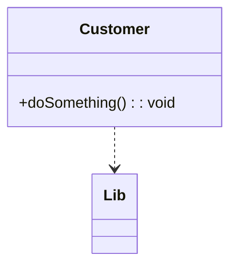
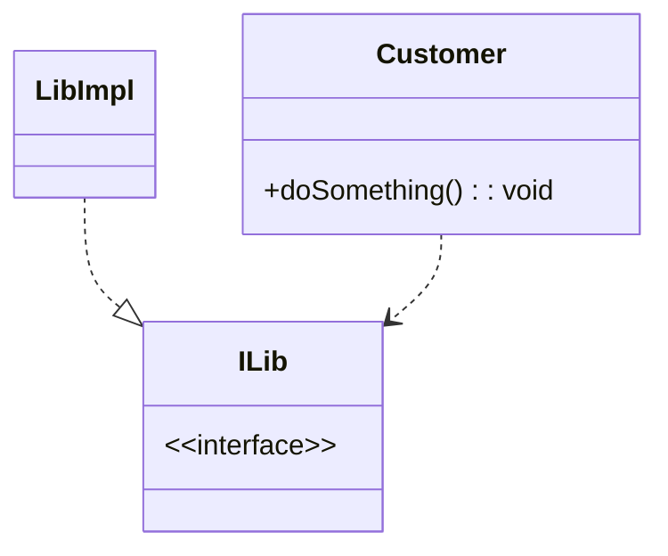
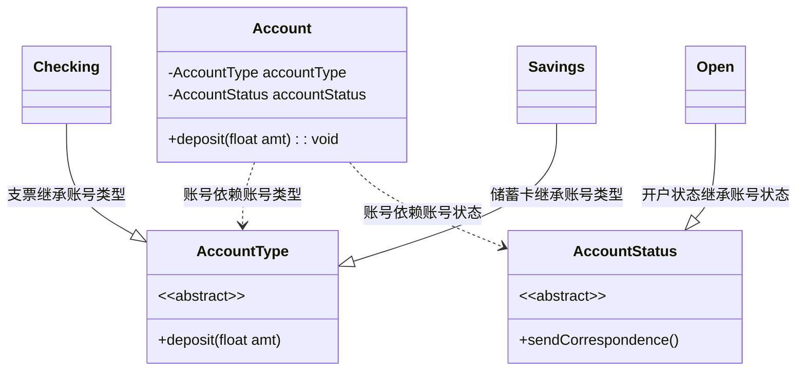
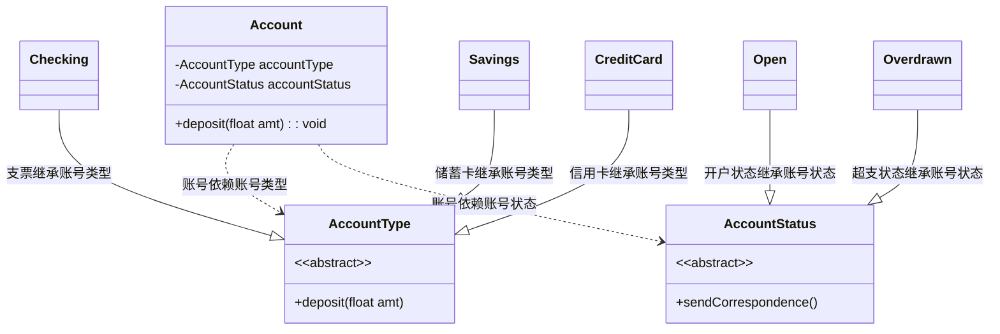

## 简介

- 高层模块不应该依赖低层模块, 两者都应该依赖其抽象
- 抽象不应该依赖细节
- 细节应该依赖抽象

## 意义

在传统的应用架构中, 低层次的组件设计用于被高层次的组件使用, 这一点提供了逐步的构建一个复杂系统的可能, 在这种结构下, 高层次的组件直接依赖于低层次的组件去实现一些任务, 这种对于低层次组件的依赖限制了高层次组件被重用的可行性

依赖反转原则的目的是把高层次组件从对低层次组件的依赖中解耦出来, 这样使得重用不同层级的组件实现变得可能, 把高层组件和低层组件划分到不同的包/库 (在这些包/库中拥有定义了高层组件所必须的行为和服务的接口, 并且存在高层组件的包) 中的方式促进了这种解耦, 由于低层组件是对高层组件接口的具体实现, 因此低层组件包的编译是依赖于高层组件的, 这颠倒了传统的依赖关系, 众多的设计模式, 比如插件, 服务定位器或者依赖反转, 则被用来在运行时把指定的低层组件实现提供给高层组件

应用依赖反转原则同样被认为是应用了适配器模式, 例如: 高层的类定义了它自己的适配器接口 (高层类所依赖的抽象接口) , 被适配的对象同样依赖于适配器接口的抽象 (这是当然的, 因为它实现了这个接口) , 同时它的实现则可以使用它自身所在低层模块的代码, 通过这种方式, 高层组件则不依赖于低层组件, 因为它 (高层组件) 仅间接的通过调用适配器接口多态方法使用了低层组件, 而这些多态方法则是由被适配对象以及它的低层模块所实现的

高层对象 Customer 依赖于底层对象 Lib 的实现, 修改 Lib 有可能导致 Customer 也需要修改

把高层对象 Customer 对底层对象的需求抽象为一个接口 ILib, 底层对象 LibImpl 实现了接口 ILib, 这就是依赖反转

## 例子

Account 中保存着 AccountType 和 AccountStatus, 当系统升级时, 增加了信用卡类型和透支状态, 这时候只需要通过添加子类即可

## 小结

依赖倒置原则的本质就是通过抽象 (接口 (OC 中类似协议) 或抽象类) 使各个类或模块的实现彼此独立, 不互相影响, 实现模块间的松耦合, 可以遵循以下规则:

- 每个类尽量都有接口或抽象类, 或者抽象类和接口两则兼备
- 变量的表面类型尽量是接口或抽象类
- 任何类都不应该是从具体类派生过来
- 尽量不要覆写基类方法
- 结合里氏替换原则使用
