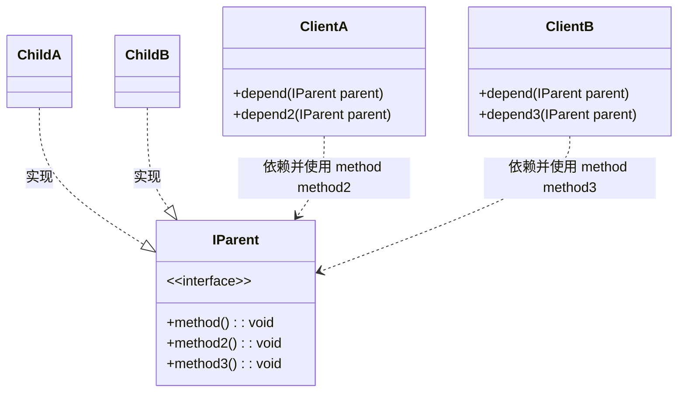
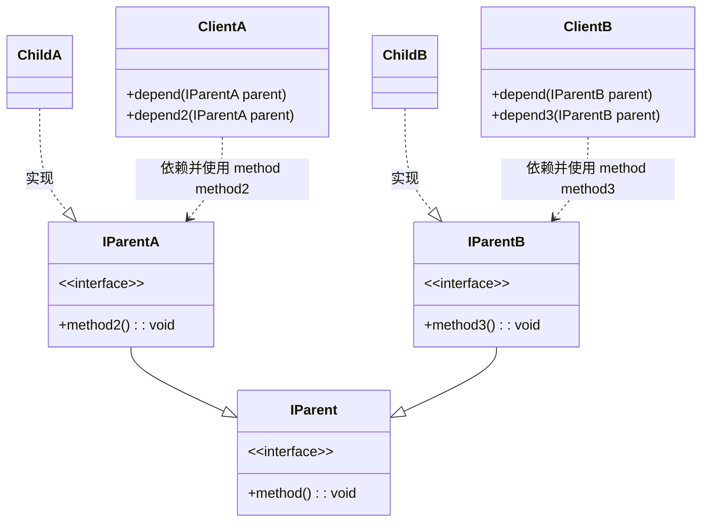

## 简介

类间的依赖关系应该建立在最小的接口上

- 接口尽量小: 与单一职责像呼应，尽量职责单一
- 接口高内聚: 高内聚，尽量少暴露公开；公开方法也减少外部影响，接口是对外的承诺，承诺越少对系统开发越有利
- 模块定制: 为个别业务提供定制接口，减少对全部接口的访问

## 与单一职责原则的区别

- 单一职责原则指的是类、接口和方法的职责是单一的，强调的是职责，也就是说在一个接口里，只要职责是单一的，有很多个方法也是可以的
- 接口隔离原则指的是在接口中的方法尽量越来越少，接口隔离原则的前提必须先符合单一职责，在单一职责的前提下，接口尽量是单一接口

## 意义

将一个大而全的接口根据实际的业务逻辑划分成多个相应的接口, 可以有效的降低开发, 维护的难度, 因为只提供一个大而全的接口会导致所有实现的子类都必须实现接口所规范的所有方法, 造成各个实现类中都有一定程度的无用的方法, 这会对后期维护增加成本, 从而容易重构，更改和重新部署

拆分非常庞大臃肿的接口成为更小的和更具体的接口，这样客户将会只需要知道他们感兴趣的方法。这种缩小的接口也被称为角色接口

## 例子

如果 ClientA 只对 ChildA 的 method method2 感兴趣, 那 ChildA 的 method3 是无用的实现方法, 虽然可以将方法参数修改为 ChildA, 但是这样便失去了扩展性, 不符合依赖反转原则, 在已经划定业务的情况下, 可以对 IParent 进行拆分, 使得符合接口隔离原则

## 小结

接口的设计粒度越小，系统越灵活，这是不争的事实，但是灵活也带来结构的复杂化，开发难度增加，可维护性降低, 所以需要根据当前的业务环境和经验进行判断, 通过及时的重构来避免接口过度集中或过度分散的情况出现
