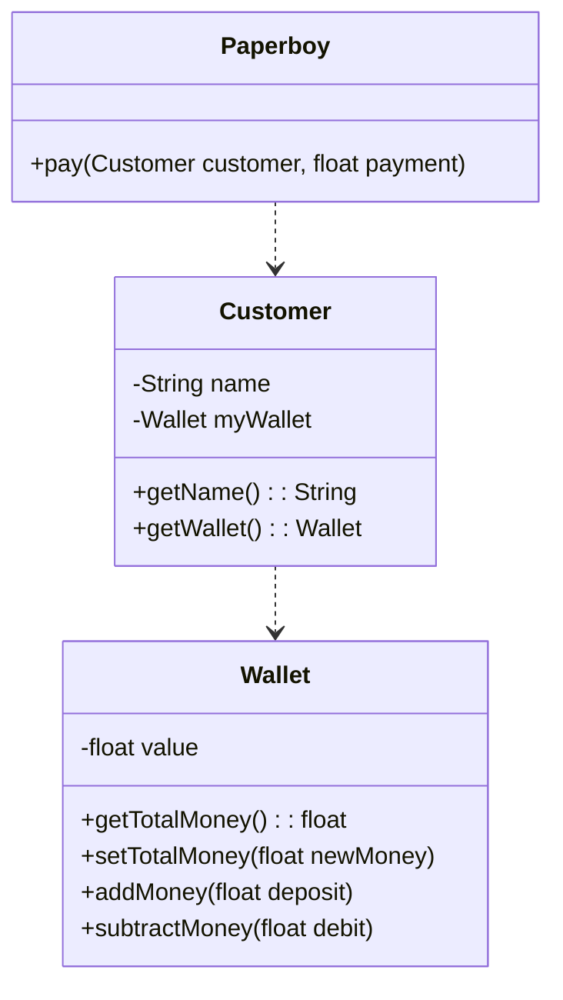
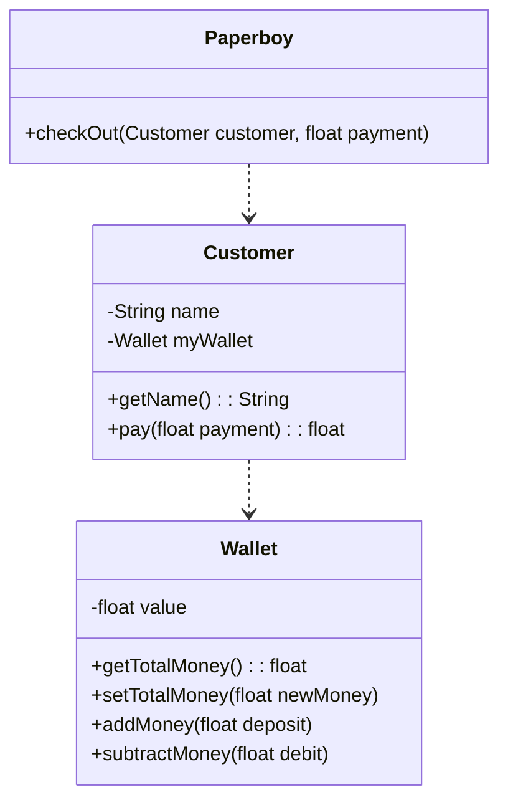

## 简介

也叫做迪米特法则, 一个类应该对自己需要耦合或调用的类的内部知道的最少，被调用的类内部如何复杂都没任何关系

任何一个对象或者方法，它应该只能调用下列对象

- 该对象本身
- 作为参数传进来的对象（也可以是该对象的字段）
- 在方法内创建的对象

<!-- more -->

## 例子



这里通过一个收银的实例, 可以看下如果收银员的逻辑设计如下

```java
public class Paperboy {
    public void pay(Customer myCustomer, float payment) {
        Wallet theWallet = myCustomer.getWallet();
        if (theWallet.getTotalMoney() > payment) {
            theWallet.subtractMoney(payment);
        } else {
            //money not enough
        }
    }
}
```

可以看到虽然结果是正确的, 但是很明显 Paperboy 中使用了 Customer 的参数的方法, 并不符合迪米特法则

pay 的逻辑应该由 Customer 来实现, 而 Paperboy 的逻辑是通过调用 Customer 的 pay 方法来获得相应的钱



```java
public class Customer {
    public float pay(Customer myCustomer, float payment) {
        if (this.theWallet.getTotalMoney() > payment) {
            this.theWallet.subtractMoney(payment);
            return payment;
        } else {
            //money not enough
        }
    }
}
public class Paperboy {
    public void checkOut(Customer myCustomer, float payment) {
        myCustomer.pay(payment);
    }
}
```

## 小结

迪米特法则的核心观念就是类间解耦，弱耦合，只有弱耦合了以后，类的复用率才可以提高。其要求的结果就是产生了大量的中转或跳转类，导致系统的复杂性提高，同时也为维护带来了难度
