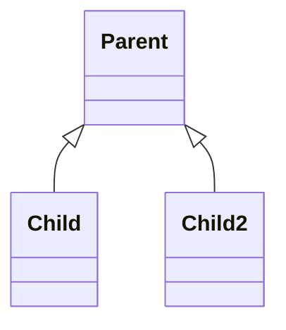
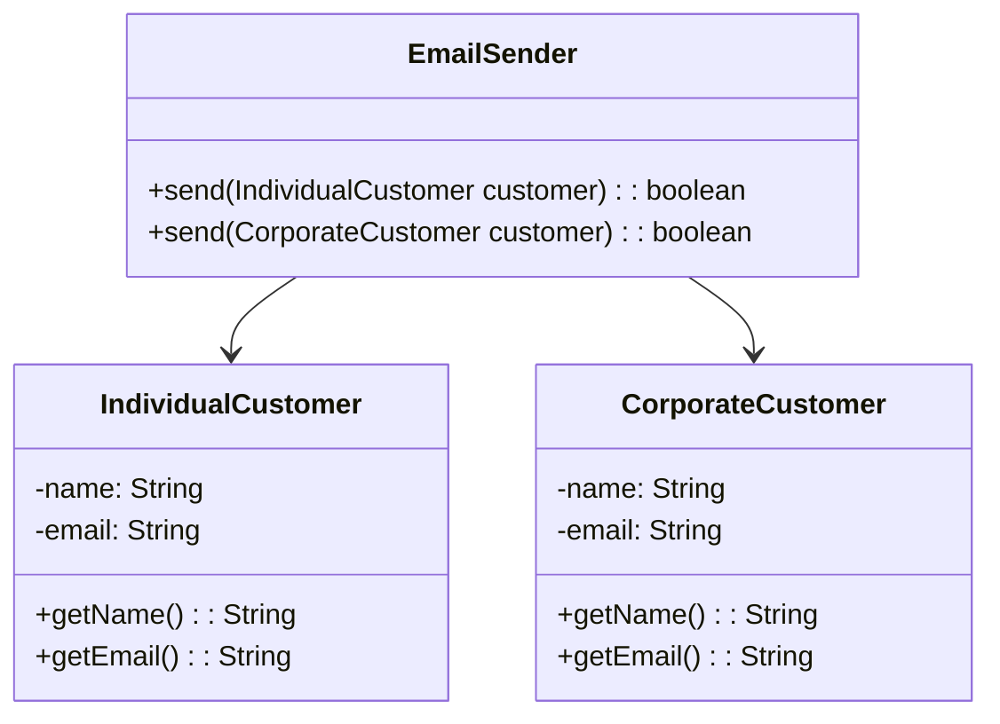
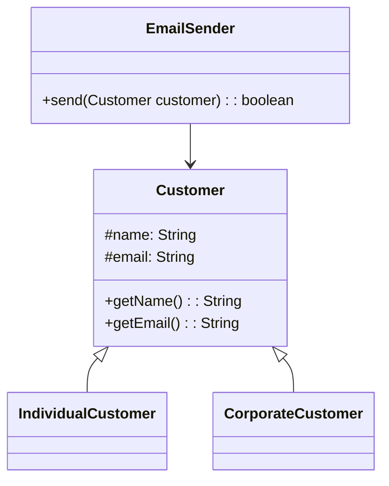

## 简介

里氏替换原则由 2008 年图灵奖得主, 美国第一位计算机科学女博士 Barbara Liskov 教授和卡内基·梅隆大学 Jeannette Wing 教授于 1994 年提出, 其严格表述如下: 如果对每一个类型为 S 的对象 o1, 都有类型为 T 的对象 o2, 使得以 T 定义的所有程序 P 在所有的对象 o1 替换 o2 时, 程序 P 的行为没有变化, 那么类型 S 是类型 T 的子类型

可以这样理解: 所有引用基类的地方必须能透明地使用其子类的对象, 任何基类可以出现的地方, 子类一定可以出现

<!-- more -->

## 意义

在软件中将一个基类对象替换成它的子类对象, 程序将不会产生任何错误和异常, 反过来则不成立, 如果一个软件实体使用的是一个子类对象的话, 那么它不一定能够使用基类对象, 如下图: 如果一个方法接收 Parent 类型参数, 那么它一定可以接收 Parent 的子类参数例如 Child, Child2 类型的参数, 但是, 如果另一个方法只接收 Child 类型的参数, 那么它一定不能接收所有 Parent 类型的参数

里氏替换原则是实现开闭原则的重要方式之一, 由于使用基类对象的地方都可以使用子类对象, 因此在程序中尽量使用基类类型来对对象进行定义, 而在运行时再确定其子类类型, 用子类对象来替换父类对象

要遵循里氏替换原则, 主要是要做到子类扩展父类的功能, 尽量避免改变父类原有的功能

- 子类实现父类的抽象方法, 并尽量避免覆盖父类的非抽象方法
- 子类中可以增加自己特有的方法和属性
- 当子类的方法重载父类的方法时, 方法的前置条件（即方法的形参）要比父类方法的输入参数更宽松
- 当子类的方法实现父类的抽象方法时, 方法的后置条件（即方法的返回值）要比父类更严格

## 例子

一个简单的邮件系统设计, 通过统一的入口对不同类型的客户发邮件, 类图如下

上图中明显出现了过多的重复逻辑, 可以将两个方法中传入的类抽象出一个父类, 将方法传参修改为父类, 这样便可以通过一个方法来接收两个不同的子类的实例

