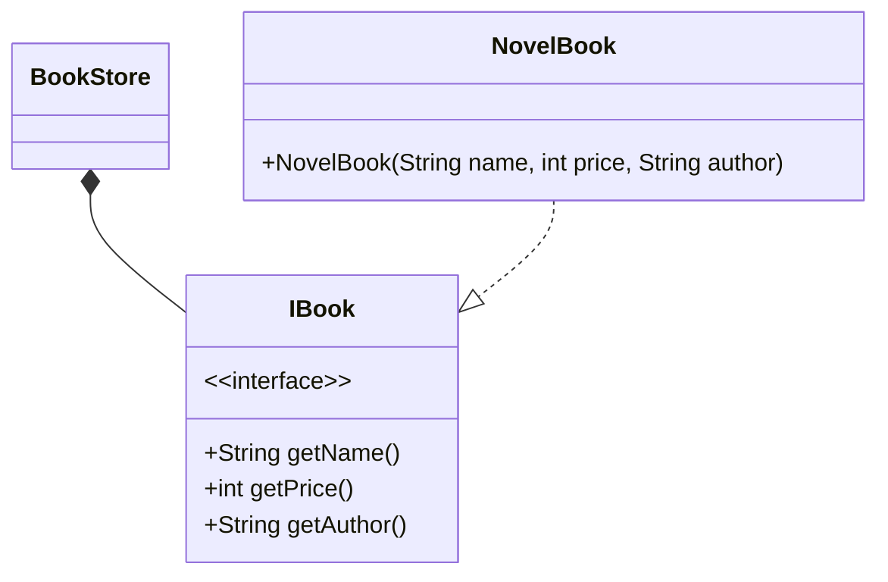
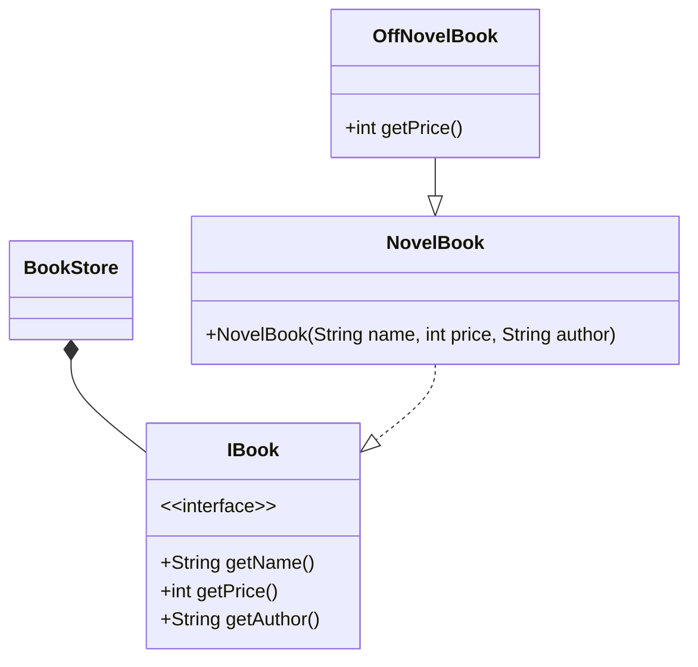
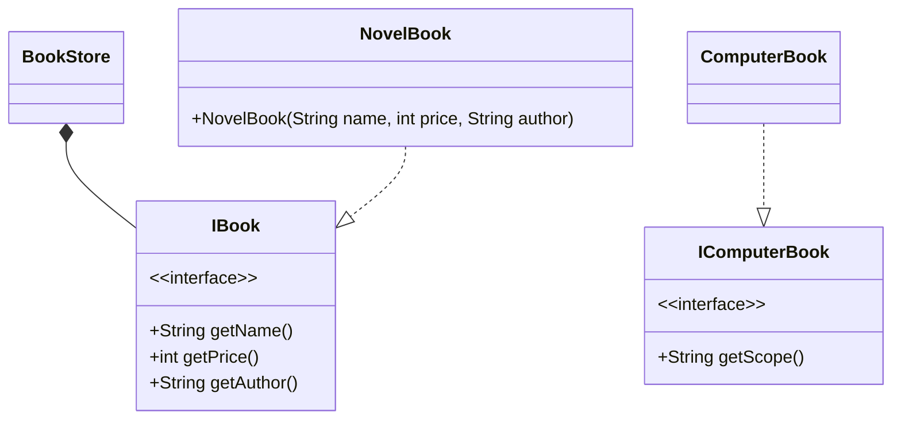

## 简介

一个软件实体如类, 模块和函数应该对扩展开放, 对修改关闭, 模块应尽量在不修改原有的代码的情况下进行扩展

## 意义

在软件的生命周期内, 因为变化, 升级和维护等原因需要对软件原有代码进行修改时, 可能会给旧代码中引入错误, 也可能会使我们不得不对整个功能进行重构, 并且需要原有代码经过重新测试, 当软件需要变化时, 尽量通过扩展软件实体的行为来实现变化, 而不是通过修改已有的代码来实现变化

## 设计

遵循开闭原则, 需要对系统进行抽象化设计, 抽象可以基于抽象类或者接口, 一般需要做到:

- 通过接口或者抽象类约束扩展, 对扩展进行边界限定, 不允许出现在接口或抽象类中不存在的 public 方法, 也就是扩展必须添加具体实现而不是改变具体的方法
- 参数类型, 引用对象尽量使用接口或者抽象类, 而不是实现类, 这样就能尽量保证抽象层是稳定的
- 一般抽象模块设计完成 (例如接口的方法已经敲定), 不允许修改接口或者抽象方法的定义

<!-- more -->

## 例子

以一个书店销售小说书籍为例, IBook 作为抽象类, 定义了数据的三个属性: 姓名, 价格, 作者, NovelBook 为具体子类, 获取小说书信息

根据开闭原则, 如果小说搞活动打折促销, 这时不可以在 NovelBook 类 getPrice() 方法中加入打折信息, 而是对 NovelBook 类进行扩展

如果后期加入其他书籍销售, 这时候只需要在原有的基础上扩展新的子类

## 小结

使用开闭原则需要注意

- 前提条件是, 类必须做到高内聚, 低耦合, 这样拥抱变化时减少不可预料故障
- 所有成员必须遵守的项目规章约定
- 预知变化
