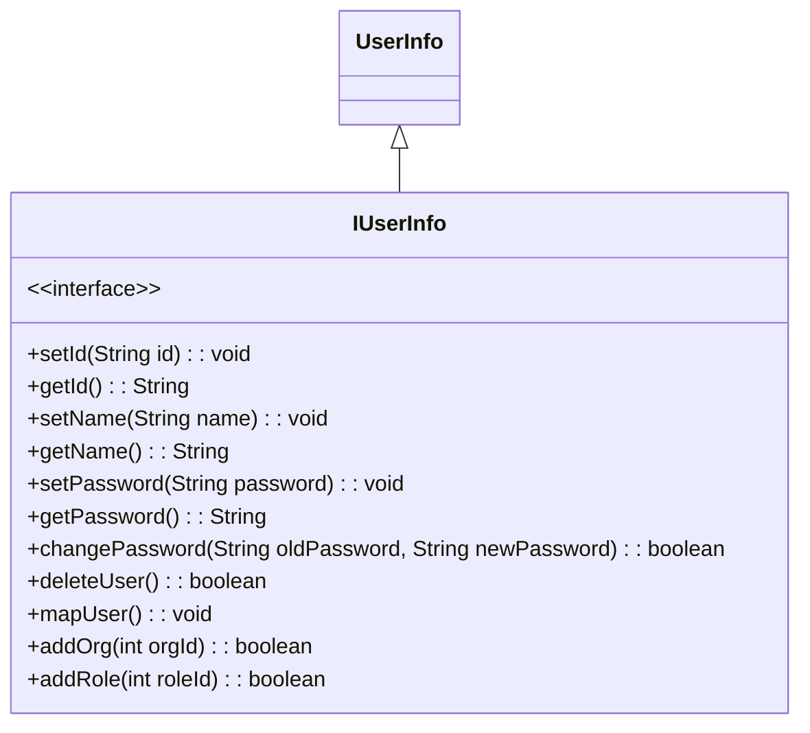
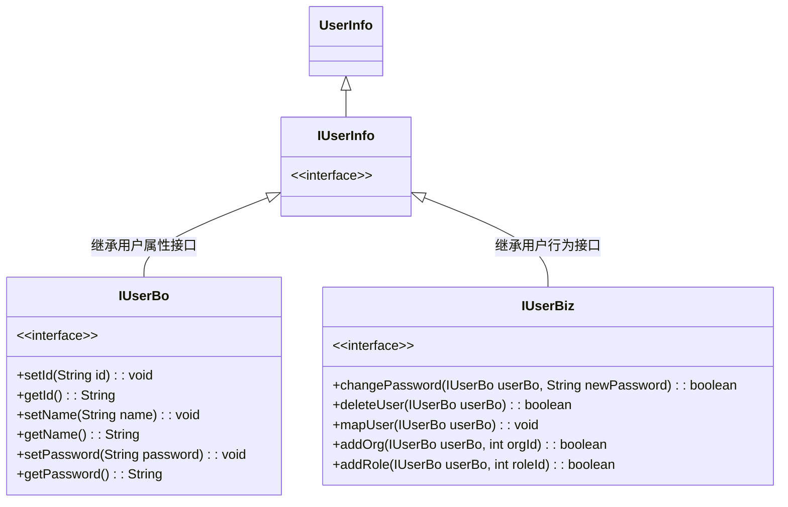

## 简介

一个类或者模块应该有且只有一个改变的原因, 如果一个类承担的职责过多, 就等于把这些职责耦合在一起了, 一个职责的变化可能会削弱或者抑制这个类完成其他职责的能力, 这种耦合会导致脆弱的设计, 当发生变化时, 设计会遭受到意想不到的破坏, 而如果想要避免这种现象的发生, 就要尽可能的遵守单一职责原则, 此原则的核心就是解耦和增强内聚性

## 意义

在软件系统中, 一个类 (一个模块, 或者一个方法) 承担的职责越多, 那么其被复用的可能性就越低, 职责耦合严重, 导致当其中一个职责变化时, 可能会影响到其他职责, 因此要将这些职责进行分离, 将不同的职责封装在不同的类中, 即将不同的变化原因封装在不同的类中, 如果多个职责总是同时发生改变则可将它们封装在同一类中

好处:

- 类的复杂性降低, 实现什么职责都有清晰明确的定义
- 复杂性降低, 可读性提高
- 可读性提高, 可维护性提高
- 变更引起的风险降低, 变更是必不可少的, 如果接口的单一职责做得好, 一个接口修改只对相应的实现类有影响, 对其他的接口无影响, 这对系统的扩展性, 维护性都有非常大的帮助

<!-- more -->

## 例子

一个用户对象, 其中包含有用户的信息和行为, 接口如下

UserInfo 类中包含用户的属性和行为, 两者任一的改动都会引起当前 userInfo 类的改动, 从严格上来看, 并不符合单一职责原则

- IUserBo 负责属性: 只有用户属性修改才使当前类发生变化
- IUserBiz 负责行为: 只有用户行为变化才使当前类发生变化

符合当前用户职责下的单一职责原则, 随着业务的扩展, 每个模型的职责都会有一定的变化, 这时可以根据当前职责的划分适当进行业务模块的拆分和重构

## 小结

userInfo 中拆分两个类, 我们势必要维护两个相同的生命周期, 另外完全按照单一原则来分类, 可能划分出多个类来, 人为的增加复杂性和维护成本, 所以最好就是保证接口的设计遵循单一原则, 这样类的设计就很容易做到只有一个原因引起变化

单一职责原则提出了一个编写程序的标准, 用 "职责" 或 "变化原因" 来衡量接口或类设计得是否优良, 但是 "职责" 和 "变化原因" 都是不可度量的, 因项目而异, 因环境而异
