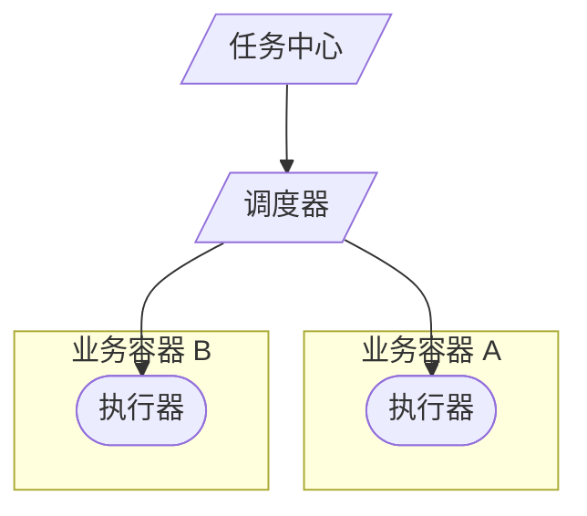
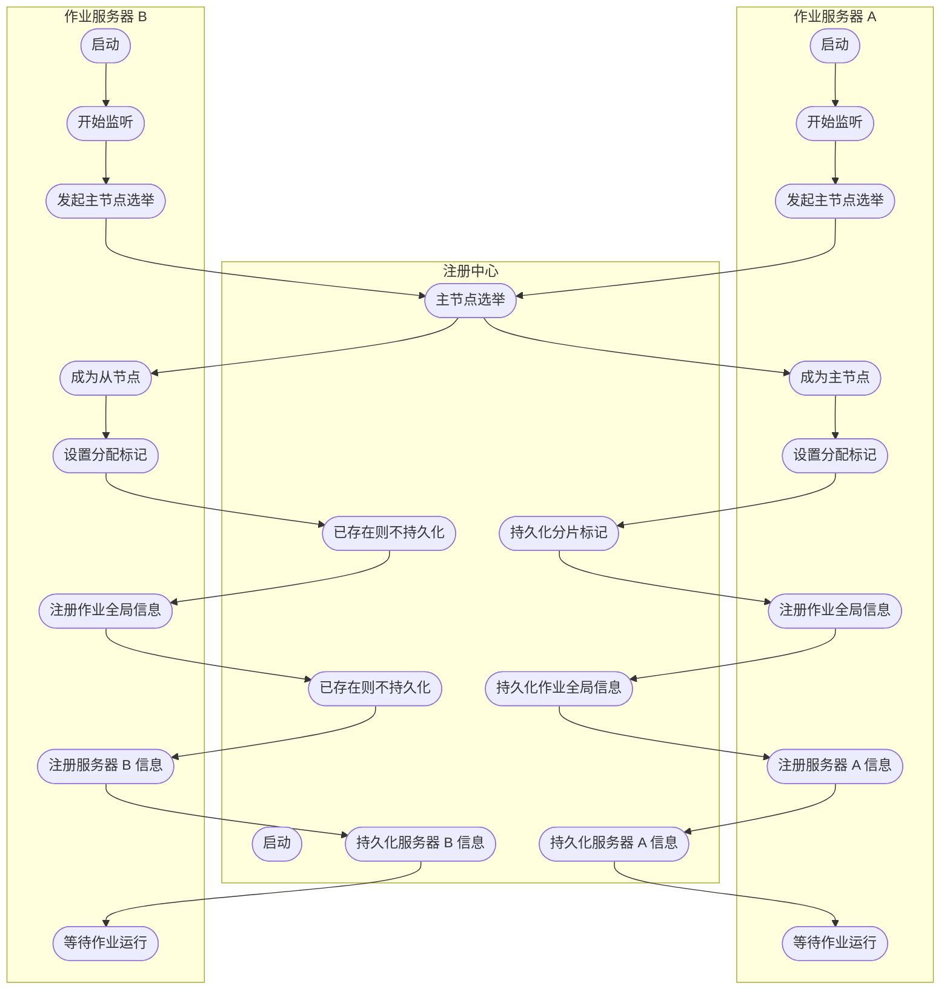
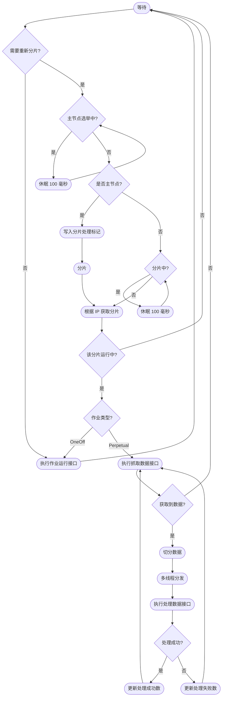

## 简介

在企业从单体架构向微服务架构, 云化服务架构演进过程中, 基于 Quartz 的常规调度框架无法应对这种分布式场景下的需求, 既无法实现任务调度的精准实时, 稳定高效, 也无法实现任务的切分, 编排, 失败补充

常见开源分布式任务调度解决方案

- Quartz: 该框架应用最为广泛, 其完全基于 Java 实现, Quartz 对单个任务的控制基本做到了极致, 以其强大功能和应用灵活性, 成为开源任务调度领域的权威及同类开源产品如 Antares 的基石
- XXL-JOB: 一个轻量级分布式任务调度平台, 其核心设计目标是开发迅速, 学习简单, 轻量级, 易扩展, XXL-JOB 支持分片, 支持简单任务依赖, 支持子任务依赖, 不支持跨平台的
- Elastic-Job: 支持任务分片 (作业分片一致性) , 没有任务编排, 不支持跨平台
- SIA-TASK: 具有跨平台, 可编排, 高可用, 无侵入, 一致性, 异步并行, 动态扩展, 实时监控等特点

<!-- more -->

## Elastic-Job

- 定时任务: 基于成熟的定时任务作业框架 Quartz cron 表达式执行定时任务
- 作业注册中心: 基于 Zookeeper 和其客户端 Curator 实现的全局作业注册控制中心, 用于注册, 控制和协调分布式作业执行
- 作业分片: 将一个任务分片成为多个小任务项在多服务器上同时执行
- 弹性扩容缩容: 运行中的作业服务器崩溃, 或新增加n台作业服务器, 作业框架将在下次作业执行前重新分片, 不影响当前作业执行
- 支持多种作业执行模式: 支持 OneOff, Perpetual 和 SequencePerpetual 三种作业模式
- 失效转移: 运行中的作业服务器崩溃不会导致重新分片, 只会在下次作业启动时分片, 启用失效转移功能可以在本次作业执行过程中, 监测其他作业服务器空闲, 抓取未完成的孤儿分片项执行
- 运行时状态收集: 监控作业运行时状态, 统计最近一段时间处理的数据成功和失败数量, 记录作业上次运行开始时间, 结束时间和下次运行时间
- 作业停止, 恢复和禁用: 用于操作作业启停, 并可以禁止某作业运行 (上线时常用)
- 被错过执行的作业重触发: 自动记录错过执行的作业, 并在上次作业完成后自动触发, 可参考 Quartz 的 misfire
- 多线程快速处理数据: 使用多线程处理抓取到的数据, 提升吞吐量
- 幂等性: 重复作业任务项判定, 不重复执行已运行的作业任务项, 由于开启幂等性需要监听作业运行状态, 对瞬时反复运行的作业对性能有较大影响
- 容错处理: 作业服务器与 Zookeeper 服务器通信失败则立即停止作业运行, 防止作业注册中心将失效的分片分项配给其他作业服务器, 而当前作业服务器仍在执行任务, 导致重复执行
- Spring 支持: 支持 spring 容器, 自定义命名空间, 支持占位符
- 运维平台: 提供运维界面, 可以管理作业和注册中心

### 弹性分布式实现

- 第一台服务器上线触发主服务器选举, 主服务器一旦下线, 则重新触发选举, 选举过程中阻塞, 只有主服务器选举完成, 才会执行其他任务
- 某作业服务器上线时会自动将服务器信息注册到注册中心, 下线时会自动更新服务器状态
- 主节点选举, 服务器上下线, 分片总数变更均更新重新分片标记
- 定时任务触发时, 如需重新分片, 则通过主服务器分片, 分片过程中阻塞, 分片结束后才可执行任务, 如分片过程中主服务器下线, 则先选举主服务器, 再分片
- 为了维持作业运行时的稳定性, 运行过程中只会标记分片状态, 不会重新分片, 分片仅可能发生在下次任务触发前
- 每次分片都会按服务器IP排序, 保证分片结果不会产生较大波动
- 实现失效转移功能, 在某台服务器执行完毕后主动抓取未分配的分片, 并且在某台服务器下线后主动寻找可用的服务器执行任务

运行流程

作业流程

## Uncode-Schedule

基于 zookeeper 的分布式任务调度组件, 非常小巧, 使用简单, 只需要引入 jar 包, 不需要单独部署服务端, 确保所有任务在集群中不重复, 不遗漏的执行, 支持动态添加和删除任务

### 功能概述

- 基于 zookeeper+spring task/quartz/uncode task 的分布任务调度系统
- 确保每个任务在集群中不同节点上不重复的执行
- 单个任务节点故障时自动转移到其他任务节点继续执行
- 任务节点启动时必须保证 zookeeper 可用, 任务节点运行期 zookeeper 集群不可用时任务节点保持可用前状态运行, zookeeper 集群恢复正常运期
- 支持动态添加, 修改和删除任务, 支持任务暂停和重新启动
- 添加 ip 黑名单, 过滤不需要执行任务的节点
- 后台管理和任务执行监控
- 支持 spring-boot, 支持单个任务运行多个实例 (使用扩展后缀)

说明: **单节点故障时需要业务保障数据完整性或幂等性**
