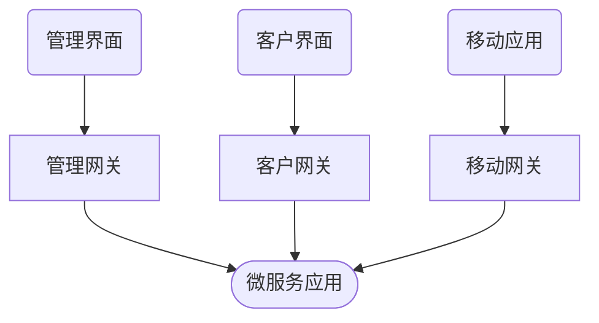

## 简介

边界层就是服务边界, 主要的作用是隐藏了内部服务的复杂交互, 只展示一个统一的外观, 如下所示, 像移动 App, 管理界面或者其他第三方互联网设备之类的客户端都可以和微服务应用进行交互

```mermaid
graph TB
  a(管理界面) --> b&#123;&#123;微服务应用&#125;&#125;
  c(公共 API) --> b
  d(投资网站) --> b
  e(IOS App) --> b
  f(Android App) --> b
```

<!-- more -->

## 封装

边界层对内部的复杂度和变更进行了封装和抽象, 对外提供一系列的 API 接口, 但是接口的实现方式是可以变更的, 在满足接口契约的基础上也会进行功能重构等, 如果没有边界层, 客户端就得随着接口功能的变化而进行修改

```mermaid
graph LR
  a(客户端) -->|HTTP| b[边界层]
  b -.- g[封装后端的复杂性]
  b -->|HTTP: 以客户端的格式进行返回| a
  b -->|通信协议, 如 gRPC| c&#123;&#123;服务 A&#125;&#125;
  c -->|通信协议, 如 gRPC| b
  c --> d&#123;&#123;服务 B&#125;&#125;
  c --> e&#123;&#123;服务 C&#125;&#125;
  d --> f&#123;&#123;服务 D&#125;&#125;
```

边界层提供了访问数据和功能的方法, 例如服务内部使用特定的 rpc 协议通信, 是无法满足所有客户端的, 边界层在这里提供了相应的 restful API, graphql API 等满足各种客户端的需求

## 其他功能

在边界层之内的整个微服务应用就是一个黑盒, 通过执行各种客户端并不了解的操作来提供功能, 这也使得边界层可以实现的一些面向客户端的功能

- 认证和授权: 验证 API 客户端的身份和权限
- 限流: 对客户端的滥用进行处理
- 缓存: 降低后端整体的负载
- 日志和指标收集: 对客户端的请求进行分析和监控

把这些功能放到边界层可以将关注点划分得更加清晰

## 服务间边界

对于不同业务模块的服务来说, 不同业务的互相通信就相当于客户端与服务端通信, 所以在服务层的不同模块中, 可以通过边界来划分业务领域, 比如订单流程包括几个不同的服务, 但是服务只会暴露其他业务领域可以访问的切入点

```mermaid
graph LR
  subgraph 订单管理
    a&#123;&#123;功能 A&#125;&#125; --> b&#123;&#123;功能 B&#125;&#125;
    b --> c&#123;&#123;功能 C&#125;&#125;
  end
  subgraph 费用管理
    d[边界] --> e&#123;&#123;功能 A&#125;&#125;
    e --> f&#123;&#123;功能 B&#125;&#125;
  end
  a --> d
```

## 应用边界模式

应用边界模式主要有三种: API 网关, 服务于前端的后端, 消费者驱动网关

### API 网关

API 网关是在底层的后端服务之上搭建的统一入口点, 主要是将客户端的请求代理转发到相应的下层服务并接收返回转换为客户端所需结果, 同时也处理一些客户端关注的其他横向问题, 比如认证和请求签名

```mermaid
graph LR
  subgraph API 网关
    a[认证] --> b[路由]
    b --> c[转换]
    d[转换]
  end
  e(客户端) -->|HTTP| a
  c -->|RPC| f&#123;&#123;服务&#125;&#125;
  f -->|RPC| d
  d -->|HTTP| e
```

网关会对请求进行认证, 如果认证通过, 会将请求路由到对应的后端服务上, 这中间也会涉及到请求协议的转换, 在安全上, 网关也将系统的暴露范围控制到最小, 可以将内部服务部署到内网专用网络中进行保护, 限制除了网关外的所有请求访问

常见的 API 网关有 Kong 这类基于 nginx 的开源方案, 也有基于特定语言实现的网关

由于 API 网关会执行 API 组合 (composition) 操作, 将多个服务的返回结果汇总到一个结果中, 应该避免在 API 网关中处理相应结果的业务逻辑, 这会极大增加网关和下层服务间的耦合, 降低网关的性能

### 服务于前端的后端

服务于前端的后端 (BFF) 模式是 API 网关模式的一种变形, 作为对比, API 网关的优点是简洁, 这也会导致随着客户端应用的增加, API 网关承担的职责就会越来越多, 在保持简洁的时候, 就需要维护多套 API

例如现在最常见的应用环境就是一个系统有桌面应用和移动应用, 由于客户端的差异比如会有两套相似但不一样的 API, 分别是桌面端 API 和移动端 API, 随着功能的增加, 每个客户端都需要增加相应的 API, 这会导致网关的功能越来越宽泛, 维护起来也越来越困难, 各种需求也会容易起冲突

BFF 模式中, 每个客户端类型都提供了一个 API 网关, 这样就使得每个 API 网关都是高度专一的, 对于客户端的需求响应更加及时, 而且减少了导致臃肿和冲突的因素, 这样的网关群规模更小更简单



### 消费者驱动网关

BFF 模式中需要不同客户端类型不同的 API 网关也会导致需要更多的监控, 客户端有新需求后都是需要 API 网关新建一个契约并进行实现和发布, 这就导致了不同客户端的需求需要对每种网关进行更新, 开发过程更加复杂

相反, 消费者驱动网关模式是只构建一个超级 API 来接受所有客户端的请求, 并返回由客户端指定的数据, 这样在满足超级 API 的功能后, 整个 API 网关基本不需要变动, 客户端新需求可以通过简单的添加获取数据结构和后端新服务即可

现有的比较成熟的消费者驱动网关是 GraphQL, GraphQL 是一种用于 API 的查询语言, 主要能接受客户端指定的数据结构并将多个指定的数据操作后返回
