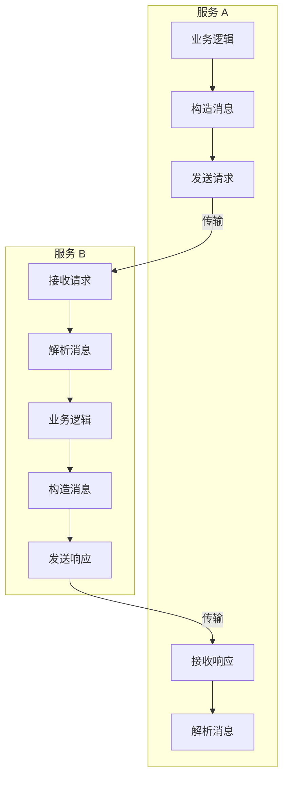

## 简介

通信是微服务应用的一个基本要素, 多个服务的协同是建立在互相通信的基础上

注意: **在微服务系统中, 网络通信是一个很主要的不可靠因素**

在架构上, 通信是属于平台层, 如通信代理, 通信协议等, 但是负责组装发送和消费消息的是在服务层处理

### 同步通信

同步消息通信是最简单的设计方案, 当服务在执行新的操作前需要获取其他服务的操作结果时就适合采用同步消息



当服务 A 处理业务时, 会通过网络请求服务 B 的业务处理, 只有当服务 B 返回结果后, 服务 A 才继续执行

不同的服务通信都会影响服务的设计方案, 每种传输方式都有不同的时延, 语法支持情况, 规范性等特性, 例如

- gRPC: 使用 Protobuf 生成 API 契约
- HTTP: 与消息无关的上下文

在系统中, 只使用一种同步传输方式能产生规模效益, 这样也更易于通过一些监控和工具来排查问题

微服务的关注点分离也同样重要, 应该将传输方案的选择与服务的业务逻辑拆分开, 服务不需要了解 HTTP 状态码或者 gRPC 的响应流, 这么做有助于在未来应用演进时替换为另一种不同的机制

同步消息的缺点也有许多, 需要注意如下

- 服务之间耦合更紧, 因为服务必须知道协作者的存在
- 不能很好地支持广播模型以及发布-订阅模型, 这限制了执行并行工作的能力
- 在等待响应的时候, 代码执行是被阻塞的, 在基于线程或者进程的服务模型中, 这可能会耗尽资源并触发连锁故障
- 过度使用同步消息会导致出现很深的依赖链, 而这又会增加调用路径整体的脆弱性

### 异步通信

异步消息通信是一种更加灵活的通信方案

- 优点:
  - 通过事件通知的方式来扩展系统处理新的需求, 新服务可以直接消费已有的事件而不需要去对已有的服务进行修改
  - 服务不需要了解下游的消费者, 降低服务间的耦合
- 缺点:
  - 异步交互难理解, 会导致业务不再是显示的线性顺序
  - 系统变得更加危险, 服务间的交互变得不可预测
  - 需要更完善的监控和跟踪服务状态

注意: **这里的事件 (event) 是指事后 (post-hoc) 的状态变化, 例如 OrderCreated, OrderPlaced, OrderCanceled 都可以是订单服务根据订单的处理状态后发出的事件**

异步消息通常需要一个**通信代理** (communication broker), 这是一个独立的系统组件, 可以被所有的服务所感知, 负责接收事件并把它们分发给对应的消费者, 它也可以称为一个**事件中枢** (event backbone), 常用的代理工具包括

- Kafka: 专门研究海量, 可重复的事件存储
- RabbitMQ: 基于 AMQP 协议的高度抽象的消息中间件
- Redis: 内存数据库

常见的基于事件的异步通信模式有: 任务队列, 发布-订阅, 基于前两种模式实现的更高级交互模式

#### 作业队列

工作者 (worker) 从队列中接收任务并执行, 一个作业应该只被消费一次

```mermaid
graph LR
  subgraph 事件代理
    a[事件 a]
    b[事件 b]
    c[事件 c]
    d[事件 d]
    e[事件 e]
  end
  f&#123;&#123;服务 A&#125;&#125; -->|发布事件| a
  g&#123;&#123;服务 B&#125;&#125; -->|监听事件| e
  h&#123;&#123;服务 C&#125;&#125; -->|监听事件| e
  f -.- i(事件生产者不知道消费者的存在)
  c -.- j(事件消息表示发送了某些事情, 比如创建订单)
  g -.- k(消费者也不清楚事件是哪个服务产生的)
  h -.- k
```

具体例子如下

```mermaid
graph LR
  subgraph 每个事件只消费一次
    a[事件 a]
    b[事件 b]
    c[事件 c]
    d[事件 d]
  end
  e&#123;&#123;订单服务 A&#125;&#125; -->|创建订单| a
  e -->|创建订单| b
  f&#123;&#123;订单服务 B&#125;&#125; -->|创建订单| c
  f -->|创建订单| d
  g&#123;&#123;支付服务 A&#125;&#125; -->|支付订单| a
  g -->|支付订单| c
  h&#123;&#123;支付服务 B&#125;&#125; -->|支付订单| b
  h -->|支付订单| d
  g -.- i(服务实例共享工作)
  h -.- i
```

该实例列举了多个生产者和多个消费者间的工作状态, 这种模式适合下列场景

- 事件与响应该事件所需要的工作之间是一对一的关系
- 要完成的工作比较复杂或者花费的时间比较长, 所以需要和触发事件区分开

现有比较常见的任务队列实现方案有

- Redis
- Resque
- Celery
- Sidekiq
- SQL 数据库

#### 发布-订阅

在该模式中, 服务可以向事件代理发送事件, 也可以订阅自己感兴趣的事件

```mermaid
graph LR
  a&#123;&#123;订单服务&#125;&#125; -->|发布新增订单事件| b[事件代理中心]
  c&#123;&#123;支付服务&#125;&#125; -->|订阅| b
  d&#123;&#123;服务 A&#125;&#125; -->|订阅| b
  e&#123;&#123;服务 B&#125;&#125; -->|订阅| b
```

这种模式可以很方便的添加新的生产者和消费者, 而不用去修改旧有的消息模型

## 服务发现

服务间的通信, 往往依赖着它们能互相发现, 平台层应该提供这一功能

服务发现最简单的设计方案就是使用负载均衡器, 如下所示

```mermaid
graph LR
  a((LB: orders.demo.internal)) -.->|在创建时, 通知命名服务器| b[命名服务器]
  c&#123;&#123;服务 A&#125;&#125; -->|在 DNS 中查找 orders.demo.internal| b
  b -->|返回 172.12.12.2| c
  c -->|请求 172.12.12.2| a
  a -->|负载均衡转发给服务实例| d&#123;&#123;order 服务&#125;&#125;
  a -->|负载均衡转发给服务实例| e&#123;&#123;order 服务&#125;&#125;
```

这种模型通过为服务分配一个 DNS 名称并负责管理底层节点的健康检查来实现简单的服务发现, 但是无法处理复杂的场景, 比如需要将请求路由到不同版本的代码中支持**金丝雀部署**或者**灰度上线**, 又或者需要将请求路由到不同的数据中心, 当前的模型是不能支持的

一种更加复杂的方案是使用类似 Consul 的注册中心, 每个服务实例把自己注册到注册中心, 然后注册中心会提供 API 来对这些服务的请求进行解析, 通过 DNS 或者是注册中心自定义的机制来解析, 如下所示

```mermaid
graph LR
  a&#123;&#123;服务 A&#125;&#125; -->|1. 发起注册| b[注册中心]
  c&#123;&#123;服务 B&#125;&#125; -->|2. 查找服务 A| b
  b -->|3. 返回服务 A 的 IP 和端口| c
  c -->|4. 向服务 A 发起请求| a
```

服务发现需要依赖所部署的应用的拓扑复杂度, 部署方式越复杂 (比如多数据中心部署), 越要求服务发现的架构更具有鲁棒性
