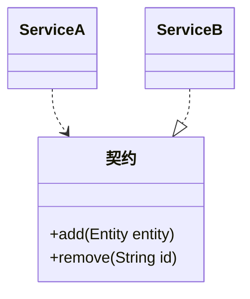

## 简介

支撑微服务开发的五大文化和架构原则为: 自治性, 可恢复性, 透明性, 自动化和一致性

<!-- more -->

## 自治性

每个服务的操作和修改都是独立于其他服务的, 需要满足松耦合, 可独立部署

- 松耦合: 每个服务通过明确定义的接口或者发布的事件消息来与其他服务进行交互, 这些交互独立于协作方的内部实现
- 可独立部署: 服务都能够快速, 频繁地发布小的改动

服务 A 依照契约使用服务 B, 契约隐藏了服务 B 的实现细节

自治性可以让开发团队拥有服务的所有权, 同时也提升团队的责任意识

## 可恢复性

微服务与生俱来地具备故障隔离的机制: 如果开发者独立地部署这些微服务, 那么当应用或者基础设施出现故障后, 故障将只会影响到整个系统的一部分功能, 同样, 部署的功能粒度越小, 开发者越能更平缓地对系统进行变更, 这样才不会在发布新功能的时候发布的是一个有风险隐患的大炸弹

尽管将应用拆分成多个服务能够隔离故障, 但它还是会存在多点故障的问题, 同样, 当故障发生的时候, 开发者需要能够解释到底发生了什么问题以避免连锁反应, 这包括设计层面的 (在可能的情况下支持异步交互以及适当地使用熔断器和超时) , 还包括运维层面的 (比如, 使用可验证的持续交付技术和对系统活动进行稳定可靠地监控)

## 透明性

最重要的一点, 当故障发生时, 开发者需要记得微服务应用是依赖于多个服务 (而非单个系统) 之间的交互及其表现的, 而这些服务可能是由不同的团队开发的, 不管在什么时候, 系统都应该是透明的, 可观测的, 这样既可以发现问题, 也可以对问题进行诊断

应用中的每个服务都会产生来自于业务, 运营和基础设施的数据, 应用日志以及请求记录, 因此, 开发者需要搞清楚这些大量数据的含义

## 自动化

通过开发大批的服务来缓解应用不断变大所带来的痛苦, 这看似是有悖常理的, 事实上, 相对于开发一个单体应用, 微服务确实是一种更加复杂的架构, 通过采用自动化和在基础设施内保持服务之间的一致性, 开发者可以极大地降低因这些额外的复杂性引入的管理代价, 开发者需要使用自动化来保证部署和系统运维过程中的正确性

微服务架构的流行与两种趋势是一致的

- DevOps: DevOps 技术得到主流接纳, 其中的典型就是基础设施即代码 (infrastructure-as-code) 技术
- 云开发环境: 完全通过 API 进行编程的基础设施环境 (如 AWS 和 Azure) 的兴起

这两种技术做了大量的基础工作, 这才使得微服务在小型团队里具有可行性

## 一致性

最后, 以恰当的方式调整开发工作是至关重要的, 开发者的目标应该是围绕业务概念来组织服务和团队, 只有这样安排, 服务和团队的内聚性才能更高

- 在 SOA 中使用横向拆分是有问题的, 因为这样会导致内聚的功能被分散到多个系统中, 新的功能可能需要协调发布到多个服务中, 并且可能与其他在同一技术抽象层次的其他功能产生耦合, 而这种耦合是不可接受的
- 微服务架构应该偏向于纵向拆分, 每个服务应该与一个独立的业务功能相匹配, 并且将所有相关的技术层的内容封装在一起

开发者应该时刻牢记是谁在消费这些服务, 为了保证系统的稳定性, 开发者需要在开发过程中有足够的耐心来保持所开发服务的向后兼容性 (不论是显式地兼容, 还是同时运行多个版本的服务) , 这样就可以确保不需要强迫其他团队升级或者破坏服务之间已有的复杂交互
