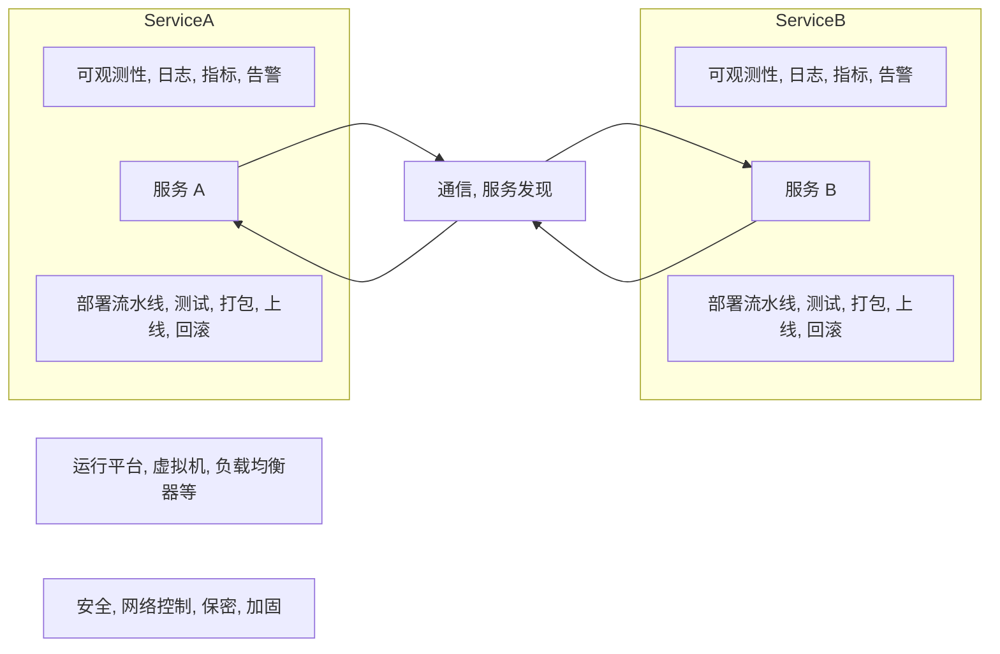
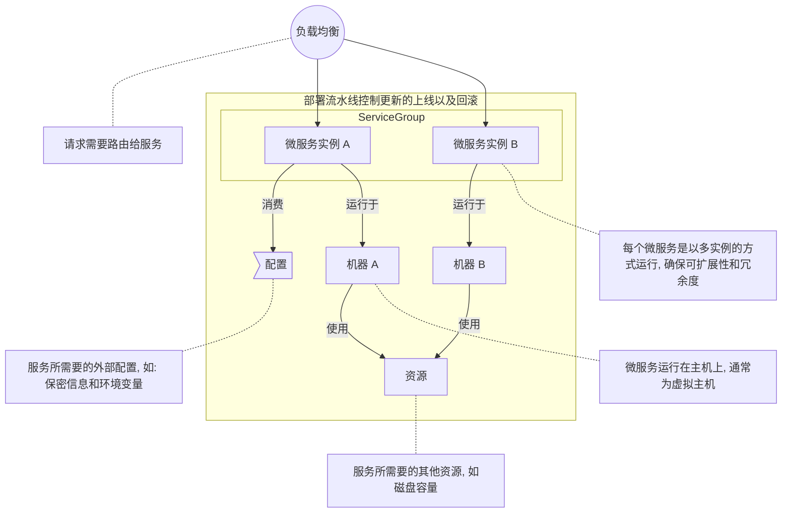

## 简介

微服务需要基础设施提供支持

- 服务运行的部署目标，包括基础设施的基本元件，如负载均衡器和虚拟机
- 日志聚合和监控聚合用于观测服务运行情况
- 一致且可重复的部署流水线，用于测试和发布新服务或者新版本
- 支持安全运行，如网络控制、涉密信息管理和应用加固
- 通信通道和服务发现方案，用于支持服务间交互

<!-- more -->

如图所示

一个具有鲁棒性的平台层既能够降低整体的实现成本，又能够提升整体的可稳定性，甚至能提高服务的开发速度。如果没有平台层，产品开发者就需要重复编写大量的底层的基础代码，无暇交付新的功能和业务价值。一般的开发者不需要也不应该对应用的每一层的复杂性都了然于胸。基本上，一个半独立的专业团队就可以开发出一套平台层，能够满足那些在服务层工作的团队的需求

## 映射运行时平台

运行时平台（或者部署目标）例如: AWS 的云环境或者像 Heroku 这样的 PaaS 平台, 提供了运行多个服务实例以及将请求路由给这些实例的基础元件和相应的机制来为服务实例提供配置信息: 机密信息和特定环境的变量

开发者在这一基础之上来开发微服务平台的其他部分。观测工具会收集服务以及底层基础设施的数据并进行修正。部署流水线会管理这一应用栈的升级或回滚

如图所示

