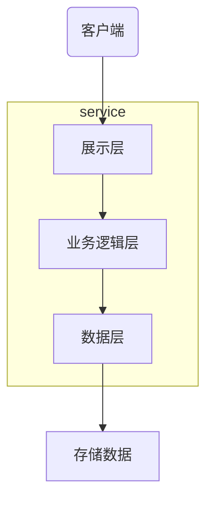
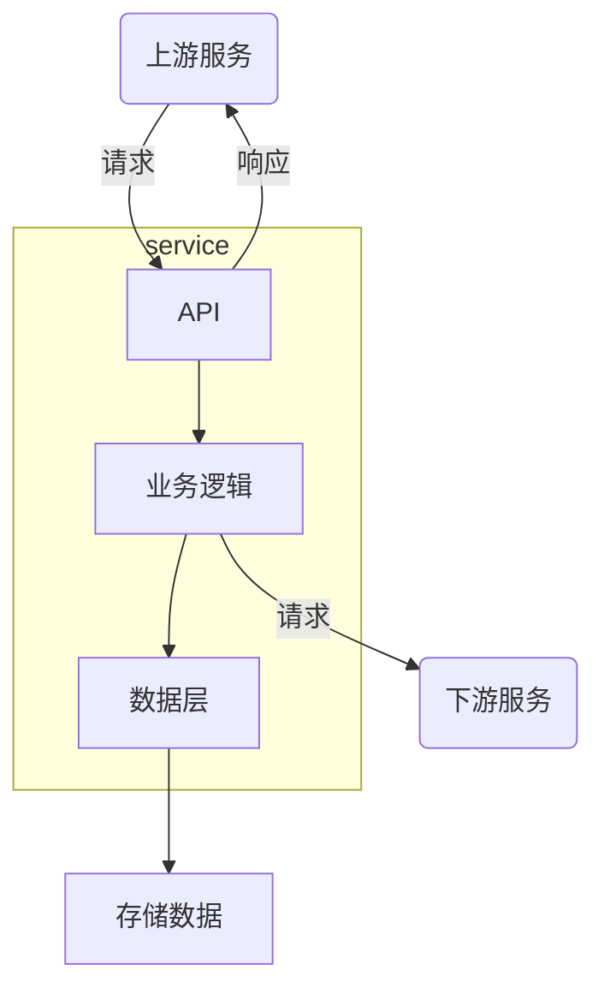
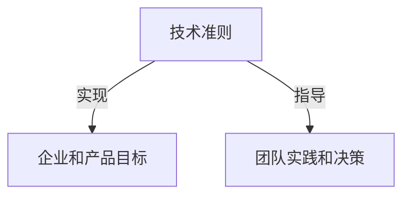
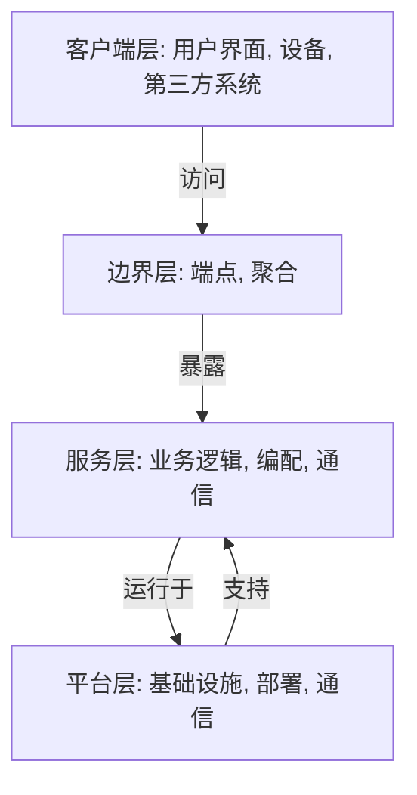

## 简介

> 软件设计师希望所开发出来的软件是易于修改的, 许多外部力量都会对开发者的软件施加影响：新增需求, 系统缺陷, 市场需要, 新客户, 业务增长情况等, 理想情况下, 工程师可以自信满满地以稳定的步调来响应这些压力, 如果想要做到这一点, 开发方式就应该减少摩擦并将风险降至最低

<!-- more -->

## 从单体应用到微服务

在单体应用中, 主要交付的就是一个应用程序, 这个应用程序可以被水平地分成几个不同的技术层, 在典型的三层架构的应用中, 它们分别是数据层, 业务逻辑层和展示层, 应用又会被垂直地分成不同的业务领域

每一层都为其上一层提供服务：数据层提供持久化状态, 业务逻辑层执行有效操作, 而展示层则将结果展示给终端用户

单个微服务和单体应用是很相似的：微服务会存储数据, 执行一些业务逻辑操作并通过 API 将数据和结果返回给消费者, 每个微服务都具备一项业务能力或者技术能力, 并且会通过和其他微服务进行交互来执行某些任务, 单个服务的抽象架构如下

在单体应用中, 架构限定在整个应用本身的边界内；而在微服务应用中, 开发者是在对从规模到范围都在不断演变的内容进行规划

## 技术负责人

微服务的应用使得快速修改成为可能, 团队在不断地开发新的服务, 停用现有服务或重构现有功能, 应用也随着时间慢慢的演进

技术负责人就是需要确保系统能够不断演进, 确保应用的技术基础能够支持快节奏的开发以及频繁的变化

- 应用和组织远大的战略目标是一致的
- 团队共同承担一套通用的技术价值观和期望
- 跨领域的内容: 诸如可观察性, 部署, 服务间通信等应该满足不同的团队需求
- 面对变化, 整个应用是灵活可扩展的

## 准则

为了实现更高一层的技术目标或者组织目标, 团队需要遵循的一套指南

准则用于指导团队如何实践, 如下图

准则是灵活的, 它们可以并且应该随着业务优先级的变化以及应用的技术演进而变化, 例如, 早期的开发过程会将验证产品和市场需求的匹配度作为更高优先级的工作, 而一个更加成熟的应用可能需要更专注于性能和可扩展性

例如, 如果某产品的目标是销售给那些对隐私和安全问题特别敏感的企业, 那么开发者就要制定这些准则

- 开发实践必须符合那些公认的外部标准 (如 ISO 27001)
- 时刻牢记, 所有数据必须是可转移的, 并且在存储数据的时候要有效期限制
- 必须要能够在应用中清晰地跟踪和回溯追查个人信息

## 概念模型

系统内部相互联系以及应用层面的模式的抽象模型

## 微服务应用的 4 层架构

架构应该体现出清晰的高层概念模型, 如图所示

- 平台层——微服务平台提供了工具, 基础架构和一些高级的基本部件, 以支持微服务的快速开发, 运行和部署, 一个成熟的平台层会让技术人员把重心放在功能开发而非一些底层的工作上
- 服务层——在这一层, 开发的各个服务会借助下层的平台层的支持来相互作用, 以提供业务和技术功能
- 边界层——客户端会通过定义好的边界和应用进行交互, 这个边界会暴露底层的各个功能, 以满足外部消费者的需求
- 客户端层——与微服务后端交互的客户端应用, 如网站和移动应用

不管底层使用了什么技术方案, 开发者应该都能够将它应用到所有微服务应用中

每一层都是建立在下一层次的功能之上的, 比如, 每个服务都会利用下层的微服务平台提供的部署流水线, 基础设施和通信机制, 要设计良好的微服务应用, 需要在每个层级上都进行大量的投入并精心设计
