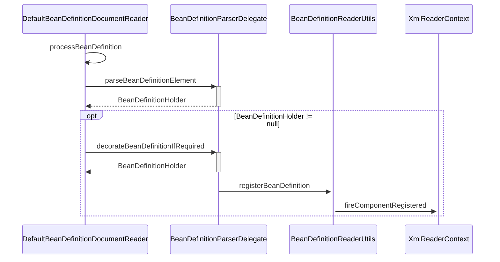

## 简介

DefaultBeanDefinitionDocumentReader 主要实现了默认标签的解析

<!-- more -->

```java
// org.springframework.beans.factory.xml.DefaultBeanDefinitionDocumentReader#parseDefaultElement
private void parseDefaultElement(Element ele, BeanDefinitionParserDelegate delegate) {
  if (delegate.nodeNameEquals(ele, IMPORT_ELEMENT)) {
    // import 标签
    importBeanDefinitionResource(ele);
  }
  else if (delegate.nodeNameEquals(ele, ALIAS_ELEMENT)) {
    // alias 标签
    processAliasRegistration(ele);
  }
  else if (delegate.nodeNameEquals(ele, BEAN_ELEMENT)) {
    // bean 标签
    processBeanDefinition(ele, delegate);
  }
  else if (delegate.nodeNameEquals(ele, NESTED_BEANS_ELEMENT)) {
    // recurse
    // beans 标签
    doRegisterBeanDefinitions(ele);
  }
}
```

## bean 标签

在 4 种标签中 bean 标签的解析最为复杂也最为重要

```java
// org.springframework.beans.factory.xml.DefaultBeanDefinitionDocumentReader#processBeanDefinition
protected void processBeanDefinition(Element ele, BeanDefinitionParserDelegate delegate) {
  // 委托 BeanDefinitionDelegate 类的 parseBeanDefinitionElement 方法进行元素解析, 返回 BeanDefinitionHolder 类型的实例
  // bdHolder 实例已经包含配置文件中配置的各种属性, 例如 class、name、id、alias 之类的属性
  BeanDefinitionHolder bdHolder = delegate.parseBeanDefinitionElement(ele);
  if (bdHolder != null) {
    // bdHolder 不为空
    // 存在默认标签的子节点下再有自定义属性, 还需要再次对自定义标签进行解析
    bdHolder = delegate.decorateBeanDefinitionIfRequired(ele, bdHolder);
    try {
      // Register the final decorated instance.
      // 对解析后的 bdHolder 进行注册
      BeanDefinitionReaderUtils.registerBeanDefinition(bdHolder, getReaderContext().getRegistry());
    }
    catch (BeanDefinitionStoreException ex) {
      getReaderContext().error("Failed to register bean definition with name '" +
          bdHolder.getBeanName() + "'", ele, ex);
    }
    // Send registration event.
    // 发出响应事件, 通知相关的监听器, 这个 bean 已经加载完成
    getReaderContext().fireComponentRegistered(new BeanComponentDefinition(bdHolder));
  }
}
```



### 解析 BeanDefinition

```java
// org.springframework.beans.factory.xml.BeanDefinitionParserDelegate#parseBeanDefinitionElement(org.w3c.dom.Element, org.springframework.beans.factory.config.BeanDefinition)
@Nullable
public BeanDefinitionHolder parseBeanDefinitionElement(Element ele, @Nullable BeanDefinition containingBean) {
  // 解析 id 属性
  String id = ele.getAttribute(ID_ATTRIBUTE);
  // 解析 name 属性
  String nameAttr = ele.getAttribute(NAME_ATTRIBUTE);
  // 分割 name
  List<String> aliases = new ArrayList<>();
  if (StringUtils.hasLength(nameAttr)) {
    String[] nameArr = StringUtils.tokenizeToStringArray(nameAttr, MULTI_VALUE_ATTRIBUTE_DELIMITERS);
    aliases.addAll(Arrays.asList(nameArr));
  }

  String beanName = id;
  if (!StringUtils.hasText(beanName) && !aliases.isEmpty()) {
    beanName = aliases.remove(0);
    if (logger.isTraceEnabled()) {
      logger.trace("No XML 'id' specified - using '" + beanName +
          "' as bean name and " + aliases + " as aliases");
    }
  }

  if (containingBean == null) {
    checkNameUniqueness(beanName, aliases, ele);
  }
  // 解析其他所有属性并统一封装至 GenericBeanDefinition 类型的实例中
  AbstractBeanDefinition beanDefinition = parseBeanDefinitionElement(ele, beanName, containingBean);
  if (beanDefinition != null) {
    if (!StringUtils.hasText(beanName)) {
      try {
        // 如果不存在 beanName 那么根据 Spring 中提供的命名规则为当前 bean 生成对应的 beanName
        if (containingBean != null) {
          beanName = BeanDefinitionReaderUtils.generateBeanName(
              beanDefinition, this.readerContext.getRegistry(), true);
        }
        else {
          beanName = this.readerContext.generateBeanName(beanDefinition);
          // Register an alias for the plain bean class name, if still possible,
          // if the generator returned the class name plus a suffix.
          // This is expected for Spring 1.2/2.0 backwards compatibility.
          String beanClassName = beanDefinition.getBeanClassName();
          if (beanClassName != null &&
              beanName.startsWith(beanClassName) && beanName.length() > beanClassName.length() &&
              !this.readerContext.getRegistry().isBeanNameInUse(beanClassName)) {
            aliases.add(beanClassName);
          }
        }
        if (logger.isTraceEnabled()) {
          logger.trace("Neither XML 'id' nor 'name' specified - " +
              "using generated bean name [" + beanName + "]");
        }
      }
      catch (Exception ex) {
        error(ex.getMessage(), ele);
        return null;
      }
    }
    String[] aliasesArray = StringUtils.toStringArray(aliases);
    // 将获取到的信息封装到 BeanDefinitionHolder 的实例中
    return new BeanDefinitionHolder(beanDefinition, beanName, aliasesArray);
  }

  return null;
}
```

其他属性具体处理方法

```java
// org.springframework.beans.factory.xml.BeanDefinitionParserDelegate#parseBeanDefinitionElement(org.w3c.dom.Element, java.lang.String, org.springframework.beans.factory.config.BeanDefinition)
@Nullable
public AbstractBeanDefinition parseBeanDefinitionElement(
    Element ele, String beanName, @Nullable BeanDefinition containingBean) {

  this.parseState.push(new BeanEntry(beanName));

  String className = null;
  // 解析 class 属性
  if (ele.hasAttribute(CLASS_ATTRIBUTE)) {
    className = ele.getAttribute(CLASS_ATTRIBUTE).trim();
  }
  String parent = null;
  // 解析 parent 属性
  if (ele.hasAttribute(PARENT_ATTRIBUTE)) {
    parent = ele.getAttribute(PARENT_ATTRIBUTE);
  }

  try {
    // 创建用于承载属性的 AbstractBeanDefinition 类型的 GenericBeanDefinition
    AbstractBeanDefinition bd = createBeanDefinition(className, parent);

    // 硬编码解析默认 bean 的各种属性
    parseBeanDefinitionAttributes(ele, beanName, containingBean, bd);
    // 提取 description
    bd.setDescription(DomUtils.getChildElementValueByTagName(ele, DESCRIPTION_ELEMENT));
    // 解析元数据
    parseMetaElements(ele, bd);
    // 解析 lookup-method 属性
    parseLookupOverrideSubElements(ele, bd.getMethodOverrides());
    // 解析 replaced-method 属性
    parseReplacedMethodSubElements(ele, bd.getMethodOverrides());
    // 解析构造函数参数
    parseConstructorArgElements(ele, bd);
    // 解析 property 子元素
    parsePropertyElements(ele, bd);
    // 解析 qualifier 子元素
    parseQualifierElements(ele, bd);

    bd.setResource(this.readerContext.getResource());
    bd.setSource(extractSource(ele));

    return bd;
  }
  catch (ClassNotFoundException ex) {
    error("Bean class [" + className + "] not found", ele, ex);
  }
  catch (NoClassDefFoundError err) {
    error("Class that bean class [" + className + "] depends on not found", ele, err);
  }
  catch (Throwable ex) {
    error("Unexpected failure during bean definition parsing", ele, ex);
  }
  finally {
    this.parseState.pop();
  }

  return null;
}
```

#### 创建承载属性的 BeanDefinition

BeanDefinition 是一个接口, 在 Spring 中存在三种实现: RootBeanDefinition、ChildBeanDefinition 以及 GenericBeanDefinition, 三种实现均继承了 AbstractBeanDefiniton

- BeanDefinition 和 <bean> 中的属性是一一对应的
- RootBeanDefinition 是最常用的实现类, 它对应一般性的 <bean> 元素标签
- GenericBeanDefinition 是自 2.5 版本以后新加入的 bean 文件配置属性定义类, 是一站式服务类
- 在配置文件中可以定义父 <bean> 和子 <bean>, 父 <bean> 用 RootBeanDefinition 表示, 而子 <bean> 用 ChildBeanDefiniton 表示,
- 没有父 <bean> 的 <bean> 就使用 RootBeanDefinition 表示

Spring 通过 BeanDefinition 将配置文件中的 <bean> 配置信息转换为容器的内部表示, 并将这些 BeanDefiniton 注册到 BeanDefinitonRegistry 中, Spring 容器的 BeanDefinitionRegistry 就像是 Spring 配置信息的内存数据库, 主要是以 map 的形式保存, 后续操作直接从 BeanDefinitionRegistry 中读取配置信息

```java
// org.springframework.beans.factory.support.AbstractBeanDefinition
protected AbstractBeanDefinition createBeanDefinition(@Nullable String className, @Nullable String parentName)
    throws ClassNotFoundException {

  return BeanDefinitionReaderUtils.createBeanDefinition(
      parentName, className, this.readerContext.getBeanClassLoader());
}
```

```java
// org.springframework.beans.factory.support.BeanDefinitionReaderUtils#createBeanDefinition
public static AbstractBeanDefinition createBeanDefinition(
    @Nullable String parentName, @Nullable String className, @Nullable ClassLoader classLoader) throws ClassNotFoundException {

  GenericBeanDefinition bd = new GenericBeanDefinition();
  // parentName 可能为空
  bd.setParentName(parentName);
  if (className != null) {
    if (classLoader != null) {
      // 如果 classLoader 不为空, 则使用以传入的 classLoader 同一虚拟机加载类对象, 否则只是
      // 记录 className
      bd.setBeanClass(ClassUtils.forName(className, classLoader));
    }
    else {
      bd.setBeanClassName(className);
    }
  }
  return bd;
}
```

#### 解析各种属性

```java
// org.springframework.beans.factory.xml.BeanDefinitionParserDelegate#parseBeanDefinitionAttributes
public AbstractBeanDefinition parseBeanDefinitionAttributes(Element ele, String beanName,
    @Nullable BeanDefinition containingBean, AbstractBeanDefinition bd) {
  // scope 与 singleton 两个属性只能指定其中之一, 不可以同时出现, 否则 Spring 将会报出异常
  // 解析 singleton 属性
  if (ele.hasAttribute(SINGLETON_ATTRIBUTE)) {
    error("Old 1.x 'singleton' attribute in use - upgrade to 'scope' declaration", ele);
  }
  // 解析 scope 属性
  else if (ele.hasAttribute(SCOPE_ATTRIBUTE)) {
    bd.setScope(ele.getAttribute(SCOPE_ATTRIBUTE));
  }
  else if (containingBean != null) {
    // Take default from containing bean in case of an inner bean definition.
    // 在嵌入 beanDifinition 情况下且没有单独指定 scope 属性则使用父类默认的属性
    bd.setScope(containingBean.getScope());
  }
  // 解析 abstract 属性
  if (ele.hasAttribute(ABSTRACT_ATTRIBUTE)) {
    bd.setAbstract(TRUE_VALUE.equals(ele.getAttribute(ABSTRACT_ATTRIBUTE)));
  }
  // 解析 lazy-init 属性
  String lazyInit = ele.getAttribute(LAZY_INIT_ATTRIBUTE);
  if (isDefaultValue(lazyInit)) {
    lazyInit = this.defaults.getLazyInit();
  }
  // 默认值或设置成其他字符都会被设置为 false
  bd.setLazyInit(TRUE_VALUE.equals(lazyInit));
  // 解析 autowire 属性
  String autowire = ele.getAttribute(AUTOWIRE_ATTRIBUTE);
  bd.setAutowireMode(getAutowireMode(autowire));
  // 解析 depends-on 属性
  if (ele.hasAttribute(DEPENDS_ON_ATTRIBUTE)) {
    String dependsOn = ele.getAttribute(DEPENDS_ON_ATTRIBUTE);
    bd.setDependsOn(StringUtils.tokenizeToStringArray(dependsOn, MULTI_VALUE_ATTRIBUTE_DELIMITERS));
  }
  // 解析 autowire-candidate 属性
  String autowireCandidate = ele.getAttribute(AUTOWIRE_CANDIDATE_ATTRIBUTE);
  if (isDefaultValue(autowireCandidate)) {
    String candidatePattern = this.defaults.getAutowireCandidates();
    if (candidatePattern != null) {
      String[] patterns = StringUtils.commaDelimitedListToStringArray(candidatePattern);
      bd.setAutowireCandidate(PatternMatchUtils.simpleMatch(patterns, beanName));
    }
  }
  else {
    bd.setAutowireCandidate(TRUE_VALUE.equals(autowireCandidate));
  }
  // 解析 primary 属性
  if (ele.hasAttribute(PRIMARY_ATTRIBUTE)) {
    bd.setPrimary(TRUE_VALUE.equals(ele.getAttribute(PRIMARY_ATTRIBUTE)));
  }
  // 解析 init-method 属性
  if (ele.hasAttribute(INIT_METHOD_ATTRIBUTE)) {
    String initMethodName = ele.getAttribute(INIT_METHOD_ATTRIBUTE);
    bd.setInitMethodName(initMethodName);
  }
  else if (this.defaults.getInitMethod() != null) {
    bd.setInitMethodName(this.defaults.getInitMethod());
    bd.setEnforceInitMethod(false);
  }
  // 解析 destroy-method 属性
  if (ele.hasAttribute(DESTROY_METHOD_ATTRIBUTE)) {
    String destroyMethodName = ele.getAttribute(DESTROY_METHOD_ATTRIBUTE);
    bd.setDestroyMethodName(destroyMethodName);
  }
  else if (this.defaults.getDestroyMethod() != null) {
    bd.setDestroyMethodName(this.defaults.getDestroyMethod());
    bd.setEnforceDestroyMethod(false);
  }
  // 解析 factory-method 属性
  if (ele.hasAttribute(FACTORY_METHOD_ATTRIBUTE)) {
    bd.setFactoryMethodName(ele.getAttribute(FACTORY_METHOD_ATTRIBUTE));
  }
  // 解析 factory-bean 属性
  if (ele.hasAttribute(FACTORY_BEAN_ATTRIBUTE)) {
    bd.setFactoryBeanName(ele.getAttribute(FACTORY_BEAN_ATTRIBUTE));
  }

  return bd;
}
```

#### 元数据 meta 属性

元数据 meta 属性的使用

```xml
<bean id="myTestBean" class="bean.MyTestBean">
    <meta key="testStr" value="aaaaaaaa"/>
</bean>
```

这段配置并不会体现在 MyTestBean 的属性当中, 而是一个额外的声明, 当需要使用里面的信息的时候可以通过 BeanDefinition 的 getAttribute（key）方法进行获取

```java
// org.springframework.beans.factory.xml.BeanDefinitionParserDelegate#parseMetaElements
public void parseMetaElements(Element ele, BeanMetadataAttributeAccessor attributeAccessor) {
  // 获取当前节点的所有子元素
  NodeList nl = ele.getChildNodes();
  for (int i = 0; i < nl.getLength(); i++) {
    Node node = nl.item(i);
    // 提取 meta
    if (isCandidateElement(node) && nodeNameEquals(node, META_ELEMENT)) {
      Element metaElement = (Element) node;
      String key = metaElement.getAttribute(KEY_ATTRIBUTE);
      String value = metaElement.getAttribute(VALUE_ATTRIBUTE);
      //使用 key、value 构造 BeanMetadataAttribute
      BeanMetadataAttribute attribute = new BeanMetadataAttribute(key, value);
      attribute.setSource(extractSource(metaElement));
      // 添加信息到 attributeAccessor
      attributeAccessor.addMetadataAttribute(attribute);
    }
  }
}
```

#### 子元素 lookup-method

lookup-method 获取器注入是一种特殊的方法注入, 它是把一个方法声明为返回某种类型的 bean, 但实际要返回的 bean 是在配置文件里面配置的, 此方法可用在设计有些可插拔的功能上, 解除程序依赖

使用过程, 创建父类

```java
public class User {
  public void showMe(){
    System.out.println("i am user");
  }
}
```

创建子类并覆盖 showMe 方法

```java
public class Teacher extends User{
  public void showMe(){
    System.out.println("i am Teacher");
  }
}
```

创建调用方法

```java
public abstract class GetBeanTest {
  public void showMe(){
    this.getBean().showMe();
  }
  public abstract User getBean();
}
```

测试方法

```java
public class Main {
  public static void main(String[] args) {
    ApplicationContext bf =
            new ClassPathXmlApplicationContext("test/lookup/lookupTest.xml");
    GetBeanTest test=(GetBeanTest) bf.getBean("getBeanTest");
    test.showMe();
  }
}
```

配置文件

```xml
<?xml version="1.0" encoding="UTF-8"?>
<beans xmlns="http://www.Springframework.org/schema/beans"
  xmlns:xsi="http://www.w3.org/2001/XMLSchema-instance"
  xsi:schemaLocation="http://www.springframework.org/schema/beans http://www.
  springframework.org/schema/beans/Spring-beans.xsd">

  <bean id="getBeanTest" class="test.lookup.app.GetBeanTest">
    <lookup-method name="getBean" bean="teacher"/>
  </bean>

  <bean id="teacher" class="test.lookup.bean.Teacher"/>
</beans>
```

该配置动态地将 teacher 所代表的 bean 作为 getBean 的返回值, 当业务变更或者在其他情况下, teacher 里面的业务逻辑已经不再符合需求, 可以增加新的逻辑类进行替换

```java
public class Student extends User {
  public void showMe(){
    System.out.println("i am student");
  }
}
```

```xml
<?xml version="1.0" encoding="UTF-8"?>
<beans xmlns="http://www.Springframework.org/schema/beans"
  xmlns:xsi="http://www.w3.org/2001/XMLSchema-instance"
  xsi:schemaLocation="http://www.springframework.org/schema/beans http://www.
  springframework.org/schema/beans/Spring-beans.xsd">

  <bean id="getBeanTest" class="test.lookup.app.GetBeanTest">
    <lookup-method name="getBean" bean="student"/>
  </bean>

  <bean id="teacher" class="test.lookup.bean.Teacher"/>
  <bean id="student" class="test.lookup.bean.Student"/>
</beans>
```

```java
public void parseLookupOverrideSubElements(Element beanEle, MethodOverrides overrides) {
  NodeList nl = beanEle.getChildNodes();
  for (int i = 0; i < nl.getLength(); i++) {
    Node node = nl.item(i);
    //仅当在 Spring 默认 bean 的子元素下且为 lookup-method 时有效
    if (isCandidateElement(node) && nodeNameEquals(node, LOOKUP_METHOD_ELEMENT)) {
      Element ele = (Element) node;
      // 获取要修饰的方法
      String methodName = ele.getAttribute(NAME_ATTRIBUTE);
      // 获取配置返回的 bean
      String beanRef = ele.getAttribute(BEAN_ELEMENT);
      // 使用 LookupOverride 类型的实体类来进行数据承载并记录在 AbstractBeanDefinition 中的 methodOverrides 属性中
      LookupOverride override = new LookupOverride(methodName, beanRef);
      override.setSource(extractSource(ele));
      overrides.addOverride(override);
    }
  }
}
```

#### 子元素 replaced-method

replaced-method 方法替换: 可以在运行时用新的方法替换现有的方法

与 look-up 不同的是, replaced-method 不但可以动态地替换返回实体 bean, 而且还能动态地更改原有方法的逻辑

配置示例

```java
public class TestMethodReplacer implements MethodReplacer{
  @Override
  public Object reimplement（Object obj, Method method, Object[] args）throws Throwable {
    System.out.println（"我替换了原有的方法"）;
    return null;
  }
}
```

```xml
<?xml version="1.0" encoding="UTF-8"?>
  <beans xmlns="http://www.Springframework.org/schema/beans"
          xmlns:xsi="http://www.w3.org/2001/XMLSchema-instance"
  xsi:schemaLocation="http://www.Springframework.org/schema/beans http://www.Springframework. org/schema/beans/Spring-beans.xsd">

  <bean id="testChangeMethod" class="test.replacemethod.TestChangeMethod">
    <replaced-method name="changeMe" replacer="replacer"/>
  </bean>

  <bean id="replacer" class="test.replacemethod.TestMethodReplacer"/>
</beans>
```

这里直接将原本的 changeMe 方法动态替换

```java
// org.springframework.beans.factory.xml.BeanDefinitionParserDelegate#parseReplacedMethodSubElements
public void parseReplacedMethodSubElements(Element beanEle, MethodOverrides overrides) {
  NodeList nl = beanEle.getChildNodes();
  for (int i = 0; i < nl.getLength(); i++) {
    Node node = nl.item(i);
    // 仅当在 Spring 默认 bean 的子元素下且为 replaced-method 时有效
    if (isCandidateElement(node) && nodeNameEquals(node, REPLACED_METHOD_ELEMENT)) {
      Element replacedMethodEle = (Element) node;
      // 提取要替换的旧的方法
      String name = replacedMethodEle.getAttribute(NAME_ATTRIBUTE);
      // 提取对应的新的替换方法
      String callback = replacedMethodEle.getAttribute(REPLACER_ATTRIBUTE);
      ReplaceOverride replaceOverride = new ReplaceOverride(name, callback);
      // Look for arg-type match elements.
      List<Element> argTypeEles = DomUtils.getChildElementsByTagName(replacedMethodEle, ARG_TYPE_ELEMENT);
      for (Element argTypeEle : argTypeEles) {
        // 记录参数
        String match = argTypeEle.getAttribute(ARG_TYPE_MATCH_ATTRIBUTE);
        match = (StringUtils.hasText(match) ? match : DomUtils.getTextValue(argTypeEle));
        if (StringUtils.hasText(match)) {
          replaceOverride.addTypeIdentifier(match);
        }
      }
      replaceOverride.setSource(extractSource(replacedMethodEle));
      overrides.addOverride(replaceOverride);
    }
  }
}
```

无论是 look-up 还是 replaced-method 都是构造了一个 MethodOverride, 并最终记录在了 AbstractBeanDefinition 中的 methodOverrides 属性中

#### 子元素 constructor-arg

```java
// org.springframework.beans.factory.xml.BeanDefinitionParserDelegate#parseConstructorArgElements
public void parseConstructorArgElements(Element beanEle, BeanDefinition bd) {
  NodeList nl = beanEle.getChildNodes();
  for (int i = 0; i < nl.getLength(); i++) {
    Node node = nl.item(i);
    if (isCandidateElement(node) && nodeNameEquals(node, CONSTRUCTOR_ARG_ELEMENT)) {
      parseConstructorArgElement((Element) node, bd);
    }
  }
}
// org.springframework.beans.factory.xml.BeanDefinitionParserDelegate#parseConstructorArgElement
public void parseConstructorArgElement(Element ele, BeanDefinition bd) {
  // 提取 index 属性
  String indexAttr = ele.getAttribute(INDEX_ATTRIBUTE);
  // 提取 type 属性
  String typeAttr = ele.getAttribute(TYPE_ATTRIBUTE);
  // 提取 name 属性
  String nameAttr = ele.getAttribute(NAME_ATTRIBUTE);
  if (StringUtils.hasLength(indexAttr)) {
    try {
      int index = Integer.parseInt(indexAttr);
      // index 是指参数下标
      if (index < 0) {
        error("'index' cannot be lower than 0", ele);
      }
      else {
        try {
          this.parseState.push(new ConstructorArgumentEntry(index));
          // 解析 ele 对应的属性元素
          Object value = parsePropertyValue(ele, bd, null);
          // 使用 ConstructorArgumentValues.ValueHolder 类型来封装解析出来的元素
          ConstructorArgumentValues.ValueHolder valueHolder = new ConstructorArgumentValues.ValueHolder(value);
          // 设置属性
          if (StringUtils.hasLength(typeAttr)) {
            valueHolder.setType(typeAttr);
          }
          if (StringUtils.hasLength(nameAttr)) {
            valueHolder.setName(nameAttr);
          }
          valueHolder.setSource(extractSource(ele));
          // 不允许重复指定相同参数
          if (bd.getConstructorArgumentValues().hasIndexedArgumentValue(index)) {
            error("Ambiguous constructor-arg entries for index " + index, ele);
          }
          else {
            // 添加至当前 BeanDefinition 的 constructorArgumentValues 的 indexedArgumentValues 属性中
            bd.getConstructorArgumentValues().addIndexedArgumentValue(index, valueHolder);
          }
        }
        finally {
          this.parseState.pop();
        }
      }
    }
    catch (NumberFormatException ex) {
      error("Attribute 'index' of tag 'constructor-arg' must be an integer", ele);
    }
  }
  else {
    // 没有 index 属性则忽略属性, 自动寻找
    try {
      this.parseState.push(new ConstructorArgumentEntry());
      Object value = parsePropertyValue(ele, bd, null);
      // 使用 ConstructorArgumentValues.ValueHolder 类型来封装解析出来的元素
      ConstructorArgumentValues.ValueHolder valueHolder = new ConstructorArgumentValues.ValueHolder(value);
      // 设置属性
      if (StringUtils.hasLength(typeAttr)) {
        valueHolder.setType(typeAttr);
      }
      if (StringUtils.hasLength(nameAttr)) {
        valueHolder.setName(nameAttr);
      }
      valueHolder.setSource(extractSource(ele));
      // 添加至当前 BeanDefinition 的 constructorArgumentValues 的 indexedArgumentValues 属性中
      bd.getConstructorArgumentValues().addGenericArgumentValue(valueHolder);
    }
    finally {
      this.parseState.pop();
    }
  }
}
```

```java
// org.springframework.beans.factory.xml.BeanDefinitionParserDelegate#parsePropertyValue
@Nullable
public Object parsePropertyValue(Element ele, BeanDefinition bd, @Nullable String propertyName) {
  String elementName = (propertyName != null ?
      "<property> element for property '" + propertyName + "'" :
      "<constructor-arg> element");

  // Should only have one child element: ref, value, list, etc.
  // 一个属性只能对应一种类型: ref、value、list 等
  NodeList nl = ele.getChildNodes();
  Element subElement = null;
  for (int i = 0; i < nl.getLength(); i++) {
    Node node = nl.item(i);
    // 对应 description 或者 meta 不处理
    if (node instanceof Element && !nodeNameEquals(node, DESCRIPTION_ELEMENT) &&
        !nodeNameEquals(node, META_ELEMENT)) {
      // Child element is what we're looking for.
      if (subElement != null) {
        error(elementName + " must not contain more than one sub-element", ele);
      }
      else {
        subElement = (Element) node;
      }
    }
  }
  // 解析 constructor-arg 上的 ref 属性
  boolean hasRefAttribute = ele.hasAttribute(REF_ATTRIBUTE);
  // 解析 constructor-arg 上的 value 属性
  boolean hasValueAttribute = ele.hasAttribute(VALUE_ATTRIBUTE);
  // 不能既有 ref 属性又有 value 属性, 或者不能存在 ref 属性或者 value 属性且又有子元素
  if ((hasRefAttribute && hasValueAttribute) ||
      ((hasRefAttribute || hasValueAttribute) && subElement != null)) {
    error(elementName +
        " is only allowed to contain either 'ref' attribute OR 'value' attribute OR sub-element", ele);
  }

  if (hasRefAttribute) {
    // ref 属性的处理, 使用 RuntimeBeanReference 封装对应的 ref 名称
    String refName = ele.getAttribute(REF_ATTRIBUTE);
    if (!StringUtils.hasText(refName)) {
      error(elementName + " contains empty 'ref' attribute", ele);
    }
    RuntimeBeanReference ref = new RuntimeBeanReference(refName);
    ref.setSource(extractSource(ele));
    return ref;
  }
  else if (hasValueAttribute) {
    // value 属性的处理, 使用 TypedStringValue 封装
    TypedStringValue valueHolder = new TypedStringValue(ele.getAttribute(VALUE_ATTRIBUTE));
    valueHolder.setSource(extractSource(ele));
    return valueHolder;
  }
  else if (subElement != null) {
    // 解析子元素
    return parsePropertySubElement(subElement, bd);
  }
  else {
    // Neither child element nor "ref" or "value" attribute found.
    //既没有 ref 也没有 value 也没有子元素, 打印错误日志
    error(elementName + " must specify a ref or value", ele);
    return null;
  }
}
```

parsePropertySubElement 中实现了对各种子元素的分类处理

```java
// org.springframework.beans.factory.xml.BeanDefinitionParserDelegate#parsePropertySubElement(org.w3c.dom.Element, org.springframework.beans.factory.config.BeanDefinition, java.lang.String)
@Nullable
public Object parsePropertySubElement(Element ele, @Nullable BeanDefinition bd, @Nullable String defaultValueType) {
  if (!isDefaultNamespace(ele)) {
    return parseNestedCustomElement(ele, bd);
  }
  else if (nodeNameEquals(ele, BEAN_ELEMENT)) {
    BeanDefinitionHolder nestedBd = parseBeanDefinitionElement(ele, bd);
    if (nestedBd != null) {
      nestedBd = decorateBeanDefinitionIfRequired(ele, nestedBd, bd);
    }
    return nestedBd;
  }
  else if (nodeNameEquals(ele, REF_ELEMENT)) {
    // A generic reference to any name of any bean.
    String refName = ele.getAttribute(BEAN_REF_ATTRIBUTE);
    boolean toParent = false;
    if (!StringUtils.hasLength(refName)) {
      // A reference to the id of another bean in a parent context.
      // 解析 parent
      refName = ele.getAttribute(PARENT_REF_ATTRIBUTE);
      toParent = true;
      if (!StringUtils.hasLength(refName)) {
        error("'bean' or 'parent' is required for <ref> element", ele);
        return null;
      }
    }
    if (!StringUtils.hasText(refName)) {
      error("<ref> element contains empty target attribute", ele);
      return null;
    }
    RuntimeBeanReference ref = new RuntimeBeanReference(refName, toParent);
    ref.setSource(extractSource(ele));
    return ref;
  }
  // idref 元素
  else if (nodeNameEquals(ele, IDREF_ELEMENT)) {
    return parseIdRefElement(ele);
  }
  // value 元素
  else if (nodeNameEquals(ele, VALUE_ELEMENT)) {
    return parseValueElement(ele, defaultValueType);
  }
  // null 元素
  else if (nodeNameEquals(ele, NULL_ELEMENT)) {
    // It's a distinguished null value. Let's wrap it in a TypedStringValue
    // object in order to preserve the source location.
    TypedStringValue nullHolder = new TypedStringValue(null);
    nullHolder.setSource(extractSource(ele));
    return nullHolder;
  }
  // array 元素
  else if (nodeNameEquals(ele, ARRAY_ELEMENT)) {
    return parseArrayElement(ele, bd);
  }
  // list 元素
  else if (nodeNameEquals(ele, LIST_ELEMENT)) {
    return parseListElement(ele, bd);
  }
  // set 元素
  else if (nodeNameEquals(ele, SET_ELEMENT)) {
    return parseSetElement(ele, bd);
  }
  // map 元素
  else if (nodeNameEquals(ele, MAP_ELEMENT)) {
    return parseMapElement(ele, bd);
  }
  // props 元素
  else if (nodeNameEquals(ele, PROPS_ELEMENT)) {
    return parsePropsElement(ele);
  }
  else {
    error("Unknown property sub-element: [" + ele.getNodeName() + "]", ele);
    return null;
  }
}
```

#### 子元素 property

```java
// org.springframework.beans.factory.xml.BeanDefinitionParserDelegate#parsePropertyElements
public void parsePropertyElements(Element beanEle, BeanDefinition bd) {
  NodeList nl = beanEle.getChildNodes();
  for (int i = 0; i < nl.getLength(); i++) {
    Node node = nl.item(i);
    if (isCandidateElement(node) && nodeNameEquals(node, PROPERTY_ELEMENT)) {
      parsePropertyElement((Element) node, bd);
    }
  }
}
// org.springframework.beans.factory.xml.BeanDefinitionParserDelegate#parsePropertyElement
public void parsePropertyElement(Element ele, BeanDefinition bd) {
  // 获取配置元素中 name 的值
  String propertyName = ele.getAttribute(NAME_ATTRIBUTE);
  if (!StringUtils.hasLength(propertyName)) {
    error("Tag 'property' must have a 'name' attribute", ele);
    return;
  }
  this.parseState.push(new PropertyEntry(propertyName));
  try {
    // 不允许多次对同一属性配置
    if (bd.getPropertyValues().contains(propertyName)) {
      error("Multiple 'property' definitions for property '" + propertyName + "'", ele);
      return;
    }
    Object val = parsePropertyValue(ele, bd, propertyName);
    PropertyValue pv = new PropertyValue(propertyName, val);
    parseMetaElements(ele, pv);
    pv.setSource(extractSource(ele));
    bd.getPropertyValues().addPropertyValue(pv);
  }
  finally {
    this.parseState.pop();
  }
}
```

#### 子元素 qualifier

使用 Spring 框架中进行自动注入时, Spring 容器中匹配的候选 Bean 数目必须有且仅有一个, 当找不到一个匹配的 Bean 时, Spring 容器将抛出 BeanCreationException 异常, 并指出必须至少拥有一个匹配的 Bean

通过 Qualifier 指定注入 Bean 的名称, 这样歧义就消除了

```xml
<bean id="myTestBean" class="bean.MyTestBean">
  <qualifier type="org.Springframework.beans.factory.annotation.Qualifier" value="qf"/>
</bean>
```

对于 qualifier 元素更多的是注解的形式

```java
// org.springframework.beans.factory.xml.BeanDefinitionParserDelegate#parseQualifierElements
public void parseQualifierElements(Element beanEle, AbstractBeanDefinition bd) {
  NodeList nl = beanEle.getChildNodes();
  for (int i = 0; i < nl.getLength(); i++) {
    Node node = nl.item(i);
    if (isCandidateElement(node) && nodeNameEquals(node, QUALIFIER_ELEMENT)) {
      parseQualifierElement((Element) node, bd);
    }
  }
}
// org.springframework.beans.factory.xml.BeanDefinitionParserDelegate#parseQualifierElement
public void parseQualifierElement(Element ele, AbstractBeanDefinition bd) {
  String typeName = ele.getAttribute(TYPE_ATTRIBUTE);
  if (!StringUtils.hasLength(typeName)) {
    error("Tag 'qualifier' must have a 'type' attribute", ele);
    return;
  }
  this.parseState.push(new QualifierEntry(typeName));
  try {
    AutowireCandidateQualifier qualifier = new AutowireCandidateQualifier(typeName);
    qualifier.setSource(extractSource(ele));
    String value = ele.getAttribute(VALUE_ATTRIBUTE);
    if (StringUtils.hasLength(value)) {
      qualifier.setAttribute(AutowireCandidateQualifier.VALUE_KEY, value);
    }
    NodeList nl = ele.getChildNodes();
    for (int i = 0; i < nl.getLength(); i++) {
      Node node = nl.item(i);
      if (isCandidateElement(node) && nodeNameEquals(node, QUALIFIER_ATTRIBUTE_ELEMENT)) {
        Element attributeEle = (Element) node;
        String attributeName = attributeEle.getAttribute(KEY_ATTRIBUTE);
        String attributeValue = attributeEle.getAttribute(VALUE_ATTRIBUTE);
        if (StringUtils.hasLength(attributeName) && StringUtils.hasLength(attributeValue)) {
          BeanMetadataAttribute attribute = new BeanMetadataAttribute(attributeName, attributeValue);
          attribute.setSource(extractSource(attributeEle));
          qualifier.addMetadataAttribute(attribute);
        }
        else {
          error("Qualifier 'attribute' tag must have a 'name' and 'value'", attributeEle);
          return;
        }
      }
    }
    bd.addQualifier(qualifier);
  }
  finally {
    this.parseState.pop();
  }
}
```

### 解析默认标签中的自定义标签元素

当 Spring 中的 bean 使用的是默认的标签配置, 但是其中的子元素却使用了自定义的配置时就可以通过 delegate.decorateBeanDefinitionIfRequired(ele, bdHolder) 方法来解析

```java
// org.springframework.beans.factory.xml.BeanDefinitionParserDelegate#decorateBeanDefinitionIfRequired(org.w3c.dom.Element, org.springframework.beans.factory.config.BeanDefinitionHolder)
/**
  * Decorate the given bean definition through a namespace handler, if applicable.
  * @param ele the current element
  * @param originalDef the current bean definition
  * @return the decorated bean definition
  */
public BeanDefinitionHolder decorateBeanDefinitionIfRequired(Element ele, BeanDefinitionHolder originalDef) {
  return decorateBeanDefinitionIfRequired(ele, originalDef, null);
}
// org.springframework.beans.factory.xml.BeanDefinitionParserDelegate#decorateBeanDefinitionIfRequired(org.w3c.dom.Element, org.springframework.beans.factory.config.BeanDefinitionHolder, org.springframework.beans.factory.config.BeanDefinition)
/**
  * Decorate the given bean definition through a namespace handler, if applicable.
  * @param ele the current element
  * @param originalDef the current bean definition
  * @param containingBd the containing bean definition (if any)
  * @return the decorated bean definition
  */
public BeanDefinitionHolder decorateBeanDefinitionIfRequired(
    Element ele, BeanDefinitionHolder originalDef, @Nullable BeanDefinition containingBd) {

  BeanDefinitionHolder finalDefinition = originalDef;

  // Decorate based on custom attributes first.
  NamedNodeMap attributes = ele.getAttributes();
  // 遍历所有的属性, 看看是否有适用于修饰的属性
  for (int i = 0; i < attributes.getLength(); i++) {
    Node node = attributes.item(i);
    finalDefinition = decorateIfRequired(node, finalDefinition, containingBd);
  }

  // Decorate based on custom nested elements.
  NodeList children = ele.getChildNodes();
  // 遍历所有的子节点, 看看是否有适用于修饰的子元素
  for (int i = 0; i < children.getLength(); i++) {
    Node node = children.item(i);
    if (node.getNodeType() == Node.ELEMENT_NODE) {
      finalDefinition = decorateIfRequired(node, finalDefinition, containingBd);
    }
  }
  return finalDefinition;
}
```

方法分别对元素的所有属性以及子节点进行了 decorateIfRequired 函数的调用

```java
// org.springframework.beans.factory.xml.BeanDefinitionParserDelegate#decorateIfRequired
/**
  * Decorate the given bean definition through a namespace handler,
  * if applicable.
  * @param node the current child node
  * @param originalDef the current bean definition
  * @param containingBd the containing bean definition (if any)
  * @return the decorated bean definition
  */
public BeanDefinitionHolder decorateIfRequired(
    Node node, BeanDefinitionHolder originalDef, @Nullable BeanDefinition containingBd) {
  // 获取自定义标签的命名空间
  String namespaceUri = getNamespaceURI(node);
  // 对于非默认标签进行修饰
  if (namespaceUri != null && !isDefaultNamespace(namespaceUri)) {
    // 根据命名空间找到对应的处理器
    NamespaceHandler handler = this.readerContext.getNamespaceHandlerResolver().resolve(namespaceUri);
    if (handler != null) {
      // 解析处理
      BeanDefinitionHolder decorated =
          handler.decorate(node, originalDef, new ParserContext(this.readerContext, this, containingBd));
      if (decorated != null) {
        return decorated;
      }
    }
    else if (namespaceUri.startsWith("http://www.springframework.org/")) {
      error("Unable to locate Spring NamespaceHandler for XML schema namespace [" + namespaceUri + "]", node);
    }
    else {
      // A custom namespace, not to be handled by Spring - maybe "xml:...".
      if (logger.isDebugEnabled()) {
        logger.debug("No Spring NamespaceHandler found for XML schema namespace [" + namespaceUri + "]");
      }
    }
  }
  return originalDef;
}
```

### 注册解析的 BeanDefinition

```java
// org.springframework.beans.factory.support.BeanDefinitionReaderUtils#registerBeanDefinition
/**
  * Register the given bean definition with the given bean factory.
  * @param definitionHolder the bean definition including name and aliases
  * @param registry the bean factory to register with
  * @throws BeanDefinitionStoreException if registration failed
  */
public static void registerBeanDefinition(
    BeanDefinitionHolder definitionHolder, BeanDefinitionRegistry registry)
    throws BeanDefinitionStoreException {

  // Register bean definition under primary name.
  // 使用 beanName 做唯一标识注册
  String beanName = definitionHolder.getBeanName();
  registry.registerBeanDefinition(beanName, definitionHolder.getBeanDefinition());

  // Register aliases for bean name, if any.
  // 注册所有的别名
  String[] aliases = definitionHolder.getAliases();
  if (aliases != null) {
    for (String alias : aliases) {
      registry.registerAlias(beanName, alias);
    }
  }
}
```

#### 使用 beanName 注册 BeanDefinition

```java
// org.springframework.beans.factory.support.DefaultListableBeanFactory#registerBeanDefinition
@Override
public void registerBeanDefinition(String beanName, BeanDefinition beanDefinition)
    throws BeanDefinitionStoreException {

  Assert.hasText(beanName, "Bean name must not be empty");
  Assert.notNull(beanDefinition, "BeanDefinition must not be null");

  if (beanDefinition instanceof AbstractBeanDefinition) {
    try {
      // 主要是对于 AbstractBeanDefinition 属性中的 methodOverrides 校验
      // 校验 methodOverrides 是否与工厂方法并存或者 methodOverrides 对应的方法根本不存在
      ((AbstractBeanDefinition) beanDefinition).validate();
    }
    catch (BeanDefinitionValidationException ex) {
      throw new BeanDefinitionStoreException(beanDefinition.getResourceDescription(), beanName,
          "Validation of bean definition failed", ex);
    }
  }

  BeanDefinition existingDefinition = this.beanDefinitionMap.get(beanName);
  if (existingDefinition != null) {
    // 如果不允许覆盖抛出异常
    if (!isAllowBeanDefinitionOverriding()) {
      throw new BeanDefinitionOverrideException(beanName, beanDefinition, existingDefinition);
    }
    else if (existingDefinition.getRole() < beanDefinition.getRole()) {
      // e.g. was ROLE_APPLICATION, now overriding with ROLE_SUPPORT or ROLE_INFRASTRUCTURE
      if (logger.isInfoEnabled()) {
        logger.info("Overriding user-defined bean definition for bean '" + beanName +
            "' with a framework-generated bean definition: replacing [" +
            existingDefinition + "] with [" + beanDefinition + "]");
      }
    }
    // 判断是否存在
    else if (!beanDefinition.equals(existingDefinition)) {
      if (logger.isDebugEnabled()) {
        logger.debug("Overriding bean definition for bean '" + beanName +
            "' with a different definition: replacing [" + existingDefinition +
            "] with [" + beanDefinition + "]");
      }
    }
    else {
      if (logger.isTraceEnabled()) {
        logger.trace("Overriding bean definition for bean '" + beanName +
            "' with an equivalent definition: replacing [" + existingDefinition +
            "] with [" + beanDefinition + "]");
      }
    }
    this.beanDefinitionMap.put(beanName, beanDefinition);
  }
  else {
    if (hasBeanCreationStarted()) {
      // Cannot modify startup-time collection elements anymore (for stable iteration)
      // 因为 beanDefinitionMap 是全局变量, 这里定会存在并发访问的情况
      synchronized (this.beanDefinitionMap) {
        // 注册 beanDefinition
        this.beanDefinitionMap.put(beanName, beanDefinition);
        List<String> updatedDefinitions = new ArrayList<>(this.beanDefinitionNames.size() + 1);
        updatedDefinitions.addAll(this.beanDefinitionNames);
        // 添加 beanName
        updatedDefinitions.add(beanName);
        this.beanDefinitionNames = updatedDefinitions;
        removeManualSingletonName(beanName);
      }
    }
    else {
      // Still in startup registration phase
      this.beanDefinitionMap.put(beanName, beanDefinition);
      this.beanDefinitionNames.add(beanName);
      removeManualSingletonName(beanName);
    }
    this.frozenBeanDefinitionNames = null;
  }

  if (existingDefinition != null || containsSingleton(beanName)) {
    // 重置所有 beanName 对应的缓存
    resetBeanDefinition(beanName);
  }
}
```

#### 使用 alias 注册 BeanDefinition

```java
// org.springframework.core.SimpleAliasRegistry#registerAlias
@Override
public void registerAlias(String name, String alias) {
  Assert.hasText(name, "'name' must not be empty");
  Assert.hasText(alias, "'alias' must not be empty");
  synchronized (this.aliasMap) {
    // 如果 beanName 与 alias 相同的话不记录 alias, 并删除对应的 alias
    if (alias.equals(name)) {
      this.aliasMap.remove(alias);
      if (logger.isDebugEnabled()) {
        logger.debug("Alias definition '" + alias + "' ignored since it points to same name");
      }
    }
    else {
      String registeredName = this.aliasMap.get(alias);
      if (registeredName != null) {
        if (registeredName.equals(name)) {
          // An existing alias - no need to re-register
          return;
        }
        // 如果 alias 不允许被覆盖则抛出异常
        if (!allowAliasOverriding()) {
          throw new IllegalStateException("Cannot define alias '" + alias + "' for name '" +
              name + "': It is already registered for name '" + registeredName + "'.");
        }
        if (logger.isDebugEnabled()) {
          logger.debug("Overriding alias '" + alias + "' definition for registered name '" +
              registeredName + "' with new target name '" + name + "'");
        }
      }
      //当 A->B 存在时, 若再次出现 A->C->B 时候则会抛出异常
      checkForAliasCircle(name, alias);
      this.aliasMap.put(alias, name);
      if (logger.isTraceEnabled()) {
        logger.trace("Alias definition '" + alias + "' registered for name '" + name + "'");
      }
    }
  }
}
```

### 通知监听器解析及注册完成

通过代码 getReaderContext().fireComponentRegistered（new BeanComponentDefinition(bdHolder)）里的实现只为扩展, 当程序开发人员需要对注册 BeanDefinition 事件进行监听时可以通过注册监听器的方式并将处理逻辑写入监听器中, 目前在 Spring 中并没有对此事件做任何逻辑处理
