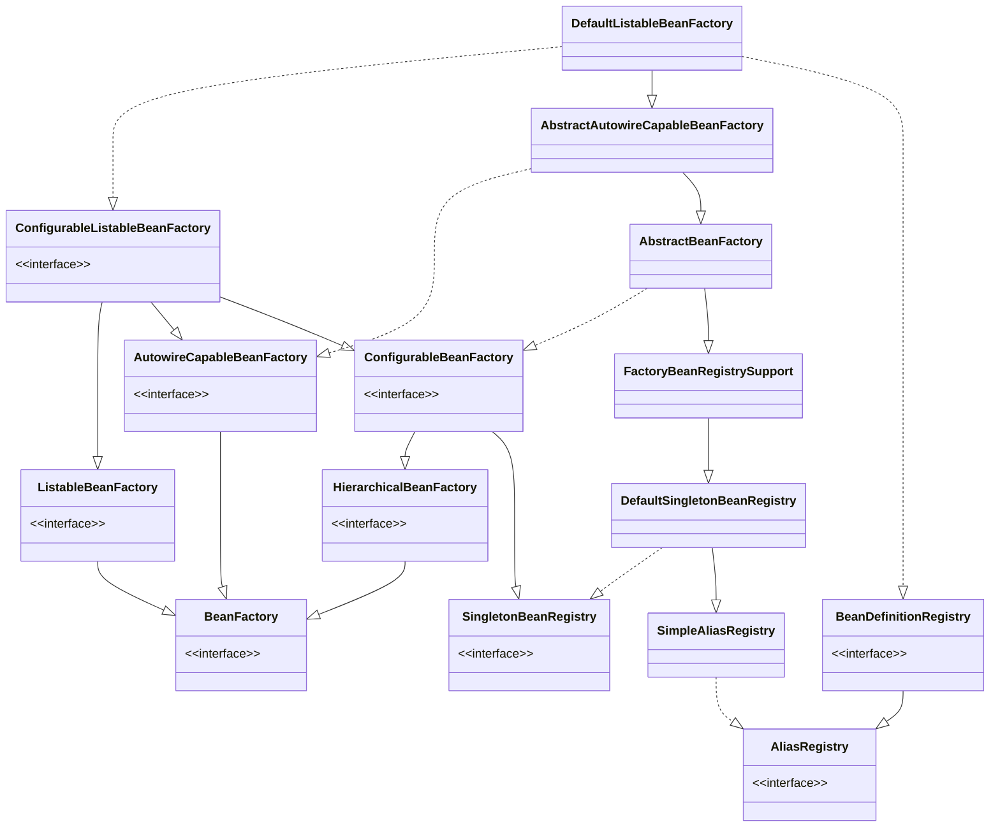

## 简介

DefaultListableBeanFactory 是整个 bean 加载的核心部分, 是 Spring 注册及加载 bean 的默认实现

XmlBeanFactory 与 DefaultListableBeanFactory 的不同

- XmlBeanFactory 继承自 DefaultListableBeanFactory
- XmlBeanFactory 中使用了自定义的 XML 读取器 XmlBeanDefinitionReader, 实现了个性化的 BeanDefinitionReader 读取
- DefaultListableBeanFactory 继承了 AbstractAutowireCapableBeanFactory 并实现了 ConfigurableListableBeanFactory 以及 BeanDefinitionRegistry 接口

## 各个类描述

- AliasRegistry: 定义对 alias 的简单增删改等操作
- SimpleAliasRegistry: 主要使用 map 作为 alias 的缓存, 并对接口 AliasRegistry 进行实现
- SingletonBeanRegistry: 定义对单例的注册及获取
- BeanFactory: 定义获取 bean 及 bean 的各种属性
- DefaultSingletonBeanRegistry: 对接口 SingletonBeanRegistry 各函数的实现
- HierarchicalBeanFactory: 继承 BeanFactory, 也就是在 BeanFactory 定义的功能的基础上增加了对 parentFactory 的支持
- BeanDefinitionRegistry: 定义对 BeanDefinition 的各种增删改操作
- FactoryBeanRegistrySupport: 在 DefaultSingletonBeanRegistry 基础上增加了对 FactoryBean 的特殊处理功能
- ConfigurableBeanFactory: 提供配置 Factory 的各种方法
- ListableBeanFactory: 根据各种条件获取 bean 的配置清单
- AbstractBeanFactory: 综合 FactoryBeanRegistrySupport 和 ConfigurableBeanFactory 的功能
- AutowireCapableBeanFactory: 提供创建 bean、自动注入、初始化以及应用 bean 的后处理器
- AbstractAutowireCapableBeanFactory: 综合 AbstractBeanFactory 并对接口 Autowire Capable BeanFactory 进行实现
- ConfigurableListableBeanFactory: BeanFactory 配置清单, 指定忽略类型及接口等
- DefaultListableBeanFactory: 综合上面所有功能, 主要是对 bean 注册后的处理
