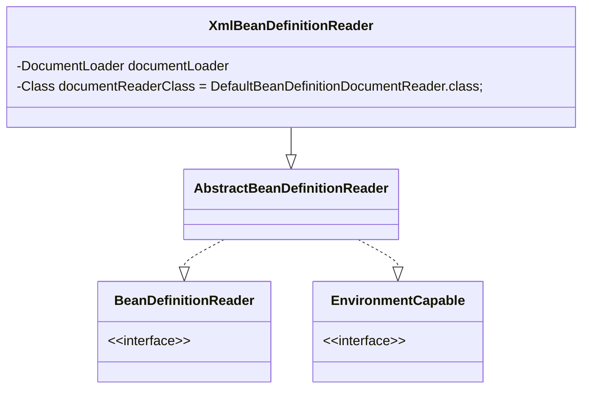

## 简介

XML 配置文件的读取是 Spring 中重要的功能, XmlBeanFactory 对 DefaultListableBeanFactory 类进行了扩展，主要用于从 XML 文档中读取 BeanDefinition，对于注册及获取 bean 都是使用从父类 DefaultListableBeanFactory 继承的方法去实现, 增加了 XmlBeanDefinitionReader 类型的 reader 属性对 XML 资源文件进行读取和注册



- 通过继承自 AbstractBeanDefinitionReader 中的方法，来使用 ResourLoader 将资源文件路径转换为对应的 Resource 文件
- 通过 DocumentLoader 对 Resource 文件进行转换，将 Resource 文件转换为 Document 文件
- 通过实现接口 BeanDefinitionDocumentReader 的 DefaultBeanDefinitionDocumentReader 类对 Document 进行解析，并使用 BeanDefinitionParserDelegate 对 Element 进行解析

<!-- more -->

## 各个类描述

- ResourceLoader：定义资源加载器，主要应用于根据给定的资源文件地址返回对应的 Resource
- BeanDefinitionReader：主要定义资源文件读取并转换为 BeanDefinition 的各个功能
- EnvironmentCapable：定义获取 Environment 方法
- DocumentLoader：定义从资源文件加载到转换为 Document 的功能
- AbstractBeanDefinitionReader：对 EnvironmentCapable、BeanDefinitionReader 类定义的功能进行实现
- BeanDefinitionDocumentReader：定义读取 Docuemnt 并注册 BeanDefinition 功能
- BeanDefinitionParserDelegate：定义解析 Element 的各种方法

## 获取 Document

XmlBeanDefinitionReader 使用 DocumentLoader 去获取 Document

```java
// org.springframework.beans.factory.xml.XmlBeanDefinitionReader#doLoadDocument
protected Document doLoadDocument(InputSource inputSource, Resource resource) throws Exception {
  return this.documentLoader.loadDocument(inputSource, getEntityResolver(), this.errorHandler,
      getValidationModeForResource(resource), isNamespaceAware());
}
```

实际上通过 DefaultDocumentLoader 实现

```java
// org.springframework.beans.factory.xml.DefaultDocumentLoader#loadDocument
@Override
public Document loadDocument(InputSource inputSource, EntityResolver entityResolver,
    ErrorHandler errorHandler, int validationMode, boolean namespaceAware) throws Exception {
  // 首先创建 DocumentBuilderFactory
  DocumentBuilderFactory factory = createDocumentBuilderFactory(validationMode, namespaceAware);
  if (logger.isTraceEnabled()) {
    logger.trace("Using JAXP provider [" + factory.getClass().getName() + "]");
  }
  // 通过 DocumentBuilderFactory 创建 DocumentBuilder
  DocumentBuilder builder = createDocumentBuilder(factory, entityResolver, errorHandler);
  // 解析 inputSource 来返回 Document 对象
  return builder.parse(inputSource);
}
```

## EntityResolver

如果 SAX 应用程序需要实现自定义处理外部实体，则必须实现此接口并使用 setEntityResolver 方法向 SAX 驱动器注册一个实例。也就是说，对于解析一个 XML，SAX 首先读取该 XML 文档上的声明，根据声明去寻找相应的 DTD 定义，以便对文档进行一个验证。默认的寻找规则，即通过网络（实现上就是声明的 DTD 的 URI 地址）来下载相应的 DTD 声明，并进行认证。下载的过程是一个漫长的过程，而且当网络中断或不可用时，这里会报错，就是因为相应的 DTD 声明没有被找到的原因

Spring 中使用 DelegatingEntityResolver 类为 EntityResolver 的实现类

```java
// org.springframework.beans.factory.xml.DelegatingEntityResolver#resolveEntity
@Override
@Nullable
public InputSource resolveEntity(@Nullable String publicId, @Nullable String systemId)
    throws SAXException, IOException {

  if (systemId != null) {
    if (systemId.endsWith(DTD_SUFFIX)) {
      // 如果是 dtd
      return this.dtdResolver.resolveEntity(publicId, systemId);
    }
    else if (systemId.endsWith(XSD_SUFFIX)) {
      // 通过调用 META-INF/Spring.schemas 解析
      return this.schemaResolver.resolveEntity(publicId, systemId);
    }
  }

  // Fall back to the parser's default behavior.
  return null;
}
```

加载 DTD 类型的 BeansDtdResolver 的 resolveEntity 是直接截取 systemId 最后的 xx.dtd 然后去当前路径下寻找

加载 XSD 类型的 PluggableSchemaResolver 类的 resolveEntity 是默认到 META-INF/Spring.schemas 文件中找到 systemid 所对应的 XSD 文件并加载

```java
// org.springframework.beans.factory.xml.BeansDtdResolver#resolveEntity
@Override
@Nullable
public InputSource resolveEntity(@Nullable String publicId, @Nullable String systemId) throws IOException {
  if (logger.isTraceEnabled()) {
    logger.trace("Trying to resolve XML entity with public ID [" + publicId +
        "] and system ID [" + systemId + "]");
  }

  if (systemId != null && systemId.endsWith(DTD_EXTENSION)) {
    int lastPathSeparator = systemId.lastIndexOf('/');
    int dtdNameStart = systemId.indexOf(DTD_NAME, lastPathSeparator);
    if (dtdNameStart != -1) {
      String dtdFile = DTD_NAME + DTD_EXTENSION;
      if (logger.isTraceEnabled()) {
        logger.trace("Trying to locate [" + dtdFile + "] in Spring jar on classpath");
      }
      try {
        Resource resource = new ClassPathResource(dtdFile, getClass());
        InputSource source = new InputSource(resource.getInputStream());
        source.setPublicId(publicId);
        source.setSystemId(systemId);
        if (logger.isTraceEnabled()) {
          logger.trace("Found beans DTD [" + systemId + "] in classpath: " + dtdFile);
        }
        return source;
      }
      catch (FileNotFoundException ex) {
        if (logger.isDebugEnabled()) {
          logger.debug("Could not resolve beans DTD [" + systemId + "]: not found in classpath", ex);
        }
      }
    }
  }

  // Fall back to the parser's default behavior.
  return null;
}
```

## 解析及注册 BeanDefinitions

```java
// org.springframework.beans.factory.xml.XmlBeanDefinitionReader#registerBeanDefinitions
public int registerBeanDefinitions(Document doc, Resource resource) throws BeanDefinitionStoreException {
  // 使用 DefaultBeanDefinitionDocumentReader 实例化 BeanDefinitionDocumentReader
  BeanDefinitionDocumentReader documentReader = createBeanDefinitionDocumentReader();
  // 在实例化 BeanDefinitionReader 时候会将 BeanDefinitionRegistry 传入，默认使用继承自 DefaultListableBeanFactory 的子类
  // 记录统计前 BeanDefinition 的加载个数
  int countBefore = getRegistry().getBeanDefinitionCount();
  // 加载及注册 bean
  documentReader.registerBeanDefinitions(doc, createReaderContext(resource));
  // 返回本次加载的 BeanDefinition 个数
  return getRegistry().getBeanDefinitionCount() - countBefore;
}
```

BeanDefinitionDocumentReader 是一个接口, 通过 createBeanDefinitionDocumentReader() 实例化后 BeanDefinitionDocumentReader 真正的类型是 DefaultBeanDefinitionDocumentReader 了

这个方法中很好地应用了面向对象中单一职责的原则，将逻辑处理委托给单一的类进行处理

这个方法的重要目的之一就是提取 doc root

```java
// org.springframework.beans.factory.xml.DefaultBeanDefinitionDocumentReader#registerBeanDefinitions
@Override
public void registerBeanDefinitions(Document doc, XmlReaderContext readerContext) {
  this.readerContext = readerContext;
  doRegisterBeanDefinitions(doc.getDocumentElement());
}
```

```java
// org.springframework.beans.factory.xml.DefaultBeanDefinitionDocumentReader#doRegisterBeanDefinitions
@SuppressWarnings("deprecation")  // for Environment.acceptsProfiles(String...)
protected void doRegisterBeanDefinitions(Element root) {
  // Any nested <beans> elements will cause recursion in this method. In
  // order to propagate and preserve <beans> default-* attributes correctly,
  // keep track of the current (parent) delegate, which may be null. Create
  // the new (child) delegate with a reference to the parent for fallback purposes,
  // then ultimately reset this.delegate back to its original (parent) reference.
  // this behavior emulates a stack of delegates without actually necessitating one.
  // 专门处理解析
  BeanDefinitionParserDelegate parent = this.delegate;
  this.delegate = createDelegate(getReaderContext(), root, parent);

  if (this.delegate.isDefaultNamespace(root)) {
    // 处理 profile 属性
    String profileSpec = root.getAttribute(PROFILE_ATTRIBUTE);
    if (StringUtils.hasText(profileSpec)) {
      String[] specifiedProfiles = StringUtils.tokenizeToStringArray(
          profileSpec, BeanDefinitionParserDelegate.MULTI_VALUE_ATTRIBUTE_DELIMITERS);
      // We cannot use Profiles.of(...) since profile expressions are not supported
      // in XML config. See SPR-12458 for details.
      if (!getReaderContext().getEnvironment().acceptsProfiles(specifiedProfiles)) {
        if (logger.isDebugEnabled()) {
          logger.debug("Skipped XML bean definition file due to specified profiles [" + profileSpec +
              "] not matching: " + getReaderContext().getResource());
        }
        return;
      }
    }
  }
  // 解析前处理, 子类实现
  preProcessXml(root);
  parseBeanDefinitions(root, this.delegate);
  // 解析后处理, 子类实现
  postProcessXml(root);

  this.delegate = parent;
}
```

preProcessXml(root) 和 postProcessXml(root) 默认并没有实现, 这里是面向继承而设计的

继承自 DefaultBeanDefinitionDocumentReader 的子类需要在 Bean 解析前后做一些处理需要重写这两个方法

## profile 属性

```xml
<beans xmlns="http://www.Springframework.org/schema/beans"
  xmlns:xsi="http://www.w3.org/2001/XMLSchema-instance" xmlns:jdbc="http://www. Springframework.org/schema/jdbc"
  xmlns:jee="http://www.springframework.org/schema/jee"
  xsi:schemaLocation="...">
    ... ...
  <beans profile="dev">
      ... ...
  </beans>
  <beans profile="production">
      ... ...
  </beans>
</beans>
```

集成到 Web 环境中时，在 web.xml 中加入以下代码

```xml
<context-param>
    <param-name>Spring.profiles.active</param-name>
    <param-value>dev</param-value>
</context-param>
```

可以看出, profile 属性可以在配置文件中部署多套配置来适用于生产环境和开发环境, 可以方便的切换开发, 部署环境

doRegisterBeanDefinitions 中解析 profileSpec 流程

- 获取 beans 节点是否定义了 profile 属性
- 到环境变量中寻找
- 拆分多个 profile 并解析每个 profile 是都符合环境变量中所定义

## BeanDefinition

```java
// org.springframework.beans.factory.xml.DefaultBeanDefinitionDocumentReader#parseBeanDefinitions
protected void parseBeanDefinitions(Element root, BeanDefinitionParserDelegate delegate) {
  // 判断是否 BEANS_NAMESPACE_URI
  if (delegate.isDefaultNamespace(root)) {
    NodeList nl = root.getChildNodes();
    for (int i = 0; i < nl.getLength(); i++) {
      Node node = nl.item(i);
      if (node instanceof Element) {
        Element ele = (Element) node;
        if (delegate.isDefaultNamespace(ele)) {
          // 处理 Bean
          parseDefaultElement(ele, delegate);
        }
        else {
          // 处理 Bean
          delegate.parseCustomElement(ele);
        }
      }
    }
  }
  else {
    delegate.parseCustomElement(root);
  }
}
```

Spring 的 XML 配置里面有两大类 Bean 声明

- 默认: `<bean id="test" class="test.TestBean"/>`
- 自定义: `<tx:annotation-driven/>`

两种方式的读取及解析差别非常大, 自定义需要用户实现一些接口及配置。对于根节点或者子节点如果是默认命名空间的话则采用 parseDefaultElement 方法进行解析，否则使用 delegate.parseCustomElement 方法对自定义命名空间进行解析

判断是否默认命名空间还是自定义命名空间的办法是使用 node.getNamespaceURI() 获取命名空间, 并与 Spring 中固定的命名空间 `http://www.springframework.org/schema/beans` 进行比对, 如果一致则认为是默认，否则就认为是自定义
