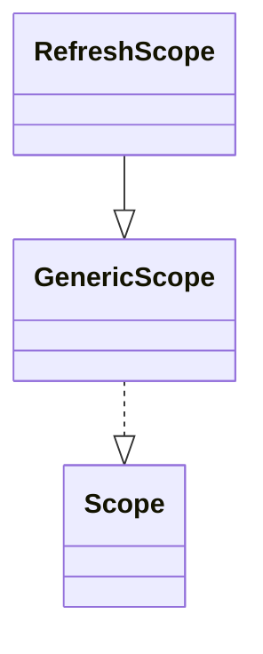

## 简介

`org.springframework.cloud.context.scope.refresh.RefreshScope` 是 Spring Cloud 提供的一种特殊的 scope 实现, 用了实现修改配置, 实例热加载的功能

<!-- more -->

## 实现

### @RefreshScope

查看源码, 可以看到 `@RefreshScope` 是一个使用了 `ScopedProxyMode.TARGET_CLASS` 作为默认参数的 `@Scope`

使用 `ScopedProxyMode.TARGET_CLASS`, 每次获取 Bean 实例时都会使用 GCLIB 代理方式创建一个新的代理对象

```java
/**
 * Convenience annotation to put a <code>@Bean</code> definition in
 * {@link org.springframework.cloud.context.scope.refresh.RefreshScope refresh scope}.
 * Beans annotated this way can be refreshed at runtime and any components that are using
 * them will get a new instance on the next method call, fully initialized and injected
 * with all dependencies.
 *
 * @author Dave Syer
 *
 */
@Target({ ElementType.TYPE, ElementType.METHOD })
@Retention(RetentionPolicy.RUNTIME)
@Scope("refresh")
@Documented
public @interface RefreshScope {

  /**
   * @see Scope#proxyMode()
   * @return proxy mode
   */
  ScopedProxyMode proxyMode() default ScopedProxyMode.TARGET_CLASS;

}
```

### RefreshScope

`RefreshScope` 继承关系如下



通过实现 `Scope` 来实现管理 Bean 的功能, 对获取到的 Bean 进行缓存, 当进行刷新的时候, 只需要清理掉缓存的实例即可

```java
// 通过监听 ContextRefreshedEvent 事件
// 在 ApplicationContext 初始化或者 refreshed 时触发
// org.springframework.cloud.context.scope.refresh.RefreshScope#onApplicationEvent
@Override
public void onApplicationEvent(ContextRefreshedEvent event) {
  start(event);
}

public void start(ContextRefreshedEvent event) {
  if (event.getApplicationContext() == this.context && this.eager
      && this.registry != null) {
    eagerlyInitialize();
  }
}

private void eagerlyInitialize() {
  for (String name : this.context.getBeanDefinitionNames()) {
    BeanDefinition definition = this.registry.getBeanDefinition(name);
    // 获取 refreshScope 注解的 bean
    if (this.getName().equals(definition.getScope())
        && !definition.isLazyInit()) {
      Object bean = this.context.getBean(name);
      if (bean != null) {
        bean.getClass();
      }
    }
  }
}
```

```java
// 刷新时调用的是 GernericScope 类中实现的 destroy 方法
// org.springframework.cloud.context.scope.refresh.RefreshScope#refreshAll
@ManagedOperation(description = "Dispose of the current instance of all beans "
    + "in this scope and force a refresh on next method execution.")
public void refreshAll() {
  super.destroy();
  this.context.publishEvent(new RefreshScopeRefreshedEvent());
}
```

在 `GernericScope` 类中主要实现了代理机制和获取销毁方法

```java
// 遍历所有 Bean 的定义, 如果 Bean 的 Scope 是 refresh
// 那么将 bean 设置为 LockedScopedProxyFactoryBean 的代理对象
// org.springframework.cloud.context.scope.GenericScope#postProcessBeanDefinitionRegistry
@Override
public void postProcessBeanDefinitionRegistry(BeanDefinitionRegistry registry)
    throws BeansException {
  for (String name : registry.getBeanDefinitionNames()) {
    BeanDefinition definition = registry.getBeanDefinition(name);
    if (definition instanceof RootBeanDefinition) {
      RootBeanDefinition root = (RootBeanDefinition) definition;
      if (root.getDecoratedDefinition() != null && root.hasBeanClass()
          && root.getBeanClass() == ScopedProxyFactoryBean.class) {
        if (getName().equals(root.getDecoratedDefinition().getBeanDefinition()
            .getScope())) {
          root.setBeanClass(LockedScopedProxyFactoryBean.class);
          root.getConstructorArgumentValues().addGenericArgumentValue(this);
          // surprising that a scoped proxy bean definition is not already
          // marked as synthetic?
          root.setSynthetic(true);
        }
      }
    }
  }
}
```

```java
// 通过缓存类获取 bean 实例
// org.springframework.cloud.context.scope.GenericScope#get
@Override
public Object get(String name, ObjectFactory<?> objectFactory) {
  BeanLifecycleWrapper value = this.cache.put(name,
      new BeanLifecycleWrapper(name, objectFactory));
  this.locks.putIfAbsent(name, new ReentrantReadWriteLock());
  try {
    return value.getBean();
  }
  catch (RuntimeException e) {
    this.errors.put(name, e);
    throw e;
  }
}
```

```java
// 使用同步发送, 当没有缓存时, 从 objectFactory 获取
// org.springframework.cloud.context.scope.GenericScope.BeanLifecycleWrapper#getBean
public Object getBean() {
  if (this.bean == null) {
    synchronized (this.name) {
      if (this.bean == null) {
        this.bean = this.objectFactory.getObject();
      }
    }
  }
  return this.bean;
}
```

```java
// 清除缓存里的 bean
// org.springframework.cloud.context.scope.GenericScope#destroy()
@Override
public void destroy() {
  List<Throwable> errors = new ArrayList<Throwable>();
  Collection<BeanLifecycleWrapper> wrappers = this.cache.clear();
  for (BeanLifecycleWrapper wrapper : wrappers) {
    try {
      Lock lock = this.locks.get(wrapper.getName()).writeLock();
      lock.lock();
      try {
        wrapper.destroy();
      }
      finally {
        lock.unlock();
      }
    }
    catch (RuntimeException e) {
      errors.add(e);
    }
  }
  if (!errors.isEmpty()) {
    throw wrapIfNecessary(errors.get(0));
  }
  this.errors.clear();
}
```

### ContextRefresher

ContextRefresher 主要是提供一个 refresh 方法来触发配置更新和 bean 的热加载

主要步骤为

- 获取刷新之前的所有 PropertySource
- 调用 addConfigFilesToEnvironment 方法获取最新的配置
- 调用 changes 方法更新配置信息
- 发布 EnvironmentChangeEnvent 事件
- 调用 refreshScope 的 refreshAll 方法刷新范围

```java
// org.springframework.cloud.context.refresh.ContextRefresher#refresh
public synchronized Set<String> refresh() {
  Set<String> keys = refreshEnvironment();
  this.scope.refreshAll();
  return keys;
}

public synchronized Set<String> refreshEnvironment() {
  Map<String, Object> before = extract(
      this.context.getEnvironment().getPropertySources());
  addConfigFilesToEnvironment();
  Set<String> keys = changes(before,
      extract(this.context.getEnvironment().getPropertySources())).keySet();
  this.context.publishEvent(new EnvironmentChangeEvent(this.context, keys));
  return keys;
}
```
