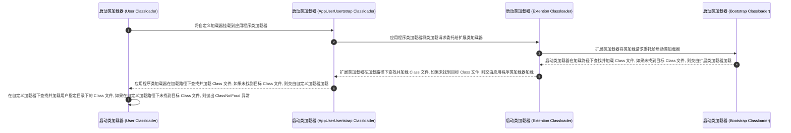

## 简介

- 启动类加载器：负责加载 `Java_HOME/lib` 目录中的类库, 或通过 `-Xbootclasspath` 参数指定路径中被虚拟机认可的类库
- 扩展类加载器：负责加载 `Java_HOME/lib/ext` 目录中的类库, 或通过 `java.ext.dirs` 系统变量加载指定路径中的类库
- 应用程序类加载器：负责加载用户路径 (classpath) 上的类库
- 通过继承 `java.lang.ClassLoader` 实现自定义的类加载器

<!-- more -->

## 双亲委派机制

双亲委派机制指一个类在收到类加载请求后不会尝试自己加载这个类, 而是把该类加载请求向上委派给其父类去完成, 其父类在接收到该类加载请求后又会将其委派给自己的父类, 以此类推, 这样所有的类加载请求都被向上委派到启动类加载器中, 若父类加载器在接收到类加载请求后发现自己也无法加载该类 (通常原因是该类的 Class 文件在父类的类加载路径中不存在) , 则父类会将该信息反馈给子类并向下委派子类加载器加载该类, 直到该类被成功加载, 若找不到该类, 则 JVM 会抛出 `ClassNotFoud` 异常

双亲委派机制的核心是保障类的唯一性和安全性

在加载 `rt.jar` 包中的 `java.lang.Object` 类时, 无论是哪个类加载器加载这个类, 最终都将类加载请求委托给启动类加载器加载, 这样就保证了类加载的唯一性, 如果在 JVM 中存在包名和类名相同的两个类, 则该类将无法被加载, JVM 也无法完成类加载流程

## OSGI

OSGI (Open Service Gateway Initiative) 是 Java 动态化模块化系统的一系列规范, 旨在为实现 Java 程序的模块化编程提供基础条件, 基于 OSGI 的程序可以实现模块级的热插拔功能, 在程序升级更新时, 可以只针对需要更新的程序进行停用和重新安装, 极大提高了系统升级的安全性和便捷性

- 提供了一种面向服务的架构, 该架构为组件提供了动态发现其他组件的功能, 这样无论是加入组件还是卸载组件, 都能被系统的其他组件感知, 以便各个组件之间能更好地协调工作
- 定义了模块化开发的规范, 还定义了实现这些规范所依赖的服务与架构, 市场上也有成熟的框架对其进行实现和应用, 但只有部分应用适合采用 OSGI 方式, 因为它为了实现动态模块, 不再遵循 JVM 类加载双亲委派机制和其他 JVM 规范, 在安全性上有所牺牲
