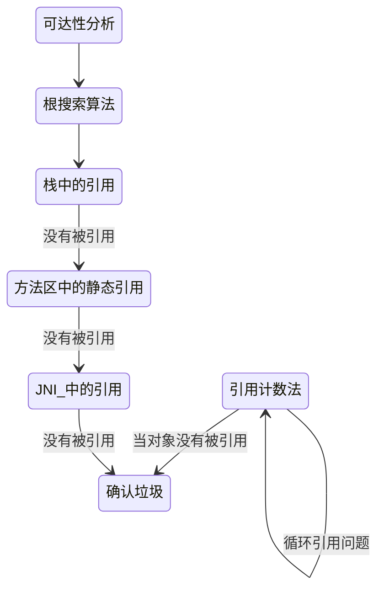

# 确定对象可被回收

Java 采用引用计数法和可达性分析来确定对象是否应该被回收，其中，引用计数法容易产生循环引用的问题，可达性分析通过根搜索算法（GC Roots Tracing）来实现。根搜索算法以一系列 GC Roots 的点作为起点向下搜索，在一个对象到任何 GC Roots 都没有引用链相连时，说明其已经死亡。根搜索算法主要针对栈中的引用、方法区中的静态引用和 JNI 中的引用展开分析

简单的图示



## 引用计数法

在 Java 中如果要操作对象，就必须先获取该对象的引用，因此可以通过引用计数法来判断一个对象是否可以被回收。在为对象添加一个引用时，引用计数加 1；在为对象删除一个引用时，引进计数减 1；如果一个对象的引用计数为 0，则表示此刻该对象没有被引用，可以被回收。

引用计数法容易产生循环引用问题。循环引用指两个对象相互引用，导致它们的引用一直存在，而不能被回收

```mermaid
```

## 可达性分析

为了解决引用计数法的循环引用问题，Java 还采用了可达性分析来判断对象是否可以被回收。具体做法是首先定义一些 GC Roots 对象，然后以这些 GC Roots 对象作为起点向下搜索，如果在 GC roots 和一个对象之间没有可达路径，则称该对象是不可达的。不可达对象要经过至少两次标记才能判定其是否可以被回收，如果在两次标记后该对象仍然是不可达的，则将被垃圾收集器回收