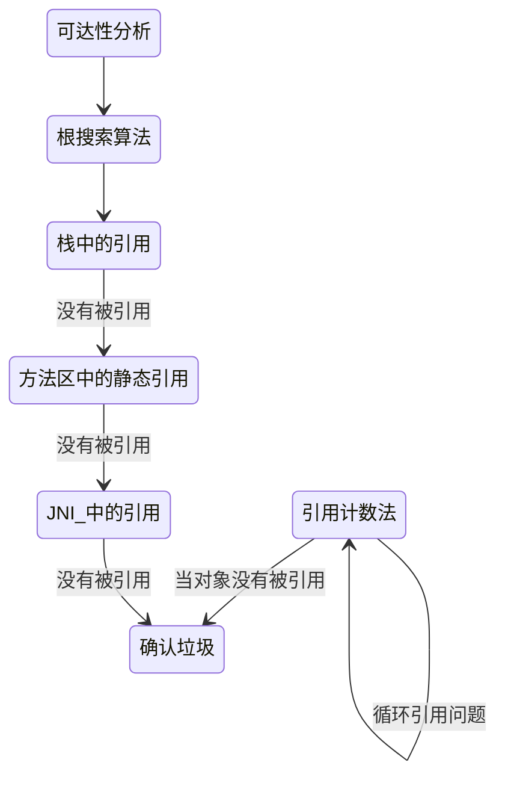
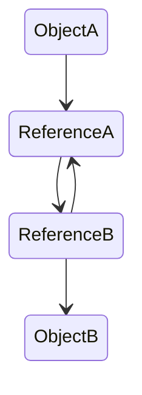

## 确定对象可被回收

Java 采用引用计数法和可达性分析来确定对象是否应该被回收, 引用计数法容易产生循环引用的问题, 可达性分析通过根搜索算法 (GC Roots Tracing) 以一系列 GC Roots 的点作为起点向下搜索, 在一个对象到任何 GC Roots 都没有引用链相连时, 可以被回收. 根搜索算法主要针对栈中的引用, 方法区中的静态引用和 JNI 中的引用展开分析

简单的图示

<!-- more -->

### 引用计数法

在 Java 中如果要操作对象, 就必须先获取该对象的引用, 因此可以通过引用计数法来判断一个对象是否可以被回收. 在为对象添加一个引用时, 引用计数加 1. 在为对象删除一个引用时, 引进计数减 1. 如果一个对象的引用计数为 0, 则表示此刻该对象没有被引用, 可以被回收

引用计数法容易产生循环引用问题. 循环引用指两个对象相互引用, 导致它们的引用一直存在, 而不能被回收

### 可达性分析

为了解决引用计数法的循环引用问题, Java 还采用了可达性分析来判断对象是否可以被回收. 具体做法是首先定义一些 GC Roots 对象, 然后以这些 GC Roots 对象作为起点向下搜索, 如果在 GC roots 和一个对象之间没有可达路径, 则称该对象是不可达的. 不可达对象要经过至少两次标记才能判定其是否可以被回收, 如果在两次标记后该对象仍然是不可达的, 则将被垃圾收集器回收

## 垃圾回收算法

常用的垃圾回收算法

- 标记清除 (Mark-Sweep) : 过程分为标记和清除两个阶段
  - 效率低
  - 内存碎片多
- 复制 (Copying) : 为了解决标记清除算法内存碎片化的问题, 从 Eden 区和 Servivor From 区复制到 Servivor To 区, 然后清理 Eden 区和 ServivorFrom 区的内存空间
  - 可用的内存空间被压缩
  - 当有大量长时间存活的对象时效率低
- 标记整理 (Mark-Compact) : 标记完成后将存活的对象移到内存的另一端, 然后清除该端的对象并释放内存
- 分代收集 (Generational Collecting) : 根据不同对象类型划分为新生代和老年代并使用不同的垃圾回收算法
  - 新生代主要存放新生成的对象, 其特点是对象数量多但是生命周期短, 在每次进行垃圾回收时都有大量的对象被回收, 采用了复制算法
  - 老年代主要存放大对象和生命周期长的对象, 因此可回收的对象相对较少, 采用标记清除算法
- 分区收集算法: 将整个堆空间划分为连续的大小不同的小区域, 对每个小区域都单独进行内存使用和垃圾回收
  - 灵活使用和释放内存
  - 缩短垃圾回收时系统停顿的时间
  - 多次并行累加的方式逐步完成整个内存区域的垃圾回收

JVM 内存中的对象主要被分配到新生代的 Eden 区和 ServivorFrom 区, 在少数情况下会被直接分配到老年代. 在新生代的 Eden 区和 ServivorFrom 区的内存空间不足时会触发一次 GC, 该过程被称为 MinorGC. 在 MinorGC 后, 在 Eden 区和 ServivorFrom 区中存活的对象会被复制到 ServivorTo 区, 然后 Eden 区和 ServivorFrom 区被清理. 如果此时在 ServivorTo 区无法找到连续的内存空间存储某个对象, 则将这个对象直接存储到老年代. 若 Servivor 区的对象经过一次 GC 后仍然存活, 则其年龄加 1. 在默认情况下, 对象在年龄达到 15 时, 将被移到老年代

## 垃圾收集器

- 新生代
  - Serial 单线程复制算法: 必须暂停其他所有工作线程, 是 Java 虚拟机运行在 Client 模式下的新生代的默认垃圾收集器
  - ParNew 多线程复制算法: 采用多线程模式工作, 除此之外和 Serial 收集器几乎一样, 是 Java 虚拟机运行在 Server 模式下的新生代的默认垃圾收集器, 启动时可通过 `-XX:ParallelGCThreads` 参数调节 ParNew 垃圾收集器的工作线程数
  - Parallel Scavenge 多线程复制算法: 通过自适应调节策略提高系统吞吐量, 提供了三个参数用于调节、控制垃圾回收的停顿时间及吞吐量, 分别是控制最大垃圾收集停顿时间的 `-XX:MaxGCPauseMillis` 参数, 控制吞吐量大小的 `-XX:GCTimeRatio` 参数和控制自适应调节策略开启与否的 `UseAdaptiveSizePolicy` 参数
- 老年代
  - CMS 多线程标记清除算法: 老年代垃圾收集器, 主要目的是达到最短的垃圾回收停顿时间, 在多线程并发环境下以最短的垃圾收集停顿时间提高系统的稳定性
    - 初始标记：只标记和 GC Roots 直接关联的对象, 速度快, 需要暂停所有工作线程
    - 并发标记：和用户线程一起工作, 执行 GC Roots 跟踪标记过程, 不需要暂停工作线程
    - 重新标记：在并发标记过程中用户线程继续运行, 导致在垃圾回收过程中部分对象的状态发生变化, 为了确保这部分对象的状态正确性, 需要对其重新标记并暂停工作线程
    - 并发清除：和用户线程一起工作, 执行清除 GC Roots 不可达对象的任务, 不需要暂停工作线程
  - Serial Old 单线程标记整理算法: 是 JVM 运行在 Client 模式下的老年代的默认垃圾收集器
  - Parallel Old 多线程标记整理算法: 优先考虑系统吞吐量, 其次考虑停顿时间等因素
  - G1 多线程标记整理算法: 将堆内存划分为大小固定的几个独立区域, 独立使用这些区域的内存资源并且跟踪这些区域的垃圾收集进度, 同时在后台维护一个优先级列表, 在垃圾回收过程中根据系统允许的最长垃圾收集时间, 优先回收垃圾最多的区域, 通过内存区域独立划分使用和根据不同优先级回收各区域垃圾的机制, 确保在有限时间内获得最高的垃圾收集效率。相对于 CMS 收集器, G1 垃圾收集器两个突出的改进
    - 基于标记整理算法, 不产生内存碎片
    - 可以精确地控制停顿时间, 在不牺牲吞吐量的前提下实现短停顿垃圾回收
