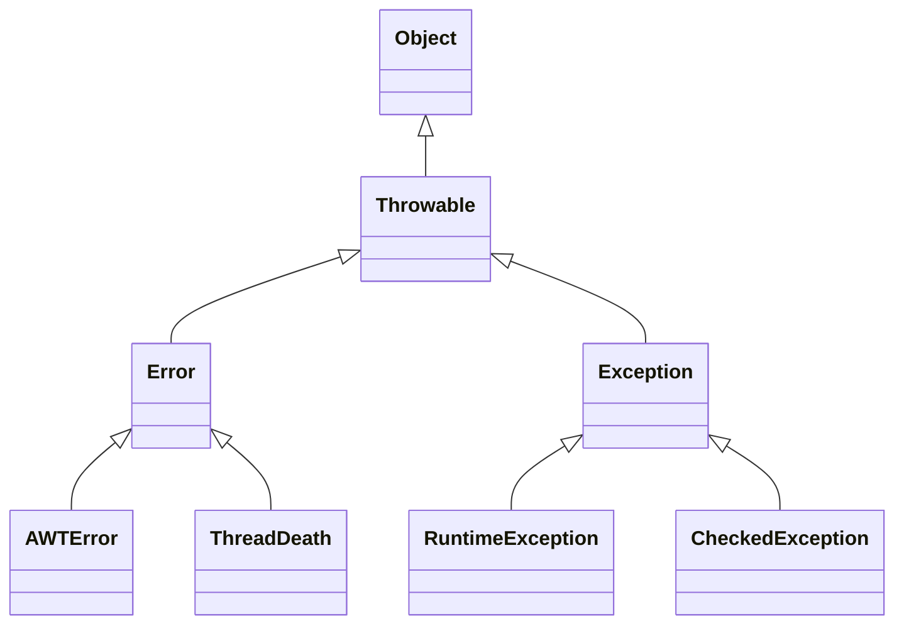

## 简介

异常指在方法不能按照正常方式完成时, 可以通过抛出异常的方式退出该方法, 在异常中封装了方法执行过程中的错误信息及原因, 调用方在获取该异常后可根据业务的情况选择处理该异常或者继续抛出该异常

在方法在执行过程中出现异常时, Java 异常处理机制会将代码的执行权交给异常处理器, 异常处理器根据在系统中定义的异常处理规则执行不同的异常处理逻辑 (抛出异常或捕捉并处理异常)

<!-- more -->

## 分类

`Throwable` 是所有错误或异常的父类, `Throwable` 又可分为 `Error` 和 `Exception`, 常见的 `Error` 有 `AWTError`, `ThreadDeath`, `Exception` 又可分为 `RuntimeException` 和 `CheckedException`

- `Error`: Java 程序运行错误, 如果程序在启动时出现 `Error`, 则启动失败；如果程序在运行过程中出现 `Error`, 则系统将退出进程, 出现 `Error` 通常是因为系统的内部错误或资源耗尽, `Error` 不能被在运行过程中被动态处理, 如果程序出现 `Error`, 则系统能做的工作也只能有记录错误的成因和安全终止
- `Exception` 指 Java 程序运行异常, 即运行中的程序发生了人们不期望发生的事件, 可以被 Java 异常处理机制处理, `Exception` 也是程序开发中异常处理的核心, 可分为 `RuntimeException` (运行时异常) 和 `CheckedException` (检查异常)
  - `RuntimeException`: 指在 Java 虚拟机正常运行期间抛出的异常, `RuntimeException` 可以被捕获并处理, 如果出现 `RuntimeException`, 那么一定是程序发生错误导致的, 我们通常需要抛出该异常或者捕获并处理该异常, 常见的 `RuntimeException` 有 `NullPointerException`, `ClassCastException`, `ArrayIndexOutOf`, `BundsException` 等
  - `CheckedException`: 指在编译阶段 Java 编译器会检查 `CheckedException` 异常并强制程序捕获和处理此类异常, 即要求程序在可能出现异常的地方通过 `try catch` 语句块捕获并处理异常, 常见的 `CheckedException` 有由于 `I/O` 错误导致的 `IOException`, `SQLException`, `ClassNotFoundException` 等, 该类异常一般由于打开错误的文件, `SQL` 语法错误, 类不存在等引起

## 处理

- 抛出异常: 遇到异常时不进行具体处理, 而是将异常抛给调用者, 抛出异常有三种形式: `throws`, `throw`, 系统自动抛出异常
  - `throw`: 作用在方法内, 表示明确抛出一个异常, 在执行到 `throw` 时后续的代码将不再执行, 而是跳转到调用者, 并将异常信息抛给调用者
  - `throws`: 作用在方法上, 用于定义方法可能抛出的异常, 用来声明方法在运行过程中可能出现的异常, 以便调用者根据不同的异常类型预先定义不同的处理方式
- 使用 `try catch` 捕获并处理异常: 针对性地处理每种可能出现的异常, 并在捕获到异常后根据不同的情况做不同的处理
