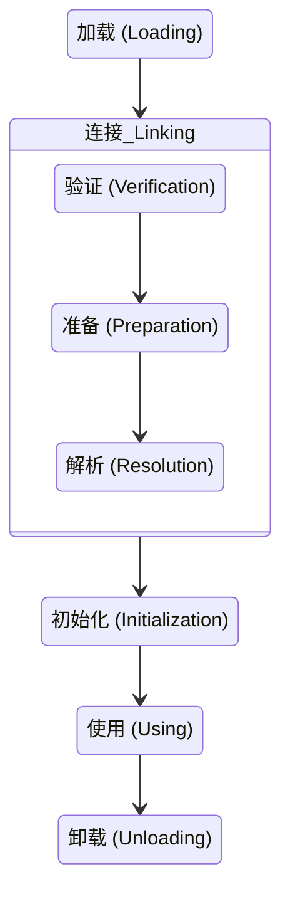

## 简介

JVM 的类加载分为 `5` 个阶段: 加载, 验证, 准备, 解析, 初始化, 在类初始化完成后就可以使用该类的信息, 在一个类不再被需要时可以从 JVM 中卸载

<!-- more -->

## 过程

### 加载

JVM 读取 Class 文件, 并且根据 Class 文件描述创建 `java.lang.Class` 对象, 类加载过程主要包含将 Class 文件读取到运行时区域的方法区内, 在堆中创建 `java.lang.Class` 对象, 并封装类在方法区的数据结构的过程, 在读取 Class 文件时既可以通过文件的形式读取, 也可以通过 jar 包, war 包读取, 还可以通过代理自动生成 Class 或其他方式读取

### 验证

用于确保 Class 文件符合当前虚拟机的要求, 保障虚拟机自身的安全, 只有通过验证的 Class 文件才能被 JVM 加载

### 准备

在方法区中为类变量分配内存空间并设置类中变量的初始值, 初始值指不同数据类型的默认值, 这里需要注意 final 类型的变量和非 final 类型的变量在准备阶段的数据初始化过程不同

- `public static int v = 1;` 静态变量 `v` 在准备阶段的初始值是 `0`, 将 `v` 设置为 `1` 的动作是在对象初始化时完成的, 因为 JVM 在编译阶段会将静态变量的初始化操作定义在构造器中, 这里的初始值指的是类型的初始值, `int` 型初始值为 `0`
- `public static final int v = 1;` `final` 类型的变量 `v` 生成其对应的 `ConstantValue` 属性, 虚拟机在准备阶段会根据 `ConstantValue` 属性将 `v` 赋值为 `1`

### 解析

将常量池中的符号引用替换为直接引用

### 初始化

通过执行类构造器的 `<client>` 方法为类进行初始化, `<client>` 方法是在编译阶段由编译器自动收集类中静态语句块和变量的赋值操作组成的, JVM 规定, 只有在父类的 `<client>` 方法都执行成功后, 子类中的 `<client>` 方法才可以被执行, 在一个类中既没有静态变量赋值操作也没有静态语句块时, 编译器不会为该类生成 `<client>` 方法,

在发生以下几种情况时, JVM 不会执行类的初始化流程

- 常量在编译时会将其常量值存入使用该常量的类的常量池中, 该过程不需要调用常量所在的类, 因此不会触发该常量类的初始化
- 在子类引用父类的静态字段时, 不会触发子类的初始化, 只会触发父类的初始化
- 定义对象数组, 不会触发该类的初始化
- 在使用类名获取 `Class` 对象时不会触发类的初始化
- 在使用 `Class.forName` 加载指定的类时, 可以通过 `initialize` 参数设置是否需要对类进行初始化
- 在使用 `ClassLoader` 默认的 `loadClass` 方法加载类时不会触发该类的初始化
