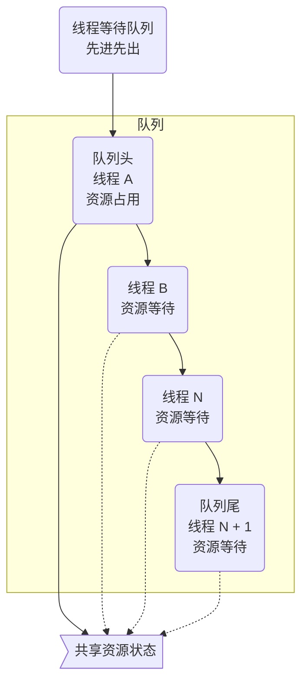

## 简介

AQS (Abstract Queued Synchronizer) 是一个抽象的队列同步器, 通过维护一个共享资源状态 (Volatile Int State) 和一个先进先出 (FIFO) 的线程等待队列来实现一个多线程访问共享资源的同步框架

## 原理

AQS 为每个共享资源都设置一个共享资源锁, 线程在需要访问共享资源时首先需要获取共享资源锁, 如果获取到了共享资源锁, 便可以在当前线程中使用该共享资源, 如果获取不到, 则将该线程放入线程等待队列, 等待下一次资源调度



<!-- more -->

## state

Abstract Queued Synchronizer 维护了一个 `volatile int` 类型的变量, 用于表示当前的同步状态, Volatile 虽然不能保证操作的原子性, 但是能保证当前变量 state 的可见性

state 的访问方式有三种: `getState()`, `setState()` 和 `compareAndSetState()`, 均是原子操作, 其中, compareAndSetState 的实现依赖于 Unsafe 的 `compareAndSwapInt()`

```java
// 返回 volatile int 类型的状态, 原子读操作
protected final int getState() {
  return state;
}
// 设置共享资源状态, volatile int 原子写操作
protected final void setState(int newState) {
  state = newState;
}
// 如果当前状态值等于预期值, 自动将同步状态设置为给定的更新值
// volatile int 原子读写操作
protected final boolean compareAndSetState(int expect, int update) {
  return unsafe.compareAndSwapInt(this, stateOffset, expect, update)
}
```

## 共享资源方式

- 独占式: 只有一个线程能执行, 具体的 Java 实现有 ReentrantLock
- 共享式: 多个线程可同时执行, 具体 的 Java 实现有 Semaphore 和 CountDownLatch

## 实现方法

AQS 只是一个框架, 只定义了一个接口, 具体资源的获取, 释放都交由自定义同步器去实现, 不同的自定义同步器争用共享资源的方式也不同, 自定义同步器在实现时只需实现共享资源 state 的获取与释放方式即可, 至于具体线程等待队列的维护, 如获取资源失败入队, 唤醒出队等, AQS 已经在顶层实现好, 不需要具体的同步器再做处理

| 方法名 | 资源共享方式 | 说明 |
| -- | -- | -- |
| isHeldExclusively() | | 查询该线程是否正在独占资源, 只有用到 condition 才需要去实现 |
| tryAcquire(int) | 独占 | 尝试获取资源, 成功返回 `true`, 失败返回 `false` |
| tryRelease(int) | 独占 | 尝试释放资源, 成功返回 `true`, 失败返回 `false` |
| tryAcquireShared(int) | 共享 | 尝试获取资源, 负数表示失败, `0` 表示成功但是没有剩余可用资源, 正数表示成功且有剩余资源 |
| tryReleaseShared(int) | 共享 | 尝试释放资源, 如果释放资源后允许唤醒后续等待线程, 则返回 `true`, 否则返回 `false` |

同步器的实现是 AQS 的核心内存

- ReentrantLock: 独占方式实现 ReentrantLock 中的 state 初始值为 `0` 时表示无锁状态, 在线程执行 `tryAcquire()` 获取该锁后 ReentrantLock 中的 `state+1`, 这时该线程独占 ReentrantLock 锁, 其他线程在通过 `tryAcquire()` 获取锁时均会失败, 直到该线程释放锁后 state 再次为 `0`, 其他线程才有机会获取该锁, 该线程在释放锁之前可以重复获取此锁, 每获取一次便会执行一次 `state+1`, 因此 ReentrantLock 也属于可重入锁, 但获取多少次锁就要释放多少次锁, 这样才能保证 state 最终为 `0`, 如果获取锁的次数多于释放锁的次数, 则会出现该线程一直持有该锁的情况, 如果获取锁的次数少于释放锁的次数, 则运行中的程序会报锁异常
- CountDownLatch: 共享方式实现将任务分为 `N` 个子线程去执行, 将 state 也初始化为 `N`, `N` 与线程的个数一致, `N` 个子线程是并行执行的, 每个子线程都在执行完成后 `countDown()` 一次, state 会执行 CAS 操作并减 `1`, 在所有子线程都执行完成 (`state=0`) 时会 `unpark()` 主线程, 然后主线程会从 `await()` 返回, 继续执行后续的动作

## 小结

一般来说, 自定义同步器要么采用独占方式, 要么采用共享方式, 实现类只需实现 tryAcquire, tryRelease 或 tryAcquireShared, tryReleaseShared 中的一组即可, 但 AQS 也支持自定义同步器同时实现独占和共享两种方式, 例如 ReentrantReadWriteLock 在读取时采用了共享方式, 在写入时采用了独占方式
