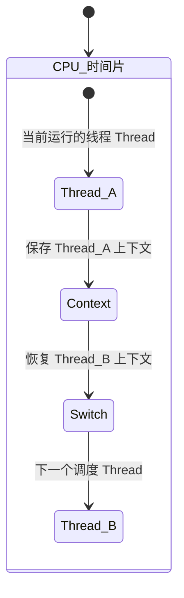

## 简介

CPU 利用时间片轮询来为每个任务都服务一定的时间, 然后把当前任务的状态保存下来, 继续服务下一个任务, 任务的状态保存及再加载就叫作线程的上下文切换

- 进程: 指一个运行中的程序的实例, 在一个进程内部可以有多个线程在同时运行, 并与创建它的进程共享同一地址空间 (一段内存区域) 和其他资源
- 上下文: 指线程切换时 CPU 寄存器和程序计数器所保存的当前线程的信息
- 寄存器: 指 CPU 内部容量较小但速度很快的内存区域 (与之对应的是 CPU 外部相对较慢的 RAM 主内存) , 寄存器通过对常用值 (通常是运算的中间值) 的快速访问来加快计算机程序运行的速度
- 程序计数器: 是一个专用的寄存器, 用于表明指令序列中 CPU 正在执行的位置, 存储的值为正在执行的指令的位置或者下一个将被执行的指令的位置, 这依赖于特定的系统

<!-- more -->

## 上下文切换

上下文切换指的是内核 (操作系统的核心) 在 CPU 上对进程或者线程进行切换, 上下文切换过程中的信息被保存在进程控制块 (PCB-Process Control Block) 中, PCB 又被称作切换桢 (SwitchFrame) , 上下文切换的信息会一直被保存在 CPU 的内存中, 直到被再次使用, 上下文的切换流程如下

- 挂起一个进程, 将这个进程在 CPU 中的状态 (上下文信息) 存储于内存的 PCB 中
- 在 PCB 中检索下一个进程的上下文并将其在 CPU 的寄存器中恢复
- 跳转到程序计数器所指向的位置 (即跳转到进程被中断时的代码行) 并恢复该进程

时间片轮转方式使多个任务在同一 CPU 上的执行有了可能

## 引起线程上下文切换的原因

- 当前正在执行的任务完成, 系统的 CPU 正常调度下一个任务
- 当前正在执行的任务遇到 I/O 等阻塞操作, 调度器挂起此任务, 继续调度下一个任务
- 多个任务并发抢占锁资源, 当前任务没有抢到锁资源, 被调度器挂起, 继续调度下一个任务
- 用户的代码挂起当前任务, 比如线程执行 sleep 方法, 让出 CPU
- 硬件中断
