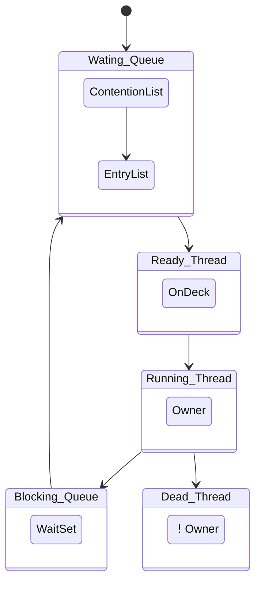

## 简介

Java 中的锁主要用于保障多并发线程情况下数据的一致性, 在需要保障数据的一致性的对象或者方法之前加锁, 这时如果有其他线程也需要使用该对象或者该方法, 则首先要获得锁, 如果某个线程发现锁正在被其他线程使用, 就会进入阻塞队列等待锁的释放, 直到其他线程执行完成并释放锁, 该线程才有机会再次获取锁进行操作, 这样就保障了在同一时刻只有一个线程持有该对象的锁并修改对象, 从而保障数据的安全

锁从乐观和悲观的角度可分为乐观锁和悲观锁, 从获取资源的公平性角度可分为公平锁和非公平锁, 从是否共享资源的角度可分为共享锁和独占锁, 从锁的状态的角度可分为偏向锁, 轻量级锁和重量级锁, 在 JVM 中还巧妙设计了自旋锁以更快地使用 CPU 资源

<!-- more -->

## 乐观锁

乐观锁采用乐观的思想处理数据, 在每次读取数据时都认为别人不会修改该数据, 所以不会上锁, 但在更新时会判断在此期间别人有没有更新该数据, 通常采用在写时先读出当前版本号然后加锁的方法, 具体过程为: 比较当前版本号与上一次的版本号, 如果版本号一致, 则更新, 如果版本号不一致, 则重复进行读, 比较, 写操作

Java 中的乐观锁大部分是通过 CAS (Compare And Swap, 比较和交换) 操作实现的, CAS 是一种原子更新操作, 在对数据操作之前首先会比较当前值跟传入的值是否一样, 如果一样则更新, 否则不执行更新操作, 直接返回失败状态

## 悲观锁

悲观锁采用悲观思想处理数据, 在每次读取数据时都认为别人会修改数据, 所以每次在读写数据时都会上锁, 这样别人想读写这个数据时就会阻塞, 等待直到拿到锁

Java 中的悲观锁大部分基于 AQS (Abstract Queued Synchronized, 抽象的队列同步器) 架构实现, AQS 定义了一套多线程访问共享资源的同步框架, 许多同步类的实现都依赖于它, 例如常用的 Synchronized, ReentrantLock, Semaphore, CountDownLatch 等, 该框架下的锁会先尝试以 CAS 乐观锁去获取锁, 如果获取不到, 则会转为悲观锁 (如 RetreenLock)

## 自旋锁

如果持有锁的线程能在很短的时间内释放锁资源, 那么那些等待竞争锁的线程就不需要做内核态和用户态之间的切换进入阻塞, 挂起状态, 只需等一等 (也叫作自旋) , 在等待持有锁的线程释放锁后即可立即获取锁, 这样就避免了用户线程在内核状态的切换上导致的锁时间消耗

线程在自旋时会占用 CPU, 在线程长时间自旋获取不到锁时, 将会产 CPU 的浪费, 甚至有时线程永远无法获取锁而导致 CPU 资源被永久占用, 所以需要设定一个自旋等待的最大时间, 在线程执行的时间超过自旋等待的最大时间后, 线程会退出自旋模式并释放其持有的锁

- 优点: 可以减少 CPU 上下文的切换, 对于占用锁的时间非常短或锁竞争不激烈的代码块来说性能大幅度提升, 因为自旋的 CPU 耗时明显少于线程阻塞, 挂起, 再唤醒时两次 CPU 上下文切换所用的时间
- 缺点: 在持有锁的线程占用锁时间过长或锁的竞争过于激烈时, 线程在自旋过程中会长时间获取不到锁资源, 将引起 CPU 的浪费, 所以在系统中有复杂锁依赖的情况下不适合采用自旋锁

JDK 的不同版本所采用的自旋周期不同, JDK 1.5 为固定时间, JDK 1.6 引入了适应性自旋锁, 适应性自旋锁的自旋时间不再是固定值, 而是由上一次在同一个锁上的自旋时间及锁的拥有者的状态来决定的, 可基本认为一个线程上下文切换的时间是就一个最佳时间

## synchronized

synchronized 关键字用于为 Java 对象, 方法, 代码块提供线程安全的操作, synchronized 属于独占式的悲观锁, 同时属于可重入锁, 在使用 synchronized 修饰对象时, 同一时刻只能有一个线程对该对象进行访问；在 synchronized 修饰方法, 代码块时, 同一时刻只能有一个线程执行该方法体或代码块, 其他线程只有等待当前线程执行完毕并释放锁资源后才能访问该对象或执行同步代码块

Java 中的每个对象都有个 monitor 对象, 加锁就是在竞争 monitor 对象, 对代码块加锁是通过在前后分别加上 monitorenter 和 monitorexit 指令实现的, 对方法是否加锁是通过一个标记位来判断的

### 作用范围

- 作用于成员变量和非静态方法时, 锁住的是对象的实例, 即 this 对象
- 作用于静态方法时, 锁住的是 Class 实例, 因为静态方法属于 Class 而不属于对象
- 作用于一个代码块时, 锁住的是所有代码块中配置的对象

### 实现原理

在 synchronized 内部包括 ContentionList, EntryList, WaitSet, OnDeck, Owner,  `!Owner` 这 6 个区域, 每个区域的数据都代表锁的不同状态

- ContentionList: 锁竞争队列, 所有请求锁的线程都被放在竞争队列中
- EntryList: 竞争候选列表, 在 Contention List 中有资格成为候选者来竞争锁资源的线程被移动到了 Entry List 中
- WaitSet: 等待集合, 调用 wait 方法后被阻塞的线程将被放在 WaitSet 中
- OnDeck: 竞争候选者, 在同一时刻最多只有一个线程在竞争锁资源, 该线程的状态被称为 OnDeck
- Owner: 竞争到锁资源的线程被称为 Owner 状态线程
- `!Owner`: 在 Owner 线程释放锁后, 会从 Owner 的状态变成 `!Owner`

synchronized 在收到新的锁请求时首先自旋, 如果通过自旋也没有获取锁资源, 则将被放入锁竞争队列 ContentionList 中

为了防止锁竞争时 ContentionList 尾部的元素被大量的并发线程进行 CAS 访问而影响性能, Owner 线程会在释放锁资源时将 ContentionList 中的部分线程移动到 EntryList 中, 并指定 EntryList 中的某个线程 (一般是最先进入的线程) 为 OnDeck 线程, Owner 线程并没有直接把锁传递给 OnDeck 线程, 而是把锁竞争的权利交给 OnDeck, 让 OnDeck 线程重新竞争锁, 在 Java 中把该行为称为 "竞争切换" , 该行为牺牲了公平性, 但提高了性能

获取到锁资源的 OnDeck 线程会变为 Owner 线程, 而未获取到锁资源的线程仍然停留在 EntryList 中

Owner 线程在被 wait 方法阻塞后, 会被转移到 WaitSet 队列中, 直到某个时刻被 notify 方法或者 notifyAll 方法唤醒, 会再次进入 EntryList 中, ContentionList, EntryList, WaitSet 中的线程均为阻塞状态, 该阻塞是由操作系统来完成的 (在 Linux 内核下是采用 pthread_mutex_lock 内核函数实现的)

Owner 线程在执行完毕后会释放锁的资源并变为 `!Owner` 状态

这里使用 ！Owner 是为了能在图表显示

在 synchronized 中, 在线程进入 ContentionList 之前, 等待的线程会先尝试以自旋的方式获取锁, 如果获取不到就进入 ContentionList, 该做法对于已经进入队列的线程是不公平的, 因此 synchronized 是非公平锁, 另外, 自旋获取锁的线程也可以直接抢占 OnDeck 线程的锁资源

synchronized 是一个重量级操作, 需要调用操作系统的相关接口, 性能较低, 给线程加锁的时间有可能超过获取锁后具体逻辑代码的操作时间

JDK 1.6 对 synchronized 做了很多优化, 引入了适应自旋, 锁消除, 锁粗化, 轻量级锁及偏向锁等以提高锁的效率, 锁可以从偏向锁升级到轻量级锁, 再升级到重量级锁, 这种升级过程叫作锁膨胀, 在 JDK 1.6 中默认开启了偏向锁和轻量级锁, 可以通过-XX:UseBiasedLocking 禁用偏向锁

## ReentrantLock

ReentrantLock 继承了 Lock 接口并实现了在接口中定义的方法, 是一个可重入的独占锁, ReentrantLock 通过自定义队列同步器 (Abstract Queued Sychronized, AQS) 来实现锁的获取与释放, 支持公平锁和非公平锁的实现

具体的使用流程是定义一个 ReentrantLock, 在需要加锁的地方通过 lock 方法加锁, 等资源使用完成后再通过 unlock 方法释放锁

ReentrantLock 锁可以反复进入, 即允许连续多次获得同一把锁, 多次释放同一把锁, 获取锁和释放锁的次数要相同, 如果释放锁的次数多于获取锁的次数, Java 就会抛出 java.lang.IllegalMonitorStateException 异常；如果释放锁的次数少于获取锁的次数, 该线程就会一直持有该锁, 其他线程将无法获取锁资源

### 避免死锁

- 响应中断: 在 synchronized 中如果有一个线程尝试获取一把锁, 则其结果是要么获取锁继续执行, 要么保持等待, ReentrantLock 还提供了可响应中断的可能, 即在等待锁的过程中, 线程可以根据需要取消对锁的请求
- 可轮询锁: 通过 boolean tryLock()获取锁, 如果有可用锁, 则获取该锁并返回 `true`, 如果无可用锁, 则立即返回 `false`
- 定时锁: 通过 boolean tryLock (long time,TimeUnit unit) throws InterruptedException 获取定时锁, 如果在给定的时间内获取到了可用锁, 且当前线程未被中断, 则获取该锁并返回 `true`, 如果在给定的时间内获取不到可用锁, 将禁用当前线程, 并且在发生以下三种情况之前, 该线程一直处于休眠状态
  - 当前线程获取到了可用锁并返回 `true`
  - 当前线程在进入此方法时设置了该线程的中断状态, 或者当前线程在获取锁时被中断, 则将抛出 InterruptedException, 并清除当前线程的已中断状态
  - 当前线程获取锁的时间超过了指定的等待时间, 则将返回 `false`, 如果设定的时间小于等于 0, 则该方法将完全不等待

### 主要方法

- `void lock()`: 给对象加锁, 如果锁未被其他线程使用, 则当前线程将获取该锁；如果锁正在被其他线程持有, 则将禁用当前线程, 直到当前线程获取锁
- `boolean tryLock()`: 试图给对象加锁, 如果锁未被其他线程使用, 则将获取该锁并返回 `true`, 否则返回 `false`, `tryLock()` 和 `lock()` 的区别在于 `tryLock()` 只是 "试图" 获取锁, 如果没有可用锁, 就会立即返回, `lock()` 在锁不可用时会一直等待, 直到获取到可用锁
- `tryLock(long timeout TimeUnit unit)` : 创建定时锁, 如果在给定的等待时间内有可用锁, 则获取该锁
- `void unlock()`: 释放当前线程所持有的锁, 锁只能由持有者释放, 如果当前线程并不持有该锁却执行该方法, 则抛出异常
- `Condition newCondition()`: 创建条件对象, 获取等待通知组件, 该组件和当前锁绑定, 当前线程只有获取了锁才能调用该组件的 `await()`, 在调用后当前线程将释放锁
- `getHoldCount()`: 查询当前线程保持此锁的次数, 也就是此线程执行 lock 方法的次数
- `getQueueLength()`: 返回等待获取此锁的线程估计数, 比如启动 5 个线程, 1 个线程获得锁, 此时返回 4
- `getWaitQueueLength(Condition condition)` : 返回在 Condition 条件下等待该锁的线程数量, 比如有 5 个线程用同一个 condition 对象, 并且这 5 个线程都执行了 condition 对象的 await 方法, 那么执行此方法将返回 5
- `hasWaiters(Condition condition)` : 查询是否有线程正在等待与给定条件有关的锁, 即对于指定的 contidion 对象, 有多少线程执行了 `condition.await` 方法
- `hasQueuedThread(Thread thread)` : 查询给定的线程是否等待获取该锁
- `hasQueuedThreads()`: 查询是否有线程等待该锁
- `isFair()`: 查询该锁是否为公平锁
- `isHeldByCurrentThread()`: 查询当前线程是否持有该锁, 线程执行 lock 方法的前后状态分别是 `false` 和 `true`
- `isLock()`: 判断此锁是否被线程占用
- `lockInterruptibly()`: 如果当前线程未被中断, 则获取该锁

ReentrantLock 通过在构造函数 `ReentrantLock(boolean fair)` 中传递不同的参数来定义不同类型的锁, 默认的实现是非公平锁, 这是因为, 非公平锁虽然放弃了锁的公平性, 但是执行效率明显高于公平锁, 如果系统没有特殊的要求, 一般情况下建议使用非公平锁

tryLock, lock 和 lockInterruptibly 区别

- tryLock 若有可用锁, 则获取该锁并返回 `true`, 否则返回 `false`, 不会有延迟或等待；tryLock (long timeout,TimeUnit unit) 可以增加时间限制, 如果超过了指定的时间还没获得锁, 则返回 `false`
- lock 若有可用锁, 则获取该锁并返回 `true`, 否则会一直等待直到获取可用锁
- 在锁中断时 lockInterruptibly 会抛出异常, lock 不会

## synchronized 和 ReentrantLock 比较

- 共同点
  - 都用于控制多线程对共享对象的访问
  - 都是可重入锁
  - 都保证了可见性和互斥性
- 不同点
  - ReentrantLock 显式获取和释放锁；synchronized 隐式获取和释放锁, 为了避免程序出现异常而无法正常释放锁, 在使用 ReentrantLock 时必须在 finally 控制块中进行解锁操作
  - ReentrantLock 可响应中断, 可轮回, 为处理锁提供了更多的灵活性
  - ReentrantLock 是 API 级别的, synchronized 是 JVM 级别的
  - ReentrantLock 可以定义公平锁
  - ReentrantLock 通过 Condition 可以绑定多个条件
  - 二者的底层实现不一样: synchronized 是同步阻塞, 采用的是悲观并发策略；Lock 是同步非阻塞, 采用的是乐观并发策略
  - Lock 是一个接口, 而 synchronized 是 Java 中的关键字, synchronized 是由内置的语言实现的
  - 我们通过 Lock 可以知道有没有成功获取锁, 通过 synchronized 却无法做到
  - Lock 可以通过分别定义读写锁提高多个线程读操作的效率

## Atomic

在多线程程序中, 诸如 `++i` 或 `i++` 等运算不具有原子性, 因此不是安全的线程操作, 可以通过 synchronized 或 ReentrantLock 将该操作变成一个原子操作, 但是 synchronized 和 ReentrantLock 均属于重量级锁, 因此 JVM 为此类原子操作提供了一些原子操作同步类, 使得同步操作 (线程安全操作) 更加方便, 高效, 它们便是 AtomicBoolean, AtomicInteger, AtomicLong, AtomicReference, 它们的实现原理相同, 区别在于运算对象的类型不同, 还可以通过 `AtomicReference<V>` 将一个对象的所有操作都转化成原子操作, AtomicInteger 的性能通常是 synchronized 和 ReentrantLock 的好几倍

## 可重入锁

可重入锁也叫作递归锁, 指在同一线程中, 在外层函数获取到该锁之后, 内层的递归函数仍然可以继续获取该锁, 在 Java 环境下, ReentrantLock 和 synchronized 都是可重入锁

## 公平锁与非公平锁

- 公平锁 (Fair Lock) 指在分配锁前检查是否有线程在排队等待获取该锁, 优先将锁分配给排队时间最长的线程
- 非公平锁 (Nonfair Lock) 指在分配锁时不考虑线程排队等待的情况, 直接尝试获取锁, 在获取不到锁时再排到队尾等待

因为公平锁需要在多核的情况下维护一个锁线程等待队列, 基于该队列进行锁的分配, 因此效率比非公平锁低很多, Java 中的 synchronized 是非公平锁, ReentrantLock 默认的 lock 方法采用的是非公平锁

## 读写锁

在 Java 中通过 Lock 接口及对象可以方便地为对象加锁和释放锁, 但是这种锁不区分读写, 叫作普通锁, 为了提高性能, Java 提供了读写锁, 读写锁分为读锁和写锁两种, 多个读锁不互斥, 读锁与写锁互斥, 在读的地方使用读锁, 在写的地方使用写锁, 在没有写锁的情况下, 读是无阻塞的

一般做法是分别定义一个读锁和一个写锁, 在读取共享数据时使用读锁, 在使用完成后释放读锁, 在写共享数据时使用写锁, 在使用完成后释放写锁, 在 Java 中, 通过读写锁的接口 `java.util.concurrent.locks.ReadWriteLock` 的实现类 `ReentrantReadWriteLock` 来完成对读写锁的定义和使用

## 共享锁和独占锁

- 独占锁: 也叫互斥锁, 每次只允许一个线程持有该锁, ReentrantLock 为独占锁的实现
- 共享锁: 允许多个线程同时获取该锁, 并发访问共享资源, ReentrantReadWriteLock 中的读锁为共享锁的实现

ReentrantReadWriteLock 的加锁和解锁操作最终都调用内部类 Sync 提供的方法, Sync 对象通过继承 AQS (Abstract Queued Synchronizer) 进行实现, AQS 的内部类 Node 定义了两个常量 SHARED 和 EXCLUSIVE, 分别标识 AQS 队列中等待线程的锁获取模式

独占锁是一种悲观的加锁策略, 同一时刻只允许一个读线程读取锁资源, 限制了读操作的并发性；因为并发读线程并不会影响数据的一致性, 因此共享锁采用了乐观的加锁策略, 允许多个执行读操作的线程同时访问共享资源

## 重量级锁和轻量级锁

synchronized 在内部基于监视器锁 (Monitor) 实现, 监视器锁基于底层的操作系统的 Mutex Lock 实现, 因此 synchronized 属于重量级锁, 重量级锁需要在用户态和核心态之间做转换, 所以 synchronized 的运行效率不高

JDK 在 1.6 版本以后, 为了减少获取锁和释放锁所带来的性能消耗及提高性能, 引入了轻量级锁和偏向锁

- 重量级锁: 基于操作系统的互斥量 (Mutex Lock) 而实现的锁, 会导致进程在用户态与内核态之间切换, 相对开销较大
- 轻量级锁: 相对于重量级锁, 核心设计是在没有多线程竞争的前提下, 减少重量级锁的使用以提高系统性能, 轻量级锁适用于线程交替执行同步代码块的情况 (即互斥操作) , 如果同一时刻有多个线程访问同一个锁, 则将会导致轻量级锁膨胀为重量级锁

## 偏向锁

除了在多线程之间存在竞争获取锁的情况, 还会经常出现同一个锁被同一个线程多次获取的情况, 偏向锁用于在某个线程获取某个锁之后, 消除这个线程锁重入的开销, 看起来似乎是这个线程得到了该锁的偏向 (偏袒)

偏向锁的主要目的是在同一个线程多次获取某个锁的情况下尽量减少轻量级锁的执行路径, 因为轻量级锁的获取及释放需要多次 CAS (Compare and Swap) 原子操作, 而偏向锁只需要在切换 ThreadID 时执行一次 CAS 原子操作, 因此可以提高锁的运行效率

在出现多线程竞争锁的情况时, JVM 会自动撤销偏向锁, 因此偏向锁的撤销操作的耗时必须少于节省下来的 CAS 原子操作的耗时

## 分段锁

分段锁并非一种实际的锁, 而是一种思想, 用于将数据分段并在每个分段上都单独加锁, 把锁进一步细粒度化, 以提高并发效率, ConcurrentHashMap 在内部就是使用分段锁实现的

## 同步锁与死锁

在有多个线程同时被阻塞时, 它们之间若相互等待对方释放锁资源, 就会出现死锁, 为了避免出现死锁, 可以为锁操作添加超时时间, 在线程持有锁超时后自动释放该锁

## 小结

轻量级锁用于提高线程交替执行同步块时的性能, 偏向锁则在某个线程交替执行同步块时进一步提高性能

锁的状态总共有 4 种: 无锁, 偏向锁, 轻量级锁和重量级锁, 随着锁竞争越来越激烈, 锁可能从偏向锁升级到轻量级锁, 再升级到重量级锁, 但在 Java 中锁只单向升级, 不会降级

在实际应用中, 应该要尽可能对锁进行优化

- 减少锁持有的时间: 只在有线程安全要求的程序上加锁来尽量减少同步代码块对锁的持有时间
- 减小锁粒度: 将单个耗时较多的锁操作拆分为多个耗时较少的锁操作来增加锁的并行度, 减少同一个锁上的竞争, 在减少锁的竞争后, 偏向锁, 轻量级锁的使用率才会提高, 减小锁粒度最典型的案例就是 ConcurrentHashMap 中的分段锁
- 锁分离: 根据不同的应用场景将锁的功能进行分离, 以应对不同的变化, 最常见的锁分离思想就是读写锁 (ReadWriteLock) , 它根据锁的功能将锁分离成读锁和写锁, 这样读读不互斥, 读写互斥, 写写互斥, 既保证了线程的安全性, 又提高了性能, 操作分离思想可以进一步延伸为只要操作互不影响, 就可以进一步拆分, 比如 LinkedBlockingQueue 从头部取出数据, 并从尾部加入数据
- 锁粗化: 为了保障性能, 会要求尽可能将锁的操作细化以减少线程持有锁的时间, 但是如果锁分得太细, 将会导致系统频繁获取锁和释放锁, 反而影响性能的提升, 在这种情况下, 建议将关联性强的锁操作集中起来处理, 以提高系统整体的效率
- 锁消除: 在开发中经常会出现在不需要使用锁的情况下误用了锁操作而引起性能下降, 这多数是因为程序编码不规范引起的, 这时, 我们需要检查并消除这些不必要的锁来提高系统的性能
