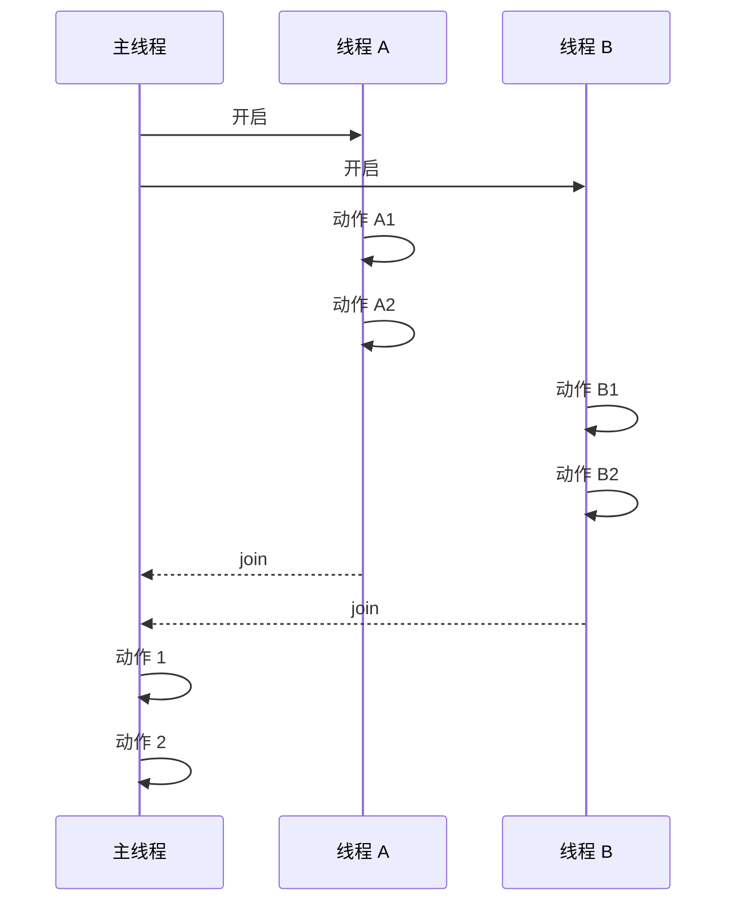

## 原理

`join` 操作的原理是: 阻塞当前的线程, 直到准备合并的目标线程的执行完成

## 流程

在 Java 中, 线程 `Thread` 的合并流程: 线程 A 调用了线程 B 的 `B.join` 方法, 合并 B 线程, 线程 A 进入阻塞状态, 直到 B 线程执行完成或 `join` 方法超时

简单流程如下



<!-- more -->

## 代码描述

```java
@Slf4j
public class JoinDemo {
    public static final int SLEEP = 1000;

    public static String getCurThreadName() {
        return Thread.currentThread().getName();
    }

    static class ThreadA extends Thread {
        ThreadA () {
            super("I am Thread-A");
        }

        @Override
        public void run() {
            try {
                log.info("执行线程 A 动作");
                log.info("动作 A1");
                sleep(SLEEP);
                log.info("动作 A2");
                sleep(SLEEP);
            } catch (InterruptedException e) {
                e.printStackTrace();
                log.error(e.getLocalizedMessage());
            }
        }
    }

    static class ThreadB extends Thread {
        ThreadB () {
            super("I am Thread-B");
        }

        @Override
        public void run() {
            try {
                log.info("执行线程 B 动作");
                log.info("动作 B1");
                sleep(SLEEP);
                log.info("动作 B2");
                sleep(SLEEP);
            } catch (InterruptedException e) {
                e.printStackTrace();
                log.error(e.getLocalizedMessage());
            }
        }
    }

    public static void main(String[] args) {
        ThreadA threadA = new ThreadA();
        ThreadB threadB = new ThreadB();
        Thread.currentThread().setName("I am MainThread");
        log.info("启动线程 A");
        threadA.start();
        log.info("启动线程 B");
        threadB.start();

        try {
            threadA.join();
            threadB.join();

            log.info("动作 1");
            Thread.sleep(SLEEP);
            log.info("动作 2");
            Thread.sleep(SLEEP);
        } catch (InterruptedException e) {
            e.printStackTrace();
            log.error(e.getLocalizedMessage());
        }
        log.info("运行结束");
    }
}
```

```sh
[I am MainThread] INFO reactor.simple.Join - 启动线程 A
[I am MainThread] INFO reactor.simple.Join - 启动线程 B
[I am Thread-A] INFO reactor.simple.Join - 执行线程 A 动作
[I am Thread-A] INFO reactor.simple.Join - 动作 A1
[I am Thread-B] INFO reactor.simple.Join - 执行线程 B 动作
[I am Thread-B] INFO reactor.simple.Join - 动作 B1
[I am Thread-A] INFO reactor.simple.Join - 动作 A2
[I am Thread-B] INFO reactor.simple.Join - 动作 B2
[I am MainThread] INFO reactor.simple.Join - 动作 1
[I am MainThread] INFO reactor.simple.Join - 动作 2
[I am MainThread] INFO reactor.simple.Join - 运行结束

Process finished with exit code 0
```

## 详情

`join` 方法有三个重载版本:

- `void join()`: A 线程等待 B 线程执行结束后, A 线程重新恢复执行
- `void join(long millis)`: A 线程等待 B 线程执行一段时间, 最长等待时间为 millis 毫秒, 超过 millis 毫秒后, 不论 B 线程是否结束, A 线程重新恢复执行
- `void join(long millis, int nanos)`: 等待 B 线程执行一段时间, 最长等待时间为 millis 毫秒, 加 nanos 纳秒, 超过时间后, 不论 B 线程是否结束, A 线程重新恢复执行

强调一下容易混淆的几点:

- join 是实例方法, 不是静态方法, 需要使用线程对象去调用, 如 `thread.join()`
- join 调用时, 不是线程所指向的目标线程阻塞, 而是当前线程阻塞
- 只有等到当前线程所指向的线程执行完成, 或者超时, 当前线程才能重新恢复执行

注意: **被合并的线程没有返回值**
