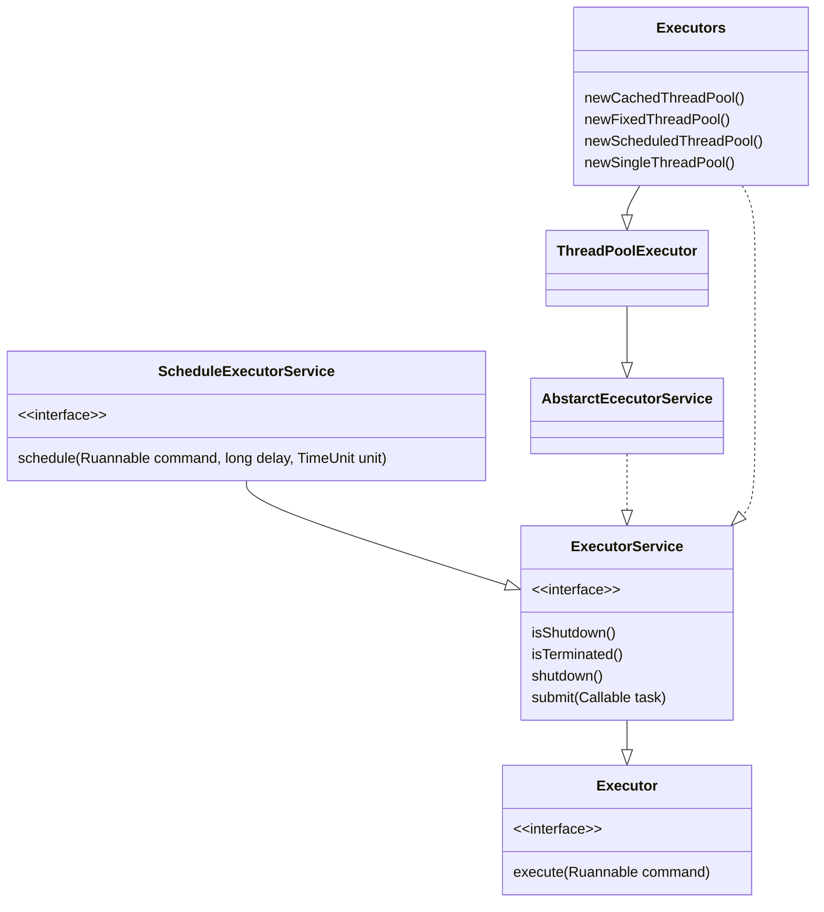

## 简介

Java 线程池主要用于管理线程组及其运行状态, 以便 Java 虚拟机更好地利用 CPU 资源

## 原理

JVM 先根据用户的参数创建一定数量的可运行的线程任务, 并将其放入队列中, 在线程创建后启动这些任务, 如果线程数量超过了最大线程数量 (用户设置的线程池大小) , 则超出数量的线程排队等候, 在有任务执行完毕后, 线程池调度器会发现有可用的线程, 进而再次从队列中取出任务并执行

## 作用

- 线程复用
- 线程资源管理
- 控制操作系统的最大并发数, 以保证系统高效 (通过线程资源复用实现) 且安全 (通过控制最大线程并发数实现) 地运行

<!-- more -->

## 线程复用

执行线程, Thread 类的 run 方法中其实调用了 Runnable 对象的 run 方法, 因此可以继承 Thread 类在 start 方法中不断循环调用传递进来的 Runnable 对象, 程序就会不断执行 run 方法中的代码, 可以将在循环方法中不断获取的 Runnable 对象存放在 Queue 中, 当前线程在获取下一个 Runnable 对象之前可以是阻塞的, 这样既能有效控制正在执行的线程个数, 也能保证系统中正在等待执行的其他线程有序执行, 这样就简单实现了一个线程池, 达到了线程复用的效果

## 核心组件

- 线程池管理器：用于创建并管理线程池
- 工作线程：线程池中执行具体任务的线程
- 任务接口：用于定义工作线程的调度和执行策略, 只有线程实现了该接口, 线程中的任务才能够被线程池调度
- 任务队列：存放待处理的任务, 新的任务将会不断被加入队列中, 执行完成的任务将被从队列中移除

## 核心类

线程池是通过 Executor 框架实现的, 在该框架中用到了 Executor、Executors、ExecutorService、ThreadPoolExecutor、Callable、Future、FutureTask 这几个核心类



ThreadPoolExecutor 构造函数参数

| 参数 | 说明 |
| -- | -- |
| corePoolSize | 线程池中核心线程的数量 |
| maximumPoolSize | 线程池中最大线程的数量 |
| keepAliveTime | 当前线程数量超过 corePoolSize 时, 空闲线程的存活时间 |
| unit | keepAliveTime 时间单位 TimeUnit |
| workQueue | 任务队列, 被提交但尚未被执行的任务存放的队列 |
| threadFactory | 线程工厂, 用于创建线程, 可使用默认的线程工厂或自定义 |
| handler | 由于任务过多或其他原因导致线程池无法处理时的任务拒绝策略 |

## 拒绝策略

- AbortPolicy: 直接抛出异常, 阻止线程正常运行
- CallerRunsPolicy: 如果被丢弃的线程任务未关闭, 则执行该线程任务, 注意, CallerRunsPolicy 拒绝策略不会真的丢弃任务
- DiscardOldestPolicy: 移除线程队列中最早的一个线程任务, 并尝试提交当前任务
- DiscardPolicy: 丢弃当前的线程任务而不做任何处理, 如果系统允许在资源不足的情况下丢弃部分任务, 则这将是保障系统安全、稳定的一种很好的方案
- 自定义拒绝策略: 扩展 RejectedExecutionHandler 接口并捕获异常来实现自定义拒绝策略

```java
public interface RejectedExecutionHandler {
    void rejectedExecution(Runnable r, ThreadPoolExecutor executor);
}
```

## 常用线程池

- newCachedThreadPool: 创建一个缓存线程池, 在创建新线程时如果有可重用的线程, 则重用它们, 否则重新创建一个新的线程并将其添加到线程池中, 当需要执行时间短的大量任务时, newCachedThreadPool 线程池能很大程度地重用线程进而提高系统的性能, 在线程池的 keepAliveTime 时间超过默认的 `60` 秒后, 该线程会被终止并从缓存中移除, 因此在没有线程任务运行时, newCachedThreadPool 将不会占用系统的线程资源
- newFixedThreadPool: 建一个固定线程数量的线程池, 并将线程资源存放在队列中循环使用, 若处于活动状态的线程数量大于等于核心线程池的数量, 则新提交的任务将在阻塞队列中排队, 直到有可用的线程资源
- newScheduledThreadPool: 创建一个可定时调度的线程池, 可设置在给定的延迟时间后执行或者定期执行某个线程任务
- newSingleThreadExecutor: 证永远有且只有一个可用的线程, 在该线程停止或发生异常时, newSingleThreadExecutor 线程池会启动一个新的线程来代替该线程继续执行任务
- newWorkStealingPool: 创建持有足够线程的线程池来达到快速运算的目的, 在内部通过使用多个队列来减少各个线程调度产生的竞争, 这里所说的有足够的线程指 JDK 根据当前线程的运行需求向操作系统申请足够的线程, 以保障线程的快速执行, 并很大程度地使用系统资源, 提高并发计算的效率, 省去用户根据 CPU 资源估算并行度的过程, 当然, 如果开发者想自己定义线程的并发数, 则也可以将其作为参数传入

## 工作流程

线程池刚被创建时, 只是向系统申请一个用于执行线程队列和管理线程池的线程资源, 在调用 `execute()` 添加一个任务时, 线程池会按照以下流程执行任务

- 如果正在运行的线程数量少于 corePoolSize (用户定义的核心线程数) , 线程池就会立刻创建线程并执行该线程任务
- 如果正在运行的线程数量大于等于 corePoolSize, 该任务就将被放入阻塞队列中
- 在阻塞队列已满且正在运行的线程数量少于 maximumPoolSize 时, 线程池会创建非核心线程立刻执行该线程任务
- 在阻塞队列已满且正在运行的线程数量大于等于 maximumPoolSize 时, 线程池将拒绝执行该线程任务并抛出 RejectExecutionException 异常
- 在线程任务执行完毕后, 该任务将被从线程池队列中移除, 线程池将从队列中取下一个线程任务继续执行
- 在线程处于空闲状态的时间超过 keepAliveTime 时间时, 正在运行的线程数量超过 corePoolSize, 该线程将会被认定为空闲线程并停止, 因此在线程池中所有线程任务都执行完毕后, 线程池会收缩到 corePoolSize 大小
