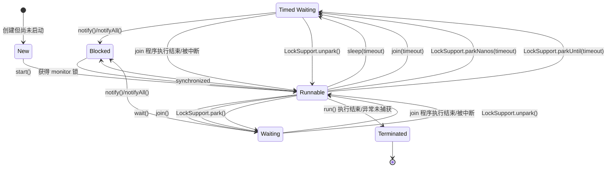

## 简介

Java 线程状态主要有以下状态:

- New（新创建）: 创建但尚未启动的状态
- Runnable（可运行）: 包括 Running 和 Ready 状态
  - Running: 正在执行
  - Ready: 正在等待被分配 CPU 资源
- Blocked（被阻塞）: 进入到 synchronized 代码块中时未能获得相应的 monitor 锁
- Waiting（等待）: 无限的等待另一个线程的特定操作
  - 调用没有设置 Timeout 参数的 Object.wait() 方法
  - 调用没有设置 Timeout 参数的 Thread.join() 方法
  - 调用 LockSupport.park() 方法
- Timed Waiting（计时等待）: 在设置的等待时间等待另一个线程的特点操作
  - 调用设置了时间参数的Thread.sleep(long millis) 方法
  - 调用设置了时间参数的 Object.wait(long timeout) 方法
  - 调用设置了时间参数的 Thread.join(long millis) 方法
  - 调用设置了时间参数的 LockSupport.parkNanos(long nanos) 方法和 LockSupport.parkUntil(long deadline) 方法
- Terminated（被终止）: 已终止线程的线程状态
  - run() 方法执行完毕，线程正常退出
  - 出现一个没有捕获的异常，终止了 run() 方法，最终导致意外终止

<!-- more -->

可以在程序过程中通过线程 getState() 方法获取



## 阻塞状态

### Blocked 被阻塞状态

Blocked 是相对简单的状态, 当一个 Runnable 状态的线程进入到 synchronized 代码块时才会变成改状态, 也只有在获得相应的 monitor 锁才会重新进入 Runnable 状态

### Waiting 等待状态

如上图, 进入该状态有 3 种情况

众所周知, 除了针对 synchronized monitor 锁所使用的同步代码外, Java 中还有各种各样的自定义锁, 例如 ReentrantLock 等, 在这些锁中, 如果线程没有获取到锁则会直接进入 Waiting 状态, 这种本质是就是执行了 LockSupport.park() 方法进入了 Waiting 状态

```sh
  java.lang.Thread.State: WAITING (parking)

  at sun.misc.Unsafe.park(Native Method)

  - parking to wait for  <0x00000005d4e168d8> (a java.util.concurrent.locks.AbstractQueuedSynchronizer$ConditionObject)

  at java.util.concurrent.locks.LockSupport.park(LockSupport.java:175)

  at java.util.concurrent.locks.AbstractQueuedSynchronizer$ConditionObject.await(AbstractQueuedSynchronizer.java:2039)
```

```sh
   java.lang.Thread.State: WAITING (parking)

  at sun.misc.Unsafe.park(Native Method)

  - parking to wait for  <0x00000005d4e20c30> (a java.util.concurrent.CountDownLatch$Sync)

  at java.util.concurrent.locks.LockSupport.park(LockSupport.java:175)

  at java.util.concurrent.locks.AbstractQueuedSynchronizer.parkAndCheckInterrupt(AbstractQueuedSynchronizer.java:836)

  at java.util.concurrent.locks.AbstractQueuedSynchronizer.doAcquireSharedInterruptibly(AbstractQueuedSynchronizer.java:997)

  at java.util.concurrent.locks.AbstractQueuedSynchronizer.acquireSharedInterruptibly(AbstractQueuedSynchronizer.java:1304)

  at java.util.concurrent.CountDownLatch.await(CountDownLatch.java:231)
```

可以从线程堆栈中看出, 等待获取锁的时候都是执行了 java.util.concurrent.locks.LockSupport.park 方法

### Blocked 与 Waiting 区别

- Blocked: 等待其他线程释放 monitor 锁
- Waiting: 等待某个条件, 例如 join 的线程执行完毕, 或者是 notify()/notifyAll()

### Timed Waiting 计时等待状态

可以简单看到该状态是 Waiting 状态的有限等待状态

## 等待到运行

处于 Waiting 状态的线程只有当执行了 LockSupport.unpark() 方法或者 join 的线程结束运行或者被中断时才会进入到 Runnable 状态

处于 Timed Waiting 状态的线程与 Waiting 一致, 但是存在超时机制, 当超时时直接拿到锁

## 等待到阻塞

处于 Waiting 状态和 Timed Waiting 状态的线程通过其他线程调用 notify() 或 notifyAll() 来唤醒, 则会进入到 Blocked 状态, 需要持有 monitor 锁才能进入到 Runnable 状态

也就是说, 当 Waiting 状态和 Timed Waiting 状态的线程 A 被执行了 notify() 或 notifyAll() 的线程 B 唤醒了后, 需要等待线程 B 执行完毕并释放 monitor 锁, 然后轮到线程 A 去抢夺这把锁, 如果抢到了, 就会从 Blocked 状态回到 Runnable 状态, 否则一直在 Blocked 状态

## 小结

- 线程只有一次 New 和 Terminated 状态, 处于其他状态的时候可以相互转换
- 线程的状态转换只能如图的状态机制, 例如不能直接从 New 转到 Terminated, 也不能从 New 转到 Blocked
- 线程生命周期不可逆
  - 进入 Runnable 状态就不能进入到 New 状态
  - 进入 Terminated 状态就不能转换为其他状态
