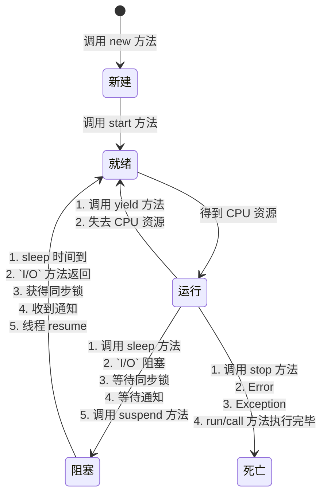

## 简介

常见的 Java 线程的 4 种创建方式

- 继承 Thread 类: 创建一个类并继承 Thread 接口, 然后实例化线程对象并调用 start 方法启动线程, start 方法是一个 native 方法, 通过在操作系统上启动一个新线程, 并最终执行 run 方法来启动一个线程, run 方法内的代码是线程类的具体实现逻辑
- 实现 Runnable 接口: 将一个实现了 Runnable 的线程实例 target 给 Thread 后, Thread 的 run 方法在执行时就会调用 `target.run` 方法并执行该线程具体的实现逻辑
- 通过 ExecutorService 和 `Callable<Class>` 实现有返回值的线程: 创建一个类并实现 Callable 接口, 在 call 方法中实现具体的运算逻辑并返回计算结果, 具体的调用过程为：创建一个线程池, 一个用于接收返回结果的 Future List 及 Callable 线程实例, 使用线程池提交任务并将线程执行之后的结果保存在 Future 中, 在线程执行结束后遍历 Future List 中的 Future 对象, 在该对象上调用 get 方法就可以获取 Callable 线程任务返回的数据并汇总结果
- 基于线程池

<!-- more -->

## 状态

- 新建状态 (New): 在 Java 中使用 new 关键字创建一个线程, 新创建的线程将处于新建状态, 主要为线程分配内存并初始化其成员变量的值
- 就绪状态 (Runnable): 新建的线程对象在调用 start 方法之后将转为就绪状态, 此时 JVM 完成了方法调用栈和程序计数器的创建, 等待该线程的调度和运行
- 运行状态 (Running): 就绪状态的线程在竞争到 CPU 的使用权并开始执行 run 方法的线程执行体时, 会转为运行状态, 处于运行状态的线程的主要任务就是执行 run 方法中的逻辑代码
- 阻塞状态 (Blocked): 运行中的线程会主动或被动地放弃 CPU 的使用权并暂停运行, 此时该线程将转为阻塞状态, 直到再次进入就绪状态, 才有机会再次竞争到 CPU 使用权并转为运行状态
  - 等待阻塞：在运行状态的线程调用 `Object.wait` 方法时, JVM 会把该线程放入等待队列 (Waitting Queue) 中, 线程转为阻塞状态
  - 同步阻塞：在运行状态的线程尝试获取正在被其他线程占用的对象同步锁时, JVM 会把该线程放入锁池 (Lock Pool) 中, 此时线程转为阻塞状态
  - 其他阻塞：运行状态的线程在执行 `Thread.sleep(long ms)` , `Thread.join()` 或者发出 ``I/O`` 请求时, JVM 会把该线程转为阻塞状态, 直到 `sleep()` 状态超时, `Thread.join()` 等待线程终止或超时, 或者 ``I/O`` 处理完毕, 线程才重新转为可运行状态
- 死亡状态 (Dead):
  - 线程正常结束：run 方法或 call 方法执行完成
  - 线程异常退出：运行中的线程抛出一个 Error 或未捕获的 Exception, 线程异常退出
  - 手动结束：调用线程对象的 stop 方法手动结束运行中的线程 (该方式会瞬间释放线程占用的同步对象锁, 导致锁混乱和死锁, 不推荐使用)

## 生命周期

## 流程

- 调用 new 方法新建一个线程, 这时线程处于新建状态
- 调用 start 方法启动一个线程, 这时线程处于就绪状态
- 处于就绪状态的线程等待线程获取 CPU 资源, 在等待其获取 CPU 资源后线程会执行 run 方法进入运行状态
- 正在运行的线程在调用了 yield 方法或失去处理器资源时, 会再次进入就绪状态
- 正在执行的线程在执行了 sleep 方法, `I/O` 阻塞, 等待同步锁, 等待通知, 调用 suspend 方法等操作后, 会挂起并进入阻塞状态, 进入 Blocked 池
- 阻塞状态的线程由于出现 sleep 时间已到, `I/O` 方法返回, 获得同步锁, 收到通知, 调用 resume 方法等情况, 会再次进入就绪状态, 等待 CPU 时间片的轮询, 该线程在获取 CPU 资源后, 会再次进入运行状态
- 处于运行状态的线程, 在调用 run 方法或 call 方法正常执行完成, 调用 stop 方法停止线程或者程序执行错误导致异常退出时, 会进入死亡状态

## 方法

- wait: 调用 wait 方法的线程会进入 WAITING 状态, 只有等到其他线程的通知或被中断后才会返回, 需要注意的是, 在调用 wait 方法后会释放对象的锁, 因此 wait 方法一般被用于同步方法或同步代码块中
- sleep: 调用 sleep 方法会导致当前线程休眠, 与 wait 方法不同的是, sleep 方法不会释放当前占有的锁, 会导致线程进入 TIMED-WATING 状态
- yield: 调用 yield 方法会使当前线程让出 (释放) CPU 执行时间片, 与其他线程一起重新竞争 CPU 时间片, 在一般情况下, 优先级高的线程更有可能竞争到 CPU 时间片, 但这不是绝对的, 有的操作系统对线程的优先级并不敏感
- interrupt: 用于向线程发行一个终止通知信号, 会影响该线程内部的一个中断标识位, 这个线程本身并不会因为调用了 interrupt 方法而改变状态 (阻塞, 终止等) , 状态的具体变化需要等待接收到中断标识的程序的最终处理结果来判定
  - 调用 interrupt 方法并不会中断一个正在运行的线程, 也就是说处于 Running 状态的线程并不会因为被中断而终止, 仅仅改变了内部维护的中断标识位而已
  - 若因为调用 sleep 方法而使线程处于 TIMED-WATING 状态, 则这时调用 interrupt 方法会抛出 InterruptedException, 使线程提前结束 TIMED-WATING 状态
  - 许多声明抛出 InterruptedException 的方法如 `Thread.sleep(long mills)` , 在抛出异常前都会清除中断标识位, 所以在抛出异常后调用 isInterrupted 方法将会返回 false
  - 中断状态是线程固有的一个标识位, 可以通过此标识位安全终止线程, 比如, 想终止一个线程时, 可以先调用该线程的 interrupt 方法, 然后在线程的 run 方法中根据该线程 isInterrupted 方法的返回状态值安全终止线程
- join: 用于等待其他线程终止, 如果在当前线程中调用一个线程的 join 方法, 则当前线程转为阻塞状态, 等到另一个线程结束, 当前线程再由阻塞状态转为就绪状态, 等待获取 CPU 的使用权, 在很多情况下, 主线程生成并启动了子线程, 需要等到子线程返回结果并收集和处理再退出, 这时就要用到 join 方法
- notify: Object 类有个 notify 方法, 用于唤醒在此对象监视器上等待的一个线程, 如果所有线程都在此对象上等待, 则会选择唤醒其中一个线程, 选择是任意的, 我们通常调用其中一个对象的 wait 方法在对象的监视器上等待, 直到当前线程放弃此对象上的锁定, 才能继续执行被唤醒的线程, 被唤醒的线程将以常规方式与在该对象上主动同步的其他线程竞争, 类似的方法还有 notifyAll, 用于唤醒在监视器上等待的所有线程

sleep 方法与 wait 方法的区别

- sleep 方法属于 Thread 类, wait 方法则属于 Object 类
- sleep 方法暂停执行指定的时间, 让出 CPU 给其他线程, 但其监控状态依然保持, 在指定的时间过后又会自动恢复运行状态
- 在调用 sleep 方法的过程中, 线程不会释放对象锁
- 在调用 wait 方法时, 线程会放弃对象锁, 进入等待此对象的等待锁池, 只有针对此对象调用 notify 方法后, 该线程才能进入对象锁池准备获取对象锁, 并进入运行状态

start 方法与 run 方法的区别

- start 方法用于启动线程, 真正实现了多线程运行, 在调用了线程的 start 方法后, 线程会在后台执行, 无须等待 run 方法体的代码执行完毕, 就可以继续执行下面的代码
- 在通过调用 Thread 类的 start 方法启动一个线程时, 此线程处于就绪状态, 并没有运行
- run 方法也叫作线程体, 包含了要执行的线程的逻辑代码, 在调用 run 方法后, 线程就进入运行状态, 开始运行 run 方法中的代码, 在 run 方法运行结束后, 该线程终止, CPU 再调度其他线程

## 守护线程

setDaemon 方法用于定义一个守护线程, 该线程是后台线程, 有一个特性, 即为用户线程提供公共服务, 在没有用户线程可服务时会自动离开, 守护线程的优先级较低, 用于为系统中的其他对象和线程提供服务, 将一个用户线程设置为守护线程的方法是在线程对象创建之前用线程对象的 `setDaemon(true)` 来设置

垃圾回收线程就是一个经典的守护线程, 在 JVM 中的所有线程都是守护线程时, JVM 就可以退出了, 如果还有一个或一个以上的非守护线程, 则 JVM 不会退出

## 终止线程的 4 种方式

- 正常运行结束: 在 run 方法执行完毕时, 线程会正常结束
- 使用退出标志退出线程: 有些线程是后台线程, 需要长时间运行, 只有在系统满足某些特殊条件后, 才能触发关闭这些线程, 这时可以使用一个变量来控制循环
- 使用 Interrupt 方法终止线程:
  - 当线程处于阻塞状态, 例如, 在使用了 sleep, 调用锁的 wait 或者调用 socket 的 receiver, accept 等方法时, 在调用线程的 interrupt 方法时, 会抛出 InterruptException 异常, 通过代码捕获该异常, 然后通过 break 跳出状态检测循环, 可以有机会结束这个线程的执行
  - 当线程执行过程中, 使用 isInterrupted 方法判断线程的中断标志来退出循环, 在调用 interrupt 方法时, 中断标志会被设置为 true, 并不能立刻退出线程, 而是执行线程终止前的资源释放操作, 等待资源释放完毕后退出该线程
- 使用 stop 方法终止线程: 直接调用 `Thread.stop` 方法强行终止线程时, 该线程的子线程会抛出 ThreadDeatherror 错误, 并且释放子线程持有的所有锁, 加锁的代码块一般被用于保护数据的一致性, 如果在调用 `Thread.stop` 方法后导致该线程所持有的所有锁突然释放而使锁资源不可控制, 被保护的数据就可能出现不一致的情况, 其他线程在使用这些被破坏的数据时, 有可能使程序运行错误, 因此, 并不推荐采用这种方法终止线程
