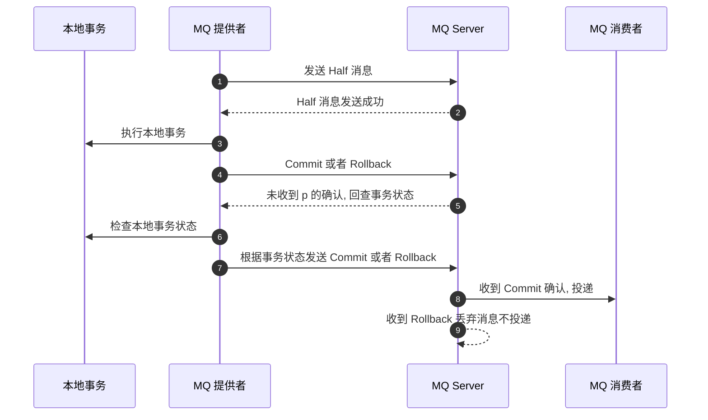

## 简介

RocketMQ 事务消息设计则主要是为了解决 Producer 端的消息发送与本地事务执行的原子性问题, RocketMQ 的设计中 broker 与 producer 端的双向通信能力, 使得 broker 天生可以作为一个事务协调者存在, 而 RocketMQ 本身提供的存储机制为事务消息提供了持久化能力, RocketMQ 的高可用机制以及可靠消息设计则为事务消息在系统发生异常时依然能够保证达成事务的最终一致性

在 RocketMQ 4.3 后实现了完整的事务消息, 实际上其实是对本地消息表的一个封装, 将本地消息表移动到了 MQ 内部, 解决 Producer 端的消息发送与本地事务执行的原子性问题

RocketMQ 事务消息的设计流程同样借鉴了两阶段提交理论, 通过在执行本地事务前后发送两条消息来保证本地事务与发送消息的原子性, 过程如下图



## 详细过程说明

- Producer 发送 Half (prepare)消息到 broker,
- half 消息发送成功之后执行本地事务,
- 本地事务执行如果成功则返回 commit, 如果执行失败则返回 roll_back (由用户实现)
- Producer 发送确认消息到 broker (也就是将步骤 3 执行的结果发送给 broker) , 这里可能 broker 未收到确认消息, 下面分两种情况分析:
- 如果 broker 收到了确认消息:
  - 如果收到的结果是 commit, 则 broker 视为整个事务过程执行成功, 将消息下发给 Conusmer 端消费,
  - 如果收到的结果是 rollback, 则 broker 视为本地事务执行失败, broker 删除 Half 消息, 不下发给 consumer.
- 如果 broker 未收到了确认消息:
  - broker 定时回查本地事务的执行结果,
  - 如果本地事务已经执行则返回 commit, 如果未执行, 则返回 rollback (由用户实现)
- Producer 端回查的结果发送给 broker,
- broker 接收到的如果是 commit, 则 broker 视为整个事务过程执行成功, 将消息下发给 Conusmer 端消费, 如果是 rollback, 则 broker 视为本地事务执行失败, broker 删除 Half 消息, 不下发给 consumer. 如果 broker 未接收到回查的结果 (或者查到的是 unknow) , 则 broker 会定时进行重复回查, 以确保查到最终的事务结果.

注意: `如果执行本地事务突然宕机了 (相当本地事务执行结果返回 unknow) , 则和 broker 未收到确认消息的情况一样处理`

<!-- more -->

## 简单使用

rocket-mq 提供有完整的 java api

事务消息生产主要有 3 种状态:

```java
public enum LocalTransactionState {
    COMMIT_MESSAGE,
    ROLLBACK_MESSAGE,
    UNKNOW,
}
```

实现自定义事务消息监听器:

```java
@Slf4j
@RocketMQTransactionListener(txProducerGroup = "producer")
class TransactionListenerImpl implements TransactionListener {

    @Autowired
    private ProduceOrderService produceOrderService ;

    public TransactionListenerImpl( ProduceOrderService produceOrderService) {
        this.produceOrderService = produceOrderService;
    }

    @Override
    public LocalTransactionState executeLocalTransaction(Message msg, Object arg) {
        log.info("=========本地事务开始执行=============");
        String message = new String(msg.getBody());
        // 本地事务消化 message
        int result = localService.save(message);
        /**
         * 本地事务执行会有三种可能
         * 1. commit 成功
         * 2. Rollback 失败
         * 3. 网络等原因服务宕机收不到返回结果
         */
        // 模拟执行本地事务 end========
        //TODO 实际开发下面不需要我们手动返回, 而是根据本地事务执行结果自动返回
        //1. 二次确认消息, 然后消费者可以消费
        if (result == 0) {
            return LocalTransactionState.COMMIT_MESSAGE;
        }
        //2. 回滚消息, Broker端会删除半消息
        if (result == 1) {
            return LocalTransactionState.ROLLBACK_MESSAGE;
        }
        //3. Broker端会进行回查消息
        if (result == 2) {
            return LocalTransactionState.UNKNOW;
        }
        return LocalTransactionState.COMMIT_MESSAGE;
    }

    /**
     * 只有上面接口返回 LocalTransactionState.UNKNOW 才会调用查接口被调用
     *
     * @param msg 消息
     * @return
     */
    @Override
    public LocalTransactionState checkLocalTransaction(MessageExt msg) {
        log.info("==========回查接口=========");
        String key = msg.getKeys();
        //TODO 1. 必须根据key先去检查本地事务消息是否完成
        /**
         * 因为有种情况就是: 上面本地事务执行成功了, 但是 return LocalTransactionState.COMMIT_MESSAG 的时候
         * 服务挂了, 那么最终 Brock 还未收到消息的二次确定, 还是个半消息 , 所以当重新启动的时候还是回调这个回调接口
         * 如果不先查询上面本地事务的执行情况 直接在执行本地事务, 那么就相当于成功执行了两次本地事务了
         */
        // TODO 2. 这里返回要么 commit 要么 rollback, 或者等待重试
        return LocalTransactionState.COMMIT_MESSAGE;
    }
}
```

事务消息消费者主要有两种状态

```java
public enum ConsumeConcurrentlyStatus {
    /**
     * Success consumption
     */
    CONSUME_SUCCESS,
    /**
     * Failure consumption,later try to consume
     */
    RECONSUME_LATER;
}
```

可以发现, 消息消费端只有成功和稍后重试两种结果, 所以需要人工实现相应逻辑

## 参考

- [RocketMQ 事务消息的使用与原理分析](http://silence.work/2018/08/22/RocketMQ-4-3%E4%BA%8B%E5%8A%A1%E4%BD%BF%E7%94%A8%E4%B8%8E%E5%88%86%E6%9E%90/)
- [GitHub Demo](https://github.com/apache/rocketmq/tree/master/example/src/main/java/org/apache/rocketmq/example/transaction)
