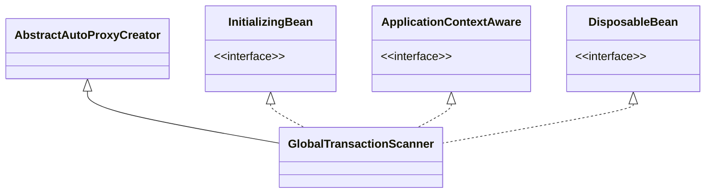
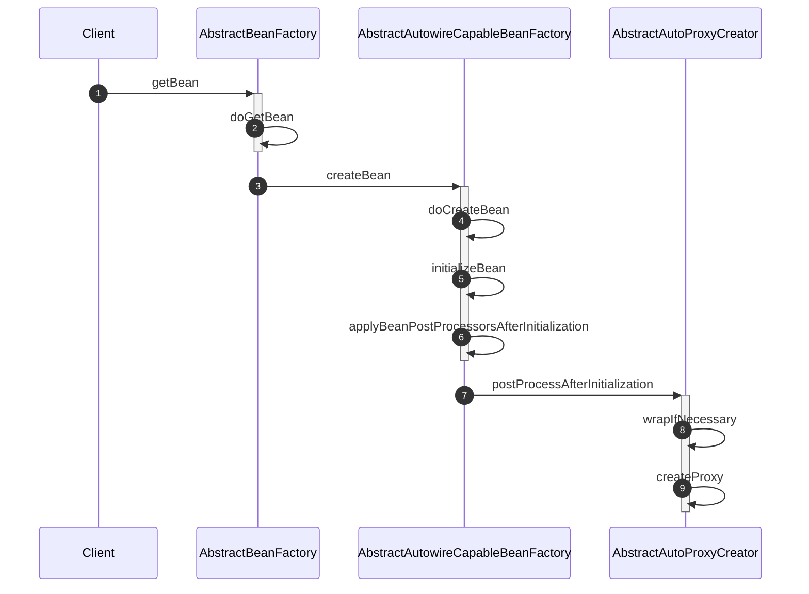

## 解析

<!-- more -->

### 客户端启动

TM 是负责整个全局事务的管理器, 因此一个全局事务是由 TM 开启的

```java
// io.seata.core.model.TransactionManager
package io.seata.core.model;

import io.seata.core.exception.TransactionException;

/**
 * Transaction Manager.
 *
 * Define a global transaction and control it.
 *
 * @author sharajava
 */
public interface TransactionManager {

    /**
     * Begin a new global transaction.
     *
     * @param applicationId           ID of the application who begins this transaction.
     * @param transactionServiceGroup ID of the transaction service group.
     * @param name                    Give a name to the global transaction.
     * @param timeout                 Timeout of the global transaction.
     * @return XID of the global transaction
     * @throws TransactionException Any exception that fails this will be wrapped with TransactionException and thrown
     * out.
     */
    String begin(String applicationId, String transactionServiceGroup, String name, int timeout)
        throws TransactionException;

    /**
     * Global commit.
     *
     * @param xid XID of the global transaction.
     * @return Status of the global transaction after committing.
     * @throws TransactionException Any exception that fails this will be wrapped with TransactionException and thrown
     * out.
     */
    GlobalStatus commit(String xid) throws TransactionException;

    /**
     * Global rollback.
     *
     * @param xid XID of the global transaction
     * @return Status of the global transaction after rollbacking.
     * @throws TransactionException Any exception that fails this will be wrapped with TransactionException and thrown
     * out.
     */
    GlobalStatus rollback(String xid) throws TransactionException;

    /**
     * Get current status of the give transaction.
     *
     * @param xid XID of the global transaction.
     * @return Current status of the global transaction.
     * @throws TransactionException Any exception that fails this will be wrapped with TransactionException and thrown
     * out.
     */
    GlobalStatus getStatus(String xid) throws TransactionException;

    /**
     * Global report.
     *
     * @param xid XID of the global transaction.
     * @param globalStatus Status of the global transaction.
     * @return Status of the global transaction.
     * @throws TransactionException Any exception that fails this will be wrapped with TransactionException and thrown
     * out.
     */
    GlobalStatus globalReport(String xid, GlobalStatus globalStatus) throws TransactionException;
}
```

通过 holder 可以获取一个单例的 RM 对象

```java
// io.seata.tm.TransactionManagerHolder
package io.seata.tm;

import io.seata.common.exception.ShouldNeverHappenException;
import io.seata.common.loader.EnhancedServiceLoader;
import io.seata.core.model.TransactionManager;
import org.slf4j.Logger;
import org.slf4j.LoggerFactory;

/**
 * The type Default transaction manager.
 *
 * @author sharajava
 */
public class TransactionManagerHolder {

    private static final Logger LOGGER = LoggerFactory.getLogger(TransactionManagerHolder.class);

    private static class SingletonHolder {

        private static TransactionManager INSTANCE = null;

        static {
            try {
                INSTANCE = EnhancedServiceLoader.load(TransactionManager.class);
                LOGGER.info("TransactionManager Singleton " + INSTANCE);
            } catch (Throwable anyEx) {
                LOGGER.error("Failed to load TransactionManager Singleton! ", anyEx);
            }
        }
    }

    /**
     * Get transaction manager.
     *
     * @return the transaction manager
     */
    public static TransactionManager get() {
        if (SingletonHolder.INSTANCE == null) {
            throw new ShouldNeverHappenException("TransactionManager is NOT ready!");
        }
        return SingletonHolder.INSTANCE;
    }

    /**
     * Set a TM instance.
     *
     * @param mock commonly used for test mocking
     */
    public static void set(TransactionManager mock) {
        SingletonHolder.INSTANCE = mock;
    }

    private TransactionManagerHolder() {

    }
}
```

seata 已经将大部分逻辑封装好 starter 了, 可以如下使用

```xml
<dependency>
  <groupId>com.alibaba.cloud</groupId>
  <artifactId>spring-cloud-alibaba-seata</artifactId>
  <version>2.2.0.RELEASE</version>
</dependency>
```

主要提供了一个全局事务注解

```java
// io.seata.spring.annotation.GlobalTransactional
package io.seata.spring.annotation;

import io.seata.tm.api.transaction.TransactionInfo;

import java.lang.annotation.ElementType;
import java.lang.annotation.Inherited;
import java.lang.annotation.Retention;
import java.lang.annotation.RetentionPolicy;
import java.lang.annotation.Target;

/**
 * The interface Global transactional.
 */
@Retention(RetentionPolicy.RUNTIME)
@Target(ElementType.METHOD)
@Inherited
public @interface GlobalTransactional {

    /**
     * Global transaction timeoutMills in MILLISECONDS.
     *
     * @return timeoutMills in MILLISECONDS.
     */
    int timeoutMills() default TransactionInfo.DEFAULT_TIME_OUT;

    /**
     * Given name of the global transaction instance.
     *
     * @return Given name.
     */
    String name() default "";

    /**
     * roll back for the Class
     * @return
     */
    Class<? extends Throwable>[] rollbackFor() default {};

    /**
     *  roll back for the class name
     * @return
     */
    String[] rollbackForClassName() default {};

    /**
     * not roll back for the Class
     * @return
     */
    Class<? extends Throwable>[] noRollbackFor() default {};

    /**
     * not roll back for the class name
     * @return
     */
    String[] noRollbackForClassName() default {};


}
```

开启一个全局事务是在方法上加上 `@GlobalTransactional` 注解, Seata 的 Spring 模块中, 有个 `GlobalTransactionScanner`, 它的继承关系如下



在基于 Spring 项目的启动过程中, 对该类会有如下初始化流程



`InitializingBean` 的 `afterPropertiesSet()` 方法调用了 `initClient()` 方法

```java
// io.seata.spring.annotation.GlobalTransactionScanner#initClient
private void initClient() {
    if (LOGGER.isInfoEnabled()) {
        LOGGER.info("Initializing Global Transaction Clients ... ");
    }
    if (StringUtils.isNullOrEmpty(applicationId) || StringUtils.isNullOrEmpty(txServiceGroup)) {
        throw new IllegalArgumentException(
            "applicationId: " + applicationId + ", txServiceGroup: " + txServiceGroup);
    }
    //init TM
    TMClient.init(applicationId, txServiceGroup);
    if (LOGGER.isInfoEnabled()) {
        LOGGER.info(
            "Transaction Manager Client is initialized. applicationId[" + applicationId + "] txServiceGroup["
                + txServiceGroup + "]");
    }
    //init RM
    RMClient.init(applicationId, txServiceGroup);
    if (LOGGER.isInfoEnabled()) {
        LOGGER.info(
            "Resource Manager is initialized. applicationId[" + applicationId + "] txServiceGroup[" + txServiceGroup
                + "]");
    }

    if (LOGGER.isInfoEnabled()) {
        LOGGER.info("Global Transaction Clients are initialized. ");
    }
    registerSpringShutdownHook();

}
```

对 TM 和 RM 做了初始化操作

#### TM 初始化

```java
// io.seata.tm.TMClient
public class TMClient {

    /**
     * Init.
     *
     * @param applicationId           the application id
     * @param transactionServiceGroup the transaction service group
     */
    public static void init(String applicationId, String transactionServiceGroup) {
        // 获取 TmRpcClient 实例
        TmRpcClient tmRpcClient = TmRpcClient.getInstance(applicationId, transactionServiceGroup);
        // 初始化 TM Client
        tmRpcClient.init();
    }

}
```

调用 `TmRpcClient.getInstance()` 方法会获取一个 TM 客户端实例, 在获取过程中, 会创建 Netty 客户端配置文件对象, 以及创建 `messageExecutor` 线程池, 该线程池用于在处理各种与服务端的消息交互, 在创建 `TmRpcClient` 实例时, 创建 `ClientBootstrap`, 用于管理 Netty 服务的启停, 以及 `ClientChannelManager`, 它是专门用于管理 Netty 客户端对象池, Seata 的 Netty 部分配合使用了对象池, 后面在分析网络模块会讲到

```java
// io.seata.core.rpc.netty.AbstractRpcRemotingClient#init
@Override
public void init() {
    clientBootstrap.start();
    // 定时尝试连接服务端
    timerExecutor.scheduleAtFixedRate(new Runnable() {
        @Override
        public void run() {
            clientChannelManager.reconnect(getTransactionServiceGroup());
        }
    }, SCHEDULE_INTERVAL_MILLS, SCHEDULE_INTERVAL_MILLS, TimeUnit.SECONDS);
    if (NettyClientConfig.isEnableClientBatchSendRequest()) {
        mergeSendExecutorService = new ThreadPoolExecutor(MAX_MERGE_SEND_THREAD,
            MAX_MERGE_SEND_THREAD,
            KEEP_ALIVE_TIME, TimeUnit.MILLISECONDS,
            new LinkedBlockingQueue<>(),
            new NamedThreadFactory(getThreadPrefix(), MAX_MERGE_SEND_THREAD));
        mergeSendExecutorService.submit(new MergedSendRunnable());
    }
    super.init();
}
```

调用 TM 客户端 `init()` 方法, 最终会启动 netty 客户端 (此时还未真正启动, 在对象池被调用时才会被真正启动) , 开启一个定时任务, 定时重新发送 `RegisterTMRequest` (RM 客户端会发送 `RegisterRMRequest`) 请求尝试连接服务端, 具体逻辑是在 `NettyClientChannelManager` 中的 `channels` 中缓存了客户端 channel, 如果此时 `channels` 不存在获取已过期, 那么就会尝试连接服务端以重新获取 channel 并将其缓存到 `channels` 中, 开启一条单独线程, 用于处理异步请求发送, 这里用得很巧妙, 之后在分析网络模块在具体对其进行分析

```java
/**
  * Init.
  */
public void init() {
    timerExecutor.scheduleAtFixedRate(new Runnable() {
        @Override
        public void run() {
            for (Map.Entry<Integer, MessageFuture> entry : futures.entrySet()) {
                if (entry.getValue().isTimeout()) {
                    futures.remove(entry.getKey());
                    entry.getValue().setResultMessage(null);
                    if (LOGGER.isDebugEnabled()) {
                        LOGGER.debug("timeout clear future: {}", entry.getValue().getRequestMessage().getBody());
                    }
                }
            }

            nowMills = System.currentTimeMillis();
        }
    }, TIMEOUT_CHECK_INTERNAL, TIMEOUT_CHECK_INTERNAL, TimeUnit.MILLISECONDS);
}
```

在 `AbstractRpcRemoting` 的 `init` 方法中, 又是开启了一个定时任务, 该定时任务主要是用于定时清除 `futures` 中已过期的 futrue, `futures` 是保存发送请求需要返回结果的 future 对象, 该对象有个超时时间, 过了超时时间就会自动抛异常, 因此需要定时清除已过期的 future 对象

#### RM 初始化

```java
// io.seata.rm.RMClient
/**
 * The Rm client Initiator.
 *
 * @author slievrly
 */
public class RMClient {

    /**
     * Init.
     *
     * @param applicationId           the application id
     * @param transactionServiceGroup the transaction service group
     */
    public static void init(String applicationId, String transactionServiceGroup) {
        RmRpcClient rmRpcClient = RmRpcClient.getInstance(applicationId, transactionServiceGroup);
        rmRpcClient.setResourceManager(DefaultResourceManager.get());
        rmRpcClient.setClientMessageListener(new RmMessageListener(DefaultRMHandler.get()));
        rmRpcClient.init();
    }

}
```

`RmRpcClient.getInstance` 处理逻辑与 TM 大致相同, `ResourceManager` 是 RM 资源管理器, 负责分支事务的注册、提交、上报、以及回滚操作, 以及全局锁的查询操作, `DefaultResourceManager` 会持有当前所有的 RM 资源管理器, 进行统一调用处理, 而 `get()` 方法主要是加载当前的资源管理器, 主要用了类似 SPI 的机制, 进行灵活加载, 如下图, Seata 会扫描 `META-INF/services/` 目录下的配置类并进行动态加载.

`ClientMessageListener` 是 RM 消息处理监听器, 用于负责处理从 TC 发送过来的指令, 并对分支进行分支提交、分支回滚, 以及 `undo log` 删除操作, 最后 `init` 方法跟 TM 逻辑也大体一致, `DefaultRMHandler` 封装了 RM 分支事务的一些具体操作逻辑

```java
// io.seata.spring.annotation.GlobalTransactionScanner#wrapIfNecessary
@Override
protected Object wrapIfNecessary(Object bean, String beanName, Object cacheKey) {
    // 判断是否有开启全局事务
    if (disableGlobalTransaction) {
        return bean;
    }
    try {
        synchronized (PROXYED_SET) {
            if (PROXYED_SET.contains(beanName)) {
                return bean;
            }
            interceptor = null;
            //check TCC proxy
            if (TCCBeanParserUtils.isTccAutoProxy(bean, beanName, applicationContext)) {
                //TCC interceptor, proxy bean of sofa:reference/dubbo:reference, and LocalTCC
                interceptor = new TccActionInterceptor(TCCBeanParserUtils.getRemotingDesc(beanName));
            } else {
                Class<?> serviceInterface = SpringProxyUtils.findTargetClass(bean);
                Class<?>[] interfacesIfJdk = SpringProxyUtils.findInterfaces(bean);
                // 判断 bean 中是否有 GlobalTransactional 和 GlobalLock 注解
                if (!existsAnnotation(new Class[]{serviceInterface})
                    && !existsAnnotation(interfacesIfJdk)) {
                    return bean;
                }

                if (interceptor == null) {
                    // 创建代理类
                    interceptor = new GlobalTransactionalInterceptor(failureHandlerHook);
                    ConfigurationFactory.getInstance().addConfigListener(ConfigurationKeys.DISABLE_GLOBAL_TRANSACTION,(ConfigurationChangeListener)interceptor);
                }
            }

            LOGGER.info(
                "Bean[" + bean.getClass().getName() + "] with name [" + beanName + "] would use interceptor ["
                    + interceptor.getClass().getName() + "]");
            if (!AopUtils.isAopProxy(bean)) {
                bean = super.wrapIfNecessary(bean, beanName, cacheKey);
            } else {
                AdvisedSupport advised = SpringProxyUtils.getAdvisedSupport(bean);
                // 执行包装目标对象到代理对象
                Advisor[] advisor = buildAdvisors(beanName, getAdvicesAndAdvisorsForBean(null, null, null));
                for (Advisor avr : advisor) {
                    advised.addAdvisor(0, avr);
                }
            }
            PROXYED_SET.add(beanName);
            return bean;
        }
    } catch (Exception exx) {
        throw new RuntimeException(exx);
    }
}
```

`GlobalTransactionScanner` 继承了 `AbstractAutoProxyCreator`, 用于对 Spring AOP 支持, 从代码中可看出, `用GlobalTransactionalInterceptor` 代替了被 `GlobalTransactional` 和 `GlobalLock` 注解的方法.

`GlobalTransactionalInterceptor` 实现了 `MethodInterceptor`

```java
// io.seata.spring.annotation.GlobalTransactionalInterceptor#invoke
@Override
public Object invoke(final MethodInvocation methodInvocation) throws Throwable {
    Class<?> targetClass = methodInvocation.getThis() != null ? AopUtils.getTargetClass(methodInvocation.getThis())
        : null;
    Method specificMethod = ClassUtils.getMostSpecificMethod(methodInvocation.getMethod(), targetClass);
    final Method method = BridgeMethodResolver.findBridgedMethod(specificMethod);

    final GlobalTransactional globalTransactionalAnnotation = getAnnotation(method, GlobalTransactional.class);
    final GlobalLock globalLockAnnotation = getAnnotation(method, GlobalLock.class);
    if (!disable && globalTransactionalAnnotation != null) {
        // 全局事务注解
        return handleGlobalTransaction(methodInvocation, globalTransactionalAnnotation);
    } else if (!disable && globalLockAnnotation != null) {
        // 全局锁注解
        return handleGlobalLock(methodInvocation);
    } else {
        return methodInvocation.proceed();
    }
}
```

以上是代理方法执行的逻辑逻辑, 其中 `handleGlobalTransaction()` 方法里面调用了 `TransactionalTemplate` 模版

```java
// io.seata.spring.annotation.GlobalTransactionalInterceptor#handleGlobalTransaction
private Object handleGlobalTransaction(final MethodInvocation methodInvocation,
                                        final GlobalTransactional globalTrxAnno) throws Throwable {
    try {
        return transactionalTemplate.execute(new TransactionalExecutor() {
            @Override
            public Object execute() throws Throwable {
                return methodInvocation.proceed();
            }

            public String name() {
                String name = globalTrxAnno.name();
                if (!StringUtils.isNullOrEmpty(name)) {
                    return name;
                }
                return formatMethod(methodInvocation.getMethod());
            }

            @Override
            public TransactionInfo getTransactionInfo() {
                TransactionInfo transactionInfo = new TransactionInfo();
                transactionInfo.setTimeOut(globalTrxAnno.timeoutMills());
                transactionInfo.setName(name());
                Set<RollbackRule> rollbackRules = new LinkedHashSet<>();
                for (Class<?> rbRule : globalTrxAnno.rollbackFor()) {
                    rollbackRules.add(new RollbackRule(rbRule));
                }
                for (String rbRule : globalTrxAnno.rollbackForClassName()) {
                    rollbackRules.add(new RollbackRule(rbRule));
                }
                for (Class<?> rbRule : globalTrxAnno.noRollbackFor()) {
                    rollbackRules.add(new NoRollbackRule(rbRule));
                }
                for (String rbRule : globalTrxAnno.noRollbackForClassName()) {
                    rollbackRules.add(new NoRollbackRule(rbRule));
                }
                transactionInfo.setRollbackRules(rollbackRules);
                return transactionInfo;
            }
        });
    } catch (TransactionalExecutor.ExecutionException e) {
        TransactionalExecutor.Code code = e.getCode();
        switch (code) {
            case RollbackDone:
                throw e.getOriginalException();
            case BeginFailure:
                failureHandler.onBeginFailure(e.getTransaction(), e.getCause());
                throw e.getCause();
            case CommitFailure:
                failureHandler.onCommitFailure(e.getTransaction(), e.getCause());
                throw e.getCause();
            case RollbackFailure:
                failureHandler.onRollbackFailure(e.getTransaction(), e.getCause());
                throw e.getCause();
            default:
                throw new ShouldNeverHappenException("Unknown TransactionalExecutor.Code: " + code);

        }
    }
}
```

`handleGlobalTransaction()` 方法执行了就是 `TransactionalTemplate` 模版类的 `execute` 方法

```java
// io.seata.tm.api.TransactionalTemplate#execute
/**
  * Execute object.
  *
  * @param business the business
  * @return the object
  * @throws TransactionalExecutor.ExecutionException the execution exception
  */
public Object execute(TransactionalExecutor business) throws Throwable {
    // 1. get or create a transaction
    GlobalTransaction tx = GlobalTransactionContext.getCurrentOrCreate();

    // 1.1 get transactionInfo
    TransactionInfo txInfo = business.getTransactionInfo();
    if (txInfo == null) {
        throw new ShouldNeverHappenException("transactionInfo does not exist");
    }
    try {

        // 2. begin transaction
        beginTransaction(txInfo, tx);

        Object rs = null;
        try {

            // Do Your Business
            rs = business.execute();

        } catch (Throwable ex) {

            // 3.the needed business exception to rollback.
            completeTransactionAfterThrowing(txInfo,tx,ex);
            throw ex;
        }

        // 4. everything is fine, commit.
        commitTransaction(tx);

        return rs;
    } finally {
        //5. clear
        triggerAfterCompletion();
        cleanUp();
    }
}
```

Spring 通过代理模式, 把这些冗余代码都封装带模版里面了, 它将那些冗余代码统统封装起来统一流程处理, 并不需要显式写出来

### 服务端处理逻辑

服务端收到客户端的连接, 那当然是将其 channel 也缓存起来, 前面也说到客户端会发送 `RegisterRMRequest/RegisterTMRequest` 请求给服务端, 服务端收到后会调用 `ServerMessageListener` 监听器处理

```java
// io.seata.core.rpc.ServerMessageListener
/**
 * The interface Server message listener.
 *
 * @author slievrly
 */
public interface ServerMessageListener {

    /**
     * On trx message.
     *
     * @param request the msg id
     * @param ctx     the ctx
     * @param sender  the sender
     */
     // 处理各种事务, 如分支注册、分支提交、分支上报、分支回滚等等
    void onTrxMessage(RpcMessage request, ChannelHandlerContext ctx, ServerMessageSender sender);

    /**
     * On reg rm message.
     *
     * @param request          the msg id
     * @param ctx              the ctx
     * @param sender           the sender
     * @param checkAuthHandler the check auth handler
     */
     // 处理 RM 客户端的注册连接
    void onRegRmMessage(RpcMessage request, ChannelHandlerContext ctx,
                        ServerMessageSender sender, RegisterCheckAuthHandler checkAuthHandler);

    /**
     * On reg tm message.
     *
     * @param request          the msg id
     * @param ctx              the ctx
     * @param sender           the sender
     * @param checkAuthHandler the check auth handler
     */
     // 处理 TM 客户端的注册连接
    void onRegTmMessage(RpcMessage request, ChannelHandlerContext ctx,
                        ServerMessageSender sender, RegisterCheckAuthHandler checkAuthHandler);

    /**
     * On check message.
     *
     * @param request the msg id
     * @param ctx     the ctx
     * @param sender  the sender
     */
     // 服务端与客户端保持心跳
    void onCheckMessage(RpcMessage request, ChannelHandlerContext ctx, ServerMessageSender sender);

}
```

`ChannelManager` 是服务端 channel 的管理器, 服务端每次和客户端通信, 都需要从 `ChannelManager` 中获取客户端对应的 channel, 它用于保存 TM 和 RM 客户端 channel 的缓存结构如下

```java
// io.seata.core.rpc.ChannelManager#RM_CHANNELS
/**
  * resourceId -> applicationId -> ip -> port -> RpcContext
  */
private static final ConcurrentMap<String, ConcurrentMap<String, ConcurrentMap<String, ConcurrentMap<Integer,
    RpcContext>>>>
    RM_CHANNELS = new ConcurrentHashMap<String, ConcurrentMap<String, ConcurrentMap<String, ConcurrentMap<Integer,
    RpcContext>>>>();
// io.seata.core.rpc.ChannelManager#TM_CHANNELS
/**
  * ip+appname,port
  */
private static final ConcurrentMap<String, ConcurrentMap<Integer, RpcContext>> TM_CHANNELS
    = new ConcurrentHashMap<String, ConcurrentMap<Integer, RpcContext>>();
```

结构如下

- `RM_CHANNELS`:
  - `resourceId` 指的是 RM client 的数据库地址,
  - `applicationId` 指的是 RM client 的服务 Id, 比如 springboot 的配置 `spring.application.name=account-service` 中的 `- account-service` 即是 `applicationId`,
  - `ip` 指的是 RM client 服务地址,
  - `port` 指的是 RM client 服务地址,
  - `RpcContext` 保存了本次注册请求的信息
- `TM_CHANNELS`:
  - `ip+appname`: 这里的注释应该是写错了, 应该是 appname+ip, 即 `TM_CHANNELS` 的 Map 结构第一个 `key` 为 `appname+ip`,
  - `port`: 客户端的端口号

以下是 RM Client 注册逻辑

```java
// io.seata.core.rpc.ChannelManager#registerRMChannel
/**
  * Register rm channel.
  *
  * @param resourceManagerRequest the resource manager request
  * @param channel                the channel
  * @throws IncompatibleVersionException the incompatible  version exception
  */
public static void registerRMChannel(RegisterRMRequest resourceManagerRequest, Channel channel)
    throws IncompatibleVersionException {
    Version.checkVersion(resourceManagerRequest.getVersion());
    // 将 ResourceIds 数据库连接连接信息放入一个set中
    Set<String> dbkeySet = dbKeytoSet(resourceManagerRequest.getResourceIds());
    RpcContext rpcContext;
    // 从缓存中判断是否有该 channel 信息
    if (!IDENTIFIED_CHANNELS.containsKey(channel)) {
        // 根据请求注册信息, 构建 rpcContext
        rpcContext = buildChannelHolder(NettyPoolKey.TransactionRole.RMROLE, resourceManagerRequest.getVersion(),
            resourceManagerRequest.getApplicationId(), resourceManagerRequest.getTransactionServiceGroup(),
            resourceManagerRequest.getResourceIds(), channel);
        // 将 rpcContext 放入缓存中
        rpcContext.holdInIdentifiedChannels(IDENTIFIED_CHANNELS);
    } else {
        rpcContext = IDENTIFIED_CHANNELS.get(channel);
        rpcContext.addResources(dbkeySet);
    }
    if (null == dbkeySet || dbkeySet.isEmpty()) { return; }
    for (String resourceId : dbkeySet) {
        String clientIp;
        // 将请求信息存入 RM_CHANNELS 中, 这里用了 java8 的 computeIfAbsent 方法操作
        ConcurrentMap<Integer, RpcContext> portMap = RM_CHANNELS.computeIfAbsent(resourceId, resourceIdKey -> new ConcurrentHashMap<>())
                .computeIfAbsent(resourceManagerRequest.getApplicationId(), applicationId -> new ConcurrentHashMap<>())
                .computeIfAbsent(clientIp = getClientIpFromChannel(channel), clientIpKey -> new ConcurrentHashMap<>());
        // 将当前 rpcContext 放入 portMap 中
        rpcContext.holdInResourceManagerChannels(resourceId, portMap);
        updateChannelsResource(resourceId, clientIp, resourceManagerRequest.getApplicationId());
    }

}
```

从以上代码逻辑能够看出, 注册 RM client 主要是将注册请求信息, 放入 `RM_CHANNELS` 缓存中, 同时还会从 `IDENTIFIED_CHANNELS` 中判断本次请求的 channel 是否已验证过, `IDENTIFIED_CHANNELS` 的结构如下

```java
private static final ConcurrentMap<Channel, RpcContext> IDENTIFIED_CHANNELS
        = new ConcurrentHashMap<Channel, RpcContext>();
```

`IDENTIFIED_CHANNELS` 包含了所有 TM 和 RM 已注册的 channel

以下是 TM 注册逻辑

```java
// io.seata.core.rpc.ChannelManager#registerTMChannel
/**
  * Register tm channel.
  *
  * @param request the request
  * @param channel the channel
  * @throws IncompatibleVersionException the incompatible version exception
  */
public static void registerTMChannel(RegisterTMRequest request, Channel channel)
    throws IncompatibleVersionException {
    Version.checkVersion(request.getVersion());
    // 根据请求注册信息, 构建 RpcContext
    RpcContext rpcContext = buildChannelHolder(NettyPoolKey.TransactionRole.TMROLE, request.getVersion(),
        request.getApplicationId(),
        request.getTransactionServiceGroup(),
        null, channel);
    // 将 RpcContext 放入 IDENTIFIED_CHANNELS 缓存中
    rpcContext.holdInIdentifiedChannels(IDENTIFIED_CHANNELS);
    // account-service:127.0.0.1:63353
    String clientIdentified = rpcContext.getApplicationId() + Constants.CLIENT_ID_SPLIT_CHAR
        + getClientIpFromChannel(channel);
    // 将请求信息存入 TM_CHANNELS 缓存中
    TM_CHANNELS.putIfAbsent(clientIdentified, new ConcurrentHashMap<Integer, RpcContext>());
    // 将上一步创建好的 get 出来, 之后再将 rpcContext 放入这个 map 的 value 中
    ConcurrentMap<Integer, RpcContext> clientIdentifiedMap = TM_CHANNELS.get(clientIdentified);
    rpcContext.holdInClientChannels(clientIdentifiedMap);
}
```

TM client 的注册大体类似, 把本次注册的信息放入对应的缓存中保存, 但比 RM client 的注册逻辑简单一些, 主要是 RM client 会涉及分支事务资源的信息, 需要注册的信息也会比 TM client 多

以上源码来源 `~/.m2/repository/io/seata/seata-all/1.0.0/seata-all-1.0.0.jar`

## 摘自

- [Seata AT 模式启动分析](https://seata.io/zh-cn/blog/seata-at-mode-start.html)
