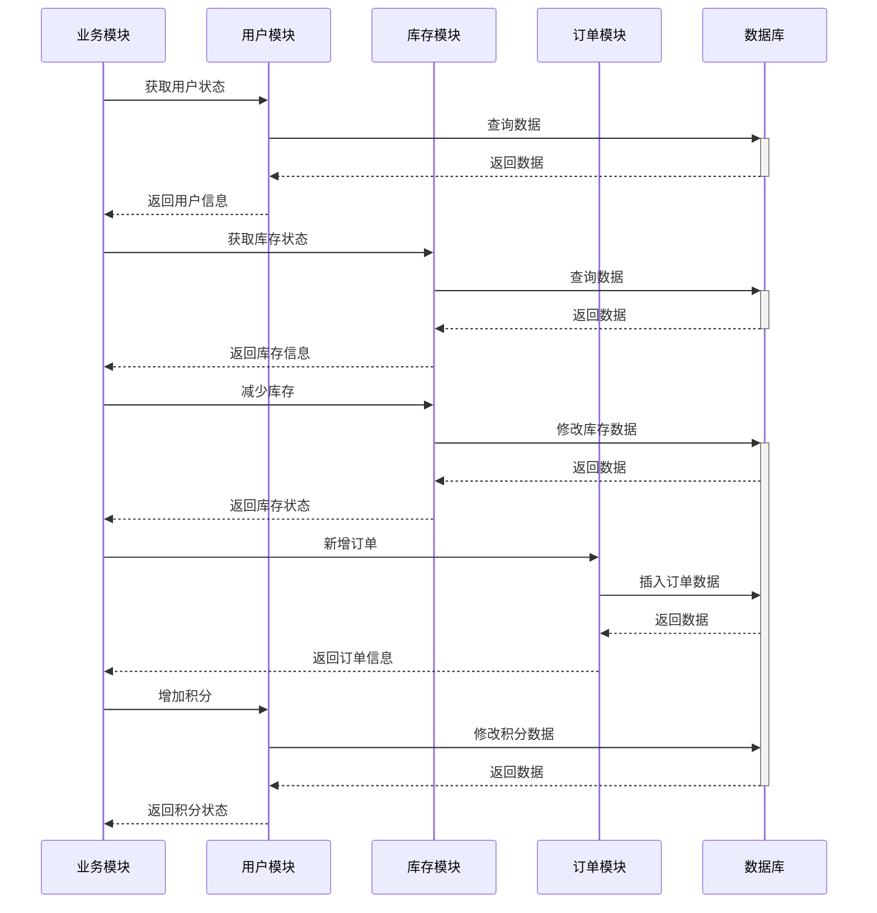
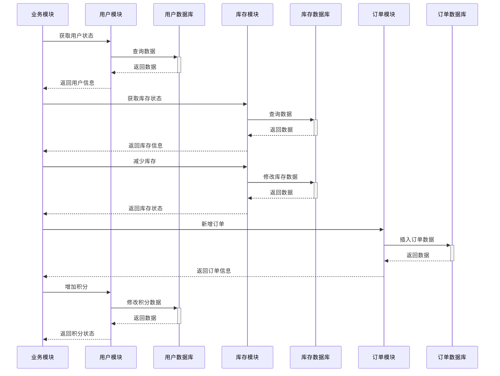
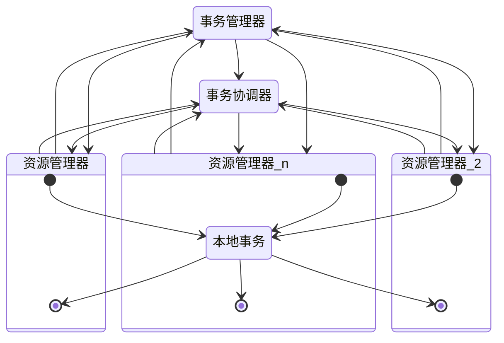
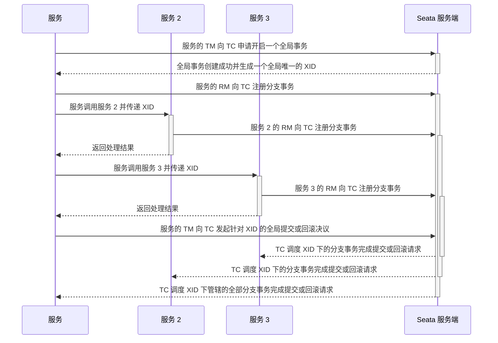
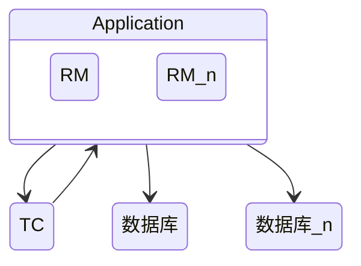
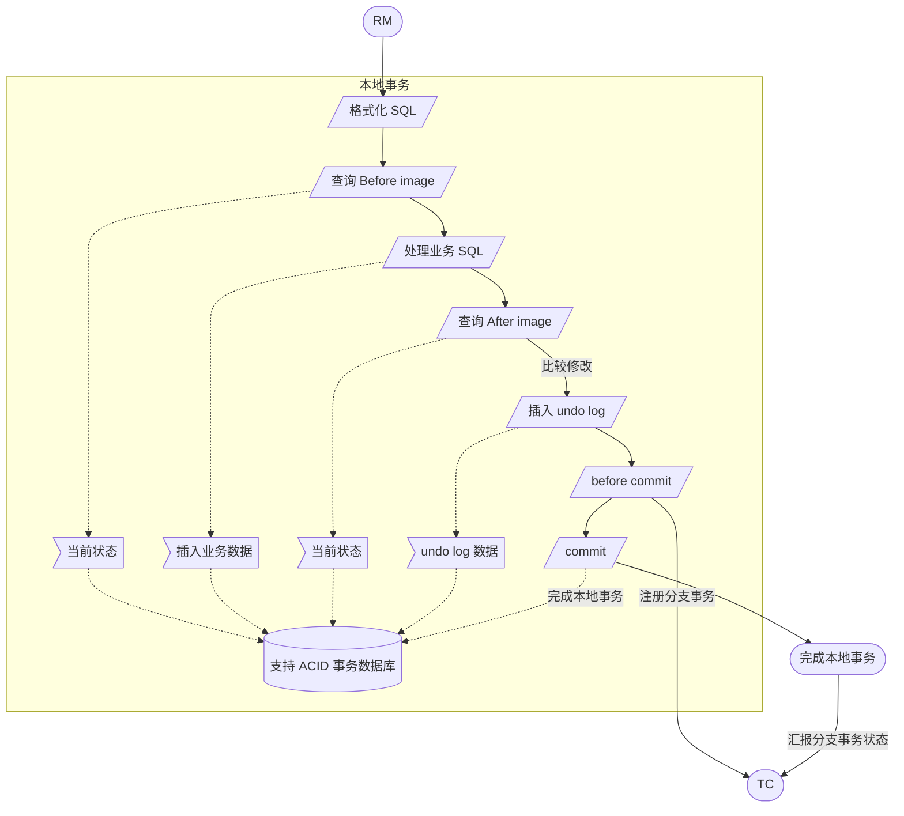
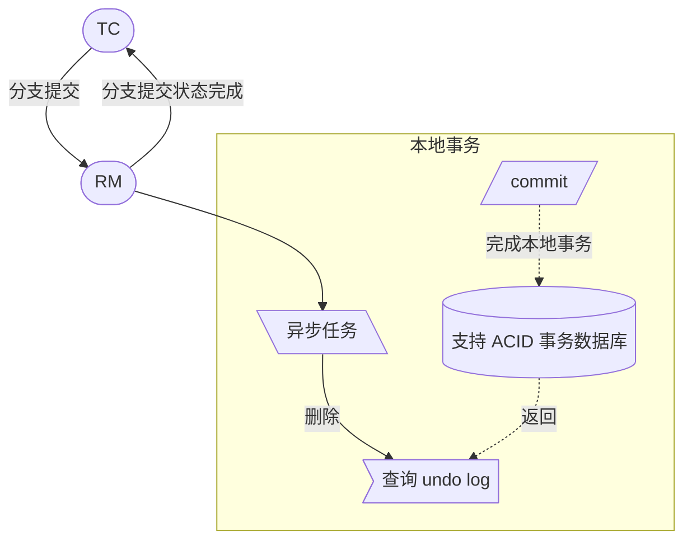
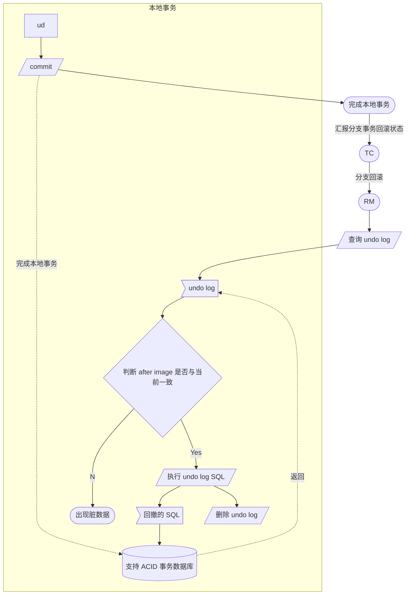

## 简介

Seata 是**阿里巴巴**开源的**分布式事务中间件**, 以**高效**并且对业务 **0 侵入**的方式, 解决**微服务**场景下面临的分布式事务问题

### 什么是分布式事务

本地事务通过 ACID 原则保证数据的强一致性, 随着系统按照业务和功能的拆分, 会出现每个业务系统只保存自身的业务数据, 而且数据是相对透明, 这样便带来了一个问题, 在跨服务调用中出现失败, 如服务宕机, 网络异常, 连接超时等问题则会出现数据的不一致, 这时候就是需要考虑数据一致性的问题, 可以简单地理解, 分布式事务就是为了保证不同数据库的数据一致性的事务解决方案

### 举例说明

传统单体应用多个模块间的操作主要是在同一数据源上进行的, 例如



这样可以很方便的通过本地事务来保证数据一致性

随着业务发展需要将现有的模块拆分成单独的服务, 这样便会有如下类似的流程



可以发现, 每个服务的数据一致性可以通过本地事务保证, 但是整个业务调用过程中的数据一致性就需要再进一步处理, 例如手动回撤, 通过分布式事务框架保证等等

<!-- more -->

## 现有解决方案

### 业务无侵入的方案

既有的主流分布式事务解决方案中, 对业务无侵入的只有基于 XA 的方案, 但应用 XA 方案存在 3 个方面的问题:

- 要求数据库提供对 XA 的支持, 如果遇到不支持 XA (或支持得不好, 比如 MySQL 5.7 以前的版本) 的数据库, 则不能使用,
- 受协议本身的约束, 事务资源 (数据记录、数据库连接) 的锁定周期长, 长周期的资源锁定从业务层面来看, 往往是不必要的, 而因为事务资源的管理器是数据库本身, 应用层无法插手, 这样形成的局面就是, 基于 XA 的应用往往性能会比较差, 而且很难优化,
- 已经落地的基于 XA 的分布式解决方案, 都依托于重量级的应用服务器 (Tuxedo/WebLogic/WebSphere 等), 这是不适用于微服务架构的,

### 侵入业务的方案

最初分布式事务只有 XA 这个唯一方案, XA 是完备的, 但在实践过程中, 由于种种原因 (包含但不限于上面提到的 3 点) 往往不得不放弃, 转而从业务层面着手来解决分布式事务问题, 比如:

- 基于可靠消息的最终一致性方案
- TCC
- Sag

## 原理和设计

### 如何定义一个分布式事务

可以把一个分布式事务理解成一个包含了若干分支事务的全局事务, 全局事务的职责是协调其下管辖的分支事务达成一致, 要么一起成功提交, 要么一起失败回滚, 此外, 通常分支事务本身就是一个满足 ACID 的本地事务, 与 XA 是一致的

```mermaid
erDiagram
  全局事务 |--|{ 分支事务
```

一个全局事务包括 1 个或多个分支事务

与 XA 的模型类似, 定义 3 个组件来协议分布式事务的处理过程, 如下所示



- Transaction Coordinator (TC):  事务协调器, 维护全局事务的运行状态, 负责协调并驱动全局事务的提交或回滚
- Transaction Manager (TM):  控制全局事务的边界, 负责开启一个全局事务, 并最终发起全局提交或全局回滚的决议
- Resource Manager (RM):  控制分支事务, 负责分支注册、状态汇报, 并接收事务协调器的指令, 驱动分支 (本地) 事务的提交和回滚

一个典型的分布式事务过程:

- TM 向 TC 申请开启一个全局事务, 全局事务创建成功并生成一个全局唯一的 XID
- XID 在微服务调用链路的上下文中传播
- RM 向 TC 注册分支事务, 将其纳入 XID 对应全局事务的管辖
- TM 向 TC 发起针对 XID 的全局提交或回滚决议
- TC 调度 XID 下管辖的全部分支事务完成提交或回滚请求



### 与 XA 的差别

XA 方案的 RM 实际上是在数据库层, RM 本质上就是数据库自身 (通过提供支持 XA 的驱动程序来供应用使用)

#### 设计方案

XA 方案:

```mermaid
stateDiagram
  Application --> TC
  TC--> 数据库
  TC--> 数据库_n
  Application --> 数据库
  state 数据库 {
    RM --> DB
  }
  Application --> 数据库_n
  state 数据库_n {
    RM --> DB
  }
```

Seata 方案:



Seata 的 RM 是以二方包的形式作为中间件层部署在应用程序这一侧的, 不依赖与数据库本身对协议的支持, 当然也不需要数据库支持 XA 协议, 这点对于微服务化的架构来说是非常重要的: 应用层不需要为本地事务和分布式事务两类不同场景来适配两套不同的数据库驱动,

这个设计, 剥离了分布式事务方案对数据库在协议支持上的要求

#### 2PC

- XA
  - 无论 Phase2 的决议是 commit 还是 rollback, 事务性资源的锁都要保持到 Phase2 完成才释放
- Seata
  - 分支事务中数据的 本地锁 由本地事务管理, 在分支事务 Phase1 结束时释放
  - 随着本地事务结束, 连接 也得以释放
  - 分支事务中数据的 全局锁 在事务协调器侧管理, 在决议 Phase2 全局提交时, 全局锁马上可以释放, 只有在决议全局回滚的情况下, 全局锁 才被持有至分支的 Phase2 结束

Seata 极大地减少了分支事务对资源 (数据和连接) 的锁定时间, 给整体并发和吞吐的提升提供了基础, 设想一个正常运行的业务, 大概率是 90% 以上的事务最终应该是成功提交的, 这样可以省去 Phase2 持锁的时间, 整体提高效率

### 分支事务如何提交和回滚

应用使用 SeaTa 的 JDBC 数据源代理, 作为 RM

#### Phase1

SeaTa 的 JDBC 数据源代理通过对业务 SQL 的解析, 把业务数据在更新前后的数据镜像组织成回滚日志, 利用 本地事务 的 ACID 特性, 将业务数据的更新和回滚日志的写入在同一个 本地事务 中提交

这样可以保证: 任何提交的业务数据的更新一定有相应的回滚日志存在, 如下流程



基于这样的机制, 分支的本地事务便可以在全局事务的 Phase1 提交, 马上释放本地事务锁定的资源

#### Phase2

如果决议是全局提交, 此时分支事务此时已经完成提交, 不需要同步协调处理 (只需要异步清理回滚日志) , Phase2 可以非常快速地完成



如果决议是全局回滚, RM 收到协调器发来的回滚请求, 通过 XID 和 Branch ID 找到相应的回滚日志记录, 通过回滚记录生成反向的更新 SQL 并执行, 以完成分支的回滚



### 事务传播机制

XID 是一个全局事务的唯一标识, 事务传播机制要做的就是把 XID 在服务调用链路中传递下去, 并绑定到服务的事务上下文中, 这样, 服务链路中的数据库更新操作, 就都会向该 XID 代表的全局事务注册分支, 纳入同一个全局事务的管辖,

基于这个机制, SeaTa 是可以支持任何微服务 RPC 框架的, 只要在特定框架中找到可以透明传播 XID 的机制即可, 比如, Dubbo 的 Filter + RpcContext,

对应到 Java EE 规范和 Spring 定义的事务传播属性, SeaTa 的支持如下:

- PROPAGATION_REQUIRED:  默认支持
- PROPAGATION_SUPPORTS:  默认支持
- PROPAGATION_MANDATORY: 应用通过 API 来实现
- PROPAGATION_REQUIRES_NEW: 应用通过 API 来实现
- PROPAGATION_NOT_SUPPORTED: 应用通过 API 来实现
- PROPAGATION_NEVER: 应用通过 API 来实现
- PROPAGATION_NESTED: 不支持

### 隔离性

全局事务的隔离性是建立在分支事务的本地隔离级别基础之上的,

在数据库本地隔离级别**读已提交**或以上的前提下, SeaTa 设计了由事务协调器维护的**全局写排他锁**来保证事务间的**写隔离**, 将全局事务默认定义在读未提交的隔离级别上

我们对隔离级别的共识是: 微服务场景产生的分布式事务, 绝大部分应用在**读已提交**的隔离级别下工作是没有问题的, 而实际上, 这当中又有绝大多数的应用场景, 实际上工作在**读未提交**的隔离级别下同样没有问题

在极端场景下, 应用如果需要达到全局的**读已提交**, SeaTa 也提供了相应的机制来达到目的, 默认 SeaTa 是工作在**读未提交**的隔离级别下, 保证绝大多数场景的高效性

## 参考

- [概览](https://github.com/seata/seata/wiki/%E6%A6%82%E8%A7%88)
