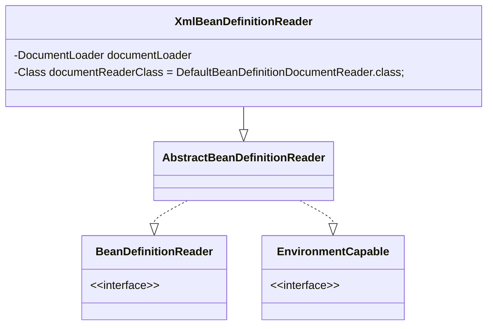

## 简介

XML 配置文件的读取是 Spring 中重要的功能, XmlBeanFactory 对 DefaultListableBeanFactory 类进行了扩展，主要用于从 XML 文档中读取 BeanDefinition，对于注册及获取 bean 都是使用从父类 DefaultListableBeanFactory 继承的方法去实现, 增加了 XmlBeanDefinitionReader 类型的 reader 属性对 XML 资源文件进行读取和注册

- 通过继承自 AbstractBeanDefinitionReader 中的方法，来使用 ResourLoader 将资源文件路径转换为对应的 Resource 文件
- 通过 DocumentLoader 对 Resource 文件进行转换，将 Resource 文件转换为 Document 文件
- 通过实现接口 BeanDefinitionDocumentReader 的 DefaultBeanDefinitionDocumentReader 类对 Document 进行解析，并使用 BeanDefinitionParserDelegate 对 Element 进行解析

## 各个类描述

- ResourceLoader：定义资源加载器，主要应用于根据给定的资源文件地址返回对应的 Resource
- BeanDefinitionReader：主要定义资源文件读取并转换为 BeanDefinition 的各个功能
- EnvironmentCapable：定义获取 Environment 方法
- DocumentLoader：定义从资源文件加载到转换为 Document 的功能
- AbstractBeanDefinitionReader：对 EnvironmentCapable、BeanDefinitionReader 类定义的功能进行实现
- BeanDefinitionDocumentReader：定义读取 Docuemnt 并注册 BeanDefinition 功能
- BeanDefinitionParserDelegate：定义解析 Element 的各种方法
