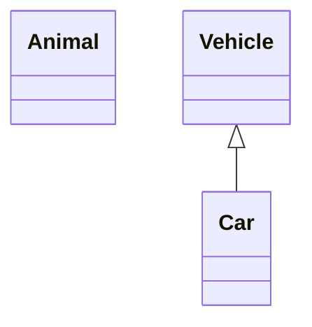
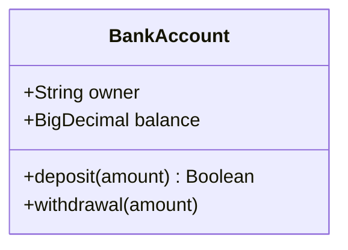
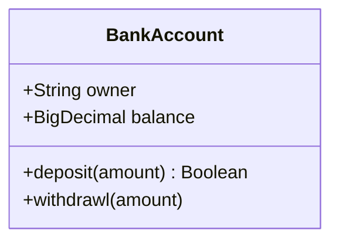
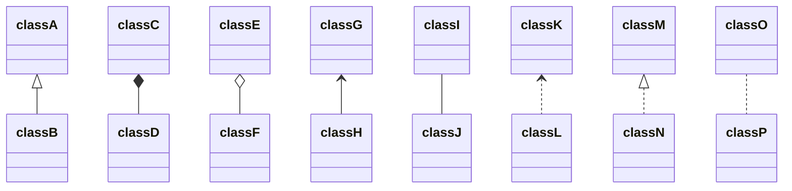
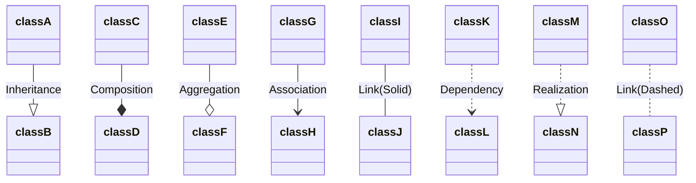
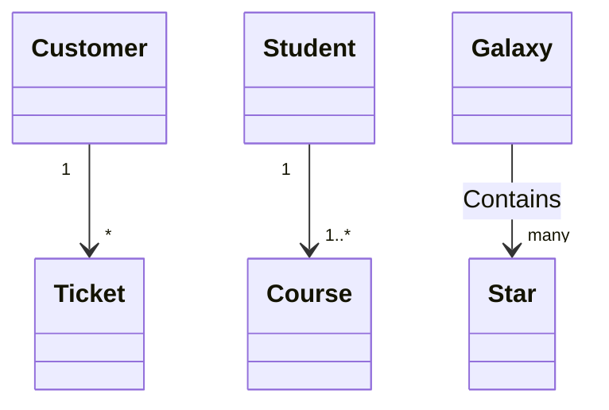
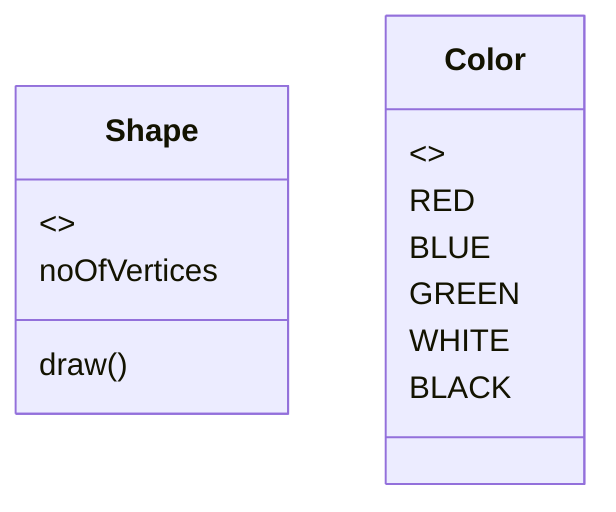
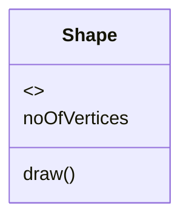

## 类图

类图主要是面向对象建模的主要工具.

### 定义类

```
classDiagram
  class Animal
  Vehicle <|-- Car
```



### 定义类成员

- 根据 `()` 来确定是属性还方法
- 方法后面可以携带返回类型, 具体写法为 `方法名(参数) 返回类型`
- `+`: Public
- `-`: Private
- `#`: Protected
- `~`: Package/Internal
- `*`: Abstract e.g.: someAbstractMethod()*
- `$`: Static e.g.: someStaticMethod()$

可以使用类名带 `:` 带成员名称来增加一个成员

```
classDiagram
  class BankAccount
  BankAccount : +String owner
  BankAccount : +BigDecimal balance
  BankAccount : +deposit(amount) Boolean
  BankAccount : +withdrawal(amount)
```



或者使用 `{}` 来增加成员

```
classDiagram
  class BankAccount{
    +String owner
    +BigDecimal balance
    +deposit(amount) Boolean
    +withdrawl(amount)
  }
```



### 定义关系

```
[classA][Arrow][ClassB]:LabelText
```

关系类型

| 类型 | 描述 |
| -- | -- |
| `<&#124;--` | 继承 |
| `*--` | 组成 |
| `o--` | 聚合 |
| `-->` | 协会 |
| `--` | 链接 (实线) |
| `..>` | 相依性 |
| `..&#124;>` | 实现 |
| `..` | 链接 (虚线) |

```
classDiagram
  classA <|-- classB
  classC *-- classD
  classE o-- classF
  classG <-- classH
  classI -- classJ
  classK <.. classL
  classM <|.. classN
  classO .. classP
```



```
classDiagram
  classA --|> classB : Inheritance
  classC --* classD : Composition
  classE --o classF : Aggregation
  classG --> classH : Association
  classI -- classJ : Link(Solid)
  classK ..> classL : Dependency
  classM ..|> classN : Realization
  classO .. classP : Link(Dashed)
```



### 数量关系

- `1` 只有一个
- `0..1` 零或一
- `1..*` 一个或多个
- `*` 许多
- `n` n 个 {其中 n > 1}
- `0..n` 零到 n {n > 1}
- `1..n` 一 到 n {n > 1}

使用方法

```
[classA] "cardinality1" [Arrow] "cardinality2" [ClassB]:LabelText
```

```
classDiagram
  Customer "1" --> "*" Ticket
  Student "1" --> "1..*" Course
  Galaxy --> "many" Star : Contains
```



### 类描述

- `<<Interface>>` 表示接口类
- `<<abstract>>` 代表抽象类
- `<<Service>>` 代表服务等级
- `<<enumeration>>` 代表一个枚举

可以在定义类后使用

<!-- **hexo-filter-mermaid-diagrams 插件不支持 <<>>** -->

```
classDiagram
  class Shape
  <<interface>> Shape
```

```mermaid
classDiagram
  class Shape
  <escape><<interface>></escape> Shape
```

也可以在定义类中使用

```
classDiagram
  class Shape{
    <<interface>>
    noOfVertices
    draw()
  }
  class Color{
    <<enumeration>>
    RED
    BLUE
    GREEN
    WHITE
    BLACK
  }
```



### 注释

注释必须自己一行, 并且必须以 `%%` (双百分号) 开头

```
classDiagram
%% This whole line is a comment classDiagram class Shape <<interface>>
class Shape{
  <<interface>>
  noOfVertices
  draw()
}
```



### 点击事件

[参考文档](http://mermaid-js.github.io/mermaid/#/classDiagram?id=interaction)

## 参考

- [官方文档](http://mermaid-js.github.io/mermaid/)
