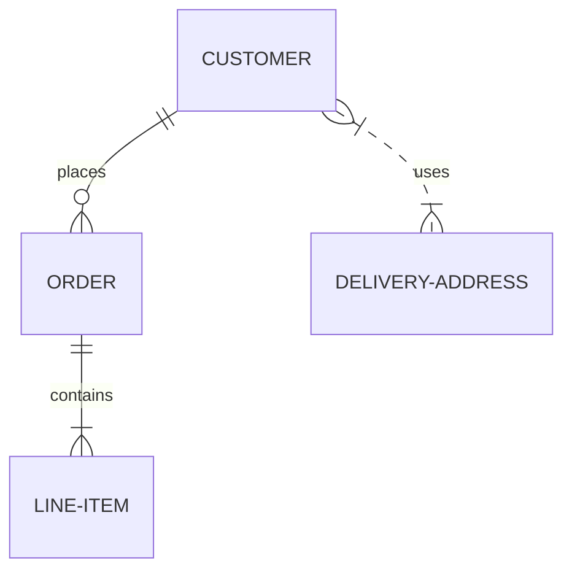

## 实体关系图 ( ER 图 )

> 实体关系模型 (或 ER 模型) 描述了特定知识领域中相互关联的相关事物, 基本的 ER 模型由实体类型 (对感兴趣的事物进行分类）组成
> 并指定实体之间可以存在的关系 (这些实体类型的实例）, 维基百科

### 示例

```
erDiagram
  CUSTOMER ||--o{ ORDER : places
  ORDER ||--|{ LINE-ITEM : contains
  CUSTOMER }|..|{ DELIVERY-ADDRESS : uses
```



### 语法

```
<first-entity> <relationship> <second-entity> : <relationship-label>
```

- `first-entity` 是实体的名称, 名称必须以字母字符开头, 并且还可以包含数字和连字符
- `relationship` 描述了两个实体相互联系的方式, 见下文
- `second-entity` 是另一个实体的名称
- `relationship-label` 从第一个实体的角度描述了这种关系

注意: **必须包含所有部分**

### 关系

`relationship` 这一部分可以分为三个子组件

- 第一个实体相对于第二个实体的基数
- 关系是否赋予 "子" 实体以身份
- 第二实体相对于第一实体的基数

| Value (left) | Value (right) | Meaning |
| -- | -- | -- |
| <code>&#124;o</code> | <code>o&#124;</code> | 0 或 1 |
| <code>&#124;</code> | <code>&#124;</code> | 刚好 1 |
| `}o` | `o{` | 0 或多个 (无上限) |
| <code>}&#124;</code> | <code>&#124;{</code> |  1 或多个 (无上限) |

### 身份识别

关系可以分类为可识别和不可识别, 使用实线 `--` 或者虚线 `..` 来表示

[参考文档](http://mermaid-js.github.io/mermaid/#/entityRelationshipDiagram?id=identification)

## 参考

- [官方文档](http://mermaid-js.github.io/mermaid/)
