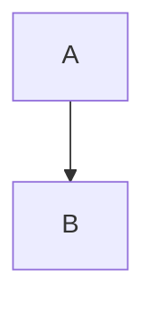
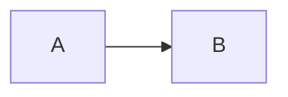
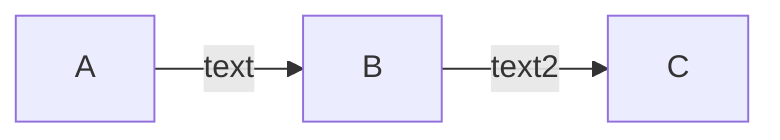
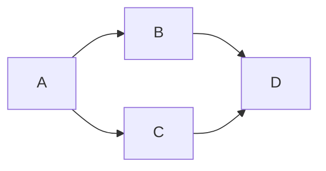
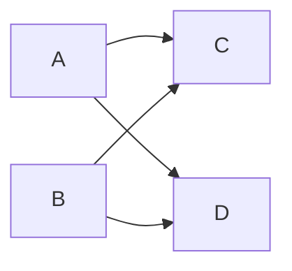
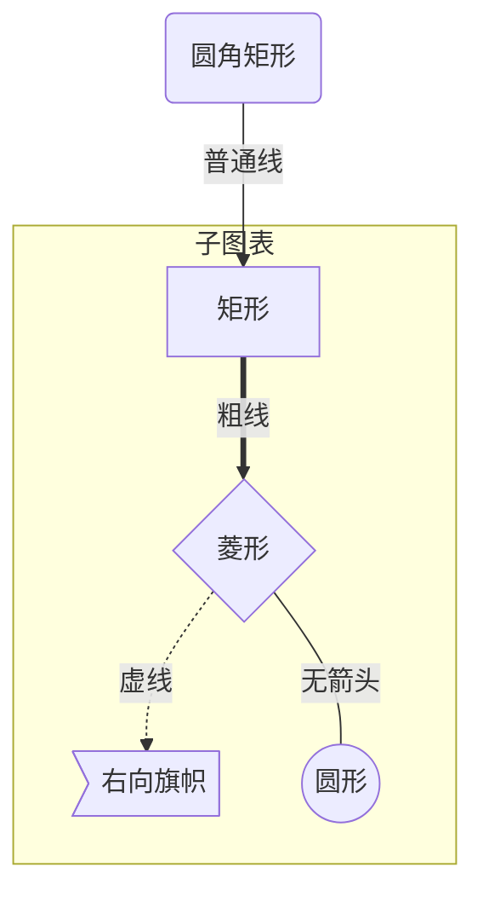
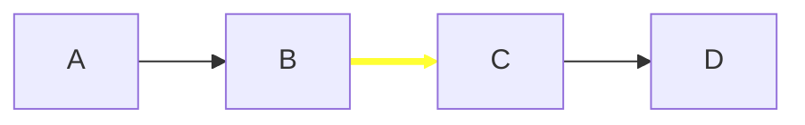
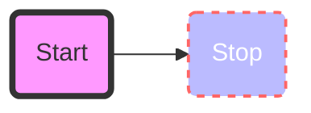
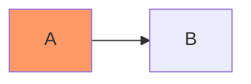
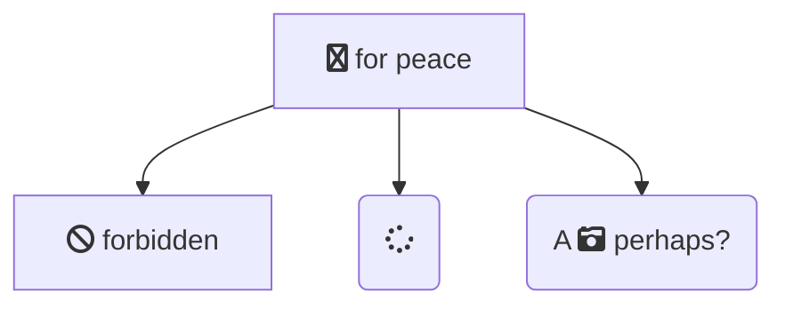

## 简介

[Mermaid](https://github.com/knsv/mermaid) 是一个用于画流程图, 状态图, 时序图, 甘特图的库

使用 JS 进行本地渲染, 广泛集成于许多 Markdown 编辑器中.

## [流程图](http://mermaid-js.github.io/mermaid/#/flowchart)

### 图表方向

| 用词 | 含义 |
| -- | -- |
| TB | 从上到下 |
| BT | 从下到上 |
| RL | 从右到左 |
| LR | 从左到右 |

#### 语法

`graph 方向描述`

#### 例子

##### 从上到下

```
graph TB
  A --> B
```



##### 从左到右

```
graph LR
  A --> B
```



<!-- more -->

### 节点定义

流程图中每个文本块, 包括开始, 结束, 处理, 判断等. Mermaid 中每个节点都有一个 id, 以及节点的文字.

| 表述 | 说明 |
| -- | -- |
| `id[文字]` | 矩形节点 |
| `id(文字)` | 圆角矩形节点 |
| `id([文字])` | 体育场形状节点 |
| `id[(文字)]` | 圆柱形节点 |
| `id((文字))` | 圆形节点 |
| `id>文字]` | 右向旗帜状节点 |
| `id{文字}` | 菱形节点 |
| <code>id{&#123;文字&#125;}</code> | 六边形节点 |
| `id[/文字/]` | 平行四边形节点 |
| `id[\文字\]` | 平行四边形节点 |
| `id[/文字\]` | 梯形节点 |
| `id[\文字/]` | 梯形节点 |

注意: **如果节点的文字中包含标点符号, 需要时用双引号包裹起来.**

### 连线

主要表示流程的起始和过程

| 表述 | 说明 |
| -- | -- |
| `A --> B` | 箭头连接 |
| `A --- B` | 不添加尾部箭头连接 |
| `A -- This is the text --- B` | 单线上加文字 |
| <code>A ---&#124;This is the text&#124;B</code> | 单线上加文字 |
| <code>A -->&#124;text&#124; B</code> | 箭头加文字 |
| `A -- text --> B` | 箭头加文字 |
| `A -.-> B` | 虚线 |
| `A -. text .-> B` | 虚线加文字 |
| `A ==> B` | 粗线 |
| `A == text ==> B` | 粗线加文字 |
| `A -- text --> B -- text2 --> C` | 多个连接 |
| `A --> B & C --> D` | 多个节点连接 |
| `A & B--> C & D` | 多个节点连接 |

注意: **当文字中含有括号的需要使用双引号包括起来**

```
graph LR
  id1["This is the (text) in the box"]
```


注意: **双引号或者其他字符需要转义**

```
graph LR
  A["A double quote:#quot;"] -->B["A dec char:#9829;"]
```


```
graph LR
  A -- text --> B -- text2 --> C
```



通过 `&` 可以实现多项串联

`A` 连接 `B` 和 `C`, `B` 和 `C` 连接 `D`

```
graph LR
  A --> B & C --> D
```



`A` 和 `B` 连接 `C`, `A` 和 `B` 连接 `D`

```
graph LR
  A & B--> C & D
```



### 子图表

使用以下语法添加子图表

```
subgraph 子图表名称
  子图表中的描述语句...
end
```

```
graph TB
  id1(圆角矩形)--普通线-->id2[矩形]
  subgraph 子图表
    id2==粗线==>id3{菱形}
    id3-.虚线.->id4>右向旗帜]
    id3--无箭头---id5((圆形))
  end
```



### 点击事件

可以在节点上绑定相应的 `click` 事件, 点击后可以触发事件或跳转连接

**注意: `securityLevel='strict'` 时禁用点击事件, `securityLevel='loose'` 开启点击事件**

```
click nodeId callback
```

- `nodeId` 是节点的 ID
- `callback` 是在显示图形的页面上定义的 javascript 函数的名称, 该函数将使用 `nodeId` 作为参数来调用

```js
<script>
  var callback = function(){
    alert('A callback was triggered');
  }
</script>
```

```
graph LR;
  A-->B;
  click A callback "Tooltip for a callback"
  click B "http://www.github.com" "This is a tooltip for a link"
```

### 样式

#### 连线的样式

由于连线在图中并没有 `ID`, 所以使用序号来设置, 序号从 `0` 开始

```
graph LR
  A --> B
  B --> C
  C --> D
  linkStyle 1 stroke:#ff3,stroke-width:4px,color:red;
```



#### 节点的样式

使用 `style nodeId myStyle` 可以让节点使用自定义样式

```
graph LR
  id1(Start)-->id2(Stop)
  style id1 fill:#f9f,stroke:#333,stroke-width:4px
  style id2 fill:#bbf,stroke:#f66,stroke-width:2px,color:#fff,stroke-dasharray: 5, 5
```



#### class 样式

使用 `classDef` 关键字定义 class 样式

```
classDef className fill:#f9f,stroke:#333,stroke-width:4px;
```

使用 `class nodeId1,nodeId2 className;` 指定节点的 class 样式, 或者使用 `:::` 操作符快速添加

```
graph LR
  A:::someclass --> B
  classDef someclass fill:#f96;
```



`default` 类名将默认分配给没有指定类的节点

```
classDef default fill:#f9f,stroke:#333,stroke-width:4px;
```

### 使用 fontawesome 图标

通过 `fa:#icon类名＃` 来使用图标

```
graph TD
  B["fa:fa-twitter for peace"]
  B-->C[fa:fa-ban forbidden]
  B-->D(fa:fa-spinner);
  B-->E(A fa:fa-camera-retro perhaps?);
```



## 参考

- [官方文档](http://mermaid-js.github.io/mermaid/)
- [基于 Mermaid 的时序图, 流程图和甘特图](https://www.iminho.me/wiki/docs/mindoc/mermaid.md)
